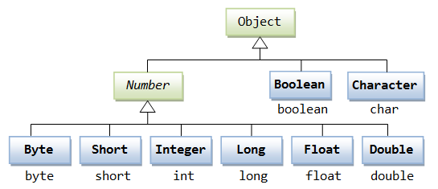
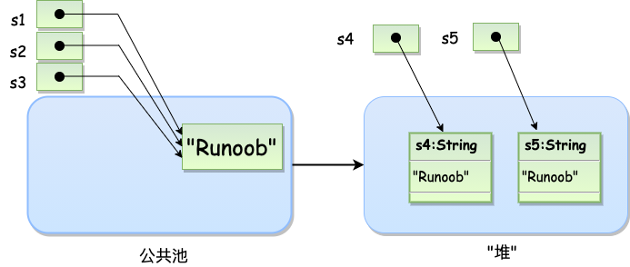
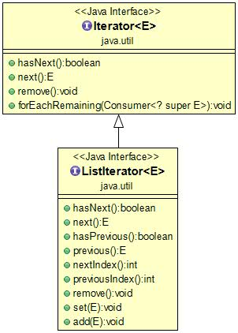

# Java基础

> 注意，此文档来源于菜鸟教程

## Java 基础语法

一个 Java 程序可以认为是一系列对象的集合，而这些对象通过调用彼此的方法来协同工作。下面简要介绍下类、对象、方法和实例变量的概念。

- **对象**：对象是类的一个实例，有状态和行为。例如，一条狗是一个对象，它的状态有：颜色、名字、品种；行为有：摇尾巴、叫、吃等。
- **类**：类是一个模板，它描述一类对象的行为和状态。
- **方法**：方法就是行为，一个类可以有很多方法。逻辑运算、数据修改以及所有动作都是在方法中完成的。
- **实例变量**：每个对象都有独特的实例变量，对象的状态由这些实例变量的值决定。

### 自动类型转换

**整型、实型（常量）、字符型数据可以混合运算。运算中，不同类型的数据先转化为同一类型，然后进行运算。**

转换从低级到高级。

```java
低  ------------------------------------>  高

byte,short,char—> int —> long—> float —> double 
```

数据类型转换必须满足如下规则：

- 不能对boolean类型进行类型转换。

- 不能把对象类型转换成不相关类的对象。

- 在把容量大的类型转换为容量小的类型时必须使用强制类型转换。

- 转换过程中可能导致溢出或损失精度，例如：

```
  int i =128;   
  byte b = (byte)i;
```

因为 byte 类型是 8 位，最大值为127，所以当 int 强制转换为 byte 类型时，值 128 时候就会导致溢出。

- 浮点数到整数的转换是通过舍弃小数得到，而不是四舍五入，例如：

  ```
  (int)23.7 == 23;        
  (int)-45.89f == -45
  ```

## Java 变量类型

### Java语言支持的变量类型有：

- 类变量：独立于方法之外的变量，用 static 修饰。
- 实例变量：独立于方法之外的变量，不过没有 static 修饰。
- 局部变量：类的方法中的变量。

### Java 局部变量

- 局部变量声明在方法、构造方法或者语句块中；
- 局部变量在方法、构造方法、或者语句块被执行的时候创建，当它们执行完成后，变量将会被销毁；
- 访问修饰符不能用于局部变量；
- 局部变量只在声明它的方法、构造方法或者语句块中可见；
- 局部变量是在栈上分配的。
- 局部变量没有默认值，所以局部变量被声明后，必须经过初始化，才可以使用。

### 实例变量

- 实例变量声明在一个类中，但在方法、构造方法和语句块之外；
- 当一个对象被实例化之后，每个实例变量的值就跟着确定；
- 实例变量在对象创建的时候创建，在对象被销毁的时候销毁；
- 实例变量的值应该至少被一个方法、构造方法或者语句块引用，使得外部能够通过这些方式获取实例变量信息；
- 实例变量可以声明在使用前或者使用后；
- 访问修饰符可以修饰实例变量；
- 实例变量对于类中的方法、构造方法或者语句块是可见的。一般情况下应该把实例变量设为私有。通过使用访问修饰符可以使实例变量对子类可见；
- 实例变量具有默认值。数值型变量的默认值是0，布尔型变量的默认值是false，引用类型变量的默认值是null。变量的值可以在声明时指定，也可以在构造方法中指定；
- 实例变量可以直接通过变量名访问。但在静态方法以及其他类中，就应该使用完全限定名：ObejectReference.VariableName。

### 类变量（静态变量）

- 类变量也称为静态变量，在类中以 static 关键字声明，但必须在方法之外。
- 无论一个类创建了多少个对象，类只拥有类变量的一份拷贝。
- 静态变量除了被声明为常量外很少使用，静态变量是指声明为 public/private，final 和 static 类型的变量。静态变量初始化后不可改变。
- 静态变量储存在静态存储区。经常被声明为常量，很少单独使用 static 声明变量。
- 静态变量在第一次被访问时创建，在程序结束时销毁。
- 与实例变量具有相似的可见性。但为了对类的使用者可见，大多数静态变量声明为 public 类型。
- 默认值和实例变量相似。数值型变量默认值是 0，布尔型默认值是 false，引用类型默认值是 null。变量的值可以在声明的时候指定，也可以在构造方法中指定。此外，静态变量还可以在静态语句块中初始化。
- 静态变量可以通过：*ClassName.VariableName*的方式访问。
- 类变量被声明为 public static final 类型时，类变量名称一般建议使用大写字母。如果静态变量不是 public 和 final 类型，其命名方式与实例变量以及局部变量的命名方式一致。

## Java 修饰符

Java语言提供了很多修饰符，主要分为以下两类：

- 访问修饰符
- 非访问修饰符

### 访问控制修饰符

Java中，可以使用访问控制符来保护对类、变量、方法和构造方法的访问。Java 支持 4 种不同的访问权限。

- **default** (即默认，什么也不写）: 在同一包内可见，不使用任何修饰符。使用对象：类、接口、变量、方法。
- **private** : 在同一类内可见。使用对象：变量、方法。 **注意：不能修饰类（外部类）**
- **public** : 对所有类可见。使用对象：类、接口、变量、方法
- **protected** : 对同一包内的类和所有子类可见。使用对象：变量、方法。 **注意：不能修饰类（外部类）**。

| 修饰符      | 当前类 | 同一包内 | 子孙类(同一包) | 子孙类(不同包)                                               | 其他包 |
| :---------- | :----- | :------- | :------------- | :----------------------------------------------------------- | :----- |
| `public`    | Y      | Y        | Y              | Y                                                            | Y      |
| `protected` | Y      | Y        | Y              | Y/N（[说明](https://www.runoob.com/java/java-modifier-types.html#protected-desc)） | N      |
| `default`   | Y      | Y        | Y              | N                                                            | N      |
| `private`   | Y      | N        | N              | N                                                            | N      |

请注意以下方法继承的规则：

- 父类中声明为 public 的方法在子类中也必须为 public。
- 父类中声明为 protected 的方法在子类中要么声明为 protected，要么声明为 public，不能声明为 private。
- 父类中声明为 private 的方法，不能够被子类继承。

### 非访问修饰符

为了实现一些其他的功能，Java 也提供了许多非访问修饰符。

static 修饰符，用来修饰类方法和类变量。

final 修饰符，用来修饰类、方法和变量，final 修饰的类不能够被继承，修饰的方法不能被继承类重新定义，修饰的变量为常量，是不可修改的。

abstract 修饰符，用来创建抽象类和抽象方法。

synchronized 和 volatile 修饰符，主要用于线程的编程。

#### static 修饰符

- **静态变量：**

  static 关键字用来声明独立于对象的静态变量，无论一个类实例化多少对象，它的静态变量只有一份拷贝。 静态变量也被称为类变量。局部变量不能被声明为 static 变量。

- **静态方法：**

  static 关键字用来声明独立于对象的静态方法。静态方法不能使用类的非静态变量。静态方法从参数列表得到数据，然后计算这些数据。

对类变量和方法的访问可以直接使用 **classname.variablename** 和 **classname.methodname** 的方式访问。

#### final 修饰符

**final 变量：**

final 表示"最后的、最终的"含义，变量一旦赋值后，不能被重新赋值。被 final 修饰的实例变量必须显式指定初始值。

final 修饰符通常和 static 修饰符一起使用来创建类常量。

#### abstract 修饰符

**抽象类：**

抽象类不能用来实例化对象，声明抽象类的唯一目的是为了将来对该类进行扩充。

一个类不能同时被 abstract 和 final 修饰。如果一个类包含抽象方法，那么该类一定要声明为抽象类，否则将出现编译错误。

抽象类可以包含抽象方法和非抽象方法。

**抽象方法**

抽象方法是一种没有任何实现的方法，该方法的具体实现由子类提供。

抽象方法不能被声明成 final 和 static。

任何继承抽象类的子类必须实现父类的所有抽象方法，除非该子类也是抽象类。

如果一个类包含若干个抽象方法，那么该类必须声明为抽象类。抽象类可以不包含抽象方法。

抽象方法的声明以分号结尾，例如：**public abstract sample();**。

#### synchronized 修饰符

synchronized 关键字声明的方法同一时间只能被一个线程访问。synchronized 修饰符可以应用于四个访问修饰符。

#### transient 修饰符

序列化的对象包含被 transient 修饰的实例变量时，java 虚拟机(JVM)跳过该特定的变量。

该修饰符包含在定义变量的语句中，用来预处理类和变量的数据类型。

#### volatile 修饰符

volatile 修饰的成员变量在每次被线程访问时，都强制从共享内存中重新读取该成员变量的值。而且，当成员变量发生变化时，会强制线程将变化值回写到共享内存。这样在任何时刻，两个不同的线程总是看到某个成员变量的同一个值。

一个 volatile 对象引用可能是 null。

## Java 运算符

### instanceof 运算符

该运算符用于操作对象实例，检查该对象是否是一个特定类型（类类型或接口类型）。instanceof运算符使用格式如下：

```java
( Object reference variable ) instanceof  (class/interface type)
```

如果运算符左侧变量所指的对象，是操作符右侧类或接口(class/interface)的一个对象，那么结果为真。

下面是一个例子：

```java
String name = "James";
boolean result = name instanceof String; // 由于 name 是 String 类型，所以返回真
```

如果被比较的对象兼容于右侧类型,该运算符仍然返回true。看下面的例子：

```java
class Vehicle {}
 
public class Car extends Vehicle {
   public static void main(String[] args){
      Vehicle a = new Car();
      boolean result =  a instanceof Car;
      System.out.println( result);
   }
}
```

以上实例编译运行结果如下：

```java
true
```

### Java运算符优先级

当多个运算符出现在一个表达式中，谁先谁后呢？这就涉及到运算符的优先级别的问题。在一个多运算符的表达式中，运算符优先级不同会导致最后得出的结果差别甚大。例如，（1+3）＋（3+2）*2，这个表达式如果按加号最优先计算，答案就是 18，如果按照乘号最优先，答案则是 14。再如，x = 7 + 3 * 2;这里x得到13，而不是20，因为乘法运算符比加法运算符有较高的优先级，所以先计算3 * 2得到6，然后再加7。

下表中具有最高优先级的运算符在的表的最上面，最低优先级的在表的底部。

|   类别   |                   操作符                   |  关联性  |
| :------: | :----------------------------------------: | :------: |
|   后缀   |             () [] . (点操作符)             |  左到右  |
|   一元   |               expr++ expr--                | 从左到右 |
|   一元   |          ++expr --expr + - ～ ！           | 从右到左 |
|   乘性   |                   * /％                    |  左到右  |
|   加性   |                    + -                     |  左到右  |
|   移位   |                 >> >>>  <<                 |  左到右  |
|   关系   |                 > >= < <=                  |  左到右  |
|   相等   |                   == !=                    |  左到右  |
|  按位与  |                     ＆                     |  左到右  |
| 按位异或 |                     ^                      |  左到右  |
|  按位或  |                     \|                     |  左到右  |
|  逻辑与  |                     &&                     |  左到右  |
|  逻辑或  |                   \| \|                    |  左到右  |
|   条件   |                    ？：                    | 从右到左 |
|   赋值   | = + = - = * = / =％= >> = << =＆= ^ = \| = | 从右到左 |
|   逗号   |                     ，                     |  左到右  |

## Java 增强 for 循环

Java5 引入了一种主要用于数组的增强型 for 循环。Java 增强 for 循环语法格式如下:

```java
for(声明语句 : 表达式)
{
   //代码句子
}
```

**声明语句：**声明新的局部变量，该变量的类型必须和数组元素的类型匹配。其作用域限定在循环语句块，其值与此时数组元素的值相等。

**表达式：**表达式是要访问的数组名，或者是返回值为数组的方法。

**实例**

```java
public class Test {
   public static void main(String[] args){
      int [] numbers = {10, 20, 30, 40, 50};
 
      for(int x : numbers ){
         System.out.print( x );
         System.out.print(",");
      }
      System.out.print("\n");
      String [] names ={"James", "Larry", "Tom", "Lacy"};
      for( String name : names ) {
         System.out.print( name );
         System.out.print(",");
      }
   }
}
```

以上实例编译运行结果如下：

```java
10,20,30,40,50,
James,Larry,Tom,Lacy,
```

## Java Number & Math 类

所有的包装类**（Integer、Long、Byte、Double、Float、Short）**都是抽象类 Number 的子类。

|  包装类   | 基本数据类型 |
| :-------: | :----------: |
|  Boolean  |   boolean    |
|   Byte    |     byte     |
|   Short   |    short     |
|  Integer  |     int      |
|   Long    |     long     |
| Character |     char     |
|   Float   |    float     |
|  Double   |    double    |



这种由编译器特别支持的包装称为装箱，所以当内置数据类型被当作对象使用的时候，编译器会把内置类型装箱为包装类。相似的，编译器也可以把一个对象拆箱为内置类型。Number 类属于 java.lang 包。

下面的表中列出的是 Number & Math 类常用的一些方法：

| 序号 | 方法与描述                                                   |
| :--: | :----------------------------------------------------------- |
|  1   | [xxxValue()](https://www.runoob.com/java/number-xxxvalue.html) 将 Number 对象转换为xxx数据类型的值并返回。 |
|  2   | [compareTo()](https://www.runoob.com/java/number-compareto.html) 将number对象与参数比较。 |
|  3   | [equals()](https://www.runoob.com/java/number-equals.html) 判断number对象是否与参数相等。 |
|  4   | [valueOf()](https://www.runoob.com/java/number-valueof.html) 返回一个 Number 对象指定的内置数据类型 |
|  5   | [toString()](https://www.runoob.com/java/number-tostring.html) 以字符串形式返回值。 |
|  6   | [parseInt()](https://www.runoob.com/java/number-parseInt.html) 将字符串解析为int类型。 |
|  7   | [abs()](https://www.runoob.com/java/number-abs.html) 返回参数的绝对值。 |
|  8   | [ceil()](https://www.runoob.com/java/number-ceil.html) 返回大于等于( >= )给定参数的的最小整数，类型为双精度浮点型。 |
|  9   | [floor()](https://www.runoob.com/java/number-floor.html) 返回小于等于（<=）给定参数的最大整数 。 |
|  10  | [rint()](https://www.runoob.com/java/number-rint.html) 返回与参数最接近的整数。返回类型为double。 |
|  11  | [round()](https://www.runoob.com/java/number-round.html) 它表示**四舍五入**，算法为 **Math.floor(x+0.5)**，即将原来的数字加上 0.5 后再向下取整，所以，Math.round(11.5) 的结果为12，Math.round(-11.5) 的结果为-11。 |
|  12  | [min()](https://www.runoob.com/java/number-min.html) 返回两个参数中的最小值。 |
|  13  | [max()](https://www.runoob.com/java/number-max.html) 返回两个参数中的最大值。 |
|  14  | [exp()](https://www.runoob.com/java/number-exp.html) 返回自然数底数e的参数次方。 |
|  15  | [log()](https://www.runoob.com/java/number-log.html) 返回参数的自然数底数的对数值。 |
|  16  | [pow()](https://www.runoob.com/java/number-pow.html) 返回第一个参数的第二个参数次方。 |
|  17  | [sqrt()](https://www.runoob.com/java/number-sqrt.html) 求参数的算术平方根。 |
|  18  | [sin()](https://www.runoob.com/java/number-sin.html) 求指定double类型参数的正弦值。 |
|  19  | [cos()](https://www.runoob.com/java/number-cos.html) 求指定double类型参数的余弦值。 |
|  20  | [tan()](https://www.runoob.com/java/number-tan.html) 求指定double类型参数的正切值。 |
|  21  | [asin()](https://www.runoob.com/java/number-asin.html) 求指定double类型参数的反正弦值。 |
|  22  | [acos()](https://www.runoob.com/java/number-acos.html) 求指定double类型参数的反余弦值。 |
|  23  | [atan()](https://www.runoob.com/java/number-atan.html) 求指定double类型参数的反正切值。 |
|  24  | [atan2()](https://www.runoob.com/java/number-atan2.html) 将笛卡尔坐标转换为极坐标，并返回极坐标的角度值。 |
|  25  | [toDegrees()](https://www.runoob.com/java/number-todegrees.html) 将参数转化为角度。 |
|  26  | [toRadians()](https://www.runoob.com/java/number-toradians.html) 将角度转换为弧度。 |
|  27  | [random()](https://www.runoob.com/java/number-random.html) 返回一个随机数。 |

## Java Character 类

### 转义序列

前面有反斜杠（\）的字符代表转义字符，它对编译器来说是有特殊含义的。下面列表展示了Java的转义序列：

| 转义序列 | 描述                     |
| :------: | :----------------------- |
|    \t    | 在文中该处插入一个tab键  |
|    \b    | 在文中该处插入一个后退键 |
|    \n    | 在文中该处换行          |
|    \r    | 在文中该处插入回车       |
|    \f    | 在文中该处插入换页符     |
|    \'    | 在文中该处插入单引号     |
|    \"    | 在文中该处插入双引号     |
|    \\    | 在文中该处插入反斜杠     |

###Character 方法

| 序号 | 方法与描述                                                   |
| :--: | :----------------------------------------------------------- |
|  1   | [isLetter()](https://www.runoob.com/java/character-isletter.html) 是否是一个字母 |
|  2   | [isDigit()](https://www.runoob.com/java/character-isdigit.html) 是否是一个数字字符 |
|  3   | [isWhitespace()](https://www.runoob.com/java/character-iswhitespace.html) 是否是一个空白字符 |
|  4   | [isUpperCase()](https://www.runoob.com/java/character-isuppercase.html) 是否是大写字母 |
|  5   | [isLowerCase()](https://www.runoob.com/java/character-islowercase.html) 是否是小写字母 |
|  6   | [toUpperCase()](https://www.runoob.com/java/character-touppercase.html) 指定字母的大写形式 |
|  7   | [toLowerCase](https://www.runoob.com/java/character-tolowercase.html)() 指定字母的小写形式 |
|  8   | [toString](https://www.runoob.com/java/character-tostring.html)() 返回字符的字符串形式，字符串的长度仅为1 |

## Java String 类

String 创建的字符串存储在公共池中，而 new 创建的字符串对象在堆上：



**注意:**String 类是不可改变的，所以你一旦创建了 String 对象，那它的值就无法改变了。

如果需要对字符串做很多修改，那么应该选择使用 [StringBuffer & StringBuilder 类](https://www.runoob.com/java/java-stringbuffer.html)。

###字符串长度

用于获取有关对象的信息的方法称为访问器方法。

String 类的一个访问器方法是 length() 方法，它返回字符串对象包含的字符数。

### 连接字符串

String 类提供了连接两个字符串的方法：

```java
string1.concat(string2);
```

返回 string2 连接 string1 的新字符串。也可以对字符串常量使用 concat() 方法，如：

```java
"我的名字是 ".concat("Runoob");
```

更常用的是使用'+'操作符来连接字符串，如：

```java
"Hello," + " runoob" + "!"
```

### 创建格式化字符串

我们知道输出格式化数字可以使用 printf() 和 format() 方法。

String 类使用静态方法 format() 返回一个String 对象而不是 PrintStream 对象。

String 类的静态方法 format() 能用来创建可复用的格式化字符串，而不仅仅是用于一次打印输出。

如下所示：

```java
System.out.printf("浮点型变量的值为 " +
                  "%f, 整型变量的值为 " +
                  " %d, 字符串变量的值为 " +
                  "is %s", floatVar, intVar, stringVar);
```

你也可以这样写

```java
String fs;
fs = String.format("浮点型变量的值为 " +
                   "%f, 整型变量的值为 " +
                   " %d, 字符串变量的值为 " +
                   " %s", floatVar, intVar, stringVar);
```

### String 方法

下面是 String 类支持的方法，更多详细，参看 [Java String API](https://www.runoob.com/manual/jdk11api/java.base/java/lang/String.html) 文档:

| SN(序号) | 方法描述                                                     |
| :------: | :----------------------------------------------------------- |
|    1     | [char charAt(int index)](https://www.runoob.com/java/java-string-charat.html) 返回指定索引处的 char 值。 |
|    2     | [int compareTo(Object o)](https://www.runoob.com/java/java-string-compareto.html) 把这个字符串和另一个对象比较。 |
|    3     | [int compareTo(String anotherString)](https://www.runoob.com/java/java-string-compareto.html) 按字典顺序比较两个字符串。 |
|    4     | [int compareToIgnoreCase(String str)](https://www.runoob.com/java/java-string-comparetoignorecase.html) 按字典顺序比较两个字符串，不考虑大小写。 |
|    5     | [String concat(String str)](https://www.runoob.com/java/java-string-concat.html) 将指定字符串连接到此字符串的结尾。 |
|    6     | [boolean contentEquals(StringBuffer sb)](https://www.runoob.com/java/java-string-contentequals.html) 当且仅当字符串与指定的StringBuffer有相同顺序的字符时候返回真。 |
|    7     | [static String copyValueOf(char[\] data)](https://www.runoob.com/java/java-string-copyvalueof.html) 返回指定数组中表示该字符序列的 String。 |
|    8     | [static String copyValueOf(char[\] data, int offset, int count)](https://www.runoob.com/java/java-string-copyvalueof.html) 返回指定数组中表示该字符序列的 String。 |
|    9     | [boolean endsWith(String suffix)](https://www.runoob.com/java/java-string-endswith.html) 测试此字符串是否以指定的后缀结束。 |
|    10    | [boolean equals(Object anObject)](https://www.runoob.com/java/java-string-equals.html) 将此字符串与指定的对象比较。 |
|    11    | [boolean equalsIgnoreCase(String anotherString)](https://www.runoob.com/java/java-string-equalsignorecase.html) 将此 String 与另一个 String 比较，不考虑大小写。 |
|    12    | [byte[\] getBytes()](https://www.runoob.com/java/java-string-getbytes.html)  使用平台的默认字符集将此 String 编码为 byte 序列，并将结果存储到一个新的 byte 数组中。 |
|    13    | [byte[\] getBytes(String charsetName)](https://www.runoob.com/java/java-string-getbytes.html) 使用指定的字符集将此 String 编码为 byte 序列，并将结果存储到一个新的 byte 数组中。 |
|    14    | [void getChars(int srcBegin, int srcEnd, char[\] dst, int dstBegin)](https://www.runoob.com/java/java-string-getchars.html) 将字符从此字符串复制到目标字符数组。 |
|    15    | [int hashCode()](https://www.runoob.com/java/java-string-hashcode.html) 返回此字符串的哈希码。 |
|    16    | [int indexOf(int ch)](https://www.runoob.com/java/java-string-indexof.html) 返回指定字符在此字符串中第一次出现处的索引。 |
|    17    | [int indexOf(int ch, int fromIndex)](https://www.runoob.com/java/java-string-indexof.html) 返回在此字符串中第一次出现指定字符处的索引，从指定的索引开始搜索。 |
|    18    | [int indexOf(String str)](https://www.runoob.com/java/java-string-indexof.html)  返回指定子字符串在此字符串中第一次出现处的索引。 |
|    19    | [int indexOf(String str, int fromIndex)](https://www.runoob.com/java/java-string-indexof.html) 返回指定子字符串在此字符串中第一次出现处的索引，从指定的索引开始。 |
|    20    | [String intern()](https://www.runoob.com/java/java-string-intern.html)  返回字符串对象的规范化表示形式。 |
|    21    | [int lastIndexOf(int ch)](https://www.runoob.com/java/java-string-lastindexof.html)  返回指定字符在此字符串中最后一次出现处的索引。 |
|    22    | [int lastIndexOf(int ch, int fromIndex)](https://www.runoob.com/java/java-string-lastindexof.html) 返回指定字符在此字符串中最后一次出现处的索引，从指定的索引处开始进行反向搜索。 |
|    23    | [int lastIndexOf(String str)](https://www.runoob.com/java/java-string-lastindexof.html) 返回指定子字符串在此字符串中最右边出现处的索引。 |
|    24    | [int lastIndexOf(String str, int fromIndex)](https://www.runoob.com/java/java-string-lastindexof.html)  返回指定子字符串在此字符串中最后一次出现处的索引，从指定的索引开始反向搜索。 |
|    25    | [int length()](https://www.runoob.com/java/java-string-length.html) 返回此字符串的长度。 |
|    26    | [boolean matches(String regex)](https://www.runoob.com/java/java-string-matches.html) 告知此字符串是否匹配给定的正则表达式。 |
|    27    | [boolean regionMatches(boolean ignoreCase, int toffset, String other, int ooffset, int len)](https://www.runoob.com/java/java-string-regionmatches.html) 测试两个字符串区域是否相等。 |
|    28    | [boolean regionMatches(int toffset, String other, int ooffset, int len)](https://www.runoob.com/java/java-string-regionmatches.html) 测试两个字符串区域是否相等。 |
|    29    | [String replace(char oldChar, char newChar)](https://www.runoob.com/java/java-string-replace.html) 返回一个新的字符串，它是通过用 newChar 替换此字符串中出现的所有 oldChar 得到的。 |
|    30    | [String replaceAll(String regex, String replacement)](https://www.runoob.com/java/java-string-replaceall.html) 使用给定的 replacement 替换此字符串所有匹配给定的正则表达式的子字符串。 |
|    31    | [String replaceFirst(String regex, String replacement)](https://www.runoob.com/java/java-string-replacefirst.html)  使用给定的 replacement 替换此字符串匹配给定的正则表达式的第一个子字符串。 |
|    32    | [String[\] split(String regex)](https://www.runoob.com/java/java-string-split.html) 根据给定正则表达式的匹配拆分此字符串。 |
|    33    | [String[\] split(String regex, int limit)](https://www.runoob.com/java/java-string-split.html) 根据匹配给定的正则表达式来拆分此字符串。 |
|    34    | [boolean startsWith(String prefix)](https://www.runoob.com/java/java-string-startswith.html) 测试此字符串是否以指定的前缀开始。 |
|    35    | [boolean startsWith(String prefix, int toffset)](https://www.runoob.com/java/java-string-startswith.html) 测试此字符串从指定索引开始的子字符串是否以指定前缀开始。 |
|    36    | [CharSequence subSequence(int beginIndex, int endIndex)](https://www.runoob.com/java/java-string-subsequence.html)  返回一个新的字符序列，它是此序列的一个子序列。 |
|    37    | [String substring(int beginIndex)](https://www.runoob.com/java/java-string-substring.html) 返回一个新的字符串，它是此字符串的一个子字符串。 |
|    38    | [String substring(int beginIndex, int endIndex)](https://www.runoob.com/java/java-string-substring.html) 返回一个新字符串，它是此字符串的一个子字符串。 |
|    39    | [char[\] toCharArray()](https://www.runoob.com/java/java-string-tochararray.html) 将此字符串转换为一个新的字符数组。 |
|    40    | [String toLowerCase()](https://www.runoob.com/java/java-string-tolowercase.html) 使用默认语言环境的规则将此 String 中的所有字符都转换为小写。 |
|    41    | [String toLowerCase(Locale locale)](https://www.runoob.com/java/java-string-tolowercase.html)  使用给定 Locale 的规则将此 String 中的所有字符都转换为小写。 |
|    42    | [String toString()](https://www.runoob.com/java/java-string-tostring.html)  返回此对象本身（它已经是一个字符串！）。 |
|    43    | [String toUpperCase()](https://www.runoob.com/java/java-string-touppercase.html) 使用默认语言环境的规则将此 String 中的所有字符都转换为大写。 |
|    44    | [String toUpperCase(Locale locale)](https://www.runoob.com/java/java-string-touppercase.html) 使用给定 Locale 的规则将此 String 中的所有字符都转换为大写。 |
|    45    | [String trim()](https://www.runoob.com/java/java-string-trim.html) 返回字符串的副本，忽略前导空白和尾部空白。 |
|    46    | [static String valueOf(primitive data type x)](https://www.runoob.com/java/java-string-valueof.html) 返回给定data type类型x参数的字符串表示形式。 |
|    47    | [contains(CharSequence chars)](https://www.runoob.com/java/java-string-contains.html) 判断是否包含指定的字符系列。 |
|    48    | [isEmpty()](https://www.runoob.com/java/java-string-isempty.html) 判断字符串是否为空。 |

## Java StringBuffer 和 StringBuilder 类

当对字符串进行修改的时候，需要使用 StringBuffer 和 StringBuilder 类。

和 String 类不同的是，StringBuffer 和 StringBuilder 类的对象能够被多次的修改，并且不产生新的未使用对象。


在使用 StringBuffer 类时，每次都会对 StringBuffer 对象本身进行操作，而不是生成新的对象，所以如果需要对字符串进行修改推荐使用 StringBuffer。

StringBuilder 类在 Java 5 中被提出，它和 StringBuffer 之间的最大不同在于 StringBuilder 的方法不是线程安全的（不能同步访问）。

由于 StringBuilder 相较于 StringBuffer 有速度优势，所以多数情况下建议使用 StringBuilder 类。


### StringBuffer 方法

| 序号 | 方法描述                                                     |
| :--: | :----------------------------------------------------------- |
|  1   | public StringBuffer append(String s) 将指定的字符串追加到此字符序列。 |
|  2   | public StringBuffer reverse()  将此字符序列用其反转形式取代。 |
|  3   | public delete(int start, int end) 移除此序列的子字符串中的字符。 |
|  4   | public insert(int offset, int i) 将 `int` 参数的字符串表示形式插入此序列中。 |
|  5   | insert(int offset, String str) 将 `str` 参数的字符串插入此序列中。 |
|  6   | replace(int start, int end, String str) 使用给定 `String` 中的字符替换此序列的子字符串中的字符。 |

| 序号 | 方法描述                                                     |
| :--: | :----------------------------------------------------------- |
|  1   | int capacity() 返回当前容量。                                |
|  2   | char charAt(int index) 返回此序列中指定索引处的 `char` 值。  |
|  3   | void ensureCapacity(int minimumCapacity) 确保容量至少等于指定的最小值。 |
|  4   | void getChars(int srcBegin, int srcEnd, char[] dst, int dstBegin) 将字符从此序列复制到目标字符数组 `dst`。 |
|  5   | int indexOf(String str) 返回第一次出现的指定子字符串在该字符串中的索引。 |
|  6   | int indexOf(String str, int fromIndex) 从指定的索引处开始，返回第一次出现的指定子字符串在该字符串中的索引。 |
|  7   | int lastIndexOf(String str) 返回最右边出现的指定子字符串在此字符串中的索引。 |
|  8   | int lastIndexOf(String str, int fromIndex) 返回 String 对象中子字符串最后出现的位置。 |
|  9   | int length()  返回长度（字符数）。                           |
|  10  | void setCharAt(int index, char ch) 将给定索引处的字符设置为 `ch`。 |
|  11  | void setLength(int newLength) 设置字符序列的长度。           |
|  12  | CharSequence subSequence(int start, int end) 返回一个新的字符序列，该字符序列是此序列的子序列。 |
|  13  | String substring(int start) 返回一个新的 `String`，它包含此字符序列当前所包含的字符子序列。 |
|  14  | String substring(int start, int end) 返回一个新的 `String`，它包含此序列当前所包含的字符子序列。 |
|  15  | String toString() 返回此序列中数据的字符串表示形式。         |

## Java 数组

### For-Each 循环

JDK 1.5 引进了一种新的循环类型，被称为 For-Each 循环或者加强型循环，它能在不使用下标的情况下遍历数组。语法格式如下：

```java
for(type element: array)
{
    System.out.println(element);
}
```

## Java 日期时间

java.util 包提供了 Date 类来封装当前的日期和时间。 Date 类提供两个构造函数来实例化 Date 对象。

第一个构造函数使用当前日期和时间来初始化对象。

```java
Date( )
```

第二个构造函数接收一个参数，该参数是从 1970 年 1 月 1 日起的毫秒数。

```java
Date(long millisec)
```

Date 对象创建以后，可以调用下面的方法。

| 序号 |                          方法和描述                          |
| :--- | :----------------------------------------------------------: |
| 1    | **boolean after(Date date)** 若当调用此方法的Date对象在指定日期之后返回true,否则返回false。 |
| 2    | **boolean before(Date date)** 若当调用此方法的Date对象在指定日期之前返回true,否则返回false。 |
| 3    |            **Object clone( )** 返回此对象的副本。            |
| 4    | **int compareTo(Date date)** 比较当调用此方法的Date对象和指定日期。两者相等时候返回0。调用对象在指定日期之前则返回负数。调用对象在指定日期之后则返回正数。 |
| 5    | **int compareTo(Object obj)** 若obj是Date类型则操作等同于compareTo(Date) 。否则它抛出ClassCastException。 |
| 6    | **boolean equals(Object date)** 当调用此方法的Date对象和指定日期相等时候返回true,否则返回false。 |
| 7    | **long getTime( )** 返回自 1970 年 1 月 1 日 00:00:00 GMT 以来此 Date 对象表示的毫秒数。 |
| 8    |         **int hashCode( )**  返回此对象的哈希码值。          |
| 9    | **void setTime(long time)**   用自1970年1月1日00:00:00 GMT以后time毫秒数设置时间和日期。 |
| 10   | **String toString( )** 把此 Date 对象转换为以下形式的 String： dow mon dd hh:mm:ss zzz yyyy 其中： dow 是一周中的某一天 (Sun, Mon, Tue, Wed, Thu, Fri, Sat)。 |

### 日期比较

Java使用以下三种方法来比较两个日期：

- 使用 getTime() 方法获取两个日期（自1970年1月1日经历的毫秒数值），然后比较这两个值。
- 使用方法 before()，after() 和 equals()。例如，一个月的12号比18号早，则 new Date(99, 2, 12).before(new Date (99, 2, 18)) 返回true。
- 使用 compareTo() 方法，它是由 Comparable 接口定义的，Date 类实现了这个接口。

### 使用 SimpleDateFormat 格式化日期

SimpleDateFormat 是一个以语言环境敏感的方式来格式化和分析日期的类。SimpleDateFormat 允许你选择任何用户自定义日期时间格式来运行。例如：

```java
import  java.util.*;
import java.text.*;
 
public class DateDemo {
   public static void main(String[] args) {
 
      Date dNow = new Date( );
      SimpleDateFormat ft = new SimpleDateFormat ("yyyy-MM-dd hh:mm:ss");
 
      System.out.println("当前时间为: " + ft.format(dNow));
   }
}
```

**注意**:有的格式大写，有的格式小写，例如 MM 是月份，mm 是分；HH 是 24 小时制，而 hh 是 12 小时制。

以上实例编译运行结果如下:

```java
当前时间为: 2018-09-06 10:16:34
```

### 日期和时间的格式化编码

时间模式字符串用来指定时间格式。在此模式中，所有的 ASCII 字母被保留为模式字母，定义如下：

| **字母** | **描述**                 | **示例**                |
| :------: | :----------------------- | :---------------------- |
|    G     | 纪元标记                 | AD                      |
|    y     | 四位年份                 | 2001                    |
|    M     | 月份                     | July or 07              |
|    d     | 一个月的日期             | 10                      |
|    h     | A.M./P.M. (1~12)格式小时 | 12                      |
|    H     | 一天中的小时 (0~23)      | 22                      |
|    m     | 分钟数                   | 30                      |
|    s     | 秒数                     | 55                      |
|    S     | 毫秒数                   | 234                     |
|    E     | 星期几                   | Tuesday                 |
|    D     | 一年中的日子             | 360                     |
|    F     | 一个月中第几周的周几     | 2 (second Wed. in July) |
|    w     | 一年中第几周             | 40                      |
|    W     | 一个月中第几周           | 1                       |
|    a     | A.M./P.M. 标记           | PM                      |
|    k     | 一天中的小时(1~24)       | 24                      |
|    K     | A.M./P.M. (0~11)格式小时 | 10                      |
|    z     | 时区                     | Eastern Standard Time   |
|    '     | 文字定界符               | Delimiter               |
|    "     | 单引号                   | `                       |

### 使用printf格式化日期

printf 方法可以很轻松地格式化时间和日期。使用两个字母格式，它以 **%t** 开头并且以下面表格中的一个字母结尾。

| 转 换 符 | 说  明                      | 示  例                           |
| :------: | :-------------------------- | :------------------------------- |
|    c     | 包括全部日期和时间信息      | 星期六 十月 27 14:21:20 CST 2007 |
|    F     | "年-月-日"格式              | 2007-10-27                       |
|    D     | "月/日/年"格式              | 10/27/07                         |
|    r     | "HH:MM:SS PM"格式（12时制） | 02:25:51 下午                    |
|    T     | "HH:MM:SS"格式（24时制）    | 14:28:16                         |
|    R     | "HH:MM"格式（24时制）       | 14:28                            |

### 解析字符串为时间

SimpleDateFormat 类有一些附加的方法，特别是parse()，它试图按照给定的SimpleDateFormat 对象的格式化存储来解析字符串。例如：

```java
import java.util.*;
import java.text.*;
  
public class DateDemo {
 
   public static void main(String[] args) {
      SimpleDateFormat ft = new SimpleDateFormat ("yyyy-MM-dd"); 
 
      String input = args.length == 0 ? "1818-11-11" : args[0]; 
 
      System.out.print(input + " Parses as "); 
 
      Date t; 
 
      try { 
          t = ft.parse(input); 
          System.out.println(t); 
      } catch (ParseException e) { 
          System.out.println("Unparseable using " + ft); 
      }
   }
}
```

### Java 休眠(sleep)

sleep()使当前线程进入停滞状态（阻塞当前线程），让出CPU的使用、目的是不让当前线程独自霸占该进程所获的CPU资源，以留一定时间给其他线程执行的机会。

你可以让程序休眠一毫秒的时间或者到您的计算机的寿命长的任意段时间。例如，下面的程序会休眠3秒：

```java
import java.util.*;
  
public class SleepDemo {
   public static void main(String[] args) {
      try { 
         System.out.println(new Date( ) + "\n"); 
         Thread.sleep(1000*3);   // 休眠3秒
         System.out.println(new Date( ) + "\n"); 
      } catch (Exception e) { 
          System.out.println("Got an exception!"); 
      }
   }
}
```

### 测量时间

下面的一个例子表明如何测量时间间隔（以毫秒为单位）：

```java
import java.util.*;
  
public class DiffDemo {
 
   public static void main(String[] args) {
      try {
         long start = System.currentTimeMillis( );
         System.out.println(new Date( ) + "\n");
         Thread.sleep(5*60*10);
         System.out.println(new Date( ) + "\n");
         long end = System.currentTimeMillis( );
         long diff = end - start;
         System.out.println("Difference is : " + diff);
      } catch (Exception e) {
         System.out.println("Got an exception!");
      }
   }
}
```

## Java 正则表达式

正则表达式定义了字符串的模式。

正则表达式可以用来搜索、编辑或处理文本。

正则表达式并不仅限于某一种语言，但是在每种语言中有细微的差别。

Java 正则表达式和 Perl 的是最为相似的。

java.util.regex 包主要包括以下三个类：

- Pattern 类：

  pattern 对象是一个正则表达式的编译表示。Pattern 类没有公共构造方法。要创建一个 Pattern 对象，你必须首先调用其公共静态编译方法，它返回一个 Pattern 对象。该方法接受一个正则表达式作为它的第一个参数。

- Matcher 类：

  Matcher 对象是对输入字符串进行解释和匹配操作的引擎。与Pattern 类一样，Matcher 也没有公共构造方法。你需要调用 Pattern 对象的 matcher 方法来获得一个 Matcher 对象。

- PatternSyntaxException：

  PatternSyntaxException 是一个非强制异常类，它表示一个正则表达式模式中的语法错误。

```java
import java.util.regex.*;
 
class RegexExample1{
   public static void main(String[] args){
      String content = "I am noob " +
        "from runoob.com.";
 
      String pattern = ".*runoob.*";
 
      boolean isMatch = Pattern.matches(pattern, content);
      System.out.println("字符串中是否包含了 'runoob' 子字符串? " + isMatch);
   }
}
```

实例输出结果为：`字符串中是否包含了 'runoob' 子字符串? true`

### 捕获组

捕获组是把多个字符当一个单独单元进行处理的方法，它通过对括号内的字符分组来创建。

例如，正则表达式 (dog) 创建了单一分组，组里包含"d"，"o"，和"g"。

捕获组是通过从左至右计算其开括号来编号。例如，在表达式（（A）（B（C））），有四个这样的组：

- ((A)(B(C)))
- (A)
- (B(C))
- (C)

可以通过调用 matcher 对象的 groupCount 方法来查看表达式有多少个分组。groupCount 方法返回一个 int 值，表示matcher对象当前有多个捕获组。

还有一个特殊的组（group(0)），它总是代表整个表达式。该组不包括在 groupCount 的返回值中。

下面的例子说明如何从一个给定的字符串中找到数字串：

```java
import java.util.regex.Matcher;
import java.util.regex.Pattern;
 
public class RegexMatches
{
    public static void main( String[] args ){
 
      // 按指定模式在字符串查找
      String line = "This order was placed for QT3000! OK?";
      String pattern = "(\\D*)(\\d+)(.*)";
 
      // 创建 Pattern 对象
      Pattern r = Pattern.compile(pattern);
 
      // 现在创建 matcher 对象
      Matcher m = r.matcher(line);
      if (m.find( )) {
         System.out.println("Found value: " + m.group(0) );
         System.out.println("Found value: " + m.group(1) );
         System.out.println("Found value: " + m.group(2) );
         System.out.println("Found value: " + m.group(3) ); 
      } else {
         System.out.println("NO MATCH");
      }
   }
}

Found value: This order was placed for QT3000! OK?
Found value: This order was placed for QT
Found value: 3000
Found value: ! OK?
```

### 正则表达式语法

在其他语言中，**\\\\** 表示：**我想要在正则表达式中插入一个普通的（字面上的）反斜杠，请不要给它任何特殊的意义。**在 Java 中，**\\\\** 表示：**我要插入一个正则表达式的反斜线，所以其后的字符具有特殊的意义。**

所以，在其他的语言中（如 Perl），一个反斜杠 **\\** 就足以具有转义的作用，而在 Java 中正则表达式中则需要有两个反斜杠才能被解析为其他语言中的转义作用。也可以简单的理解在 Java 的正则表达式中，两个 **\\\\** 代表其他语言中的一个 **\\**，这也就是为什么表示一位数字的正则表达式是 **\\\d**，而表示一个普通的反斜杠是 **\\\\**。

```java
System.out.print("\\");    // 输出为 \
System.out.print("\\\\");  // 输出为 \\
```

|     字符      | 说明                                                         |
| :-----------: | :----------------------------------------------------------- |
|       \       | 将下一字符标记为特殊字符、文本、反向引用或八进制转义符。例如， **n**匹配字符 **n**。**\n** 匹配换行符。序列 **\\\\\\\\** 匹配 **\\\\** ，**\\\\(** 匹配 **(**。 |
|       ^       | 匹配输入字符串开始的位置。如果设置了 **RegExp** 对象的 **Multiline** 属性，^ 还会与"\n"或"\r"之后的位置匹配。 |
|       $       | 匹配输入字符串结尾的位置。如果设置了 **RegExp** 对象的 **Multiline** 属性，$ 还会与"\n"或"\r"之前的位置匹配。 |
|       *       | 零次或多次匹配前面的字符或子表达式。例如，zo* 匹配"z"和"zoo"。* 等效于 {0,}。 |
|       +       | 一次或多次匹配前面的字符或子表达式。例如，"zo+"与"zo"和"zoo"匹配，但与"z"不匹配。+ 等效于 {1,}。 |
|       ?       | 零次或一次匹配前面的字符或子表达式。例如，"do(es)?"匹配"do"或"does"中的"do"。? 等效于 {0,1}。 |
|     {*n*}     | *n* 是非负整数。正好匹配 *n* 次。例如，"o{2}"与"Bob"中的"o"不匹配，但与"food"中的两个"o"匹配。 |
|    {*n*,}     | *n* 是非负整数。至少匹配 *n* 次。例如，"o{2,}"不匹配"Bob"中的"o"，而匹配"foooood"中的所有 o。"o{1,}"等效于"o+"。"o{0,}"等效于"o*"。 |
|   {*n*,*m*}   | *m* 和 *n* 是非负整数，其中 *n* <= *m*。匹配至少 *n* 次，至多 *m* 次。例如，"o{1,3}"匹配"fooooood"中的头三个 o。'o{0,1}' 等效于 'o?'。注意：您不能将空格插入逗号和数字之间。 |
|       ?       | 当此字符紧随任何其他限定符（*、+、?、{*n*}、{*n*,}、{*n*,*m*}）之后时，匹配模式是"非贪心的"。"非贪心的"模式匹配搜索到的、尽可能短的字符串，而默认的"贪心的"模式匹配搜索到的、尽可能长的字符串。例如，在字符串"oooo"中，"o+?"只匹配单个"o"，而"o+"匹配所有"o"。 |
|       .       | 匹配除"\r\n"之外的任何单个字符。若要匹配包括"\r\n"在内的任意字符，请使用诸如"[\s\S]"之类的模式。 |
|  (*pattern*)  | 匹配 *pattern* 并捕获该匹配的子表达式。可以使用 **$0…$9** 属性从结果"匹配"集合中检索捕获的匹配。若要匹配括号字符 ( )，请使用"\("或者"\)"。 |
| (?:*pattern*) | 匹配 *pattern* 但不捕获该匹配的子表达式，即它是一个非捕获匹配，不存储供以后使用的匹配。这对于用"or"字符 (\|) 组合模式部件的情况很有用。例如，'industr(?:y\|ies) 是比 'industry\|industries' 更经济的表达式。 |
| (?=*pattern*) | 执行正向预测先行搜索的子表达式，该表达式匹配处于匹配 *pattern* 的字符串的起始点的字符串。它是一个非捕获匹配，即不能捕获供以后使用的匹配。例如，'Windows (?=95\|98\|NT\|2000)' 匹配"Windows 2000"中的"Windows"，但不匹配"Windows 3.1"中的"Windows"。预测先行不占用字符，即发生匹配后，下一匹配的搜索紧随上一匹配之后，而不是在组成预测先行的字符后。 |
| (?!*pattern*) | 执行反向预测先行搜索的子表达式，该表达式匹配不处于匹配 *pattern* 的字符串的起始点的搜索字符串。它是一个非捕获匹配，即不能捕获供以后使用的匹配。例如，'Windows (?!95\|98\|NT\|2000)' 匹配"Windows 3.1"中的 "Windows"，但不匹配"Windows 2000"中的"Windows"。预测先行不占用字符，即发生匹配后，下一匹配的搜索紧随上一匹配之后，而不是在组成预测先行的字符后。 |
|   *x*\|*y*    | 匹配 *x* 或 *y*。例如，'z\|food' 匹配"z"或"food"。'(z\|f)ood' 匹配"zood"或"food"。 |
|    [*xyz*]    | 字符集。匹配包含的任一字符。例如，"[abc]"匹配"plain"中的"a"。 |
|   [^*xyz*]    | 反向字符集。匹配未包含的任何字符。例如，"[^abc]"匹配"plain"中"p"，"l"，"i"，"n"。 |
|    [*a-z*]    | 字符范围。匹配指定范围内的任何字符。例如，"[a-z]"匹配"a"到"z"范围内的任何小写字母。 |
|   [^*a-z*]    | 反向范围字符。匹配不在指定的范围内的任何字符。例如，"[\^a-z]"匹配任何不在"a"到"z"范围内的任何字符。 |
|      \b       | 匹配一个字边界，即字与空格间的位置。例如，"er\b"匹配"never"中的"er"，但不匹配"verb"中的"er"。 |
|      \B       | 非字边界匹配。"er\B"匹配"verb"中的"er"，但不匹配"never"中的"er"。 |
|     \c*x*     | 匹配 *x* 指示的控制字符。例如，\cM 匹配 Control-M 或回车符。*x* 的值必须在 A-Z 或 a-z 之间。如果不是这样，则假定 c 就是"c"字符本身。 |
|      \d       | 数字字符匹配。等效于 [0-9]。                                 |
|      \D       | 非数字字符匹配。等效于 [\^0-9]。                             |
|      \f       | 换页符匹配。等效于 \x0c 和 \cL。                             |
|      \n       | 换行符匹配。等效于 \x0a 和 \cJ。                             |
|      \r       | 匹配一个回车符。等效于 \x0d 和 \cM。                         |
|      \s       | 匹配任何空白字符，包括空格、制表符、换页符等。与 [ \f\n\r\t\v] 等效。 |
|      \S       | 匹配任何非空白字符。与 [^ \f\n\r\t\v] 等效。                 |
|      \t       | 制表符匹配。与 \x09 和 \cI 等效。                            |
|      \v       | 垂直制表符匹配。与 \x0b 和 \cK 等效。                        |
|      \w       | 匹配任何字类字符，包括下划线。与"[A-Za-z0-9_]"等效。         |
|      \W       | 与任何非单词字符匹配。与"[^A-Za-z0-9_]"等效。                |
|     \x*n*     | 匹配 *n*，此处的 *n* 是一个十六进制转义码。十六进制转义码必须正好是两位数长。例如，"\x41"匹配"A"。"\x041"与"\x04"&"1"等效。允许在正则表达式中使用 ASCII 代码。 |
|    \\*num*    | 匹配 *num*，此处的 *num* 是一个正整数。到捕获匹配的反向引用。例如，"(.)\1"匹配两个连续的相同字符。 |
|     \\*n*     | 标识一个八进制转义码或反向引用。如果 \*n* 前面至少有 *n* 个捕获子表达式，那么 *n* 是反向引用。否则，如果 *n* 是八进制数 (0-7)，那么 *n* 是八进制转义码。 |
|    \\*nm*     | 标识一个八进制转义码或反向引用。如果 \*nm* 前面至少有 *nm* 个捕获子表达式，那么 *nm* 是反向引用。如果 \*nm* 前面至少有 *n* 个捕获，则 *n* 是反向引用，后面跟有字符 *m*。如果两种前面的情况都不存在，则 \*nm* 匹配八进制值 *nm*，其中 *n* 和 *m* 是八进制数字 (0-7)。 |
|     \nml      | 当 *n* 是八进制数 (0-3)，*m* 和 *l* 是八进制数 (0-7) 时，匹配八进制转义码 *nml*。 |
|     \u*n*     | 匹配 *n*，其中 *n* 是以四位十六进制数表示的 Unicode 字符。例如，\u00A9 匹配版权符号 (©)。 |

> *根据 Java Language Specification 的要求，Java 源代码的字符串中的反斜线被解释为 Unicode 转义或其他字符转义。因此必须在字符串字面值中使用两个反斜线，表示正则表达式受到保护，不被 Java 字节码编译器解释。例如，当解释为正则表达式时，字符串字面值 "\b" 与单个退格字符匹配，而 "\\b" 与单词边界匹配。字符串字面值 "\(hello\)" 是非法的，将导致编译时错误；要与字符串 (hello) 匹配，必须使用字符串字面值 "\\(hello\\)"。*

### Matcher 类的方法

#### 索引方法

索引方法提供了有用的索引值，精确表明输入字符串中在哪能找到匹配：

| **序号** | **方法及说明**                                               |
| :------: | :----------------------------------------------------------- |
|    1     | **public int start()** 返回以前匹配的初始索引。              |
|    2     | **public int start(int group)**  返回在以前的匹配操作期间，由给定组所捕获的子序列的初始索引 |
|    3     | **public int end()** 返回最后匹配字符之后的偏移量。          |
|    4     | **public int end(int group)** 返回在以前的匹配操作期间，由给定组所捕获子序列的最后字符之后的偏移量。 |

#### 查找方法

查找方法用来检查输入字符串并返回一个布尔值，表示是否找到该模式：

| **序号** | **方法及说明**                                               |
| :------: | :----------------------------------------------------------- |
|    1     | **public boolean lookingAt()**  尝试将从区域开头开始的输入序列与该模式匹配。 |
|    2     | **public boolean find()** 尝试查找与该模式匹配的输入序列的下一个子序列。 |
|    3     | **public boolean find(int start****）** 重置此匹配器，然后尝试查找匹配该模式、从指定索引开始的输入序列的下一个子序列。 |
|    4     | **public boolean matches()** 尝试将整个区域与模式匹配。      |

#### 替换方法

替换方法是替换输入字符串里文本的方法：

| **序号** | **方法及说明**                                               |
| :------: | :----------------------------------------------------------- |
|    1     | **public Matcher appendReplacement(StringBuffer sb, String replacement)** 实现非终端添加和替换步骤。 |
|    2     | **public StringBuffer appendTail(StringBuffer sb)** 实现终端添加和替换步骤。 |
|    3     | **public String replaceAll(String replacement)**  替换模式与给定替换字符串相匹配的输入序列的每个子序列。 |
|    4     | **public String replaceFirst(String replacement)**  替换模式与给定替换字符串匹配的输入序列的第一个子序列。 |
|    5     | **public static String quoteReplacement(String s)** 返回指定字符串的字面替换字符串。这个方法返回一个字符串，就像传递给Matcher类的appendReplacement 方法一个字面字符串一样工作。 |

#### matches 和 lookingAt 方法

matches 和 lookingAt 方法都用来尝试匹配一个输入序列模式。它们的不同是 matches 要求整个序列都匹配，而lookingAt 不要求。

lookingAt 方法虽然不需要整句都匹配，但是需要从第一个字符开始匹配。

这两个方法经常在输入字符串的开始使用。

```java
import java.util.regex.Matcher;
import java.util.regex.Pattern;
 
public class RegexMatches
{
    private static final String REGEX = "foo";
    private static final String INPUT = "fooooooooooooooooo";
    private static final String INPUT2 = "ooooofoooooooooooo";
    private static Pattern pattern;
    private static Matcher matcher;
    private static Matcher matcher2;
 
    public static void main( String[] args ){
       pattern = Pattern.compile(REGEX);
       matcher = pattern.matcher(INPUT);
       matcher2 = pattern.matcher(INPUT2);
 
       System.out.println("Current REGEX is: "+REGEX);
       System.out.println("Current INPUT is: "+INPUT);
       System.out.println("Current INPUT2 is: "+INPUT2);
 
 
       System.out.println("lookingAt(): "+matcher.lookingAt());
       System.out.println("matches(): "+matcher.matches());
       System.out.println("lookingAt(): "+matcher2.lookingAt());
   }
}

```

```java
Current REGEX is: foo
Current INPUT is: fooooooooooooooooo
Current INPUT2 is: ooooofoooooooooooo
lookingAt(): true
matches(): false
lookingAt(): false
```

#### replaceFirst 和 replaceAll 方法

replaceFirst 和 replaceAll 方法用来替换匹配正则表达式的文本。不同的是，replaceFirst 替换首次匹配，replaceAll 替换所有匹配。

```java
import java.util.regex.Matcher;
import java.util.regex.Pattern;
 
public class RegexMatches
{
    private static String REGEX = "dog";
    private static String INPUT = "The dog says meow. " +
                                    "All dogs say meow.";
    private static String REPLACE = "cat";
 
    public static void main(String[] args) {
       Pattern p = Pattern.compile(REGEX);
       // get a matcher object
       Matcher m = p.matcher(INPUT); 
       INPUT = m.replaceAll(REPLACE);
       System.out.println(INPUT);
   }
}

The cat says meow. All cats say meow.
```

#### appendReplacement 和 appendTail 方法

Matcher 类也提供了appendReplacement 和 appendTail 方法用于文本替换：

```java
import java.util.regex.Matcher;
import java.util.regex.Pattern;
 
public class RegexMatches
{
   private static String REGEX = "a*b";
   private static String INPUT = "aabfooaabfooabfoobkkk";
   private static String REPLACE = "-";
   public static void main(String[] args) {
      Pattern p = Pattern.compile(REGEX);
      // 获取 matcher 对象
      Matcher m = p.matcher(INPUT);
      StringBuffer sb = new StringBuffer();
      while(m.find()){
         m.appendReplacement(sb,REPLACE);
      }
      m.appendTail(sb);
      System.out.println(sb.toString());
   }
}
-foo-foo-foo-kkk
```

### PatternSyntaxException 类的方法

PatternSyntaxException 是一个非强制异常类，它指示一个正则表达式模式中的语法错误。

PatternSyntaxException 类提供了下面的方法来帮助我们查看发生了什么错误。

| **序号** | **方法及说明**                                               |
| :------: | :----------------------------------------------------------- |
|    1     | **public String getDescription()** 获取错误的描述。          |
|    2     | **public int getIndex()**  获取错误的索引。                  |
|    3     | **public String getPattern()** 获取错误的正则表达式模式。    |
|    4     | **public String getMessage()** 返回多行字符串，包含语法错误及其索引的描述、错误的正则表达式模式和模式中错误索引的可视化指示。 |

## Java 方法

### 那么什么是方法呢？

Java方法是语句的集合，它们在一起执行一个功能。

- 方法是解决一类问题的步骤的有序组合
- 方法包含于类或对象中
- 方法在程序中被创建，在其他地方被引用

### 方法的优点

- 使程序变得更简短而清晰。
- 有利于程序维护。
- 可以提高程序开发的效率。
- 提高了代码的重用性。

### 方法的定义

一般情况下，定义一个方法包含以下语法：

```java
修饰符 返回值类型 方法名(参数类型 参数名){
    ...
    方法体
    ...
    return 返回值;
}
```

方法包含一个方法头和一个方法体。下面是一个方法的所有部分：

- **修饰符：**修饰符，这是可选的，告诉编译器如何调用该方法。定义了该方法的访问类型。
- **返回值类型 ：**方法可能会返回值。returnValueType 是方法返回值的数据类型。有些方法执行所需的操作，但没有返回值。在这种情况下，returnValueType 是关键字**void**。
- **方法名：**是方法的实际名称。方法名和参数表共同构成方法签名。
- **参数类型：**参数像是一个占位符。当方法被调用时，传递值给参数。这个值被称为实参或变量。参数列表是指方法的参数类型、顺序和参数的个数。参数是可选的，方法可以不包含任何参数。
- **方法体：**方法体包含具体的语句，定义该方法的功能。


### 方法的重载

如果你调用max方法时传递的是int型参数，则 int型参数的max方法就会被调用；

如果传递的是double型参数，则double类型的max方法体会被调用，这叫做方法重载；

就是说**一个类的两个方法拥有相同的名字，但是有不同的参数列表。**

Java编译器根据方法签名判断哪个方法应该被调用。

方法重载可以让程序更清晰易读。执行密切相关任务的方法应该使用相同的名字。

重载的方法必须拥有不同的参数列表。你不能仅仅依据修饰符或者返回类型的不同来重载方法。

### 构造方法

当一个对象被创建时候，构造方法用来初始化该对象。构造方法和它所在类的名字相同，但构造方法没有返回值。

通常会使用构造方法给一个类的**实例变量赋初值**，或者执行其它必要的步骤来创建一个完整的对象。

不管你是否自定义构造方法，所有的类都有构造方法，因为 Java 自动提供了一个默认构造方法，默认构造方法的访问修饰符和类的访问修饰符相同(类为 public，构造函数也为 public；类改为 protected，构造函数也改为 protected)。一旦你定义了自己的构造方法，默认构造方法就会失效。

### 可变参数

JDK 1.5 开始，Java支持传递同类型的可变参数给一个方法。

方法的可变参数的声明如下所示：

`typeName... parameterName`

```java
public class VarargsDemo {
    public static void main(String args[]) {
        // 调用可变参数的方法
        printMax(34, 3, 3, 2, 56.5);
        printMax(new double[]{1, 2, 3});
    }
 
    public static void printMax( double... numbers) {
        if (numbers.length == 0) {
            System.out.println("No argument passed");
            return;
        }
 
        double result = numbers[0];
 
        for (int i = 1; i <  numbers.length; i++){
            if (numbers[i] >  result) {
                result = numbers[i];
            }
        }
        System.out.println("The max value is " + result);
    }
}

The max value is 56.5
The max value is 3.0
```

### finalize() 方法

Java 允许定义这样的方法，它在对象被垃圾收集器析构(回收)之前调用，这个方法叫做 finalize( )，它用来清除回收对象。

例如，你可以使用 finalize() 来确保一个对象打开的文件被关闭了。

在 finalize() 方法里，你必须指定在对象销毁时候要执行的操作。

finalize() 一般格式是：

```java
protected void finalize()
{
   // 在这里终结代码
}
```

关键字 protected 是一个限定符，它确保 finalize() 方法不会被该类以外的代码调用。

当然，Java 的内存回收可以由 JVM 来自动完成。如果你手动使用，则可以使用上面的方法。

## Java 流(Stream)、文件(File)和IO

Java.io 包几乎包含了所有操作输入、输出需要的类。所有这些流类代表了输入源和输出目标。

Java.io 包中的流支持很多种格式，比如：基本类型、对象、本地化字符集等等。

一个流可以理解为一个数据的序列。输入流表示从一个源读取数据，输出流表示向一个目标写数据。

Java 为 I/O 提供了强大的而灵活的支持，使其更广泛地应用到文件传输和网络编程中。

### 读取控制台输入

Java 的控制台输入由 System.in 完成。

为了获得一个绑定到控制台的字符流，你可以把 System.in 包装在一个 BufferedReader 对象中来创建一个字符流。下面是创建 BufferedReader 的基本语法：

```java
BufferedReader br = new BufferedReader(new 
                      InputStreamReader(System.in));
```

BufferedReader 对象创建后，我们便可以使用 read() 方法从控制台读取一个字符，或者用 readLine() 方法读取一个字符串。

### 从控制台读取多字符输入

从 BufferedReader 对象读取一个字符要使用 read() 方法，它的语法如下：

```java
int read( ) throws IOException
```

每次调用 read() 方法，它从输入流读取一个字符并把该字符作为整数值返回。 当流结束的时候返回 -1。该方法抛出 IOException。

下面的程序示范了用 read() 方法从控制台不断读取字符直到用户输入 **q**。

```java
//使用 BufferedReader 在控制台读取字符
 
import java.io.*;
 
public class BRRead {
    public static void main(String[] args) throws IOException {
        char c;
        // 使用 System.in 创建 BufferedReader
        BufferedReader br = new BufferedReader(new InputStreamReader(System.in));
        System.out.println("输入字符, 按下 'q' 键退出。");
        // 读取字符
        do {
            c = (char) br.read();
            System.out.println(c);
        } while (c != 'q');
    }
}
```

### 从控制台读取字符串

从标准输入读取一个字符串需要使用 BufferedReader 的 readLine() 方法。

它的一般格式是：

```java
String readLine( ) throws IOException
```

下面的程序读取和显示字符行直到你输入了单词"end"。

```java
//使用 BufferedReader 在控制台读取字符
import java.io.*;
 
public class BRReadLines {
    public static void main(String[] args) throws IOException {
        // 使用 System.in 创建 BufferedReader
        BufferedReader br = new BufferedReader(new InputStreamReader(System.in));
        String str;
        System.out.println("Enter lines of text.");
        System.out.println("Enter 'end' to quit.");
        do {
            str = br.readLine();
            System.out.println(str);
        } while (!str.equals("end"));
    }
}
```

> *JDK 5 后的版本我们也可以使用* [Java Scanner](https://www.runoob.com/java/java-scanner-class.html) *类来获取控制台的输入。*

### 控制台输出

在此前已经介绍过，控制台的输出由 print( ) 和 println() 完成。这些方法都由类 PrintStream 定义，System.out 是该类对象的一个引用。

PrintStream 继承了 OutputStream类，并且实现了方法 write()。这样，write() 也可以用来往控制台写操作。

PrintStream 定义 write() 的最简单格式如下所示：

```java
void write(int byteval)
```

该方法将 byteval 的低八位字节写到流中。

下面的例子用 write() 把字符 "A" 和紧跟着的换行符输出到屏幕：

```java
import java.io.*;
 
//演示 System.out.write().
public class WriteDemo {
    public static void main(String[] args) {
        int b;
        b = 'A';
        System.out.write(b);
        System.out.write('\n');
    }
}
```

**注意：**write() 方法不经常使用，因为 print() 和 println() 方法用起来更为方便。

### 读写文件

如前所述，一个流被定义为一个数据序列。输入流用于从源读取数据，输出流用于向目标写数据。

下图是一个描述输入流和输出流的类层次图。


#### FileInputStream

该流用于从文件读取数据，它的对象可以用关键字 new 来创建。

有多种构造方法可用来创建对象。

可以使用字符串类型的文件名来创建一个输入流对象来读取文件：

```java
InputStream f = new FileInputStream("C:/java/hello");
```

也可以使用一个文件对象来创建一个输入流对象来读取文件。我们首先得使用 File() 方法来创建一个文件对象：

```java
File f = new File("C:/java/hello");
InputStream in = new FileInputStream(f);
```

创建了InputStream对象，就可以使用下面的方法来读取流或者进行其他的流操作。

| **序号** | **方法及描述**                                               |
| :------: | :----------------------------------------------------------- |
|    1     | **public void close() throws IOException{}** 关闭此文件输入流并释放与此流有关的所有系统资源。抛出IOException异常。 |
|    2     | **protected void finalize()throws IOException {}** 这个方法清除与该文件的连接。确保在不再引用文件输入流时调用其 close 方法。抛出IOException异常。 |
|    3     | **public int read(int r)throws IOException{}** 这个方法从 InputStream 对象读取指定字节的数据。返回为整数值。返回下一字节数据，如果已经到结尾则返回-1。 |
|    4     | **public int read(byte[] r) throws IOException{}** 这个方法从输入流读取r.length长度的字节。返回读取的字节数。如果是文件结尾则返回-1。 |
|    5     | **public int available() throws IOException{}** 返回下一次对此输入流调用的方法可以不受阻塞地从此输入流读取的字节数。返回一个整数值。 |

除了 InputStream 外，还有一些其他的输入流，更多的细节参考下面链接：

- [ByteArrayInputStream](https://www.runoob.com/java/java-bytearrayinputstream.html)
- [DataInputStream](https://www.runoob.com/java/java-datainputstream.html)

#### FileOutputStream

该类用来创建一个文件并向文件中写数据。

如果该流在打开文件进行输出前，目标文件不存在，那么该流会创建该文件。

有两个构造方法可以用来创建 FileOutputStream 对象。

使用字符串类型的文件名来创建一个输出流对象：

```java
OutputStream f = new FileOutputStream("C:/java/hello")
```

也可以使用一个文件对象来创建一个输出流来写文件。我们首先得使用File()方法来创建一个文件对象：

```java
File f = new File("C:/java/hello"); OutputStream fOut = new FileOutputStream(f);
```

创建OutputStream 对象完成后，就可以使用下面的方法来写入流或者进行其他的流操作。

| **序号** | **方法及描述**                                               |
| :------: | :----------------------------------------------------------- |
|    1     | **public void close() throws IOException{}** 关闭此文件输入流并释放与此流有关的所有系统资源。抛出IOException异常。 |
|    2     | **protected void finalize()throws IOException {}** 这个方法清除与该文件的连接。确保在不再引用文件输入流时调用其 close 方法。抛出IOException异常。 |
|    3     | **public void write(int w)throws IOException{}** 这个方法把指定的字节写到输出流中。 |
|    4     | **public void write(byte[] w)** 把指定数组中w.length长度的字节写到OutputStream中。 |

除了OutputStream外，还有一些其他的输出流，更多的细节参考下面链接：

- [ByteArrayOutputStream](https://www.runoob.com/java/java-bytearrayoutputstream.html)
- [DataOutputStream](https://www.runoob.com/java/java-dataoutputstream.html)

```java
import java.io.*;
 
public class fileStreamTest {
    public static void main(String[] args) {
        try {
            byte bWrite[] = { 11, 21, 3, 40, 5 };
            OutputStream os = new FileOutputStream("test.txt");
            for (int x = 0; x < bWrite.length; x++) {
                os.write(bWrite[x]); // writes the bytes
            }
            os.close();
 
            InputStream is = new FileInputStream("test.txt");
            int size = is.available();
 
            for (int i = 0; i < size; i++) {
                System.out.print((char) is.read() + "  ");
            }
            is.close();
        } catch (IOException e) {
            System.out.print("Exception");
        }
    }
}
```

上面的程序首先创建文件test.txt，并把给定的数字以二进制形式写进该文件，同时输出到控制台上。

以上代码由于是二进制写入，可能存在乱码，你可以使用以下代码实例来解决乱码问题：

```java
//文件名 :fileStreamTest2.java
import java.io.*;
 
public class fileStreamTest2 {
    public static void main(String[] args) throws IOException {
 
        File f = new File("a.txt");
        FileOutputStream fop = new FileOutputStream(f);
        // 构建FileOutputStream对象,文件不存在会自动新建
 
        OutputStreamWriter writer = new OutputStreamWriter(fop, "UTF-8");
        // 构建OutputStreamWriter对象,参数可以指定编码,默认为操作系统默认编码,windows上是gbk
 
        writer.append("中文输入");
        // 写入到缓冲区
 
        writer.append("\r\n");
        // 换行
 
        writer.append("English");
        // 刷新缓存冲,写入到文件,如果下面已经没有写入的内容了,直接close也会写入
 
        writer.close();
        // 关闭写入流,同时会把缓冲区内容写入文件,所以上面的注释掉
 
        fop.close();
        // 关闭输出流,释放系统资源
 
        FileInputStream fip = new FileInputStream(f);
        // 构建FileInputStream对象
 
        InputStreamReader reader = new InputStreamReader(fip, "UTF-8");
        // 构建InputStreamReader对象,编码与写入相同
 
        StringBuffer sb = new StringBuffer();
        while (reader.ready()) {
            sb.append((char) reader.read());
            // 转成char加到StringBuffer对象中
        }
        System.out.println(sb.toString());
        reader.close();
        // 关闭读取流
 
        fip.close();
        // 关闭输入流,释放系统资源
 
    }
}
```

### 文件和I/O

#### Java中的目录

##### 创建目录：

File类中有两个方法可以用来创建文件夹：

- **mkdir( )**方法创建一个文件夹，成功则返回true，失败则返回false。失败表明File对象指定的路径已经存在，或者由于整个路径还不存在，该文件夹不能被创建。
- **mkdirs()**方法创建一个文件夹和它的所有父文件夹。

**注意：** Java 在 UNIX 和 Windows 自动按约定分辨文件路径分隔符。如果你在 Windows 版本的 Java 中使用分隔符 (/) ，路径依然能够被正确解析。

##### 读取目录

一个目录其实就是一个 File 对象，它包含其他文件和文件夹。

如果创建一个 File 对象并且它是一个目录，那么调用 isDirectory() 方法会返回 true。

可以通过调用该对象上的 list() 方法，来提取它包含的文件和文件夹的列表。

下面展示的例子说明如何使用 list() 方法来检查一个文件夹中包含的内容：

```java
import java.io.File;
 
public class DirList {
    public static void main(String args[]) {
        String dirname = "/tmp";
        File f1 = new File(dirname);
        if (f1.isDirectory()) {
            System.out.println("目录 " + dirname);
            String s[] = f1.list();
            for (int i = 0; i < s.length; i++) {
                File f = new File(dirname + "/" + s[i]);
                if (f.isDirectory()) {
                    System.out.println(s[i] + " 是一个目录");
                } else {
                    System.out.println(s[i] + " 是一个文件");
                }
            }
        } else {
            System.out.println(dirname + " 不是一个目录");
        }
    }
}
目录 /tmp
bin 是一个目录
lib 是一个目录
demo 是一个目录
test.txt 是一个文件
README 是一个文件
index.html 是一个文件
include 是一个目录
```

##### 删除目录或文件

删除文件可以使用 **java.io.File.delete()** 方法。

以下代码会删除目录 **/tmp/java/**，需要注意的是当删除某一目录时，必须保证该目录下没有其他文件才能正确删除，否则将删除失败。

测试目录结构：

```java
/tmp/java/
|-- 1.log
|-- test
```

```java
import java.io.File;
 
public class DeleteFileDemo {
    public static void main(String[] args) {
        // 这里修改为自己的测试目录
        File folder = new File("/tmp/java/");
        deleteFolder(folder);
    }
 
    // 删除文件及目录
    public static void deleteFolder(File folder) {
        File[] files = folder.listFiles();
        if (files != null) {
            for (File f : files) {
                if (f.isDirectory()) {
                    deleteFolder(f);
                } else {
                    f.delete();
                }
            }
        }
        folder.delete();
    }
}
```

## Java Scanner 类

java.util.Scanner 是 Java5 的新特征，我们可以通过 Scanner 类来获取用户的输入。

下面是创建 Scanner 对象的基本语法：

```java
Scanner s = new Scanner(System.in);
```

接下来我们演示一个最简单的数据输入，并通过 Scanner 类的 next() 与 nextLine() 方法获取输入的字符串，在读取前我们一般需要 使用 hasNext 与 hasNextLine 判断是否还有输入的数据：

### 使用 next 方法：

```java
import java.util.Scanner; 
 
public class ScannerDemo {
    public static void main(String[] args) {
        Scanner scan = new Scanner(System.in);
        // 从键盘接收数据
 
        // next方式接收字符串
        System.out.println("next方式接收：");
        // 判断是否还有输入
        if (scan.hasNext()) {
            String str1 = scan.next();
            System.out.println("输入的数据为：" + str1);
        }
        scan.close();
    }
}
$ javac ScannerDemo.java
$ java ScannerDemo
next方式接收：
runoob com
输入的数据为：runoob
```

可以看到 com 字符串并未输出，接下来我们看 nextLine。

### 使用 nextLine 方法：

```java
import java.util.Scanner;
 
public class ScannerDemo {
    public static void main(String[] args) {
        Scanner scan = new Scanner(System.in);
        // 从键盘接收数据
 
        // nextLine方式接收字符串
        System.out.println("nextLine方式接收：");
        // 判断是否还有输入
        if (scan.hasNextLine()) {
            String str2 = scan.nextLine();
            System.out.println("输入的数据为：" + str2);
        }
        scan.close();
    }
}
$ javac ScannerDemo.java
$ java ScannerDemo
nextLine方式接收：
runoob com
输入的数据为：runoob com
```

可以看到 com 字符串输出。

### next() 与 nextLine() 区别

**next():**

- 1、一定要读取到有效字符后才可以结束输入。
- 2、对输入有效字符之前遇到的空白，next() 方法会自动将其去掉。
- 3、只有输入有效字符后才将其后面输入的空白作为分隔符或者结束符。
- next() 不能得到带有空格的字符串。

**nextLine()：**

- 1、以Enter为结束符,也就是说 nextLine()方法返回的是输入回车之前的所有字符。
- 2、可以获得空白。

如果要输入 int 或 float 类型的数据，在 Scanner 类中也有支持，但是在输入之前最好先使用 hasNextXxx() 方法进行验证，再使用 nextXxx() 来读

```java
import java.util.Scanner;
 
public class ScannerDemo {
    public static void main(String[] args) {
        Scanner scan = new Scanner(System.in);
        // 从键盘接收数据
        int i = 0;
        float f = 0.0f;
        System.out.print("输入整数：");
        if (scan.hasNextInt()) {
            // 判断输入的是否是整数
            i = scan.nextInt();
            // 接收整数
            System.out.println("整数数据：" + i);
        } else {
            // 输入错误的信息
            System.out.println("输入的不是整数！");
        }
        System.out.print("输入小数：");
        if (scan.hasNextFloat()) {
            // 判断输入的是否是小数
            f = scan.nextFloat();
            // 接收小数
            System.out.println("小数数据：" + f);
        } else {
            // 输入错误的信息
            System.out.println("输入的不是小数！");
        }
        scan.close();
    }
}
$ javac ScannerDemo.java
$ java ScannerDemo
输入整数：12
整数数据：12
输入小数：1.2
小数数据：1.2
```

以下实例我们可以输入多个数字，并求其总和与平均数，每输入一个数字用回车确认，通过输入非数字来结束输入并输出执行结果：

```java
import java.util.Scanner;
 
class RunoobTest {
    public static void main(String[] args) {
        System.out.println("请输入数字：");
        Scanner scan = new Scanner(System.in);
 
        double sum = 0;
        int m = 0;
 
        while (scan.hasNextDouble()) {
            double x = scan.nextDouble();
            m = m + 1;
            sum = sum + x;
        }
 
        System.out.println(m + "个数的和为" + sum);
        System.out.println(m + "个数的平均值是" + (sum / m));
        scan.close();
    }
}
$ javac ScannerDemo.java
$ java ScannerDemo
请输入数字：
12
23
15
21.4
end
4个数的和为71.4
4个数的平均值是17.85
```

## Java 异常处理

异常发生的原因有很多，通常包含以下几大类：

- 用户输入了非法数据。
- 要打开的文件不存在。
- 网络通信时连接中断，或者JVM内存溢出。

要理解Java异常处理是如何工作的，你需要掌握以下三种类型的异常：

- **检查性异常：**最具代表的检查性异常是用户错误或问题引起的异常，这是程序员无法预见的。例如要打开一个不存在文件时，一个异常就发生了，这些异常在编译时不能被简单地忽略。
- **运行时异常：** 运行时异常是可能被程序员避免的异常。与检查性异常相反，运行时异常可以在编译时被忽略。
- **错误：** 错误不是异常，而是脱离程序员控制的问题。错误在代码中通常被忽略。例如，当栈溢出时，一个错误就发生了，它们在编译也检查不到的。

### Exception 类的层次

所有的异常类是从 java.lang.Exception 类继承的子类。

Exception 类是 Throwable 类的子类。除了Exception类外，Throwable还有一个子类Error 。

Java 程序通常不捕获错误。错误一般发生在严重故障时，它们在Java程序处理的范畴之外。

Error 用来指示运行时环境发生的错误。

例如，JVM 内存溢出。一般地，程序不会从错误中恢复。

异常类有两个主要的子类：IOException 类和 RuntimeException 类。


### Java 内置异常类

标准运行时异常类的子类是最常见的异常类。由于 java.lang 包是默认加载到所有的 Java 程序的，所以大部分从运行时异常类继承而来的异常都可以直接使用。

Java 根据各个类库也定义了一些其他的异常，下面的表中列出了 Java 的非检查性异常。

| **异常**                        | **描述**                                                     |
| :------------------------------ | :----------------------------------------------------------- |
| ArithmeticException             | 当出现异常的运算条件时，抛出此异常。例如，一个整数"除以零"时，抛出此类的一个实例。 |
| ArrayIndexOutOfBoundsException  | 用非法索引访问数组时抛出的异常。如果索引为负或大于等于数组大小，则该索引为非法索引。 |
| ArrayStoreException             | 试图将错误类型的对象存储到一个对象数组时抛出的异常。         |
| ClassCastException              | 当试图将对象强制转换为不是实例的子类时，抛出该异常。         |
| IllegalArgumentException        | 抛出的异常表明向方法传递了一个不合法或不正确的参数。         |
| IllegalMonitorStateException    | 抛出的异常表明某一线程已经试图等待对象的监视器，或者试图通知其他正在等待对象的监视器而本身没有指定监视器的线程。 |
| IllegalStateException           | 在非法或不适当的时间调用方法时产生的信号。换句话说，即 Java 环境或 Java 应用程序没有处于请求操作所要求的适当状态下。 |
| IllegalThreadStateException     | 线程没有处于请求操作所要求的适当状态时抛出的异常。           |
| IndexOutOfBoundsException       | 指示某排序索引（例如对数组、字符串或向量的排序）超出范围时抛出。 |
| NegativeArraySizeException      | 如果应用程序试图创建大小为负的数组，则抛出该异常。           |
| NullPointerException            | 当应用程序试图在需要对象的地方使用 `null` 时，抛出该异常     |
| NumberFormatException           | 当应用程序试图将字符串转换成一种数值类型，但该字符串不能转换为适当格式时，抛出该异常。 |
| SecurityException               | 由安全管理器抛出的异常，指示存在安全侵犯。                   |
| StringIndexOutOfBoundsException | 此异常由 `String` 方法抛出，指示索引或者为负，或者超出字符串的大小。 |
| UnsupportedOperationException   | 当不支持请求的操作时，抛出该异常。                           |

下面的表中列出了 Java 定义在 java.lang 包中的检查性异常类。

| **异常**                   | **描述**                                                     |
| :------------------------- | :----------------------------------------------------------- |
| ClassNotFoundException     | 应用程序试图加载类时，找不到相应的类，抛出该异常。           |
| CloneNotSupportedException | 当调用 `Object` 类中的 `clone` 方法克隆对象，但该对象的类无法实现 `Cloneable` 接口时，抛出该异常。 |
| IllegalAccessException     | 拒绝访问一个类的时候，抛出该异常。                           |
| InstantiationException     | 当试图使用 `Class` 类中的 `newInstance` 方法创建一个类的实例，而指定的类对象因为是一个接口或是一个抽象类而无法实例化时，抛出该异常。 |
| InterruptedException       | 一个线程被另一个线程中断，抛出该异常。                       |
| NoSuchFieldException       | 请求的变量不存在                                             |
| NoSuchMethodException      | 请求的方法不存在                                             |

### 异常方法

下面的列表是 Throwable 类的主要方法:

| **序号** | **方法及说明**                                               |
| :------: | :----------------------------------------------------------- |
|    1     | **public String getMessage()** 返回关于发生的异常的详细信息。这个消息在Throwable 类的构造函数中初始化了。 |
|    2     | **public Throwable getCause()** 返回一个Throwable 对象代表异常原因。 |
|    3     | **public String toString()** 使用getMessage()的结果返回类的串级名字。 |
|    4     | **public void printStackTrace()** 打印toString()结果和栈层次到System.err，即错误输出流。 |
|    5     | **public StackTraceElement [] getStackTrace()** 返回一个包含堆栈层次的数组。下标为0的元素代表栈顶，最后一个元素代表方法调用堆栈的栈底。 |
|    6     | **public Throwable fillInStackTrace()** 用当前的调用栈层次填充Throwable 对象栈层次，添加到栈层次任何先前信息中。 |

### 捕获异常

使用 try 和 catch 关键字可以捕获异常。try/catch 代码块放在异常可能发生的地方。

try/catch代码块中的代码称为保护代码，使用 try/catch 的语法如下：

```java
try
{
   // 程序代码
}catch(ExceptionName e1)
{
   //Catch 块
}
```

#### 多重捕获块

一个 try 代码块后面跟随多个 catch 代码块的情况就叫多重捕获。

### throws/throw 关键字：

如果一个方法没有捕获到一个检查性异常，那么该方法必须使用 throws 关键字来声明。throws 关键字放在方法签名的尾部。

也可以使用 throw 关键字抛出一个异常，无论它是新实例化的还是刚捕获到的。

### finally关键字

finally 关键字用来创建在 try 代码块后面执行的代码块。

无论是否发生异常，finally 代码块中的代码总会被执行。

在 finally 代码块中，可以运行清理类型等收尾善后性质的语句。

finally 代码块出现在 catch 代码块最后，语法如下：

```java
try{
  // 程序代码
}catch(异常类型1 异常的变量名1){
  // 程序代码
}catch(异常类型2 异常的变量名2){
  // 程序代码
}finally{
  // 程序代码
}
```

注意下面事项：

- catch 不能独立于 try 存在。
- 在 try/catch 后面添加 finally 块并非强制性要求的。
- try 代码后不能既没 catch 块也没 finally 块。
- try, catch, finally 块之间不能添加任何代码。

### 声明自定义异常

在 Java 中你可以自定义异常。编写自己的异常类时需要记住下面的几点。

- 所有异常都必须是 Throwable 的子类。
- 如果希望写一个检查性异常类，则需要继承 Exception 类。
- 如果你想写一个运行时异常类，那么需要继承 RuntimeException 类。

可以像下面这样定义自己的异常类：

```java
class MyException extends Exception{ }
```

只继承Exception 类来创建的异常类是检查性异常类。

下面的 InsufficientFundsException 类是用户定义的异常类，它继承自 Exception。

一个异常类和其它任何类一样，包含有变量和方法。

### 通用异常

在Java中定义了两种类型的异常和错误。

- **JVM(Java虚拟机) 异常：**由 JVM 抛出的异常或错误。例如：NullPointerException 类，ArrayIndexOutOfBoundsException 类，ClassCastException 类。
- **程序级异常：**由程序或者API程序抛出的异常。例如 IllegalArgumentException 类，IllegalStateException 类。

# Java面向对象

## Java 继承

### 类的继承格式

在 Java 中通过 extends 关键字可以申明一个类是从另外一个类继承而来的，一般形式如下：

#### 类的继承格式

```java
class 父类 {
}
 
class 子类 extends 父类 {
}
```

### 继承的特性

- 子类拥有父类非 private 的属性、方法。
- 子类可以拥有自己的属性和方法，即子类可以对父类进行扩展。
- 子类可以用自己的方式实现父类的方法。
- Java 的继承是单继承，但是可以多重继承，单继承就是一个子类只能继承一个父类，多重继承就是，例如 B 类继承 A 类，C 类继承 B 类，所以按照关系就是 B 类是 C 类的父类，A 类是 B 类的父类，这是 Java 继承区别于 C++ 继承的一个特性。
- 提高了类之间的耦合性（继承的缺点，耦合度高就会造成代码之间的联系越紧密，代码独立性越差）。

### 继承关键字

继承可以使用 extends 和 implements 这两个关键字来实现继承，而且所有的类都是继承于 java.lang.Object，当一个类没有继承的两个关键字，则默认继承object（这个类在 **java.lang** 包中，所以不需要 **import**）祖先类。

### super 与 this 关键字

super关键字：我们可以通过super关键字来实现对父类成员的访问，用来引用当前对象的父类。

this关键字：指向自己的引用。

### final关键字

final 关键字声明类可以把类定义为不能继承的，即最终类；或者用于修饰方法，该方法不能被子类重写：

- 声明类：

```java
final class 类名 {//类体}
```

- 声明方法：

```java
修饰符(public/private/default/protected) final 返回值类型 方法名(){//方法体}
```

**注**:实例变量也可以被定义为 final，被定义为 final 的变量不能被修改。被声明为 final 类的方法自动地声明为 final，但是实例变量并不是 final

### 构造器

子类是不继承父类的构造器（构造方法或者构造函数）的，它只是调用（隐式或显式）。如果父类的构造器带有参数，则必须在子类的构造器中显式地通过 **super** 关键字调用父类的构造器并配以适当的参数列表。

如果父类构造器没有参数，则在子类的构造器中不需要使用 **super** 关键字调用父类构造器，系统会自动调用父类的无参构造器。

## Java 重写(Override)与重载(Overload)

### 重写(Override)

重写是子类对父类的允许访问的方法的实现过程进行重新编写, 返回值和形参都不能改变。**即外壳不变，核心重写！**

重写的好处在于子类可以根据需要，定义特定于自己的行为。 也就是说子类能够根据需要实现父类的方法。

重写方法不能抛出新的检查异常或者比被重写方法申明更加宽泛的异常。例如： 父类的一个方法申明了一个检查异常 IOException，但是在重写这个方法的时候不能抛出 Exception 异常，因为 Exception 是 IOException 的父类，抛出 IOException 异常或者 IOException 的子类异常。

### 方法的重写规则

- 参数列表与被重写方法的参数列表必须完全相同。
- 返回类型与被重写方法的返回类型可以不相同，但是必须是父类返回值的派生类（java5 及更早版本返回类型要一样，java7 及更高版本可以不同）。
- 访问权限不能比父类中被重写的方法的访问权限更低。例如：如果父类的一个方法被声明为 public，那么在子类中重写该方法就不能声明为 protected。
- 父类的成员方法只能被它的子类重写。
- 声明为 final 的方法不能被重写。
- 声明为 static 的方法不能被重写，但是能够被再次声明。
- 子类和父类在同一个包中，那么子类可以重写父类所有方法，除了声明为 private 和 final 的方法。
- 子类和父类不在同一个包中，那么子类只能够重写父类的声明为 public 和 protected 的非 final 方法。
- 重写的方法能够抛出任何非强制异常，无论被重写的方法是否抛出异常。但是，重写的方法不能抛出新的强制性异常，或者比被重写方法声明的更广泛的强制性异常，反之则可以。
- 构造方法不能被重写。
- 如果不能继承一个类，则不能重写该类的方法。

### 重载(Overload)

重载(overloading) 是在一个类里面，方法名字相同，而参数不同。返回类型可以相同也可以不同。

每个重载的方法（或者构造函数）都必须有一个独一无二的参数类型列表。

最常用的地方就是构造器的重载。

**重载规则:**

- 被重载的方法必须改变参数列表(参数个数或类型不一样)；
- 被重载的方法可以改变返回类型；
- 被重载的方法可以改变访问修饰符；
- 被重载的方法可以声明新的或更广的检查异常；
- 方法能够在同一个类中或者在一个子类中被重载。
- 无法以返回值类型作为重载函数的区分标准。

### 重写与重载之间的区别

| 区别点   | 重载方法 | 重写方法                                       |
| :------- | :------- | :--------------------------------------------- |
| 参数列表 | 必须修改 | 一定不能修改                                   |
| 返回类型 | 可以修改 | 一定不能修改                                   |
| 异常     | 可以修改 | 可以减少或删除，一定不能抛出新的或者更广的异常 |
| 访问     | 可以修改 | 一定不能做更严格的限制（可以降低限制）         |

### 总结

方法的重写(Overriding)和重载(Overloading)是java多态性的不同表现，重写是父类与子类之间多态性的一种表现，重载可以理解成多态的具体表现形式。

- (1)方法重载是一个类中定义了多个方法名相同,而他们的参数的数量不同或数量相同而类型和次序不同,则称为方法的重载(Overloading)。
- (2)方法重写是在子类存在方法与父类的方法的名字相同,而且参数的个数与类型一样,返回值也一样的方法,就称为重写(Overriding)。
- (3)方法重载是一个类的多态性表现,而方法重写是子类与父类的一种多态性表现。

## Java 多态

多态是同一个行为具有多个不同表现形式或形态的能力。

多态就是同一个接口，使用不同的实例而执行不同操作。

多态性是对象多种表现形式的体现。

### 多态的优点

- 消除类型之间的耦合关系
-  可替换性
- 可扩充性
- 接口性
- 灵活性
- 简化性

### 多态存在的三个必要条件

- 继承
- 重写
- 父类引用指向子类对象：**Parent p = new Child();**

### 虚函数

虚函数的存在是为了多态。

Java 中其实没有虚函数的概念，它的普通函数就相当于 C++ 的虚函数，动态绑定是Java的默认行为。如果 Java 中不希望某个函数具有虚函数特性，可以加上 final 关键字变成非虚函数。

### 多态的实现方式

## 多态的实现方式

#### 方式一：重写：

#### 方式二：接口

#### 方式三：抽象类和抽象方法

## Java 抽象类

### 抽象类

在面向对象的概念中，所有的对象都是通过类来描绘的，但是反过来，并不是所有的类都是用来描绘对象的，如果一个类中没有包含足够的信息来描绘一个具体的对象，这样的类就是抽象类。

抽象类除了不能实例化对象之外，类的其它功能依然存在，成员变量、成员方法和构造方法的访问方式和普通类一样。

由于抽象类不能实例化对象，所以抽象类必须被继承，才能被使用。也是因为这个原因，通常在设计阶段决定要不要设计抽象类。

父类包含了子类集合的常见的方法，但是由于父类本身是抽象的，所以不能使用这些方法。

在 Java 中抽象类表示的是一种继承关系，一个类只能继承一个抽象类，而一个类却可以实现多个接口。

### 继承抽象类

### 抽象方法

声明抽象方法会造成以下两个结果：

- 如果一个类包含抽象方法，那么该类必须是抽象类。
- 任何子类必须重写父类的抽象方法，或者声明自身为抽象类。

继承抽象方法的子类必须重写该方法。否则，该子类也必须声明为抽象类。最终，必须有子类实现该抽象方法，否则，从最初的父类到最终的子类都不能用来实例化对象。

### 抽象类总结规定

- 抽象类不能被实例化(初学者很容易犯的错)，如果被实例化，就会报错，编译无法通过。只有抽象类的非抽象子类可以创建对象。
- 抽象类中不一定包含抽象方法，但是有抽象方法的类必定是抽象类。
- 抽象类中的抽象方法只是声明，不包含方法体，就是不给出方法的具体实现也就是方法的具体功能。
- 构造方法，类方法（用 static 修饰的方法）不能声明为抽象方法。
- 抽象类的子类必须给出抽象类中的抽象方法的具体实现，除非该子类也是抽象类。

## Java 封装

在面向对象程式设计方法中，封装（英语：Encapsulation）是指一种将抽象性函式接口的实现细节部分包装、隐藏起来的方法。

封装可以被认为是一个保护屏障，防止该类的代码和数据被外部类定义的代码随机访问。

要访问该类的代码和数据，必须通过严格的接口控制。

封装最主要的功能在于我们能修改自己的实现代码，而不用修改那些调用我们代码的程序片段。

适当的封装可以让程式码更容易理解与维护，也加强了程式码的安全性。

### 封装的优点

- 良好的封装能够减少耦合。
- 类内部的结构可以自由修改。
- 可以对成员变量进行更精确的控制。
- 隐藏信息，实现细节。

## Java 接口

接口（英文：Interface），在JAVA编程语言中是一个抽象类型，是抽象方法的集合，接口通常以interface来声明。一个类通过继承接口的方式，从而来继承接口的抽象方法。

接口并不是类，编写接口的方式和类很相似，但是它们属于不同的概念。类描述对象的属性和方法。接口则包含类要实现的方法。

除非实现接口的类是抽象类，否则该类要定义接口中的所有方法。

接口无法被实例化，但是可以被实现。一个实现接口的类，必须实现接口内所描述的所有方法，否则就必须声明为抽象类。另外，在 Java 中，接口类型可用来声明一个变量，他们可以成为一个空指针，或是被绑定在一个以此接口实现的对象。

### 接口与类相似点：

- 一个接口可以有多个方法。
- 接口文件保存在 .java 结尾的文件中，文件名使用接口名。
- 接口的字节码文件保存在 .class 结尾的文件中。
- 接口相应的字节码文件必须在与包名称相匹配的目录结构中。

### 接口与类的区别：

- 接口不能用于实例化对象。
- 接口没有构造方法。
- 接口中所有的方法必须是抽象方法，Java 8 之后 接口中可以使用 default 关键字修饰的非抽象方法。
- 接口不能包含成员变量，除了 static 和 final 变量。
- 接口不是被类继承了，而是要被类实现。
- 接口支持多继承。

### 接口特性

- 接口中每一个方法也是隐式抽象的,接口中的方法会被隐式的指定为 **public abstract**（只能是 public abstract，其他修饰符都会报错）。
- 接口中可以含有变量，但是接口中的变量会被隐式的指定为 **public static final** 变量（并且只能是 public，用 private 修饰会报编译错误）。
- 接口中的方法是不能在接口中实现的，只能由实现接口的类来实现接口中的方法。

### 抽象类和接口的区别

- 抽象类中的方法可以有方法体，就是能实现方法的具体功能，但是接口中的方法不行。
- 抽象类中的成员变量可以是各种类型的，而接口中的成员变量只能是 **public static final** 类型的。
- 接口中不能含有静态代码块以及静态方法(用 static 修饰的方法)，而抽象类是可以有静态代码块和静态方法。
- 一个类只能继承一个抽象类，而一个类却可以实现多个接口。

> **注**：JDK 1.8 以后，接口里可以有静态方法和方法体了。
>
> **注**：JDK 1.8 以后，接口允许包含具体实现的方法，该方法称为"默认方法"，默认方法使用 default 关键字修饰。更多内容可参考 [Java 8 默认方法](https://www.runoob.com/java/java8-default-methods.html)。
>
> **注**：JDK 1.9 以后，允许将方法定义为 private，使得某些复用的代码不会把方法暴露出去。更多内容可参考 [Java 9 私有接口方法](https://www.runoob.com/java/java9-private-interface-methods.html)。

### 接口的声明

接口的声明语法格式如下：

```java
[可见度] interface 接口名称 [extends 其他的接口名] {
        // 声明变量
        // 抽象方法
}
```

接口有以下特性：

- 接口是隐式抽象的，当声明一个接口的时候，不必使用**abstract**关键字。
- 接口中每一个方法也是隐式抽象的，声明时同样不需要**abstract**关键字。
- 接口中的方法都是公有的。

### 接口的实现

当类实现接口的时候，类要实现接口中所有的方法。否则，类必须声明为抽象的类。

类使用implements关键字实现接口。在类声明中，Implements关键字放在class声明后面。

实现一个接口的语法，可以使用这个公式：

接口语法：

```java
...implements 接口名称[, 其他接口名称, 其他接口名称..., ...] ...
```

重写接口中声明的方法时，需要注意以下规则：

- 类在实现接口的方法时，不能抛出强制性异常，只能在接口中，或者继承接口的抽象类中抛出该强制性异常。
- 类在重写方法时要保持一致的方法名，并且应该保持相同或者相兼容的返回值类型。
- 如果实现接口的类是抽象类，那么就没必要实现该接口的方法。

在实现接口的时候，也要注意一些规则：

- 一个类可以同时实现多个接口。
- 一个类只能继承一个类，但是能实现多个接口。
- 一个接口能继承另一个接口，这和类之间的继承比较相似。

### 接口的继承

一个接口能继承另一个接口，和类之间的继承方式比较相似。接口的继承使用extends关键字，子接口继承父接口的方法。

### 接口的多继承

在Java中，类的多继承是不合法，但接口允许多继承。

在接口的多继承中extends关键字只需要使用一次，在其后跟着继承接口。 如下所示：

```java
public interface Hockey extends Sports, Event
```

以上的程序片段是合法定义的子接口，与类不同的是，接口允许多继承，而 Sports及 Event 可以定义或是继承相同的方法

### 标记接口

最常用的继承接口是没有包含任何方法的接口。

标记接口是没有任何方法和属性的接口.它仅仅表明它的类属于一个特定的类型,供其他代码来测试允许做一些事情。

标记接口作用：简单形象的说就是给某个对象打个标（盖个戳），使对象拥有某个或某些特权。

例如：java.awt.event 包中的 MouseListener 接口继承的 java.util.EventListener 接口定义如下：

```java
package java.util;
public interface EventListener
{}
```

没有任何方法的接口被称为标记接口。标记接口主要用于以下两种目的：

- 建立一个公共的父接口：

  正如EventListener接口，这是由几十个其他接口扩展的Java API，你可以使用一个标记接口来建立一组接口的父接口。例如：当一个接口继承了EventListener接口，Java虚拟机(JVM)就知道该接口将要被用于一个事件的代理方案。

- 向一个类添加数据类型：

  这种情况是标记接口最初的目的，实现标记接口的类不需要定义任何接口方法(因为标记接口根本就没有方法)，但是该类通过多态性变成一个接口类型。

## Java 枚举(enum)

Java 枚举是一个特殊的类，一般表示一组常量，比如一年的 4 个季节，一个年的 12 个月份，一个星期的 7 天，方向有东南西北等。

Java 枚举类使用 enum 关键字来定义，各个常量使用逗号 **,** 来分割。

例如定义一个颜色的枚举类。

```java
enum Color 
{ 
    RED, GREEN, BLUE; 
} 
```

### 内部类中使用枚举

```java
public class Test
{
    enum Color
    {
        RED, GREEN, BLUE;
    }
 
    // 执行输出结果
    public static void main(String[] args)
    {
        Color c1 = Color.RED;
        System.out.println(c1);
    }
}
```

**每个枚举都是通过 Class 在内部实现的，且所有的枚举值都是 public static final 的。**

以上的枚举类 Color 转化在内部类实现：

```java
class Color
{
     public static final Color RED = new Color();
     public static final Color BLUE = new Color();
     public static final Color GREEN = new Color();
}
```

### 迭代枚举元素

可以使用 for 语句来迭代枚举元素：

```java
enum Color
{
    RED, GREEN, BLUE;
}
public class MyClass {
  public static void main(String[] args) {
    for (Color myVar : Color.values()) {
      System.out.println(myVar);
    }
  }
}
RED
GREEN
BLUE
```

### 在 switch 中使用枚举类

```java
enum Color
{
    RED, GREEN, BLUE;
}
public class MyClass {
  public static void main(String[] args) {
    Color myVar = Color.BLUE;

    switch(myVar) {
      case RED:
        System.out.println("红色");
        break;
      case GREEN:
         System.out.println("绿色");
        break;
      case BLUE:
        System.out.println("蓝色");
        break;
    }
  }
}
```

### values(), ordinal() 和 valueOf() 方法

enum 定义的枚举类默认继承了 java.lang.Enum 类，并实现了 java.lang.Seriablizable 和 java.lang.Comparable 两个接口。

values(), ordinal() 和 valueOf() 方法位于 java.lang.Enum 类中：

- values() 返回枚举类中所有的值。
- ordinal()方法可以找到每个枚举常量的索引，就像数组索引一样。
- valueOf()方法返回指定字符串值的枚举常量。

### 枚举类成员

枚举跟普通类一样可以用自己的变量、方法和构造函数，构造函数只能使用 private 访问修饰符，所以外部无法调用。

枚举既可以包含具体方法，也可以包含抽象方法。 如果枚举类具有抽象方法，则枚举类的每个实例都必须实现它。

```java
enum Color
{
    RED, GREEN, BLUE;
 
    // 构造函数
    private Color()
    {
        System.out.println("Constructor called for : " + this.toString());
    }
 
    public void colorInfo()
    {
        System.out.println("Universal Color");
    }
}
 
public class Test
{    
    // 输出
    public static void main(String[] args)
    {
        Color c1 = Color.RED;
        System.out.println(c1);
        c1.colorInfo();
    }
}
Constructor called for : RED
Constructor called for : GREEN
Constructor called for : BLUE
RED
Universal Color
```

## Java 包(package)

为了更好地组织类，Java 提供了包机制，用于区别类名的命名空间。

### 包的作用

- 1、把功能相似或相关的类或接口组织在同一个包中，方便类的查找和使用。
- 2、如同文件夹一样，包也采用了树形目录的存储方式。同一个包中的类名字是不同的，不同的包中的类的名字是可以相同的，当同时调用两个不同包中相同类名的类时，应该加上包名加以区别。因此，包可以避免名字冲突。
- 3、包也限定了访问权限，拥有包访问权限的类才能访问某个包中的类。

Java 使用包（package）这种机制是为了防止命名冲突，访问控制，提供搜索和定位类（class）、接口、枚举（enumerations）和注释（annotation）等。

包语句的语法格式为：

```java
package pkg1[．pkg2[．pkg3…]];
```

一个包（package）可以定义为一组相互联系的类型（类、接口、枚举和注释），为这些类型提供访问保护和命名空间管理的功能。

以下是一些 Java 中的包：

- **java.lang**-打包基础的类
- **java.io**-包含输入输出功能的函数

开发者可以自己把一组类和接口等打包，并定义自己的包。而且在实际开发中这样做是值得提倡的，当你自己完成类的实现之后，将相关的类分组，可以让其他的编程者更容易地确定哪些类、接口、枚举和注释等是相关的。

由于包创建了新的命名空间（namespace），所以不会跟其他包中的任何名字产生命名冲突。使用包这种机制，更容易实现访问控制，并且让定位相关类更加简单。

### import 关键字

为了能够使用某一个包的成员，我们需要在 Java 程序中明确导入该包。使用 "import" 语句可完成此功能。

在 java 源文件中 import 语句应位于 package 语句之后，所有类的定义之前，可以没有，也可以有多条，其语法格式为：

```java
import package1[.package2…].(classname|*);
```

如果在一个包中，一个类想要使用本包中的另一个类，那么该包名可以省略。

**注意：**类文件中可以包含任意数量的 import 声明。import 声明必须在包声明之后，类声明之前。

### package 的目录结构

类放在包中会有两种主要的结果：

- 包名成为类名的一部分，正如我们前面讨论的一样。
- 包名必须与相应的字节码所在的目录结构相吻合。

通常，一个公司使用它互联网域名的颠倒形式来作为它的包名.例如：互联网域名是 runoob.com，所有的包名都以 com.runoob 开头。包名中的每一个部分对应一个子目录。

### 设置 CLASSPATH 系统变量

用下面的命令显示当前的CLASSPATH变量：

- Windows 平台（DOS 命令行下）：C:\> set CLASSPATH
- UNIX 平台（Bourne shell 下）：# echo $CLASSPATH

删除当前CLASSPATH变量内容：

- Windows 平台（DOS 命令行下）：C:\> set CLASSPATH=
- UNIX 平台（Bourne shell 下）：# unset CLASSPATH; export CLASSPATH

设置CLASSPATH变量:

- Windows 平台（DOS 命令行下）： C:\> set CLASSPATH=C:\users\jack\java\classes
- UNIX 平台（Bourne shell 下）：# CLASSPATH=/home/jack/java/classes; export CLASSPATH

# Java 高级

## Java 数据结构

Java工具包提供了强大的数据结构。在Java中的数据结构主要包括以下几种接口和类：

- 枚举（Enumeration）
- 位集合（BitSet）
- 向量（Vector）
- 栈（Stack）
- 字典（Dictionary）
- 哈希表（Hashtable）
- 属性（Properties）

以上这些类是传统遗留的，在Java2中引入了一种新的框架-集合框架(Collection)，我们后面再讨论。

### 枚举（Enumeration）

枚举（Enumeration）接口虽然它本身不属于数据结构,但它在其他数据结构的范畴里应用很广。 枚举（The Enumeration）接口定义了一种从数据结构中取回连续元素的方式。

例如，枚举定义了一个叫nextElement 的方法，该方法用来得到一个包含多元素的数据结构的下一个元素。

关于枚举接口的更多信息，[请参见枚举（Enumeration）](https://www.runoob.com/java/java-enumeration-interface.html)。

------

### 位集合（BitSet）

位集合类实现了一组可以单独设置和清除的位或标志。

该类在处理一组布尔值的时候非常有用，你只需要给每个值赋值一"位"，然后对位进行适当的设置或清除，就可以对布尔值进行操作了。

关于该类的更多信息，[请参见位集合（BitSet）](https://www.runoob.com/java/java-bitset-class.html)。

------

### 向量（Vector）

向量（Vector）类和传统数组非常相似，但是Vector的大小能根据需要动态的变化。

和数组一样，Vector对象的元素也能通过索引访问。

使用Vector类最主要的好处就是在创建对象的时候不必给对象指定大小，它的大小会根据需要动态的变化。

关于该类的更多信息，[请参见向量(Vector)](https://www.runoob.com/java/java-vector-class.html)

------

### 栈（Stack）

栈（Stack）实现了一个后进先出（LIFO）的数据结构。

你可以把栈理解为对象的垂直分布的栈，当你添加一个新元素时，就将新元素放在其他元素的顶部。

当你从栈中取元素的时候，就从栈顶取一个元素。换句话说，最后进栈的元素最先被取出。

关于该类的更多信息，[请参见栈（Stack）](https://www.runoob.com/java/java-stack-class.html)。

------

### 字典（Dictionary）

字典（Dictionary） 类是一个抽象类，它定义了键映射到值的数据结构。

当你想要通过特定的键而不是整数索引来访问数据的时候，这时候应该使用Dictionary。

由于Dictionary类是抽象类，所以它只提供了键映射到值的数据结构，而没有提供特定的实现。

关于该类的更多信息，[请参见字典（ Dictionary）](https://www.runoob.com/java/java-dictionary-class.html)。

------

### 哈希表（Hashtable）

Hashtable类提供了一种在用户定义键结构的基础上来组织数据的手段。

例如，在地址列表的哈希表中，你可以根据邮政编码作为键来存储和排序数据，而不是通过人名。

哈希表键的具体含义完全取决于哈希表的使用情景和它包含的数据。

关于该类的更多信息，[请参见哈希表（HashTable）](https://www.runoob.com/java/java-hashTable-class.html)。

------

### 属性（Properties）

Properties 继承于 Hashtable.Properties 类表示了一个持久的属性集.属性列表中每个键及其对应值都是一个字符串。

Properties 类被许多Java类使用。例如，在获取环境变量时它就作为System.getProperties()方法的返回值。

关于该类的更多信息，[请参见属性（Properties）](https://www.runoob.com/java/java-properties-class.html)。

## Java 集合框架

早在 Java 2 中之前，Java 就提供了特设类。比如：Dictionary, Vector, Stack, 和 Properties 这些类用来存储和操作对象组。

虽然这些类都非常有用，但是它们缺少一个核心的，统一的主题。由于这个原因，使用 Vector 类的方式和使用 Properties 类的方式有着很大不同。

集合框架被设计成要满足以下几个目标。

- 该框架必须是高性能的。基本集合（动态数组，链表，树，哈希表）的实现也必须是高效的。
- 该框架允许不同类型的集合，以类似的方式工作，具有高度的互操作性。
- 对一个集合的扩展和适应必须是简单的。

为此，整个集合框架就围绕一组标准接口而设计。你可以直接使用这些接口的标准实现，诸如： **LinkedList**, **HashSet**, 和 **TreeSet** 等,除此之外你也可以通过这些接口实现自己的集合。


从上面的集合框架图可以看到，Java 集合框架主要包括两种类型的容器，一种是集合（Collection），存储一个元素集合，另一种是图（Map），存储键/值对映射。Collection 接口又有 3 种子类型，List、Set 和 Queue，再下面是一些抽象类，最后是具体实现类，常用的有 [ArrayList](https://www.runoob.com/java/java-arraylist.html)、[LinkedList](https://www.runoob.com/java/java-linkedlist.html)、[HashSet](https://www.runoob.com/java/java-hashset.html)、LinkedHashSet、[HashMap](https://www.runoob.com/java/java-hashmap.html)、LinkedHashMap 等等。

集合框架是一个用来代表和操纵集合的统一架构。所有的集合框架都包含如下内容：

- **接口：**是代表集合的抽象数据类型。例如 Collection、List、Set、Map 等。之所以定义多个接口，是为了以不同的方式操作集合对象
- **实现（类）：**是集合接口的具体实现。从本质上讲，它们是可重复使用的数据结构，例如：ArrayList、LinkedList、HashSet、HashMap。
- **算法：**是实现集合接口的对象里的方法执行的一些有用的计算，例如：搜索和排序。这些算法被称为多态，那是因为相同的方法可以在相似的接口上有着不同的实现。

除了集合，该框架也定义了几个 Map 接口和类。Map 里存储的是键/值对。尽管 Map 不是集合，但是它们完全整合在集合中。

### 集合框架体系如图所示


Java 集合框架提供了一套性能优良，使用方便的接口和类，java集合框架位于java.util包中， 所以当使用集合框架的时候需要进行导包。

### 集合接口

集合框架定义了一些接口。本节提供了每个接口的概述：

| 序号 | 接口描述                                                     |
| :--: | :----------------------------------------------------------- |
|  1   | Collection 接口 Collection 是最基本的集合接口，一个 Collection 代表一组 Object，即 Collection 的元素, Java不提供直接继承自Collection的类，只提供继承于的子接口(如List和set)。Collection 接口存储一组不唯一，无序的对象。 |
|  2   | List 接口 List接口是一个有序的 Collection，使用此接口能够精确的控制每个元素插入的位置，能够通过索引(元素在List中位置，类似于数组的下标)来访问List中的元素，第一个元素的索引为 0，而且允许有相同的元素。List 接口存储一组不唯一，有序（插入顺序）的对象。 |
|  3   | Set Set 具有与 Collection 完全一样的接口，只是行为上不同，Set 不保存重复的元素。Set 接口存储一组唯一，无序的对象。 |
|  4   | SortedSet 继承于Set保存有序的集合。                          |
|  5   | Map Map 接口存储一组键值对象，提供key（键）到value（值）的映射。 |
|  6   | Map.Entry 描述在一个Map中的一个元素（键/值对）。是一个 Map 的内部接口。 |
|  7   | SortedMap 继承于 Map，使 Key 保持在升序排列。                |
|  8   | Enumeration 这是一个传统的接口和定义的方法，通过它可以枚举（一次获得一个）对象集合中的元素。这个传统接口已被迭代器取代。 |

### Set和List的区别

- Set 接口实例存储的是无序的，不重复的数据。List 接口实例存储的是有序的，可以重复的元素。
- Set检索效率低下，删除和插入效率高，插入和删除不会引起元素位置改变 **<实现类有HashSet,TreeSet>**。
- List和数组类似，可以动态增长，根据实际存储的数据的长度自动增长List的长度。查找元素效率高，插入删除效率低，因为会引起其他元素位置改变 **<实现类有ArrayList,LinkedList,Vector>** 。

### 集合实现类（集合类）

Java提供了一套实现了Collection接口的标准集合类。其中一些是具体类，这些类可以直接拿来使用，而另外一些是抽象类，提供了接口的部分实现。

标准集合类汇总于下表：

| 序号 | 类描述                                                       |
| :--: | :----------------------------------------------------------- |
|  1   | **AbstractCollection**  实现了大部分的集合接口。             |
|  2   | **AbstractList**  继承于AbstractCollection 并且实现了大部分List接口。 |
|  3   | **AbstractSequentialList**  继承于 AbstractList ，提供了对数据元素的链式访问而不是随机访问。 |
|  4   | [LinkedList](https://www.runoob.com/java/java-linkedlist.html) 该类实现了List接口，允许有null（空）元素。主要用于创建链表数据结构，该类没有同步方法，如果多个线程同时访问一个List，则必须自己实现访问同步，解决方法就是在创建List时候构造一个同步的List。例如：`List list=Collections.synchronizedList(newLinkedList(...));`LinkedList 查找效率低。 |
|  5   | [ArrayList](https://www.runoob.com/java/java-arraylist.html) 该类也是实现了List的接口，实现了可变大小的数组，随机访问和遍历元素时，提供更好的性能。该类也是非同步的,在多线程的情况下不要使用。ArrayList 增长当前长度的50%，插入删除效率低。 |
|  6   | **AbstractSet**  继承于AbstractCollection 并且实现了大部分Set接口。 |
|  7   | [HashSet](https://www.runoob.com/java/java-hashset.html) 该类实现了Set接口，不允许出现重复元素，不保证集合中元素的顺序，允许包含值为null的元素，但最多只能一个。 |
|  8   | LinkedHashSet 具有可预知迭代顺序的 `Set` 接口的哈希表和链接列表实现。 |
|  9   | TreeSet 该类实现了Set接口，可以实现排序等功能。              |
|  10  | **AbstractMap**  实现了大部分的Map接口。                     |
|  11  | [HashMap](https://www.runoob.com/java/java-hashmap.html) HashMap 是一个散列表，它存储的内容是键值对(key-value)映射。 该类实现了Map接口，根据键的HashCode值存储数据，具有很快的访问速度，最多允许一条记录的键为null，不支持线程同步。 |
|  12  | TreeMap 继承了AbstractMap，并且使用一颗树。                  |
|  13  | WeakHashMap 继承AbstractMap类，使用弱密钥的哈希表。          |
|  14  | LinkedHashMap 继承于HashMap，使用元素的自然顺序对元素进行排序. |
|  15  | IdentityHashMap 继承AbstractMap类，比较文档时使用引用相等。  |

在前面的教程中已经讨论通过java.util包中定义的类，如下所示：

| 序号 | 类描述                                                       |
| :--: | :----------------------------------------------------------- |
|  1   | Vector 该类和ArrayList非常相似，但是该类是同步的，可以用在多线程的情况，该类允许设置默认的增长长度，默认扩容方式为原来的2倍。 |
|  2   | Stack 栈是Vector的一个子类，它实现了一个标准的后进先出的栈。 |
|  3   | Dictionary Dictionary 类是一个抽象类，用来存储键/值对，作用和Map类相似。 |
|  4   | Hashtable Hashtable 是 Dictionary(字典) 类的子类，位于 java.util 包中。 |
|  5   | Properties Properties 继承于 Hashtable，表示一个持久的属性集，属性列表中每个键及其对应值都是一个字符串。 |
|  6   | BitSet 一个Bitset类创建一种特殊类型的数组来保存位值。BitSet中数组大小会随需要增加。 |

### 集合算法

集合框架定义了几种算法，可用于集合和映射。这些算法被定义为集合类的静态方法。

在尝试比较不兼容的类型时，一些方法能够抛出 ClassCastException异常。当试图修改一个不可修改的集合时，抛出UnsupportedOperationException异常。

集合定义三个静态的变量：EMPTY_SET，EMPTY_LIST，EMPTY_MAP的。这些变量都不可改变。

| 序号 | 算法描述                                               |
| :--- | :----------------------------------------------------- |
| 1    | Collection Algorithms 这里是一个列表中的所有算法实现。 |

### 如何使用迭代器

通常情况下，你会希望遍历一个集合中的元素。例如，显示集合中的每个元素。

一般遍历数组都是采用for循环或者增强for，这两个方法也可以用在集合框架，但是还有一种方法是采用迭代器遍历集合框架，它是一个对象，实现了[Iterator](https://www.runoob.com/java/java-iterator.html) 接口或 ListIterator接口。

迭代器，使你能够通过循环来得到或删除集合的元素。ListIterator 继承了 Iterator，以允许双向遍历列表和修改元素。

| 序号 | 迭代器方法描述                                               |
| :--: | :----------------------------------------------------------- |
|  1   | [使用 Java Iterator](https://www.runoob.com/java/java-iterator.html) 这里通过实例列出 Iterator 和 ListIterator 接口提供的所有方法。 |

### 遍历 ArrayList

```java
import java.util.*;
 
public class Test{
 public static void main(String[] args) {
     List<String> list=new ArrayList<String>();
     list.add("Hello");
     list.add("World");
     list.add("HAHAHAHA");
     //第一种遍历方法使用 For-Each 遍历 List
     for (String str : list) {            //也可以改写 for(int i=0;i<list.size();i++) 这种形式
        System.out.println(str);
     }
 
     //第二种遍历，把链表变为数组相关的内容进行遍历
     String[] strArray=new String[list.size()];
     list.toArray(strArray);
     for(int i=0;i<strArray.length;i++) //这里也可以改写为  for(String str:strArray) 这种形式
     {
        System.out.println(strArray[i]);
     }
     
    //第三种遍历 使用迭代器进行相关遍历
     
     Iterator<String> ite=list.iterator();
     while(ite.hasNext())//判断下一个元素之后有值
     {
         System.out.println(ite.next());
     }
 }
}
```

解析：
三种方法都是用来遍历ArrayList集合，第三种方法是采用迭代器的方法，该方法可以不用担心在遍历的过程中会**超出集合的长度**。

### 遍历 Map

```java
import java.util.*;
 
public class Test{
     public static void main(String[] args) {
      Map<String, String> map = new HashMap<String, String>();
      map.put("1", "value1");
      map.put("2", "value2");
      map.put("3", "value3");
      
      //第一种：普遍使用，二次取值
      System.out.println("通过Map.keySet遍历key和value：");
      for (String key : map.keySet()) {
       System.out.println("key= "+ key + " and value= " + map.get(key));
      }
      
      //第二种
      System.out.println("通过Map.entrySet使用iterator遍历key和value：");
      Iterator<Map.Entry<String, String>> it = map.entrySet().iterator();
      while (it.hasNext()) {
       Map.Entry<String, String> entry = it.next();
       System.out.println("key= " + entry.getKey() + " and value= " + entry.getValue());
      }
      
      //第三种：推荐，尤其是容量大时
      System.out.println("通过Map.entrySet遍历key和value");
      for (Map.Entry<String, String> entry : map.entrySet()) {
       System.out.println("key= " + entry.getKey() + " and value= " + entry.getValue());
      }
    
      //第四种
      System.out.println("通过Map.values()遍历所有的value，但不能遍历key");
      for (String v : map.values()) {
       System.out.println("value= " + v);
      }
     }
}
```

### 如何使用比较器

TreeSet和TreeMap的按照排序顺序来存储元素. 然而，这是通过比较器来精确定义按照什么样的排序顺序。

这个接口可以让我们以不同的方式来排序一个集合。

| 序号 | 比较器方法描述                                               |
| :--: | :----------------------------------------------------------- |
|  1   | 使用 Java Comparator 这里通过实例列出Comparator接口提供的所有方法 |

### 总结

Java集合框架为程序员提供了预先包装的数据结构和算法来操纵他们。

集合是一个对象，可容纳其他对象的引用。集合接口声明对每一种类型的集合可以执行的操作。

集合框架的类和接口均在java.util包中。

任何对象加入集合类后，自动转变为Object类型，所以在取出的时候，需要进行强制类型转换。

## Java ArrayList

ArrayList 类是一个可以动态修改的数组，与普通数组的区别就是它是没有固定大小的限制，我们可以添加或删除元素。ArrayList 继承了 AbstractList ，并实现了 List 接口。


ArrayList 类位于 java.util 包中，使用前需要引入它，语法格式如下：

```java
import java.util.ArrayList; // 引入 ArrayList 类

ArrayList<E> objectName =new ArrayList<>();　 // 初始化
```

- **E**: 泛型数据类型，用于设置 objectName 的数据类型，**只能为引用数据类型**。
- **objectName**: 对象名。

ArrayList 是一个数组队列，提供了相关的添加、删除、修改、遍历等功能。

### 添加元素

ArrayList 类提供了很多有用的方法，添加元素到 ArrayList 可以使用 add() 方法:

### 访问元素

访问 ArrayList 中的元素可以使用 get() 方法：

**注意**：数组的索引值从 0 开始。

### 修改元素

如果要修改 ArrayList 中的元素可以使用 set() 方法：

`sites.set(2, "Wiki");`

### 删除元素

如果要删除 ArrayList 中的元素可以使用 remove() 方法：

### 计算大小

如果要计算 ArrayList 中的元素数量可以使用 size() 方法：

### 迭代数组列表

我们可以使用 for 来迭代数组列表中的元素：

```java
for (int i = 0; i < sites.size(); i++) {
            System.out.println(sites.get(i));
        }
```

也可以使用 for-each 来迭代元素：

```java
for (String i : sites) {
            System.out.println(i);
        }
```

### 其他的引用类型

ArrayList 中的元素实际上是对象，在以上实例中，数组列表元素都是字符串 String 类型。

如果我们要存储其他类型，而 <E> 只能为引用数据类型，这时我们就需要使用到基本类型的包装类。

基本类型对应的包装类表如下：

| 基本类型 | 引用类型  |
| :------- | :-------- |
| boolean  | Boolean   |
| byte     | Byte      |
| short    | Short     |
| int      | Integer   |
| long     | Long      |
| float    | Float     |
| double   | Double    |
| char     | Character |

此外，BigInteger、BigDecimal 用于高精度的运算，BigInteger 支持任意精度的整数，也是引用类型，但它们没有相对应的基本类型。

```java
ArrayList<Integer> li=new Arraylist<>();     // 存放整数元素
ArrayList<Character> li=new Arraylist<>();   // 存放字符元素
```

### ArrayList 排序

Collections 类也是一个非常有用的类，位于 java.util 包中，提供的 sort() 方法可以对字符或数字列表进行排序。

以下实例对字母进行排序：

```java
import java.util.ArrayList;
import java.util.Collections;  // 引入 Collections 类

public class RunoobTest {
    public static void main(String[] args) {
        ArrayList<String> sites = new ArrayList<String>();
        sites.add("Taobao");
        sites.add("Wiki");
        sites.add("Runoob");
        sites.add("Weibo");
        sites.add("Google");
        Collections.sort(sites);  // 字母排序
        for (String i : sites) {
            System.out.println(i);
        }
    }
}
```

以下实例对数字进行排序：

```java
import java.util.ArrayList;
import java.util.Collections;  // 引入 Collections 类

public class RunoobTest {
    public static void main(String[] args) {
        ArrayList<Integer> myNumbers = new ArrayList<Integer>();
        myNumbers.add(33);
        myNumbers.add(15);
        myNumbers.add(20);
        myNumbers.add(34);
        myNumbers.add(8);
        myNumbers.add(12);

        Collections.sort(myNumbers);  // 数字排序

        for (int i : myNumbers) {
            System.out.println(i);
        }
    }
}
```

### Java ArrayList 方法

Java ArrayList 常用方法列表如下：

|                             方法                             | 描述                                          |
| :----------------------------------------------------------: | :-------------------------------------------- |
| [add()](https://www.runoob.com/java/java-arraylist-add.html) | 将元素插入到指定位置的 arraylist 中           |
| [addAll()](https://www.runoob.com/java/java-arraylist-addall.html) | 添加集合中的所有元素到 arraylist 中           |
| [clear()](https://www.runoob.com/java/java-arraylist-clear.html) | 删除 arraylist 中的所有元素                   |
| [clone()](https://www.runoob.com/java/java-arraylist-clone.html) | 复制一份 arraylist                            |
| [contains()](https://www.runoob.com/java/java-arraylist-contains.html) | 判断元素是否在 arraylist                      |
| [get()](https://www.runoob.com/java/java-arraylist-get.html) | 通过索引值获取 arraylist 中的元素             |
| [indexOf()](https://www.runoob.com/java/java-arraylist-indexof.html) | 返回 arraylist 中元素的索引值                 |
| [removeAll()](https://www.runoob.com/java/java-arraylist-removeall.html) | 删除存在于指定集合中的 arraylist 里的所有元素 |
| [remove()](https://www.runoob.com/java/java-arraylist-remove.html) | 删除 arraylist 里的单个元素                   |
| [size()](https://www.runoob.com/java/java-arraylist-size.html) | 返回 arraylist 里元素数量                     |
| [isEmpty()](https://www.runoob.com/java/java-arraylist-isempty.html) | 判断 arraylist 是否为空                       |
| [subList()](https://www.runoob.com/java/java-arraylist-sublist.html) | 截取部分 arraylist 的元素                     |
| [set()](https://www.runoob.com/java/java-arraylist-set.html) | 替换 arraylist 中指定索引的元素               |
| [sort()](https://www.runoob.com/java/java-arraylist-sort.html) | 对 arraylist 元素进行排序                     |
| [toArray()](https://www.runoob.com/java/java-arraylist-toarray.html) | 将 arraylist 转换为数组                       |
| [toString()](https://www.runoob.com/java/java-arraylist-tostring.html) | 将 arraylist 转换为字符串                     |
| [ensureCapacity](https://www.runoob.com/java/java-arraylist-surecapacity.html)() | 设置指定容量大小的 arraylist                  |
| [lastIndexOf()](https://www.runoob.com/java/java-arraylist-lastindexof.html) | 返回指定元素在 arraylist 中最后一次出现的位置 |
| [retainAll()](https://www.runoob.com/java/java-arraylist-retainall.html) | 保留 arraylist 中在指定集合中也存在的那些元素 |
| [containsAll()](https://www.runoob.com/java/java-arraylist-containsall.html) | 查看 arraylist 是否包含指定集合中的所有元素   |
| [trimToSize()](https://www.runoob.com/java/java-arraylist-trimtosize.html) | 将 arraylist 中的容量调整为数组中的元素个数   |
| [removeRange()](https://www.runoob.com/java/java-arraylist-removerange.html) | 删除 arraylist 中指定索引之间存在的元素       |
| [replaceAll()](https://www.runoob.com/java/java-arraylist-replaceall.html) | 将给定的操作内容替换掉数组中每一个元素        |
| [removeIf()](https://www.runoob.com/java/java-arraylist-removeif.html) | 删除所有满足特定条件的 arraylist 元素         |
| [forEach()](https://www.runoob.com/java/java-arraylist-foreach.html) | 遍历 arraylist 中每一个元素并执行特定操作     |

## Java LinkedList

链表（Linked list）是一种常见的基础数据结构，是一种线性表，但是并不会按线性的顺序存储数据，而是在每一个节点里存到下一个节点的地址。

链表可分为单向链表和双向链表。

一个单向链表包含两个值: 当前节点的值和一个指向下一个节点的链接。


一个双向链表有三个整数值: 数值、向后的节点链接、向前的节点链接。


Java LinkedList（链表） 类似于 ArrayList，是一种常用的数据容器。

与 ArrayList 相比，LinkedList 的增加和删除的操作效率更高，而查找和修改的操作效率较低。

**以下情况使用 ArrayList :**

- 频繁访问列表中的某一个元素。
- 只需要在列表末尾进行添加和删除元素操作。

**以下情况使用 LinkedList :**

- 你需要通过循环迭代来访问列表中的某些元素。
- 需要频繁的在列表开头、中间、末尾等位置进行添加和删除元素操作。

LinkedList 继承了 AbstractSequentialList 类。

LinkedList 实现了 Queue 接口，可作为队列使用。

LinkedList 实现了 List 接口，可进行列表的相关操作。

LinkedList 实现了 Deque 接口，可作为队列使用。

LinkedList 实现了 Cloneable 接口，可实现克隆。

LinkedList 实现了 java.io.Serializable 接口，即可支持序列化，能通过序列化去传输。


LinkedList 类位于 java.util 包中，使用前需要引入它，语法格式如下：

```java
// 引入 LinkedList 类
import java.util.LinkedList; 

LinkedList<E> list = new LinkedList<E>();   // 普通创建方法
或者
LinkedList<E> list = new LinkedList(Collection<? extends E> c); // 使用集合创建链表
```

更多的情况下我们使用 ArrayList 访问列表中的随机元素更加高效，但以下几种情况 LinkedList 提供了更高效的方法。

在列表开头添加元素：

```java
 // 使用 addFirst() 在头部添加元素
        sites.addFirst("Wiki");
```

在列表结尾添加元素：

```java
// 使用 addLast() 在尾部添加元素
        sites.addLast("Wiki");
```

在列表开头移除元素：

```java
 // 使用 removeFirst() 移除头部元素
        sites.removeFirst();
```

在列表结尾移除元素：

```java
 // 使用 removeLast() 移除尾部元素
        sites.removeLast();
```

获取列表开头的元素：

```java
  // 使用 getFirst() 获取头部元素
        System.out.println(sites.getFirst());
```

获取列表结尾的元素：

```java
 // 使用 getLast() 获取尾部元素
        System.out.println(sites.getLast());
```

### 迭代元素

我们可以使用 for 配合 size() 方法来迭代列表中的元素：

```java
for (int size = sites.size(), i = 0; i < size; i++) {
            System.out.println(sites.get(i));
        }
```

也可以使用 for-each 来迭代元素：

```java
for (String i : sites) {
            System.out.println(i);
        }
```

### 常用方法

| 方法                                           | 描述                                                         |
| :--------------------------------------------- | :----------------------------------------------------------- |
| public boolean add(E e)                        | 链表末尾添加元素，返回是否成功，成功为 true，失败为 false。  |
| public void add(int index, E element)          | 向指定位置插入元素。                                         |
| public boolean addAll(Collection c)            | 将一个集合的所有元素添加到链表后面，返回是否成功，成功为 true，失败为 false。 |
| public boolean addAll(int index, Collection c) | 将一个集合的所有元素添加到链表的指定位置后面，返回是否成功，成功为 true，失败为 false。 |
| public void addFirst(E e)                      | 元素添加到头部。                                             |
| public void addLast(E e)                       | 元素添加到尾部。                                             |
| public boolean offer(E e)                      | 向链表末尾添加元素，返回是否成功，成功为 true，失败为 false。 |
| public boolean offerFirst(E e)                 | 头部插入元素，返回是否成功，成功为 true，失败为 false。      |
| public boolean offerLast(E e)                  | 尾部插入元素，返回是否成功，成功为 true，失败为 false。      |
| public void clear()                            | 清空链表。                                                   |
| public E removeFirst()                         | 删除并返回第一个元素。                                       |
| public E removeLast()                          | 删除并返回最后一个元素。                                     |
| public boolean remove(Object o)                | 删除某一元素，返回是否成功，成功为 true，失败为 false。      |
| public E remove(int index)                     | 删除指定位置的元素。                                         |
| public E poll()                                | 删除并返回第一个元素。                                       |
| public E remove()                              | 删除并返回第一个元素。                                       |
| public boolean contains(Object o)              | 判断是否含有某一元素。                                       |
| public E get(int index)                        | 返回指定位置的元素。                                         |
| public E getFirst()                            | 返回第一个元素。                                             |
| public E getLast()                             | 返回最后一个元素。                                           |
| public int indexOf(Object o)                   | 查找指定元素从前往后第一次出现的索引。                       |
| public int lastIndexOf(Object o)               | 查找指定元素最后一次出现的索引。                             |
| public E peek()                                | 返回第一个元素。                                             |
| public E element()                             | 返回第一个元素。                                             |
| public E peekFirst()                           | 返回头部元素。                                               |
| public E peekLast()                            | 返回尾部元素。                                               |
| public E set(int index, E element)             | 设置指定位置的元素。                                         |
| public Object clone()                          | 克隆该列表。                                                 |
| public Iterator descendingIterator()           | 返回倒序迭代器。                                             |
| public int size()                              | 返回链表元素个数。                                           |
| public ListIterator listIterator(int index)    | 返回从指定位置开始到末尾的迭代器。                           |
| public Object[] toArray()                      | 返回一个由链表元素组成的数组。                               |
| public T[] toArray(T[] a)                      | 返回一个由链表元素转换类型而成的数组。                       |

## Java HashSet

HashSet 基于 HashMap 来实现的，是一个不允许有重复元素的集合。

HashSet 允许有 null 值。

HashSet 是无序的，即不会记录插入的顺序。

HashSet 不是线程安全的， 如果多个线程尝试同时修改 HashSet，则最终结果是不确定的。 您必须在多线程访问时显式同步对 HashSet 的并发访问。

HashSet 实现了 Set 接口。


### 添加元素

HashSet 类提供类很多有用的方法，添加元素可以使用 add() 方法:

被添加了两次，它在集合中也只会出现一次，因为集合中的每个元素都必须是唯一的。

### 判断元素是否存在

我们可以使用 contains() 方法来判断元素是否存在于集合当中:

### 删除元素

我们可以使用 remove() 方法来删除集合中的元素:

删除集合中所有元素可以使用 clear 方法：

### 计算大小

如果要计算 HashSet 中的元素数量可以使用 size() 方法：

### 迭代 HashSet

可以使用 for-each 来迭代 HashSet 中的元素。

## Java TreeSet

### TreeSet介绍

```java
TreeSet简介
TreeSet 是一个有序的集合，它的作用是提供有序的Set集合。它继承于AbstractSet抽象类，实现了NavigableSet<E>, Cloneable, java.io.Serializable接口。
TreeSet 继承于AbstractSet，所以它是一个Set集合，具有Set的属性和方法。
TreeSet 实现了NavigableSet接口，意味着它支持一系列的导航方法。比如查找与指定目标最匹配项。
TreeSet 实现了Cloneable接口，意味着它能被克隆。
TreeSet 实现了java.io.Serializable接口，意味着它支持序列化。
TreeSet是基于TreeMap实现的。TreeSet中的元素支持2种排序方式：自然排序 或者 根据创建TreeSet 时提供的 Comparator 进行排序。这取决于使用的构造方法。
TreeSet为基本操作（add、remove 和 contains）提供受保证的 log(n) 时间开销。
另外，TreeSet是非同步的。 它的iterator 方法返回的迭代器是fail-fast的。
 
TreeSet的构造函数

// 默认构造函数。使用该构造函数，TreeSet中的元素按照自然排序进行排列。
TreeSet()

// 创建的TreeSet包含collection
TreeSet(Collection<? extends E> collection)

// 指定TreeSet的比较器
TreeSet(Comparator<? super E> comparator)

// 创建的TreeSet包含set
TreeSet(SortedSet<E> set)

TreeSet的API

boolean                   add(E object)
boolean                   addAll(Collection<? extends E> collection)
void                      clear()
Object                    clone()
boolean                   contains(Object object)
E                         first()
boolean                   isEmpty()
E                         last()
E                         pollFirst()
E                         pollLast()
E                         lower(E e)
E                         floor(E e)
E                         ceiling(E e)
E                         higher(E e)
boolean                   remove(Object object)
int                       size()
Comparator<? super E>     comparator()
Iterator<E>               iterator()
Iterator<E>               descendingIterator()
SortedSet<E>              headSet(E end)
NavigableSet<E>           descendingSet()
NavigableSet<E>           headSet(E end, boolean endInclusive)
SortedSet<E>              subSet(E start, E end)
NavigableSet<E>           subSet(E start, boolean startInclusive, E end, boolean endInclusive)
NavigableSet<E>           tailSet(E start, boolean startInclusive)
SortedSet<E>              tailSet(E start)
```

说明：
(1) TreeSet是有序的Set集合，因此支持add、remove、get等方法。
(2) 和NavigableSet一样，TreeSet的导航方法大致可以区分为两类，一类时提供元素项的导航方法，返回某个元素；另一类时提供集合的导航方法，返回某个集合。
lower、floor、ceiling 和 higher 分别返回小于、小于等于、大于等于、大于给定元素的元素，如果不存在这样的元素，则返回 null。

### TreeSet数据结构

TreeSet的继承关系

```java
java.lang.Object
   ↳     java.util.AbstractCollection<E>
         ↳     java.util.AbstractSet<E>
               ↳     java.util.TreeSet<E>

public class TreeSet<E> extends AbstractSet<E>        
    implements NavigableSet<E>, Cloneable, java.io.Serializable{}
```

TreeSet与Collection关系如下图：


从图中可以看出：
(1) TreeSet继承于AbstractSet，并且实现了NavigableSet接口。
(2) TreeSet的本质是一个"有序的，并且没有重复元素"的集合，它是通过TreeMap实现的。TreeSet中含有一个"NavigableMap类型的成员变量"m，而m实际上是"TreeMap的实例"。

### 总结：

(1) TreeSet实际上是TreeMap实现的。当我们构造TreeSet时；若使用不带参数的构造函数，则TreeSet的使用自然比较器；若用户需要使用自定义的比较器，则需要使用带比较器的参数。
(2) TreeSet是非线程安全的。
(3) TreeSet实现java.io.Serializable的方式。当写入到输出流时，依次写入“比较器、容量、全部元素”；当读出输入流时，再依次读取。

### TreeSet遍历方式

#### Iterator顺序遍历

```java
for(Iterator iter = set.iterator(); iter.hasNext(); ) { 
    iter.next();
}   
```

#### Iterator顺序遍历

// 假设set是TreeSet对象

```java
for(Iterator iter = set.descendingIterator(); iter.hasNext(); ) { 
    iter.next();
}
```

####  for-each遍历HashSet

// 假设set是TreeSet对象，并且set中元素是String类型

```java
String[] arr = (String[])set.toArray(new String[0]);
for (String str:arr)
    System.out.printf("for each : %s\n", str);
```

TreeSet不支持快速随机遍历，只能通过迭代器进行遍历！

#### TreeSet遍历测试程序如下：

```java
import java.util.*;

public class TreeSetIteratorTest {
    
     public static void main(String[] args) {
         TreeSet set = new TreeSet();
         set.add("aaa");
         set.add("aaa");
         set.add("bbb");
         set.add("eee");
         set.add("ddd");
         set.add("ccc");
 
         // 顺序遍历TreeSet
         ascIteratorThroughIterator(set) ;
         // 逆序遍历TreeSet
         descIteratorThroughIterator(set);
         // 通过for-each遍历TreeSet。不推荐！此方法需要先将Set转换为数组
         foreachTreeSet(set);
     }
 
     // 顺序遍历TreeSet
     public static void ascIteratorThroughIterator(TreeSet set) {
         System.out.print("\n ---- Ascend Iterator ----\n");
         for(Iterator iter = set.iterator(); iter.hasNext(); ) {
             System.out.printf("asc : %s\n", iter.next());
         }
     }
 
     // 逆序遍历TreeSet
     public static void descIteratorThroughIterator(TreeSet set) {
         System.out.printf("\n ---- Descend Iterator ----\n");
         for(Iterator iter = set.descendingIterator(); iter.hasNext(); )
             System.out.printf("desc : %s\n", (String)iter.next());
     }
 
     // 通过for-each遍历TreeSet。不推荐！此方法需要先将Set转换为数组
     private static void foreachTreeSet(TreeSet set) {
         System.out.printf("\n ---- For-each ----\n");
         String[] arr = (String[])set.toArray(new String[0]);
         for (String str:arr)
             System.out.printf("for each : %s\n", str);
     }
 }
```

## Java HashMap

HashMap 是一个散列表，它存储的内容是键值对(key-value)映射。

HashMap 实现了 Map 接口，根据键的 HashCode 值存储数据，具有很快的访问速度，最多允许一条记录的键为 null，不支持线程同步。

HashMap 是无序的，即不会记录插入的顺序。

HashMap 继承于AbstractMap，实现了 Map、Cloneable、java.io.Serializable 接口。


### 添加元素

HashMap 类提供了很多有用的方法，添加键值对(key-value)可以使用 put() 方法:

` Sites.put(1, "Google");`

以下实例创建一个字符串（String）类型的 key 和字符串（String）类型的 value：

`Sites.put("one", "Google");`

### 访问元素

我们可以使用 get(key) 方法来获取 key 对应的 value:

`System.out.println(Sites.get(3));`

### 删除元素

我们可以使用 remove(key) 方法来删除 key 对应的键值对(key-value):

删除所有键值对(key-value)可以使用 clear 方法：

### 计算大小

如果要计算 HashMap 中的元素数量可以使用 size() 方法：

### 迭代 HashMap

可以使用 for-each 来迭代 HashMap 中的元素。

如果你只想获取 key，可以使用 keySet() 方法，然后可以通过 get(key) 获取对应的 value，如果你只想获取 value，可以使用 values() 方法。

```java
// 引入 HashMap 类      
import java.util.HashMap;

public class RunoobTest {
    public static void main(String[] args) {
        // 创建 HashMap 对象 Sites
        HashMap<Integer, String> Sites = new HashMap<Integer, String>();
        // 添加键值对
        Sites.put(1, "Google");
        Sites.put(2, "Runoob");
        Sites.put(3, "Taobao");
        Sites.put(4, "Zhihu");
        // 输出 key 和 value
        for (Integer i : Sites.keySet()) {
            System.out.println("key: " + i + " value: " + Sites.get(i));
        }
        // 返回所有 value 值
        for(String value: Sites.values()) {
          // 输出每一个value
          System.out.print(value + ", ");
        }
    }
}
```

### Java HashMap 方法

hashmap

Java HashMap 常用方法列表如下：

|                             方法                             | 描述                                                         |
| :----------------------------------------------------------: | :----------------------------------------------------------- |
| [clear()](https://www.runoob.com/java/java-hashmap-clear.html) | 删除 hashMap 中的所有键/值对                                 |
| [clone()](https://www.runoob.com/java/java-hashmap-clone.html) | 复制一份 hashMap                                             |
| [isEmpty()](https://www.runoob.com/java/java-hashmap-isempty.html) | 判断 hashMap 是否为空                                        |
| [size()](https://www.runoob.com/java/java-hashmap-size.html) | 计算 hashMap 中键/值对的数量                                 |
|  [put()](https://www.runoob.com/java/java-hashmap-put.html)  | 将键/值对添加到 hashMap 中                                   |
| [putAll()](https://www.runoob.com/java/java-hashmap-putall.html) | 将所有键/值对添加到 hashMap 中                               |
| [putIfAbsent()](https://www.runoob.com/java/java-hashmap-putifabsent.html) | 如果 hashMap 中不存在指定的键，则将指定的键/值对插入到 hashMap 中。 |
| [remove()](https://www.runoob.com/java/java-hashmap-remove.html) | 删除 hashMap 中指定键 key 的映射关系                         |
| [containsKey()](https://www.runoob.com/java/java-hashmap-containskey.html) | 检查 hashMap 中是否存在指定的 key 对应的映射关系。           |
| [containsValue()](https://www.runoob.com/java/java-hashmap-containsvalue.html) | 检查 hashMap 中是否存在指定的 value 对应的映射关系。         |
| [replace()](https://www.runoob.com/java/java-hashmap-replace.html) | 替换 hashMap 中是指定的 key 对应的 value。                   |
| [replaceAll()](https://www.runoob.com/java/java-hashmap-replaceall.html) | 将 hashMap 中的所有映射关系替换成给定的函数所执行的结果。    |
|  [get()](https://www.runoob.com/java/java-hashmap-get.html)  | 获取指定 key 对应对 value                                    |
| [getOrDefault()](https://www.runoob.com/java/java-hashmap-getordefault.html) | 获取指定 key 对应对 value，如果找不到 key ，则返回设置的默认值 |
| [forEach()](https://www.runoob.com/java/java-hashmap-foreach.html) | 对 hashMap 中的每个映射执行指定的操作。                      |
| [entrySet()](https://www.runoob.com/java/java-hashmap-entryset.html) | 返回 hashMap 中所有映射项的集合集合视图。                    |
| [keySet](https://www.runoob.com/java/java-hashmap-keyset.html)() | 返回 hashMap 中所有 key 组成的集合视图。                     |
| [values()](https://www.runoob.com/java/java-hashmap-values.html) | 返回 hashMap 中存在的所有 value 值。                         |
| [merge()](https://www.runoob.com/java/java-hashmap-merge.html) | 添加键值对到 hashMap 中                                      |
| [compute()](https://www.runoob.com/java/java-hashmap-compute.html) | 对 hashMap 中指定 key 的值进行重新计算                       |
| [computeIfAbsent()](https://www.runoob.com/java/java-hashmap-computeifabsent.html) | 对 hashMap 中指定 key 的值进行重新计算，如果不存在这个 key，则添加到 hasMap 中 |
| [computeIfPresent()](https://www.runoob.com/java/java-hashmap-computeifpresent.html) | 对 hashMap 中指定 key 的值进行重新计算，前提是该 key 存在于 hashMap 中。 |

## Java TreeMap

### TreeMap的基本概念

TreeMap集合是基于红黑树（Red-Black tree）的 NavigableMap实现。该集合最重要的特点就是可排序，该映射根据其键的自然顺序进行排序，或者根据创建映射时提供的 Comparator 进行排序，具体取决于使用的构造方法。这句话是什么意思呢？就是说TreeMap可以对添加进来的元素进行排序，可以按照默认的排序方式，也可以自己指定排序方式。

根据上一条，我们要想使用TreeMap存储并排序我们自定义的类（如User类），那么必须自己定义比较机制：一种方式是User类去实现java.lang.Comparable接口，并实现其compareTo()方法。另一种方式是写一个类（如MyCompatator）去实现java.util.Comparator接口，并实现compare()方法，然后将MyCompatator类实例对象作为TreeMap的构造方法参数进行传参（当然也可以使用匿名内部类），这些比较方法是怎么被调用的将在源码中讲解。

下图是Map集合体系类图。


### TreeMap源码分析

#### 类名及类成员变量

```java
public class TreeMap<K,V>
    extends AbstractMap<K,V>
    implements NavigableMap<K,V>, Cloneable, java.io.Serializable
{
    // 比较器对象
    private final Comparator<? super K> comparator;

    // 根节点
    private transient Entry<K,V> root;

    // 集合大小
    private transient int size = 0;

    // 树结构被修改的次数
    private transient int modCount = 0;

    // 静态内部类用来表示节点类型
    static final class Entry<K,V> implements Map.Entry<K,V> {
        K key;     // 键
        V value;   // 值
        Entry<K,V> left;    // 指向左子树的引用（指针）
        Entry<K,V> right;   // 指向右子树的引用（指针）
        Entry<K,V> parent;  // 指向父节点的引用（指针）
        boolean color = BLACK; // 
    }
}
```

#### 类构造方法

```java
 public TreeMap() {   // 1,无参构造方法
        comparator = null; // 默认比较机制
    }

    public TreeMap(Comparator<? super K> comparator) { // 2，自定义比较器的构造方法
        this.comparator = comparator;
    }

    public TreeMap(Map<? extends K, ? extends V> m) {  // 3，构造已知Map对象为TreeMap
        comparator = null; // 默认比较机制
        putAll(m);
    }

    public TreeMap(SortedMap<K, ? extends V> m) { // 4，构造已知的SortedMap对象为TreeMap
        comparator = m.comparator(); // 使用已知对象的构造器
        try {
            buildFromSorted(m.size(), m.entrySet().iterator(), null, null);
        } catch (java.io.IOException cannotHappen) {
        } catch (ClassNotFoundException cannotHappen) {
        }
    }
```

#### put()方法详解

```java
public V put(K key, V value) {
        Entry<K,V> t = root;  // 获取根节点

        // 如果根节点为空，则该元素置为根节点 
        if (t == null) {
            compare(key, key); // type (and possibly null) check

            root = new Entry<>(key, value, null);
            size = 1;    // 集合大小为1
            modCount++;  // 结构修改次数自增
            return null;
        }

        int cmp;
        Entry<K,V> parent;
        Comparator<? super K> cpr = comparator;  // 比较器对象

        // 如果比较器对象不为空，也就是自定义了比较器
        if (cpr != null) {   
            do { // 循环比较并确定元素应插入的位置(也就是找到该元素的父节点)
                parent = t;  // t就是root

                // 调用比较器对象的compare()方法，该方法返回一个整数
                cmp = cpr.compare(key, t.key); 
                if (cmp < 0)      // 待插入元素的key"小于"当前位置元素的key，则查询左子树
                    t = t.left;
                else if (cmp > 0) // 待插入元素的key"大于"当前位置元素的key，则查询右子树
                    t = t.right;
                else              // "相等"则替换其value。
                    return t.setValue(value);
            } while (t != null);
        }

        // 如果比较器对象为空，使用默认的比较机制
        else {
            if (key == null)
                throw new NullPointerException();
            @SuppressWarnings("unchecked")
                Comparable<? super K> k = (Comparable<? super K>) key; // 取出比较器对象
            do {  // 同样是循环比较并确定元素应插入的位置(也就是找到该元素的父节点)
                parent = t;
                cmp = k.compareTo(t.key); // 同样调用比较方法并返回一个整数
                if (cmp < 0)       // 待插入元素的key"小于"当前位置元素的key，则查询左子树
                    t = t.left;
                else if (cmp > 0)  // 待插入元素的key"大于"当前位置元素的key，则查询右子树
                    t = t.right;
                else               // "相等"则替换其value。
                    return t.setValue(value);
            } while (t != null);
        }

        Entry<K,V> e = new Entry<>(key, value, parent);  // 根据key找到父节点后新建一个节点
        if (cmp < 0)  // 根据比较的结果来确定放在左子树还是右子树
            parent.left = e;
        else
            parent.right = e;
        fixAfterInsertion(e);
        size++;      // 集合大小+1
        modCount++;  // 集合结构被修改次数+1
        return null;
    }
```

#### 自定义比较器的使用

说了这么多关于比较器的内容，不上手试试这么能行？

- 先来看下面这段代码

```java
import java.util.Map;
import java.util.Map.Entry;
import java.util.Set;
import java.util.TreeMap;

public class TreeMapDemo2 {
    public static void main(String[] args) {
        Map<String, String> map = new TreeMap<>();

        map.put("ddd", "444");
        map.put("ccc", "333");
        map.put("bbb", "222");
        map.put("aaa", "111");

        Set<Entry<String, String>> entrySet = map.entrySet();
        for (Entry<String, String> each : entrySet) {
            System.out.println(each.getKey()+"::"+each.getValue());
        }
    }
}
```

输出结果如下，结果是排序过的，为什么呢？那是因为String类实现了Comparable接口并实现了compareTo()方法，该方法按字典顺序比较两个字符串，请自行查看其实现。

```java
aaa::111
bbb::222
ccc::333
ddd::444
```

- 下面我们写个自定义User类，使用2种方式将类对象按照age字段从小到大排序。

##### 方式1，User实现Comparable接口并实现了compareTo()方法

User类

```java
public class User implements Comparable<User>{
    private String username;
    private int age;

    public User(String username, int age) {
        this.username = username;
        this.age = age;
    }

    @Override
    public String toString() {
        return "User [username=" + username + ", age=" + age + "]";
    }
    @Override
    public int compareTo(User user) {
        int temp = this.age - user.age;
        return temp == 0 ? this.username.compareTo(user.username) : temp;
    }   
}
```

测试代码

```java
import java.util.Map;
import java.util.Map.Entry;
import java.util.Set;
import java.util.TreeMap;

public class TreeMapDemo1 {
    public static void main(String[] args) {
        Map<User, String> map = new TreeMap<>();

        map.put(new User("jimmy1", 30), "hello");
        map.put(new User("jimmy2", 30), "hello");
        map.put(new User("jimmy", 22), "hello");
        map.put(new User("jimmy", 20), "hello");

        Set<Entry<User, String>> entrySet = map.entrySet();
        for (Entry<User, String> each : entrySet) {
            System.out.println(each.getKey()+"::"+each.getValue());
        }
    }
}
```

输出结果如下，首先按age排序，若年龄相等则再按username的字母表顺序排序。

```java
User [username=jimmy, age=20]::hello
User [username=jimmy, age=22]::hello
User [username=jimmy1, age=30]::hello
User [username=jimmy2, age=30]::hello
```

##### 方式2，写一个类实现java.util.Comparator接口，并将该类对象传递给TreeMap的构造方法。

这种方式将实体类和比较机制解耦合，可以写很多个不同的比较器对象。

实体类

```java
public class User3 {  // User对象不再实现任何接口
    private String username;
    private int age;

    public User3(String username, int age) {
        super();
        this.username = username;
        this.age = age;
    }
    public String getUsername() {
        return username;
    }
    public void setUsername(String username) {
        this.username = username;
    }
    public int getAge() {
        return age;
    }
    public void setAge(int age) {
        this.age = age;
    }
    @Override
    public String toString() {
        return "User3 [username=" + username + ", age=" + age + "]";
    }

}
```

比较器类

```java
import java.util.Comparator;

public class TreeMapComparator implements Comparator<User3>{  // 比较器类

    @Override
    public int compare(User3 o1, User3 o2) {
        int temp = o1.getAge() - o2.getAge();
        return temp == 0 ? o1.getUsername().compareTo(o2.getUsername()) : temp;
    }
}
```

测试代码

```java
import java.util.Map;
import java.util.Set;
import java.util.TreeMap;
import java.util.Map.Entry;

public class TreeMapDemo3 {
    public static void main(String[] args) {
        Map<User3, String> map = new TreeMap<>(new TreeMapComparator());

        map.put(new User3("jimmy1", 30), "hello");
        map.put(new User3("jimmy2", 30), "hello");
        map.put(new User3("jimmy", 22), "hello");
        map.put(new User3("jimmy", 20), "hello");

        Set<Entry<User3, String>> entrySet = map.entrySet();
        for (Entry<User3, String> each : entrySet) {
            System.out.println(each.getKey()+"::"+each.getValue());
        }
    }
}
```

当然，我们还可以不写比较器类，而是使用匿名内部类的形式来写比较器。

```java
import java.util.Comparator;
import java.util.Map;
import java.util.Set;
import java.util.TreeMap;
import java.util.Map.Entry;

public class TreeMapDemo4 {
    public static void main(String[] args) {
        Map<User3, String> map = new TreeMap<>(new Comparator<User3>() {

            @Override
            public int compare(User3 o1, User3 o2) {
                int temp = o1.getAge() - o2.getAge();
                return temp == 0 ? o1.getUsername().compareTo(o2.getUsername()) : temp;
            }
        });

        map.put(new User3("jimmy1", 30), "hello");
        map.put(new User3("jimmy2", 30), "hello");
        map.put(new User3("jimmy", 22), "hello");
        map.put(new User3("jimmy", 20), "hello");

        Set<Entry<User3, String>> entrySet = map.entrySet();
        for (Entry<User3, String> each : entrySet) {
            System.out.println(each.getKey()+"::"+each.getValue());
        }
    }
}
```

一般以getEntry()方法为基础的**获取元素**的方法，其中包括containsKey()，get()，remove()等。

```java
final Entry<K,V> getEntry(Object key) {
        // 如果有自定义比较器对象，就按照自定义规则遍历二叉树
        if (comparator != null)
            return getEntryUsingComparator(key);
        if (key == null)
            throw new NullPointerException();
        @SuppressWarnings("unchecked")
            Comparable<? super K> k = (Comparable<? super K>) key;
        Entry<K,V> p = root;
        while (p != null) {    // 按照默认比较规则遍历二叉树
            int cmp = k.compareTo(p.key);
            if (cmp < 0)
                p = p.left;
            else if (cmp > 0)
                p = p.right;
            else
                return p;
        }
        return null;
    }
```

一般以getFirstEntry()，getLastEntry()为基础的获取头和尾元素的方法，其中包括：firstKey()，lastKey()；firstEntry()，lastEntry()；pollFirstEntry()，pollLastEntry()；

```java
final Entry<K,V> getFirstEntry() { // 获取第一个元素也就是最小的元素，一直遍历左子树
        Entry<K,V> p = root;
        if (p != null)
            while (p.left != null)
                p = p.left;
        return p;
    }

    final Entry<K,V> getLastEntry() { // 获取最后个元素也就是最大的元素，一直遍历右子树
        Entry<K,V> p = root;
        if (p != null)
            while (p.right != null)
                p = p.right;
        return p;
    }
```

keySet()和entrySet()方法，在将HashMap的时候已经讲过了，Map没有迭代器，要将Map转化为Set，用Set的迭代器才能进行元素迭代。

### 总结

TreeMap继承了Map的性质，同时其树结构又可以进行元素排序，用处很大。

## Java Iterator（迭代器）

Java Iterator（迭代器）不是一个集合，它是一种用于访问集合的方法，可用于迭代 [ArrayList](https://www.runoob.com/java/java-arraylist.html) 和 [HashSet](https://www.runoob.com/java/java-hashset.html) 等集合。

Iterator 是 Java 迭代器最简单的实现，ListIterator 是 Collection API 中的接口， 它扩展了 Iterator 接口。



迭代器 it 的两个基本操作是 next 、hasNext 和 remove。

调用 it.next() 会返回迭代器的下一个元素，并且更新迭代器的状态。

调用 it.hasNext() 用于检测集合中是否还有元素。

调用 it.remove() 将迭代器返回的元素删除。

### 获取一个迭代器

集合想获取一个迭代器可以使用 iterator() 方法:

```java
 // 创建集合
        ArrayList<String> sites = new ArrayList<String>();
        sites.add("Google");
        sites.add("Runoob");
        sites.add("Taobao");
        sites.add("Zhihu");

        // 获取迭代器
        Iterator<String> it = sites.iterator();

        // 输出集合中的第一个元素
        System.out.println(it.next());
```

### 循环集合元素

让迭代器 it 逐个返回集合中所有元素最简单的方法是使用 while 循环：

```java
while(it.hasNext()) {
    System.out.println(it.next());
}
```

## Java Object 类

Java Object 类是所有类的父类，也就是说 Java 的所有类都继承了 Object，**子类可以使用 Object 的所有方法**。

Object 类位于 java.lang 包中，编译时会自动导入，我们创建一个类时，如果没有明确继承一个父类，那么它就会自动继承 Object，成为 Object 的子类。

### 类的方法

| 序号 | 方法 & 描述                                                  |
| :--: | :----------------------------------------------------------- |
|  1   | [protected Object clone()](https://www.runoob.com/java/java-object-clone.html)创建并返回一个对象的拷贝 |
|  2   | [boolean equals(Object obj)](https://www.runoob.com/java/java-object-equals.html)比较两个对象是否相等 |
|  3   | [protected void finalize()](https://www.runoob.com/java/java-object-finalize.html)当 GC (垃圾回收器)确定不存在对该对象的有更多引用时，由对象的垃圾回收器调用此方法。 |
|  4   | [Class getClass()](https://www.runoob.com/java/java-object-getclass.html)获取对象的运行时对象的类 |
|  5   | [int hashCode()](https://www.runoob.com/java/java-object-hashcode.html)获取对象的 hash 值 |
|  6   | [void notify()](https://www.runoob.com/java/java-object-notify.html)唤醒在该对象上等待的某个线程 |
|  7   | [void notifyAll()](https://www.runoob.com/java/java-object-notifyall.html)唤醒在该对象上等待的所有线程 |
|  8   | [String toString()](https://www.runoob.com/java/java-object-tostring.html)返回对象的字符串表示形式 |
|  9   | [void wait()](https://www.runoob.com/java/java-object-wait.html)让当前线程进入等待状态。直到其他线程调用此对象的 notify() 方法或 notifyAll() 方法。 |
|  10  | [void wait(long timeout)](https://www.runoob.com/java/java-object-wait-timeout.html)让当前线程处于等待(阻塞)状态，直到其他线程调用此对象的 notify() 方法或 notifyAll() 方法，或者超过参数设置的timeout超时时间。 |
|  11  | [void wait(long timeout, int nanos)](https://www.runoob.com/java/java-object-wait-nanos.html)与 wait(long timeout) 方法类似，多了一个 nanos 参数，这个参数表示额外时间（以纳秒为单位，范围是 0-999999）。 所以超时的时间还需要加上 nanos 纳秒。。 |

## Java 泛型

Java 泛型（generics）是 JDK 5 中引入的一个新特性, 泛型提供了编译时类型安全检测机制，该机制允许程序员在编译时检测到非法的类型。

泛型的本质是参数化类型，也就是说所操作的数据类型被指定为一个参数。

> 假定我们有这样一个需求：写一个排序方法，能够对整型数组、字符串数组甚至其他任何类型的数组进行排序，该如何实现？
>
> 答案是可以使用 **Java 泛型**。
>
> 使用 Java 泛型的概念，我们可以写一个泛型方法来对一个对象数组排序。然后，调用该泛型方法来对整型数组、浮点数数组、字符串数组等进行排序。

### 泛型方法

你可以写一个泛型方法，该方法在调用时可以接收不同类型的参数。根据传递给泛型方法的参数类型，编译器适当地处理每一个方法调用。

下面是定义泛型方法的规则：

- 所有泛型方法声明都有一个类型参数声明部分（由尖括号分隔），该类型参数声明部分在方法返回类型之前（在下面例子中的 **<E>**）。
- 每一个类型参数声明部分包含一个或多个类型参数，参数间用逗号隔开。一个泛型参数，也被称为一个类型变量，是用于指定一个泛型类型名称的标识符。
- 类型参数能被用来声明返回值类型，并且能作为泛型方法得到的实际参数类型的占位符。
- 泛型方法体的声明和其他方法一样。注意类型参数只能代表引用型类型，不能是原始类型（像 **int、double、char** 等）。

**java 中泛型标记符：**

- **E** - Element (在集合中使用，因为集合中存放的是元素)
- **T** - Type（Java 类）
- **K** - Key（键）
- **V** - Value（值）
- **N** - Number（数值类型）
- **？** - 表示不确定的 java 类型

下面的例子演示了如何使用泛型方法打印不同类型的数组元素：

```java
public class GenericMethodTest
{
   // 泛型方法 printArray                         
   public static < E > void printArray( E[] inputArray )
   {
      // 输出数组元素            
         for ( E element : inputArray ){        
            System.out.printf( "%s ", element );
         }
         System.out.println();
    }
 
    public static void main( String args[] )
    {
        // 创建不同类型数组： Integer, Double 和 Character
        Integer[] intArray = { 1, 2, 3, 4, 5 };
        Double[] doubleArray = { 1.1, 2.2, 3.3, 4.4 };
        Character[] charArray = { 'H', 'E', 'L', 'L', 'O' };
 
        System.out.println( "整型数组元素为:" );
        printArray( intArray  ); // 传递一个整型数组
 
        System.out.println( "\n双精度型数组元素为:" );
        printArray( doubleArray ); // 传递一个双精度型数组
 
        System.out.println( "\n字符型数组元素为:" );
        printArray( charArray ); // 传递一个字符型数组
    } 
}
整型数组元素为:
1 2 3 4 5 
双精度型数组元素为:
1.1 2.2 3.3 4.4 
字符型数组元素为:
H E L L O 
```

有界的类型参数:

可能有时候，你会想限制那些被允许传递到一个类型参数的类型种类范围。例如，一个操作数字的方法可能只希望接受Number或者Number子类的实例。这就是有界类型参数的目的。

要声明一个有界的类型参数，首先列出类型参数的名称，后跟extends关键字，最后紧跟它的上界。

下面的例子演示了"extends"如何使用在一般意义上的意思"extends"（类）或者"implements"（接口）。该例子中的泛型方法返回三个可比较对象的最大值。

```java
public class MaximumTest
{
   // 比较三个值并返回最大值
   public static <T extends Comparable<T>> T maximum(T x, T y, T z)
   {                     
      T max = x; // 假设x是初始最大值
      if ( y.compareTo( max ) > 0 ){
         max = y; //y 更大
      }
      if ( z.compareTo( max ) > 0 ){
         max = z; // 现在 z 更大           
      }
      return max; // 返回最大对象
   }
   public static void main( String args[] )
   {
      System.out.printf( "%d, %d 和 %d 中最大的数为 %d\n\n",
                   3, 4, 5, maximum( 3, 4, 5 ) );
 
      System.out.printf( "%.1f, %.1f 和 %.1f 中最大的数为 %.1f\n\n",
                   6.6, 8.8, 7.7, maximum( 6.6, 8.8, 7.7 ) );
 
      System.out.printf( "%s, %s 和 %s 中最大的数为 %s\n","pear",
         "apple", "orange", maximum( "pear", "apple", "orange" ) );
   }
}
3, 4 和 5 中最大的数为 5
6.6, 8.8 和 7.7 中最大的数为 8.8
pear, apple 和 orange 中最大的数为 pear
```

### 泛型类

泛型类的声明和非泛型类的声明类似，除了在类名后面添加了类型参数声明部分。

和泛型方法一样，泛型类的类型参数声明部分也包含一个或多个类型参数，参数间用逗号隔开。一个泛型参数，也被称为一个类型变量，是用于指定一个泛型类型名称的标识符。因为他们接受一个或多个参数，这些类被称为参数化的类或参数化的类型。

### 类型通配符

1、类型通配符一般是使用 **?** 代替具体的类型参数。例如 **List<?>** 在逻辑上是 List<String>,List<Integer>等所有 **List<具体类型实参>** 的父类。

```java
import java.util.*;
 
public class GenericTest {
     
    public static void main(String[] args) {
        List<String> name = new ArrayList<String>();
        List<Integer> age = new ArrayList<Integer>();
        List<Number> number = new ArrayList<Number>();
        
        name.add("icon");
        age.add(18);
        number.add(314);
 
        getData(name);
        getData(age);
        getData(number);
       
   }
 
   public static void getData(List<?> data) {
      System.out.println("data :" + data.get(0));
   }
}
data :icon
data :18
data :314
```

**解析：** 因为 **getData()** 方法的参数是 **List<?>** 类型的，所以 **name，age，number** 都可以作为这个方法的实参，这就是通配符的作用。

2、类型通配符上限通过形如List来定义，如此定义就是通配符泛型值接受Number及其下层子类类型。

```java
import java.util.*;
 
public class GenericTest {
     
    public static void main(String[] args) {
        List<String> name = new ArrayList<String>();
        List<Integer> age = new ArrayList<Integer>();
        List<Number> number = new ArrayList<Number>();
        
        name.add("icon");
        age.add(18);
        number.add(314);
 
        //getUperNumber(name);//1
        getUperNumber(age);//2
        getUperNumber(number);//3
       
   }
 
   public static void getData(List<?> data) {
      System.out.println("data :" + data.get(0));
   }
   
   public static void getUperNumber(List<? extends Number> data) {
          System.out.println("data :" + data.get(0));
       }
}
data :18
data :314
```

**解析：** 在 **//1** 处会出现错误，因为 **getUperNumber()** 方法中的参数已经限定了参数泛型上限为 **Number**，所以泛型为 **String** 是不在这个范围之内，所以会报错。

3、类型通配符下限通过形如 **List<? super Number>** 来定义，表示类型只能接受 **Number** 及其上层父类类型，如 **Object** 类型的实例。

## Java 序列化

Java 提供了一种对象序列化的机制，该机制中，一个对象可以被表示为一个字节序列，该字节序列包括该对象的数据、有关对象的类型的信息和存储在对象中数据的类型。

将序列化对象写入文件之后，可以从文件中读取出来，并且对它进行反序列化，也就是说，对象的类型信息、对象的数据，还有对象中的数据类型可以用来在内存中新建对象。

整个过程都是 Java 虚拟机（JVM）独立的，也就是说，在一个平台上序列化的对象可以在另一个完全不同的平台上反序列化该对象。

类 ObjectInputStream 和 ObjectOutputStream 是高层次的数据流，它们包含反序列化和序列化对象的方法。

ObjectOutputStream 类包含很多写方法来写各种数据类型，但是一个特别的方法例外：

```java
public final void writeObject(Object x) throws IOException
```

上面的方法序列化一个对象，并将它发送到输出流。相似的 ObjectInputStream 类包含如下反序列化一个对象的方法：

```java
public final Object readObject() throws IOException, 
                                 ClassNotFoundException
```

该方法从流中取出下一个对象，并将对象反序列化。它的返回值为Object，因此，你需要将它转换成合适的数据类型。

```java
public class Employee implements java.io.Serializable
{
   public String name;
   public String address;
   public transient int SSN;
   public int number;
   public void mailCheck()
   {
      System.out.println("Mailing a check to " + name
                           + " " + address);
   }
}
```

请注意，一个类的对象要想序列化成功，必须满足两个条件：

**该类必须实现 java.io.Serializable 接口。**

该类的**所有属性必须是可序列化**的。如果有一个属性不是可序列化的，则该属性必须注明是短暂的。

如果你想知道一个 Java 标准类是否是可序列化的，请查看该类的文档。检验一个类的实例是否能序列化十分简单， 只需要查看该类有没有实现 java.io.Serializable接口。

### 序列化对象

ObjectOutputStream 类用来序列化一个对象，如下的 SerializeDemo 例子实例化了一个 Employee 对象，并将该对象序列化到一个文件中。

该程序执行后，就创建了一个名为 employee.ser 文件。该程序没有任何输出，但是你可以通过代码研读来理解程序的作用。

**注意：** 当序列化一个对象到文件时， 按照 Java 的标准约定是给文件一个 .ser 扩展名。

```java
import java.io.*;
 
public class SerializeDemo
{
   public static void main(String [] args)
   {
      Employee e = new Employee();
      e.name = "Reyan Ali";
      e.address = "Phokka Kuan, Ambehta Peer";
      e.SSN = 11122333;
      e.number = 101;
      try
      {
         FileOutputStream fileOut =
         new FileOutputStream("/tmp/employee.ser");
         ObjectOutputStream out = new ObjectOutputStream(fileOut);
         out.writeObject(e);
         out.close();
         fileOut.close();
         System.out.printf("Serialized data is saved in /tmp/employee.ser");
      }catch(IOException i)
      {
          i.printStackTrace();
      }
   }
}
```

### 反序列化对象

```java
import java.io.*;
 
public class DeserializeDemo
{
   public static void main(String [] args)
   {
      Employee e = null;
      try
      {
         FileInputStream fileIn = new FileInputStream("/tmp/employee.ser");
         ObjectInputStream in = new ObjectInputStream(fileIn);
         e = (Employee) in.readObject();
         in.close();
         fileIn.close();
      }catch(IOException i)
      {
         i.printStackTrace();
         return;
      }catch(ClassNotFoundException c)
      {
         System.out.println("Employee class not found");
         c.printStackTrace();
         return;
      }
      System.out.println("Deserialized Employee...");
      System.out.println("Name: " + e.name);
      System.out.println("Address: " + e.address);
      System.out.println("SSN: " + e.SSN);
      System.out.println("Number: " + e.number);
    }
}
Deserialized Employee...
Name: Reyan Ali
Address:Phokka Kuan, Ambehta Peer
SSN: 0
Number:101
```

这里要注意以下要点：

readObject() 方法中的 try/catch代码块尝试捕获 ClassNotFoundException 异常。对于 JVM 可以反序列化对象，它必须是能够找到字节码的类。如果JVM在反序列化对象的过程中找不到该类，则抛出一个 ClassNotFoundException 异常。

注意，readObject() 方法的返回值被转化成 Employee 引用。

当对象被序列化时，属性 SSN 的值为 111222333，但是因为该属性是短暂的，该值没有被发送到输出流。所以反序列化后 Employee 对象的 SSN 属性为 0。

## Java 多线程编程

Java 给多线程编程提供了内置的支持。 一条线程指的是进程中一个单一顺序的控制流，一个进程中可以并发多个线程，每条线程并行执行不同的任务。

多线程是多任务的一种特别的形式，但多线程使用了更小的资源开销。

这里定义和线程相关的另一个术语 - 进程：一个进程包括由操作系统分配的内存空间，包含一个或多个线程。一个线程不能独立的存在，它必须是进程的一部分。一个进程一直运行，直到所有的非守护线程都结束运行后才能结束。

多线程能满足程序员编写高效率的程序来达到充分利用 CPU 的目的。

### 一个线程的生命周期

线程是一个动态执行的过程，它也有一个从产生到死亡的过程。

下图显示了一个线程完整的生命周期。


- 新建状态:

  使用 **new** 关键字和 **Thread** 类或其子类建立一个线程对象后，该线程对象就处于新建状态。它保持这个状态直到程序 **start()** 这个线程。

- 就绪状态:

  当线程对象调用了start()方法之后，该线程就进入就绪状态。就绪状态的线程处于就绪队列中，要等待JVM里线程调度器的调度。

- 运行状态:

  如果就绪状态的线程**获取 CPU 资源**，就可以执行 **run()**，此时线程便处于运行状态。处于运行状态的线程最为复杂，它可以变为阻塞状态、就绪状态和死亡状态。

- 阻塞状态:

  如果一个线程执行了sleep（睡眠）、suspend（挂起）等方法，失去所占用资源之后，该线程就从运行状态进入阻塞状态。在睡眠时间已到或获得设备资源后可以重新进入就绪状态。可以分为三种：

  - 等待阻塞：运行状态中的线程执行 wait() 方法，使线程进入到等待阻塞状态。
  - 同步阻塞：线程在获取 synchronized 同步锁失败(因为同步锁被其他线程占用)。
  - 其他阻塞：通过调用线程的 sleep() 或 join() 发出了 I/O 请求时，线程就会进入到阻塞状态。当sleep() 状态超时，join() 等待线程终止或超时，或者 I/O 处理完毕，线程重新转入就绪状态。

- 死亡状态:

  一个运行状态的线程完成任务或者其他终止条件发生时，该线程就切换到终止状态。

### 线程的优先级

每一个 Java 线程都有一个优先级，这样有助于操作系统确定线程的调度顺序。

Java 线程的优先级是一个整数，其取值范围是 1 （Thread.MIN_PRIORITY ） - 10 （Thread.MAX_PRIORITY ）。

默认情况下，每一个线程都会分配一个优先级 NORM_PRIORITY（5）。

具有较高优先级的线程对程序更重要，并且应该在低优先级的线程之前分配处理器资源。但是，线程优先级不能保证线程执行的顺序，而且非常依赖于平台。

### 创建一个线程

Java 提供了三种创建线程的方法：

- 通过实现 Runnable 接口；
- 通过继承 Thread 类本身；
- 通过 Callable 和 Future 创建线程。

### 通过实现 Runnable 接口来创建线程

创建一个线程，最简单的方法是创建一个实现 Runnable 接口的类。

为了实现 Runnable，一个类只需要执行一个方法调用 run()，声明如下：

```java
public void run()
```

你可以重写该方法，重要的是理解的 run() 可以调用其他方法，使用其他类，并声明变量，就像主线程一样。

在创建一个实现 Runnable 接口的类之后，你可以在类中实例化一个线程对象。

Thread 定义了几个构造方法，下面的这个是我们经常使用的：

````java
Thread(Runnable threadOb,String threadName);
````

这里，threadOb 是一个实现 Runnable 接口的类的实例，并且 threadName 指定新线程的名字。

新线程创建之后，你调用它的 start() 方法它才会运行。

```java
void start();
```

下面是一个创建线程并开始让它执行的实例：

```java
class RunnableDemo implements Runnable {
   private Thread t;
   private String threadName;
   
   RunnableDemo( String name) {
      threadName = name;
      System.out.println("Creating " +  threadName );
   }
   
   public void run() {
      System.out.println("Running " +  threadName );
      try {
         for(int i = 4; i > 0; i--) {
            System.out.println("Thread: " + threadName + ", " + i);
            // 让线程睡眠一会
            Thread.sleep(50);
         }
      }catch (InterruptedException e) {
         System.out.println("Thread " +  threadName + " interrupted.");
      }
      System.out.println("Thread " +  threadName + " exiting.");
   }
   
   public void start () {
      System.out.println("Starting " +  threadName );
      if (t == null) {
         t = new Thread (this, threadName);
         t.start ();
      }
   }
}
 
public class TestThread {
 
   public static void main(String args[]) {
      RunnableDemo R1 = new RunnableDemo( "Thread-1");
      R1.start();
      
      RunnableDemo R2 = new RunnableDemo( "Thread-2");
      R2.start();
   }   
}
```

### 通过继承Thread来创建线程

创建一个线程的第二种方法是创建一个新的类，该类继承 Thread 类，然后创建一个该类的实例。

继承类必须重写 run() 方法，该方法是新线程的入口点。它也必须调用 start() 方法才能执行。

该方法尽管被列为一种多线程实现方式，但是本质上也是实现了 Runnable 接口的一个实例。

```java
class ThreadDemo extends Thread {
   private Thread t;
   private String threadName;
   
   ThreadDemo( String name) {
      threadName = name;
      System.out.println("Creating " +  threadName );
   }
   
   public void run() {
      System.out.println("Running " +  threadName );
      try {
         for(int i = 4; i > 0; i--) {
            System.out.println("Thread: " + threadName + ", " + i);
            // 让线程睡眠一会
            Thread.sleep(50);
         }
      }catch (InterruptedException e) {
         System.out.println("Thread " +  threadName + " interrupted.");
      }
      System.out.println("Thread " +  threadName + " exiting.");
   }
   
   public void start () {
      System.out.println("Starting " +  threadName );
      if (t == null) {
         t = new Thread (this, threadName);
         t.start ();
      }
   }
}
 
public class TestThread {
 
   public static void main(String args[]) {
      ThreadDemo T1 = new ThreadDemo( "Thread-1");
      T1.start();
      
      ThreadDemo T2 = new ThreadDemo( "Thread-2");
      T2.start();
   }   
}
```

### Thread 方法

下表列出了Thread类的一些重要方法：

| **序号** | **方法描述**                                                 |
| :------: | :----------------------------------------------------------- |
|    1     | **public void start()** 使该线程开始执行；**Java** 虚拟机调用该线程的 run 方法。 |
|    2     | **public void run()** 如果该线程是使用独立的 Runnable 运行对象构造的，则调用该 Runnable 对象的 run 方法；否则，该方法不执行任何操作并返回。 |
|    3     | **public final void setName(String name)** 改变线程名称，使之与参数 name 相同。 |
|    4     | **public final void setPriority(int priority)**  更改线程的优先级。 |
|    5     | **public final void setDaemon(boolean on)** 将该线程标记为守护线程或用户线程。 |
|    6     | **public final void join(long millisec)** 等待该线程终止的时间最长为 millis 毫秒。 |
|    7     | **public void interrupt()** 中断线程。                       |
|    8     | **public final boolean isAlive()** 测试线程是否处于活动状态。 |

上述方法是被 Thread 对象调用的，下面表格的方法是 Thread 类的静态方法。

| **序号** | **方法描述**                                                 |
| :------: | :----------------------------------------------------------- |
|    1     | **public static void yield()** 暂停当前正在执行的线程对象，并执行其他线程。 |
|    2     | **public static void sleep(long millisec)** 在指定的毫秒数内让当前正在执行的线程休眠（暂停执行），此操作受到系统计时器和调度程序精度和准确性的影响。 |
|    3     | **public static boolean holdsLock(Object x)** 当且仅当当前线程在指定的对象上保持监视器锁时，才返回 true。 |
|    4     | **public static Thread currentThread()** 返回对当前正在执行的线程对象的引用。 |
|    5     | **public static void dumpStack()** 将当前线程的堆栈跟踪打印至标准错误流。 |

### 通过 Callable 和 Future 创建线程

-  创建 Callable 接口的实现类，并实现 call() 方法，该 call() 方法将作为线程执行体，并且有返回值。
- 创建 Callable 实现类的实例，使用 FutureTask 类来包装 Callable 对象，该 FutureTask 对象封装了该 Callable 对象的 call() 方法的返回值。
-  使用 FutureTask 对象作为 Thread 对象的 target 创建并启动新线程。
-  调用 FutureTask 对象的 get() 方法来获得子线程执行结束后的返回值。

```java
public class CallableThreadTest implements Callable<Integer> {
    public static void main(String[] args)  
    {  
        CallableThreadTest ctt = new CallableThreadTest();  
        FutureTask<Integer> ft = new FutureTask<>(ctt);  
        for(int i = 0;i < 100;i++)  
        {  
            System.out.println(Thread.currentThread().getName()+" 的循环变量i的值"+i);  
            if(i==20)  
            {  
                new Thread(ft,"有返回值的线程").start();  
            }  
        }  
        try  
        {  
            System.out.println("子线程的返回值："+ft.get());  
        } catch (InterruptedException e)  
        {  
            e.printStackTrace();  
        } catch (ExecutionException e)  
        {  
            e.printStackTrace();  
        }  
  
    }
    @Override  
    public Integer call() throws Exception  
    {  
        int i = 0;  
        for(;i<100;i++)  
        {  
            System.out.println(Thread.currentThread().getName()+" "+i);  
        }  
        return i;  
    }  
}
```

### 创建线程的三种方式的对比

- 采用实现 Runnable、Callable 接口的方式创建多线程时，线程类只是实现了 Runnable 接口或 Callable 接口，还可以继承其他类。
- 使用继承 Thread 类的方式创建多线程时，编写简单，如果需要访问当前线程，则无需使用 Thread.currentThread() 方法，直接使用 this 即可获得当前线程。

------

### 线程的几个主要概念

在多线程编程时，你需要了解以下几个概念：

- 线程同步
- 线程间通信
- 线程死锁
- 线程控制：挂起、停止和恢复

------

### 多线程的使用

有效利用多线程的关键是理解程序是并发执行而不是串行执行的。例如：程序中有两个子系统需要并发执行，这时候就需要利用多线程编程。

通过对多线程的使用，可以编写出非常高效的程序。不过请注意，如果你创建太多的线程，程序执行的效率实际上是降低了，而不是提升了。

请记住，上下文的切换开销也很重要，如果你创建了太多的线程，CPU 花费在上下文的切换的时间将多于执行程序的时间！


