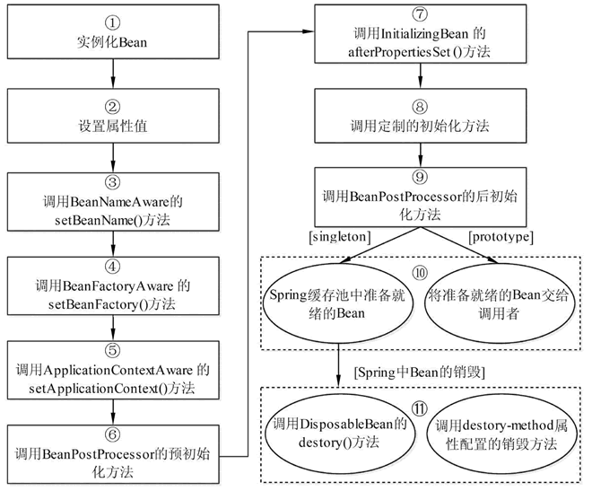
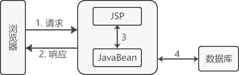
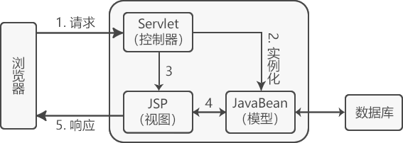
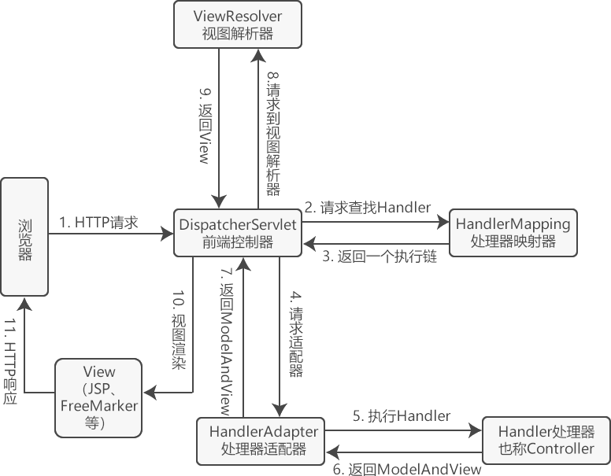
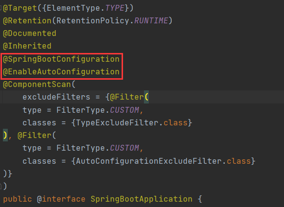
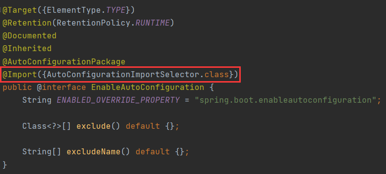
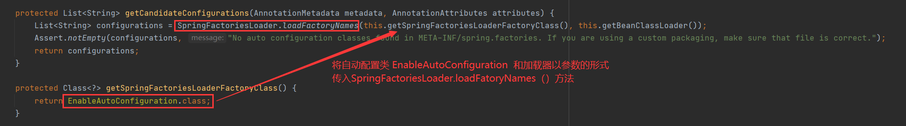

 

# Spring 速览

> 注意 ： 标记  :star: 的为重点内容

## Spring 框架学习

### Spring 是什么 

`Spring` 是目前主流的 Java Web 开发框架，是 `Java` 世界最为成功的框架。该框架是一个轻量级的开源框架，具有很高的凝聚力和吸引力。

Spring 由 Rod Johnson 创立，2004 年发布了 Spring 框架的第一版，其目的是用于简化企业级应用程序开发的难度和周期。

`Spring` 框架不局限于服务器端的开发。从简单性、可测试性和松耦合的角度而言，任何 Java 应用都可以从 `Spring` 中受益。`Spring` 框架还是一个超级粘合平台，除了自己提供功能外，还提供粘合其他技术和框架的能力。

`Spring` 使创建 Java 企业应用程序变得容易。它提供了在企业环境中采用 `Java` 语言所需的一切，支持将 `Groovy` 和 `Kotlin` 作为 `JVM` 上的替代语言，并且可以根据应用程序的需要灵活地创建多种架构。从 `Spring Framework 5.1` 开始，`Spring` 需要 `JDK 8+ (Java SE 8+)` 并为 `JDK 11 LTS` 提供开箱即用的支持。建议 **Java SE 8 update 60** 作为 Java 8 的最低补丁版本，但通常建议使用最近的补丁版本。

`Spring` 支持广泛的应用场景。在大型企业中，应用程序往往存在很长时间，并且必须运行在 `JDK` 和应用服务器上，其升级周期超出了开发人员的控制范围。其他的可能作为嵌入服务器的单个 jar 运行，可能在云环境中。还有一些可能是不需要服务器的独立应用程序（例如批处理或集成工作负载）。

**Spring 是开源的。**它拥有一个庞大而活跃的社区，可以根据各种实际用例提供持续的反馈。这帮助 Spring 在很长一段时间内成功发展。

### Spring 体系结构 :star:

`Spring` 框架采用**分层**的理念，根据功能的不同划分成了多个模块，这些模块大体可分为如下几类:

#### Data Access/Integration（数据访问／集成）

数据访问／集成层包括 **JDBC**、**ORM**、**OXM**、**JMS** 和 **Transactions** 模块，具体介绍如下。

- **JDBC 模块**：提供了一个 JBDC 的样例模板，使用这些模板能消除传统冗长的 JDBC 编码还有必须的事务控制，而且能享受到 Spring 管理事务的好处。
- **ORM 模块**：提供与流行的“**对象 - 关系**”映射框架无缝集成的 API，包括 `JPA`、`JDO`、`Hibernate` 和 `MyBatis` 等。而且还可以使用 Spring 事务管理，无需额外控制事务。
- **OXM 模块**：提供了一个支持 `Object /XML` 映射的抽象层实现，如 `JAXB`、`Castor`、`XMLBeans`、`JiBX` 和 `XStream`。将 Java 对象映射成 `XML` 数据，或者将`XML` 数据映射成 Java 对象。
- **JMS 模块**：指 **Java 消息服务**，提供一套 “消息生产者、消息消费者”模板用于更加简单的使用 JMS，JMS 用于用于在两个应用程序之间，或分布式系统中发送消息，进行异步通信。
- **Transactions 事务模块**：支持编程和声明式事务管理。

#### Web模块

Spring 的 Web 层包括 `Web`、`Servlet`、`WebSocket` 和 `Portlet` 组件，具体介绍如下。

- **Web 模块**：提供了基本的 Web 开发集成特性，例如多文件上传功能、使用的 Servlet 监听器的 IOC 容器初始化以及 Web 应用上下文。
- **Servlet 模块**：提供了一个 Spring MVC Web 框架实现。Spring MVC 框架提供了基于注解的请求资源注入、更简单的数据绑定、数据验证等及一套非常易用的 JSP 标签，完全无缝与 Spring 其他技术协作。
- **WebSocket 模块**：提供了简单的接口，用户只要实现响应的接口就可以快速的搭建 WebSocket Server，从而实现双向通讯。
- **Portlet 模块**：提供了在 Portlet 环境中使用 MVC 实现，类似 Web-Servlet 模块的功能。

#### Core Container（Spring的核心容器）

Spring 的核心容器是其他模块建立的基础，由 **Beans 模块**、**Core 核心模块**、**Context 上下文模块**和 **SpEL 表达式语言模块**组成，没有这些核心容器，也不可能有 AOP、Web 等上层的功能。具体介绍如下。

- **Beans 模块**：提供了框架的基础部分，包括**控制反转**和**依赖注入**。
- **Core 核心模块**：封装了 `Spring` 框架的底层部分，包括**资源访问**、**类型转换**及一些常用工具类。
- **Context 上下文模块**：建立在 `Core` 和 `Beans` 模块的基础之上，集成 Beans 模块功能并添加**资源绑定**、**数据验证**、**国际化**、**Java EE 支持**、**容器生命周期**、**事件传播**等。`ApplicationContext` 接口是上下文模块的焦点。
- **SpEL 模块**：提供了强大的表达式语言支持，支持访问和修改属性值，方法调用，支持访问及修改数组、容器和索引器，命名变量，支持算数和逻辑运算，支持从 Spring 容器获取 Bean，它也支持列表投影、选择和一般的列表聚合等。

#### AOP、Aspects、Instrumentation和Messaging

在 `Core Container` 之上是 **AOP**、**Aspects** 等模块，具体介绍如下：

- **AOP 模块**：提供了面向切面编程实现，提供比如日志记录、权限控制、性能统计等通用功能和业务逻辑分离的技术，并且能动态的把这些功能添加到需要的代码中，这样各司其职，降低业务逻辑和通用功能的耦合。
- **Aspects 模块**：提供与 AspectJ 的集成，是一个功能强大且成熟的面向切面编程（AOP）框架。
- **Instrumentation 模块**：提供了类工具的支持和类加载器的实现，可以在特定的应用服务器中使用。
- **messaging 模块**：Spring 4.0 以后新增了消息（Spring-messaging）模块，该模块提供了对消息传递体系结构和协议的支持。

#### Test模块

**Test 模块**：`Spring` 支持 `Junit` 和 `TestNG` 测试框架，而且还额外提供了一些基于 Spring 的测试功能，比如在测试 Web 框架时，模拟 Http 请求的功能。

### Spring 开发环境搭建

### 第一个 Spring 程序

### Spring IoC 容器 :star:

IoC 容器是 Spring 的核心，也可以称为 Spring 容器。Spring 通过 IoC 容器来管理对象的实例化和初始化，以及对象从创建到销毁的整个生命周期。

Spring 中使用的对象都由 IoC 容器管理，不需要我们手动使用 new 运算符创建对象。由 IoC 容器管理的对象称为 Spring Bean，Spring Bean 就是 Java 对象，和使用 new 运算符创建的对象没有区别。

Spring 通过读取 XML 或 Java 注解中的信息来获取哪些对象需要实例化。

Spring 提供 2 种不同类型的 IoC 容器，即 BeanFactory 和 ApplicationContext 容器。

#### BeanFactory 容器

**BeanFactory** 是最简单的容器，由`org.springframework.beans.factory.BeanFactory` 接口定义，采用**懒加载（lazy-load）**，所以容器启动比较快。`BeanFactory` 提供了容器最基本的功能。

为了能够兼容 `Spring` 集成的第三方框架（如 `BeanFactoryAware`、`InitializingBean`、`DisposableBean`），所以目前仍然保留了该接口。

简单来说，**BeanFactory** 就是一个**管理 Bean 的工厂**，它主要负责**初始化各种 Bean**，并调用它们的生命周期方法。

**BeanFactory** 接口有多个实现类，最常见的是 `org.springframework.beans.factory.xml.XmlBeanFactory`。使用 **BeanFactory** 需要创建 `XmlBeanFactory` 类的实例，通过 `XmlBeanFactory` 类的构造函数来传递 Resource 对象。如下所示。

```java
Resource resource = new ClassPathResource("applicationContext.xml"); 
BeanFactory factory = new XmlBeanFactory(resource);  
```

#### ApplicationContext 容器

`ApplicationContext` 继承了 `BeanFactory` 接口，由 `org.springframework.context.ApplicationContext` 接口定义，对象在启动容器时加载。`ApplicationContext` 在 `BeanFactory` 的基础上增加了很多企业级功能，例如 AOP、国际化、事件支持等。

`ApplicationContext` 接口有两个常用的实现类，具体如下。

##### ClassPathXmlApplicationContext

该类从类路径 ClassPath 中寻找指定的 XML 配置文件，并完成 ApplicationContext 的实例化工作，具体如下所示。

```java
ApplicationContext applicationContext = new ClassPathXmlApplicationContext(String configLocation);
```

在上述代码中，`configLocation` 参数用于**指定Spring配置文件的名称和位置**，如 Beans.xml。

##### FileSystemXmlApplicationContext

该类从指定的文件系统路径中寻找指定的 XML 配置文件，并完成 `ApplicationContext` 的实例化工作，具体如下所示。

```java
ApplicationContext applicationContext = new FileSystemXmlApplicationContext(String configLocation);
```

它与 `ClassPathXmlApplicationContext` 的区别是：在读取 Spring 的配置文件时，`FileSystemXmlApplicationContext` **不会从类路径中读取配置文件**，而是通过参数指定配置文件的位置。即 `FileSystemXmlApplicationContext` 可以获取类路径之外的资源，如`/workspaces/Beans.xml`。

通常在 Java 项目中，会采用 `ClassPathXmlApplicationContext` 类实例化 `ApplicationContext` 容器的方式，而在 Web 项目中，`ApplicationContext` 容器的实例化工作会交由 Web 服务器完成。Web 服务器实例化 `ApplicationContext` 容器通常使用基于 `ContextLoaderListener` 实现的方式，它只需要在 `web.xml` 中添加如下代码：

```xml
<!--指定Spring配置文件的位置，有多个配置文件时，以逗号分隔-->
<context-param>
    <param-name>contextConfigLocation</param-name>
    <!--spring将加载spring目录下的applicationContext.xml文件-->
    <param-value>
        classpath:spring/applicationContext.xml
    </param-value>
</context-param>
<!--指定以ContextLoaderListener方式启动Spring容器-->
<listener>
    <listener-class>
        org.springframework.web.context.ContextLoaderListener
    </listener-class>
</listener>
```

需要注意的是，`BeanFactory` 和 `ApplicationContext` 都是通过 XML 配置文件加载 Bean 的。

二者的主要区别在于，如果 Bean 的某一个属性没有注入，使用 `BeanFacotry` 加载后，第一次调用 `getBean()` 方法时会抛出异常，而 `ApplicationContext` 则会在初始化时自检，这样有利于检查所依赖的属性是否注入。

因此，在实际开发中，**通常都选择使用 `ApplicationContext`**，只有在系统资源较少时，才考虑使用 `BeanFactory`。

### Spring Bean 定义 :star:

可以把 `Spring IoC` 容器看作是一个大工厂，`Bean` 相当于工厂的产品，如果希望这个大工厂生产和管理 `Bean`，则需要告诉容器需要哪些 `Bean`，以及需要哪种方式装配 `Bean`。

Spring 配置文件支持**两种格式**，即 `XML` 文件格式和 `Properties` 文件格式。
`Properties` 配置文件主要**以 key-value 键值对**的形式存在，只能赋值，不能进行其他操作，适用于简单的属性配置。
`XML` 配置文件是树形结构，相对于 `Properties` 文件来说更加灵活。`XML` 配置文件结构清晰，但是内容比较繁琐，适用于大型复杂的项目。

通常情况下，`Spring` 的配置文件使用 `XML` 格式。`XML` 配置文件的根元素是 <beans>，该元素包含了多个子元素 <bean>。每一个 <bean> 元素都定义了一个 Bean，并描述了该 Bean 如何被装配到 Spring 容器中。

例如：

```xml
<?xml version="1.0" encoding="UTF-8"?>
<beans xmlns="http://www.springframework.org/schema/beans"
    xmlns:xsi="http://www.w3.org/2001/XMLSchema-instance"
    xsi:schemaLocation="http://www.springframework.org/schema/beans
   http://www.springframework.org/schema/beans/spring-beans-3.0.xsd">
    <bean id="helloWorld" class="net.biancheng.HelloWorld">
        <property name="message" value="Hello World!" />
    </bean>
</beans>
```

上述代码中，使用 `id` 属性定义了 `Bean`，并使用 `class` 属性指定了 `Bean` 对应的类。

`<bean>` 元素中可以包含很多属性，其常用属性如下表所示。

| 属性名称        | 描述                                                         |
| :-------------- | :----------------------------------------------------------- |
| id              | Bean 的唯一标识符，Spring 容器对 Bean 的配置和管理都通过该属性完成。**id 的值必须以字母开始**，可以使用字母、数字、下划线等符号。 |
| name            | name 属性中可以为 Bean 指定多个名称，每个名称之间用逗号或分号隔开。Spring 容器可以通过 name 属性配置和管理容器中的 Bean。 |
| class           | 该属性指定了 Bean 的具体实现类，**它必须是一个完整的类名**，即类的全限定名。 |
| scope           | 用于设定 Bean 实例的作用域，属性值可以为 `singleton`（单例）、`prototype`（原型）、`request`、`session` 和 `global Session`。其默认值是 `singleton` |
| constructor-arg | `<bean>`元素的子元素，可以使用此元素传入构造参数进行实例化。该元素的 index 属性指定构造参数的序号（从 0 开始），`type` 属性指定构造参数的类型 |
| property        | `<bean>`元素的子元素，用于调用 Bean 实例中的 `setter` 方法来属性赋值，从而完成依赖注入。该元素的 name 属性用于指定 Bean 实例中相应的属性名 |
| ref             | `<property>` 和 `<constructor-arg>` 等元素的子元索，该元素中的 bean 属性用于指定对某个 Bean 实例的引用 |
| value           | `<property>` 和 `<constractor-arg>` 等元素的子元素，用于直接指定一个常量值 |
| list            | 用于封装 `List` 或数组类型的依赖注入                         |
| set             | 用于封装 `Set` 类型的依赖注入                                |
| map             | 用于封装 `Map` 类型的依赖注入                                |
| entry           | `<map>` 元素的子元素，用于设置一个键值对。其 `key` 属性指定字符串类型的键值，`ref` 或 `value` 子元素指定其值 |
| init-method     | 容器加载 Bean 时调用该方法，类似于 Servlet 中的 `init()` 方法 |
| destroy-method  | 容器删除 Bean 时调用该方法，类似于 Servlet 中的 `destroy()` 方法。该方法**只在 `scope=singleton` 时有效** |
| lazy-init       | 懒加载，如果值为 `true`，容器在首次请求时才会创建 Bean 实例；如果值为 `false`，容器**在启动时创建 Bean 实例**。该方法**只在 `scope=singleton` 时有效**。 |

### Spring Bean 作用域 :star:

在配置文件中，除了可以定义 `Bean` 的属性值和相互之间的依赖关系，还可以声明 `Bean` 的作用域。例如，如果每次获取 `Bean` 时，都需要一个 `Bean` 实例，那么应该将 `Bean` 的 `scope` 属性定义为 `prototype`，如果 `Spring` 需要每次都返回一个相同的 `Bean` 实例，则应将 `Bean` 的 `scope` 属性定义为 `singleton`。

#### 作用域的种类

Spring 容器在初始化一个 Bean 实例时，同时会指定该实例的作用域。Spring 5 支持以下 6 种作用域。

##### 1）singleton

**默认值**，单例模式，表示在 `Spring` 容器中**只有一个 Bean 实例**，`Bean` 以单例的方式存在。

##### 2）prototype
原型模式，表示每次通过 `Spring` 容器获取 `Bean` 时，容器都会**创建一个新的Bean实例**。

##### 3）request

每次 `HTTP` 请求，容器都会创建一个 `Bean` 实例。该作用域**只在当前 `HTTP Request` 内有效**。

##### 4）session

**同一个 `HTTP Session` 共享一个 Bean 实例**，不同的 `Session` 使用不同的 Bean 实例。该作用域**仅在当前 `HTTP Session` 内有效**。

##### 5）application

同一个 `Web` 应用共享**一个 `Bean` 实例**，该作用域在当前 `ServletContext` 内有效。
类似于 `singleton`，不同的是，`singleton` 表示每个 `IoC` 容器中仅有一个 `Bean` 实例，而同一个 `Web` 应用中可能会**有多个 IoC 容器**，但一个 `Web` 应用只会有一个 `ServletContext`，也可以说 **`application` 才是 Web 应用中货真价实的单例模式**。

##### 6）websocket

`websocket` 的作用域是 `WebSocket` ，即**在整个 `WebSocket` 中有效**。


注意：`request`、`session`、`application`、`websocket` 作用域**只能在 Web 环境下使用**，如果使用 `ClassPathXmlApplicationContext` 加载这些作用域中的任意一个的 Bean，就会抛出以下异常。

```
java.lang.IllegalStateException: No Scope registered for scope name 'xxx'
```

#### 详细介绍 `singleton` 和 `prototype`

下面我们详细讲解常用的两个作用域：`singleton` 和 `prototype`。

##### singleton

`singleton` **是 Spring 容器默认的作用域**。当 Bean 的作用域为 `singleton` 时，Spring 容器中**只会存在一个共享的 Bean 实例**。该 Bean 实例将存储在高速缓存中，并且所有对 Bean 的请求，只要 **id 与该 Bean 定义相匹配**，都会返回该缓存对象。

通常情况下，这种单例模式对于**无会话状态的 Bean**（如 `DAO` 层、`Service` 层）来说，是最理想的选择。

在 Spring 配置文件中，可以使用 `<bean>` 元素的 `scope` 属性，将 `Bean` 的作用域定义成 `singleton`，其配置方式如下所示：

```xml
<bean id="..." class="..." scope="singleton"/>
```

##### prototype

对于 `prototype` 作用域的 `Bean`，`Spring` 容器会在**每次请求该 Bean 时都创建一个新的 Bean 实例**。`prototype` 作用域适用于**需要保持会话状态的 Bean**（如 Struts2 的 Action 类）。

在 `Spring` 配置文件中，可以使用 `<bean>` 元素的 `scope` 属性，将 `Bean` 的作用域定义成 `prototype`，其配置方式如下所示：

```xml
<bean id="..." class="..." scope="prototype"/>
```


### Spring Bean 生命周期 :star:

`Spring` 中 `Bean` 的生命周期较复杂，可以表示为：

**Bean 的定义** -> **Bean 的初始化** -> **Bean 的使用** -> **Bean 的销毁**。

Spring 根据 `Bean` 的作用域来选择管理方式。对于 `singleton` 作用域的 `Bean`，`Spring` 能够精确地知道该 `Bean` 何时被创建，何时初始化完成，以及何时被销毁；而对于 `prototype` 作用域的 `Bean`，`Spring` 只负责创建，当容器创建了 Bean 的实例后，`Bean` 的实例就交给客户端代码管理，`Spring` 容器将不再跟踪其生命周期。

#### Spring Bean生命周期执行流程

`Spring` 容器在确保一个 `Bean` 能够使用之前，会进行很多工作。`Spring` 容器中 `Bean` 的生命周期流程如下图所示。



`Bean` 生命周期的整个执行过程描述如下。

1. **Spring 启动**，**查找**并**加载**需要被 `Spring` 管理的 `Bean`，并**实例化** `Bean`。
1. 利用**依赖注入完成** `Bean` 中所有**属性值**的配置注入。
1. 如果 `Bean` 实现了 `BeanNameAware` 接口，则 Spring 调用 `Bean` 的 `setBeanName()` 方法传入当前 `Bean` 的 `id` 值。
1. 如果 Bean 实现了 `BeanFactoryAware` 接口，则 Spring 调用 `setBeanFactory()` 方法传入当前工厂实例的引用。
1. 如果 Bean 实现了 `ApplicationContextAware` 接口，则 Spring 调用 `setApplicationContext()` 方法传入当前 `ApplicationContext` 实例的引用。
1. 如果 Bean 实现了 `BeanPostProcessor` 接口，则 Spring 调用该接口的预初始化方法 `postProcessBeforeInitialzation()` 对 `Bean` 进行加工操作，此处非常重要，Spring 的 AOP 就是利用它实现的。
1. 如果 Bean 实现了 `InitializingBean` 接口，则 Spring 将调用 `afterPropertiesSet()` 方法。
1. 如果在配置文件中通过 `init-method` 属性指定了初始化方法，则调用该初始化方法。
1. 如果 `BeanPostProcessor` 和 `Bean` 关联，则 Spring 将调用该接口的初始化方法 `postProcessAfterInitialization()`。此时Bean **已经可以被应用系统使用**了。
1. 如果在 `<bean>` 中指定了该 Bean 的作用域为 `singleton`，则将该 `Bean` 放入 `Spring IoC` 的缓存池中，触发 Spring 对该 `Bean` 的生命周期管理；如果在 `<bean>` 中指定了该 Bean 的作用域为 `prototype`，则将该 `Bean` 交给调用者，调用者管理该 `Bean` 的生命周期，`Spring` 不再管理该 `Bean`。
1. 如果 `Bean` 实现了 `DisposableBean` 接口，则 Spring 会调用 `destory()` 方法销毁 `Bean`；如果在配置文件中通过 `destory-method` 属性指定了 `Bean` 的销毁方法，则 Spring 将调用该方法对 `Bean` 进行销毁。

Spring 为 `Bean` 提供了细致全面的生命周期过程，实现特定的接口或设置 `<bean>` 的属性都可以对 `Bean` 的生命周期过程产生影响。**建议不要过多的使用** `Bean` 实现接口，因为这样会导致代码的耦合性过高。

了解 Spring 生命周期的意义就在于，可以利用 Bean 在其存活期间的指定时刻完成一些相关操作。一般情况下，会在 `Bean` 被初始化后和被销毁前执行一些相关操作。

Spring 官方提供了 3 种方法实现初始化回调和销毁回调：

1. 实现 `InitializingBean` 和 `DisposableBean` 接口；
1. 在 `XML` 中配置 i`nit-method` 和 `destory-method`；
1. 使用 `@PostConstruct` 和 `@PreDestory` 注解。

在一个 `Bean` 中有多种生命周期回调方法时，**优先级为：注解 > 接口 > XML**。

小提示：不建议使用接口和注解，这会让 pojo 类和 Spring 框架紧耦合。

#### 初始化回调

##### 1. 使用接口
`org.springframework.beans.factory.InitializingBean` 接口提供了以下方法：

```java
void afterPropertiesSet() throws Exception;
```

您可以实现以上接口，在 `afterPropertiesSet` 方法内指定 `Bean` 初始化后需要执行的操作。

```xml
<bean id="..." class="..." />
```

```java
public class User implements InitializingBean {
    @Override
    public void afterPropertiesSet() throws Exception {
        System.out.println("调用接口：InitializingBean，方法：afterPropertiesSet，无参数");
    }
}
```

##### 2. 配置XML

可以通过 `init-method` 属性指定 `Bean` 初始化后执行的方法。

```xml
<bean id="..." class="..." init-method="init"/>
```

```java
public class User {
    public void init() {
        System.out.println("调用init-method指定的初始化方法:init" );
    }
}
```

##### 3. 使用注解

使用 `@PostConstruct` 注解标明该方法为 `Bean` 初始化后的方法。

```java
public class ExampleBean {
    @PostConstruct
    public void init() {
        System.out.println("@PostConstruct注解指定的初始化方法:init" );
    }
}
```

#### 销毁回调

##### 1. 使用接口

`org.springframework.beans.factory.DisposableBean` 接口提供了以下方法：

```java
void destroy() throws Exception;
```

您可以实现以上接口，在 `destroy` 方法内**指定 Bean 初始化后需要执行的操作**。

```xml
<bean id="..." class="..." />
```

```java
public class User implements InitializingBean {
    @Override
    public void afterPropertiesSet() throws Exception {
        System.out.println("调用接口：InitializingBean，方法：afterPropertiesSet，无参数");
    }
}
```

##### 2. 配置XML

可以通过 `destroy-method` 属性指定 `Bean` 销毁后执行的方法。

```xml
<bean id="..." class="..." destroy-method="destroy"/>
```

```java
public class User {
    public void destroy() {
        System.out.println("调用destroy-method指定的销毁方法:destroy" );
    }
}
```

##### 3. 使用注解

使用 `@PreDestory` 注解标明该方法为 `Bean` 销毁前执行的方法。

```java
public class ExampleBean {
    @PreDestory 
    public void destroy() {
        System.out.println("@PreDestory注解指定的初始化方法:destroy" );
    }
}
```


### Spring 后置处理器

`BeanPostProcessor` 接口也被称为后置处理器，通过该接口可以自定义调用初始化前后执行的操作方法。

`BeanPostProcessor` 接口源码如下：

```java
public interface BeanPostProcessor {
    Object postProcessBeforeInitialization(Object bean, String beanName) throws BeansException;
    Object postProcessAfterInitialization(Object bean, String beanName) throws BeansException;
}
```

`postProcessBeforeInitialization` 在 Bean 实例化、依赖注入后，初始化前调用。

`postProcessAfterInitialization` 在 Bean 实例化、依赖注入、初始化都完成后调用。

当需要添加多个后置处理器实现类时，默认情况下 `Spring` 容器会根据后置处理器的定义顺序来依次调用。也可以通过实现 `Ordered` 接口的 `getOrder` 方法指定后置处理器的执行顺序。该方法返回值为整数，默认值为 `0`，值越大优先级越低。

### Spring Bean 继承

`Bean` 定义可以包含很多配置信息，包括**构造函数参数**、**属性值**和**容器的一些具体信息**，如**初始化方法**、**销毁方法**等。子 `Bean` 可以继承父 `Bean` 的配置数据，根据需要，子 `Bean` 可以重写值或添加其它值。

需要注意的是，**`Spring Bean` 定义的继承与 `Java` 中的继承无关**。您可以将父 `Bean` 的定义作为一个模板，其它子 `Bean` 从父 `Bean` 中继承所需的配置。

在配置文件中通过 `parent` 属性来指定继承的父 `Bean`。

### Spring 依赖注入 :star:

**Spring 依赖注入（Dependency Injection，DI）**和控制反转含义相同，它们是从两个角度描述的同一个概念。使用依赖注入**可以更轻松的管理和测试应用程序**。

当某个 `Java` 实例需要另一个 `Java` 实例时，传统的方法是由调用者创建被调用者的实例（例如，使用 `new` 关键字获得被调用者实例），而使用 `Spring` 框架后，被调用者的实例不再由调用者创建，而是由 Spring 容器创建，这称为**控制反转**。

`Spring` 容器在创建被调用者的实例时，会自动将调用者需要的对象实例注入给调用者，调用者通过 `Spring` 容器获得被调用者实例，这称为**依赖注入**。

依赖注入主要有两种实现方式，分别是 **setter 注入（又称设值注入）**和**构造函数注入**。具体介绍如下。

#### 1）构造函数注入

指 `IoC` 容器使用构造函数注入被依赖的实例。可以通过调用带参数的构造函数实现依赖注入，每个参数代表一个依赖。

 `Spring` 实例化 `Bean` 的过程中，首先会调用默认的构造方法实例化 `Bean` 对象，然后通过 Java 的反射机制调用 `setXxx()` 方法进行属性的注入。因此，`setter` 注入要求 `Bean` 的对应类必须满足以下两点要求。

1. 必须提供一个默认的无参构造方法。
2. 必须为需要注入的属性提供对应的 `setter` 方法。

使用 `<constructor-arg>` 标签实现构造函数注入。

在 `<constructor-arg>` 标签中，包含 `ref`、`value`、type`、``index` 等属性。`value` 属性用于注入基本数据类型以及字符串类型的值；`ref` 属性用于注入已经定义好的 `Bean`；`type` 属性用来指定对应的构造函数，当构造函数有多个参数时，可以使用 `c` 属性指定参数的位置，`index` 属性值从 0 开始。

#### 2）setter 注入

指 `IoC` 容器使用 `setter` 方法注入被依赖的实例。通过调用无参构造器或无参 `static` 工厂方法实例化 `Bean` 后，调用该 `Bean` 的 `setter` 方法，即可实现基于 `setter` 的 `DI`。

使用 setter 注入时，在 Spring 配置文件中，需要使用 `<bean>` 元素的子元素 `<property>` 为每个属性注入值。而使用构造注入时，在配置文件中，主要使用 `<constructor-arg>` 标签定义构造方法的参数，使用其 `value` 属性（或子元素）设置该参数的值。

使用 `<property>` 标签实现 `setter` 注入。

在 `<property>` 标签中，包含 `name`、`ref`、`value` 等属性。`name` 用于指定参数名称；`value` 属性用于注入基本数据类型以及字符串类型的值；`ref` 属性用于注入已经定义好的 `c`。

### Spring 注入内部 Bean

Java 中在类内部定义的类称为内部类，同理在 `Bean` 中定义的 `Bean` 称为内部 Bean。注入内部 Bean 使用 `<property>` 和 `<constructor-arg>` 中的 `<bean>` 标签。如下所示。

```xml
<?xml version="1.0" encoding="UTF-8"?>
<beans xmlns="http://www.springframework.org/schema/beans"
    xmlns:xsi="http://www.w3.org/2001/XMLSchema-instance"
    xsi:schemaLocation="http://www.springframework.org/schema/beans
    http://www.springframework.org/schema/beans/spring-beans-3.0.xsd">
    <bean id="outerBean" class="...">
        <property name="target">
            <!-- 定义内部Bean -->
            <bean class="..." />
        </property>
    </bean>
</beans>
```

内部 `Bean` 的定义不需要指定 `id` 和 `name` 。如果指定了，容器也不会将其作为区分 `Bean` 的标识符，反而会无视内部 `Bean` 的 `scope` 属性。所以内部 `Bean` 总是匿名的，而且总是随着外部 `Bean` 创建。

> 在实际开发中很少注入内部 Bean，因为开发者无法将内部的 Bean 注入外部 Bean 以外的其它 Bean。

### Spring 注入集合

如果需要传递类似于 `Java Collection` 类型的值，例如 `List`、`Set`、`Map` 和 `properties`，可以使用 Spring 提供的集合配置标签，如下表所示。

| 标签    | 说明                                                     |
| ------- | -------------------------------------------------------- |
| <list>  | 用于注入 list 类型的值，允许重复                         |
| <set>   | 用于注入 set 类型的值，不允许重复                        |
| <map>   | 用于注入 key-value 的集合，其中 key-value 可以是任意类型 |
| <props> | 用于注入 key-value 的集合，其中 key-value 都是字符串类型 |

### Spring Bean 自动装配

`Bean` 的装配可以理解为**依赖关系注入**，`Bean` 的装配方式也就是 `Bean` 的依赖注入方式。`Spring` 容器支持多种装配 `Bean` 的方式，如基于 `XML` 的 `Bean` 装配、基于 `Annotation` 的 `Bean` 装配和自动装配等。

`Spring` 基于 `XML` 的装配通常采用两种实现方式: **setter 注入**和**构造注入**。

自动装配就是指 `Spring` 容器在不使用 `<constructor-arg>` 和`<property>` 标签的情况下，可以自动装配（autowire）相互协作的 Bean 之间的关联关系，将一个 `Bean` 注入其他 `Bean` 的 `Property` 中。

使用自动装配需要配置 `<bean>` 元素的 `autowire` 属性。`autowire` 属性有五个值，具体说明如下表所示。

| 名称                          | 说明                                                         |
| ----------------------------- | ------------------------------------------------------------ |
| `no`                          | 默认值，表示不使用自动装配，Bean 依赖必须通过 ref 元素定义。 |
| `byName`                      | 根据 Property 的 name 自动装配，如果一个 Bean 的 name 和另一个 Bean 中的 Property 的 name 相同，则自动装配这个 Bean 到 Property 中。 |
| `byType`                      | 根据 Property 的数据类型（Type）自动装配，如果一个 Bean 的数据类型兼容另一个 Bean 中 Property 的数据类型，则自动装配。 |
| `constructor`                 | 类似于 byType，根据构造方法参数的数据类型，进行 byType 模式的自动装配。 |
| `autodetect`（3.0版本不支持） | 如果 Bean 中有默认的构造方法，则用 constructor 模式，否则用 byType 模式。 |

### Spring 基于注解装配Bean :star:

在 Spring 中，尽管可以使用 `XML` 配置文件实现 `Bean` 的装配工作，但如果应用中 Bean 的数量较多，会导致 `XML` 配置文件过于臃肿，从而给维护和升级带来一定的困难。

Java 从 JDK 5.0 以后，提供了 `Annotation`（注解）功能，`Spring` 2.5 版本开始也提供了对 `Annotation` 技术的全面支持，我们可以使用注解来配置依赖注入。

Spring **默认不使用**注解装配 Bean，因此需要在配置文件中添加 `<context:annotation-config/>`，启用注解。

#### `Spring` 中常用的注解

##### 1）@Component

可以使用此注解描述 `Spring` 中的 `Bean`，但它是一个泛化的概念，**仅仅表示一个组件（Bean）**，并且可以作用在任何层次。使用时只需将该注解标注在相应类上即可。

##### 2）@Repository

用于将**数据访问层（DAO层）**的类标识为 `Spring` 中的 `Bean`，其功能与 `@Component` 相同。

##### 3）@Service

通常作用在**业务层（Service 层）**，用于将业务层的类标识为 `Spring` 中的 `Bean`，其功能与 `@Component` 相同。

##### 4）@Controller

通常作用在**控制层**（如 `Struts2` 的 `Action`、`SpringMVC` 的 `Controller`），用于将控制层的类标识为 `Spring` 中的 `Bean`，其功能与 `@Component` 相同。

##### 5）@Autowired

可以应用到 `Bean` 的属性变量、属性的 `setter` 方法、非 `setter` 方法及构造函数等，配合对应的注解处理器完成 `Bean` 的自动配置工作。默认按照 `Bean` 的类型进行装配。

##### 6）@Resource

作用与 `Autowired` 相同，区别在于 `@Autowired` 默认按照 `Bean` 类型装配，而 `@Resource` 默认按照 `Bean` 实例名称进行装配。

`@Resource` 中有两个重要属性：`name` 和 `type`。

`Spring` 将 `name` 属性解析为 `Bean` 的实例名称，`type` 属性解析为 `Bean` 的实例类型。如果指定 `name` 属性，则按实例名称进行装配；如果指定 `type` 属性，则按 `Bean` 类型进行装配。如果都不指定，则先按 `Bean` 实例名称装配，如果不能匹配，则再按照 `Bean` 类型进行装配；如果都无法匹配，则抛出 `NoSuchBeanDefinitionException` 异常。

##### 7）@Qualifier

与 `@Autowired` 注解配合使用，会将默认的按 `Bean` 类型装配修改为按 `Bean` 的实例名称装配，Bean 的实例名称由 `@Qualifier` 注解的参数指定。

### Spring AOP  :star:

`AOP` 的全称是“`Aspect Oriented Programming`”，即**面向切面编程**，和 **OOP（面向对象编程）**类似，也是一种**编程思想**。

AOP 采取**横向抽取机制**（动态代理），取代了传统纵向继承机制的重复性代码，其应用主要体现在**事务处理**、**日志管理**、**权限控制**、**异常处理**等方面。主要作用是**分离功能性需求**和**非功能性需求**，使开发人员可以集中处理某一个关注点或者横切逻辑，**减少对业务代码的侵入**，**增强代码的可读性**和可**维护性**。

简单的说，AOP 的作用就是**保证开发者在不修改源代码的前提下，为系统中的业务组件添加某种通用功能**。AOP 就是代理模式的典型应用。

目前最流行的 AOP 框架有两个，分别为 `Spring AOP` 和 `AspectJ`。

`Spring AOP` 是基于 `AOP` 编程模式的一个框架，它能够有效的减少系统间的重复代码，达到松耦合的目的。`Spring AOP` 使用纯 `Java` 实现，不需要专门的编译过程和类加载器，在运行期间通过代理方式向目标类植入增强的代码。有两种实现方式：**基于接口的 `JDK` 动态代理**和**基于继承的 `CGLIB` 动态代理**。

`AspectJ` 是一个基于 `Java` 语言的 `AOP` 框架，从 **Spring 2.0** 开始，`Spring AOP` 引入了对 `AspectJ` 的支持。`AspectJ` 扩展了 `Java` 语言，提供了一个专门的编译器，在编译时提供横向代码的植入。

使用 AOP，我们不用在方法内调用发送通知的方法，只需要在类的方法中定义切入点，然后在 XML 文件中调用。如果需要删除或修改此功能，那么只需要在 XML 文件中进行更改。由此可以看出，使用 AOP 可以增强代码的可维护性。

#### AOP术语

为了更好地理解 AOP，我们需要了解一些它的相关术语。这些专业术语并不是 Spring 特有的，有些也同样适用于其它 AOP 框架，如 AspectJ。它们的含义如下表所示。

| 名称                  | 说明                                                         |
| --------------------- | ------------------------------------------------------------ |
| `Joinpoint`（连接点） | 指那些被拦截到的点，在 `Spring` 中，指可以被动态代理拦截目标类的方法。 |
| `Pointcut`（切入点）  | 指要对哪些 `Joinpoint` 进行拦截，即被拦截的连接点。          |
| `Advice`（通知）      | 指拦截到 `Joinpoint` 之后要做的事情，即对切入点增强的内容。  |
| `Target`（目标）      | 指代理的目标对象。                                           |
| `Weaving`（植入）     | 指把增强代码应用到目标上，生成代理对象的过程。               |
| `Proxy`（代理）       | 指生成的代理对象。                                           |
| `Aspect`（切面）      | 切入点和通知的结合。                                         |

Advice 直译为通知，也有的资料翻译为“增强处理”，共有 5 种类型，如下表所示。

| 通知                             | 说明                               |
| -------------------------------- | ---------------------------------- |
| `before`（前置通知）             | 通知方法在目标方法调用之前执行     |
| `after`（后置通知）              | 通知方法在目标方法返回或异常后调用 |
| `after-returning`（返回后通知）  | 通知方法会在目标方法返回后调用     |
| `after-throwing`（抛出异常通知） | 通知方法会在目标方法抛出异常后调用 |
| `around`（环绕通知）             | 通知方法会将目标方法封装起来       |

**`AOP`是 Spring 的核心之一**，在 Spring 中经常会**使用 AOP 来简化编程**。在 `Spring` 框架中使用 `AOP` 主要有以下优势。

- 提供声明式企业服务，特别是作为 `EJB` 声明式服务的替代品。最重要的是，这种服务是声明式事务管理。
- 允许用户实现自定义切面。在某些不适合用 `OOP` 编程的场景中，采用 `AOP` 来补充。
- 可以对业务逻辑的各个部分进行隔离，从而使业务逻辑各部分之间的耦合度降低，提高程序的可重用性，同时也提高了开发效率。

### Spring JDK 动态代理 

Spring JDK 动态代理需要实现 `InvocationHandler` 接口，重写 `invoke` 方法，客户端使用 `Java.lang.reflect.Proxy` 类产生动态代理类的对象。

### Spring CGLlB 动态代理

`JDK` 动态代理使用起来非常简单，但是 `JDK` 动态代理的**目标类必须要实现一个或多个接口**，具有一定的局限性。如果**不希望实现接口**，可以使用 **CGLIB代理**。

**CGLIB（Code Generation Library）**是一个高性能开源的代码生成包，它被许多 `AOP` 框架所使用，其底层是通过使用一个小而快的字节码处理框架 `ASM`（Java 字节码操控框架）转换字节码并生成新的类。

Spring 核心包中包含 `CGLIB` 和 `asm`。

### Spring 集成 AspectJ :star:

`AspectJ` 是一个基于 `Java` 语言的 `AOP` 框架，它扩展了 `Java` 语言，提供了强大的 AOP `功能`。

使用 `AspectJ` 需要导入以下 jar 包：

- Aspectjrt.jar
- Aspectjweaver.jar
- Aspectj.jar

使用 `AspectJ` 开发 `AOP` 通常有以下 2 种方式：

- 基于 `XML` 的声明式 `AspectJ`
- 基于 `Annotation` 的声明式 `AspectJ`


### AspectJ 基于 XML 开发AOP :star:

基于 XML 的声明式是指通过 `Spring` 配置文件的方式来定义切面、切入点及通知，而所有的切面和通知都必须定义在 `<aop:config>` 元素中。

在使用 `<aop:config>` 元素之前，我们需要先导入 Spring aop 命名空间，如下所示。

```xml
<?xml version="1.0" encoding="UTF-8"?>
<beans xmlns="http://www.springframework.org/schema/beans"
    xmlns:xsi="http://www.w3.org/2001/XMLSchema-instance"
    xmlns:aop="http://www.springframework.org/schema/aop"
    xsi:schemaLocation="http://www.springframework.org/schema/beans
    http://www.springframework.org/schema/beans/spring-beans-3.0.xsd
    http://www.springframework.org/schema/aop
    http://www.springframework.org/schema/aop/spring-aop-3.0.xsd ">
    
<!--
	code 
-->
</beans>
```

#### 定义切面`<aop:aspect>`

在 Spring 配置文件中，使用 `<aop:aspect>` 元素定义切面，该元素可以将定义好的 Bean **转换为切面 Bean**，所以使用 `<aop:aspect>` 之前需要**先定义一个普通的 Spring Bean**。

```xml
<aop:config>
    <aop:aspect id="myAspect" ref="aBean">
<!--
	code 
-->
    </aop:aspect>
</aop:config>
```

其中，`id` 用来定义该切面的唯一表示名称，`ref` 用于引用普通的 `Spring Bean`。

#### 定义切入点`<aop:pointcut>`

`<aop:pointcut>` 用来定义一个切入点，当 `<aop:pointcut>`元素作为 `<aop:config>` 元素的子元素定义时，表示该切入点是全局切入点，它可被多个切面所共享；当 `<aop:pointcut>` 元素作为 `<aop:aspect>` 元素的子元素时，表示该切入点只对当前切面有效。

```xml
<aop:config>
    <aop:pointcut id="myPointCut"
        expression="execution(* net.service.*.*(..))"/>
</aop:config>
```

其中，`id` 用于指定切入点的唯一标识名称，`execution` 用于指定切入点关联的切入点表达式。

execution 格式为：

```
execution(modifiers-pattern returning-type-pattern declaring-type-pattern name-pattern(param-pattern)throws-pattern)
```

其中：

- `returning-type-pattern`、`name-pattern`、`param-pattern` 是必须的，其它参数为可选项。
- `modifiers-pattern`：指定修饰符，如 `private`、`public`。
- `returning-type-pattern`：指定返回值类型，`*`表示可以为任何返回值。如果返回值为对象，则需指定全路径的类名。
- `declaring-type-pattern`：指定方法的包名。
- `name-pattern`：指定方法名，`*`代表所有，`set*` 代表以 set 开头的所有方法。
- `param-pattern`：指定方法参数（声明的类型），`(..)`代表所有参数，`(*)`代表一个参数，`(*,String)`代表第一个参数可以为任何值，第二个为 String 类型的值。
- `throws-pattern`：指定抛出的异常类型。

例如：`execution(* net.biancheng.*.*(..))`表示匹配 net.biancheng 包中任意类的任意方法。

#### 定义通知

AspectJ 支持 5 种类型的 `advice`，如下。

```xml
<aop:aspect id="myAspect" ref="aBean">
    <!-- 前置通知 -->
    <aop:before pointcut-ref="myPointCut" method="..."/>
   
    <!-- 后置通知 -->
    <aop:after-returning pointcut-ref="myPointCut" method="..."/>
    <!-- 环绕通知 -->
    <aop:around pointcut-ref="myPointCut" method="..."/>
    <!-- 异常通知 -->
    <aop:after-throwing pointcut-ref="myPointCut" method="..."/>
    <!-- 最终通知 -->
    <aop:after pointcut-ref="myPointCut" method="..."/>
    .... 
</aop:aspect>
```


### AspectJ 基于注解开发AOP :star:

在 Spring 中，尽管使用 XML 配置文件可以实现 AOP 开发，但是如果所有的相关配置都集中在配置文件中，势必会导致 XML 配置文件过于臃肿，从而给维护和升级带来一定的困难。

为此，AspectJ 框架为 AOP 开发提供了一套注解。AspectJ 允许使用注解定义切面、切入点和增强处理，Spring 框架可以根据这些注解生成 AOP 代理。

关于注解的介绍如下所示。

| 名称              | 说明                                                         |
| ----------------- | ------------------------------------------------------------ |
| `@Aspect`         | 用于定义一个切面。                                           |
| `@Pointcut`       | 用于定义一个切入点。                                         |
| `@Before`         | 用于定义前置通知，相当于 `BeforeAdvice`。                    |
| `@AfterReturning` | 用于定义后置通知，相当于 `AfterReturningAdvice`。            |
| `@Around`         | 用于定义环绕通知，相当于`MethodInterceptor`。                |
| `@AfterThrowing`  | 用于定义抛出通知，相当于`ThrowAdvice`。                      |
| `@After`          | 用于定义最终`final`通知，不管是否异常，该通知都会执行。      |
| `@DeclareParents` | 用于定义引介通知，相当于`IntroductionInterceptor`（不要求掌握）。 |

#### 启用 @AspectJ 注解

启用 `@AspectJ` 注解有以下两种方法：

##### 1）使用@Configuration和@EnableAspectJAutoProxy注解

```java
@Configuration 
@EnableAspectJAutoProxy
public class Appconfig {
}
```

##### 2）基于XML配置

在 XML 文件中添加以下内容启用 `@AspectJ`。

```xml
<aop:aspectj-autoproxy>
```

#### 定义切面@Aspect

`AspectJ` 类和其它普通的 `Bean` 一样，可以有方法和字段，不同的是 `AspectJ` 类需要**使用 `@Aspect` 注解**，如下所示。

```java
package net.biancheng;
import org.aspectj.lang.annotation.Aspect;
@Aspect
public class AspectModule {
}
```

`AspectJ` 类也可以像其它 `Bean` 一样在 `XML` 中配置，如下。

```xml
<bean id = "myAspect" class = "net.biancheng.AspectModule">
   ...
</bean>
```

#### 定义切入点@Pointcut

**@Pointcut** 注解用来定义一个切入点，如下。

```java
// 要求：方法必须是private，返回值类型为void，名称自定义，没有参数
@Pointcut("execution(*net.biancheng..*.*(..))")
private void myPointCut() {
}
```

相当于以下`XML`

```xml
<aop:pointcut expression="execution(*net.biancheng..*.*(..))"  id="myPointCut"/>
```

#### 定义通知advice

`@AspectJ` 支持 5 种类型的 `advice`，以下为使用 `@Before` 的示例。

```java
@Before("myPointCut()")
public void beforeAdvice(){
}
```


### Spring JdbcTemplate类 :star:

`Spring` 针对数据库开发提供了 `JdbcTemplate` 类，该类封装了 `JDBC`，支持对数据库的所有操作。

`JdbcTemplate` 位于 `spring-jdbc-x.x.x.jar` 包中，其全限定命名为 `org.springframework.jdbc.core.JdbcTemplate`。此外使用 `JdbcTemplate` 还需要导入 `spring-tx-x.x.x.jar` 包，该包用来处理事务和异常。

在 `Spring` 中，`JDBC` 的相关信息在配置文件中完成，其配置模板如下所示。

> 本节使用 MySQL 数据库

```xml
<?xml version="1.0" encoding="UTF-8"?>
<beans xmlns="http://www.springframework.org/schema/beans"
    xmlns:xsi="http:/www.w3.org/2001/XMLSchema-instance"
    xsi:schemaLocation="http://www.springframework.org/schema/beans
    http://www.springframework.org/schema/beans/spring-beans.xsd"> 
   
    <!-- 配置数据源 --> 
    <bean id="dataSource" class="org.springframework.jdbc.datasource.DriverManagerDataSource">
        <!--数据库驱动-->
        <property name="driverClassName" value="com.mysql.jdbc.Driver" /> 
        <!--连接数据库的url-->
        <property name= "url" value="jdbc:mysql://localhost/xx" />
        <!--连接数据库的用户名-->
        <property name="username" value="root" />
        <!--连接数据库的密码-->
        <property name="password" value="root" />
    </bean>
    <!--配置JDBC模板-->
    <bean id="jdbcTemplate" class="org.springframework.jdbc.core.JdbcTemplate">
        <!--默认必须使用数据源-->
        <property name="dataSource" ref="dataSource"/>
    </bean>
    <!--配置注入类-->
    <bean id="xxx" class="xxx">
        <property name="jdbcTemplate" ref="jdbcTemplate"/>
    </bean>
</beans>
```

上述代码中定义了 3 个 `Bean`，分别是 `dataSource`、`jdbcTemplate` 和需要注入类的 Bean`。`其中 `dataSource` 对应的是 `DriverManagerDataSource` 类，用于对数据源进行配置；`jdbcTemplate` 对应 `JdbcTemplate` 类，该类中定义了 `JdbcTemplate` 的相关配置。

在 `dataSource` 中，定义了 4 个连接数据库的属性，如下表所示。

| 属性名            | 说明                                            |
| ----------------- | ----------------------------------------------- |
| `driverClassName` | 所使用的驱动名称，对应驱动 JAR 包中的 Driver 类 |
| `url`             | 数据源所在地址                                  |
| `username`        | 访问数据库的用户名                              |
| `password`        | 访问数据库的密码                                |

上表中的属性值需要根据数据库类型或者机器配置的不同进行相应设置。如果数据库类型不同，则需要更改驱动名称。如果数据库不在本地，则需要将 `localhost` 替换成**相应的主机 IP**。

在定义 `JdbcTemplate` 时，需要将 `dataSource` 注入到 `JdbcTemplate` 中。而在其他的类中要使用 `JdbcTemplate`，也需要将 `JdbcTemplate` 注入到使用类中（通常注入 `dao` 类中）。

在 `JdbcTemplate` 类中，提供了大量的查询和更新数据库的方法，如 `query()`、update() 等，如下表所示。

| 方法                                                         | 说明                                                         |
| ------------------------------------------------------------ | ------------------------------------------------------------ |
| `public int update(String sql)`                              | 用于执行**新增**、**修改**、**删除**等语句 args 表示需要传入到 query 中的参数 |
| `public int update(String sql,Object... args)`               | 同上                                                         |
| `public void execute(String sql)`                            | 可以执行任意 SQL，一般用于执行 DDL 语句 action 表示执行完 SQL 语句后，要调用的函数 |
| `public T execute(String sql, PreparedStatementCallback action)` | 同上                                                         |
| `public T query(String sql, ResultSetExtractor rse)`         | 用于执行查询语句 以 `ResultSetExtractor` 作为参数的 `query` 方法返回值为 Object，使用查询结果需要对其进行强制转型 以 `RowMapper` 作为参数的 `query` 方法返回值为 `List` |

### Spring 集成 Log4J :star:

日志是应用软件中不可缺少的部分，`Apache` 的开源项目 `Log4J` 是一个功能强大的日志组件。在 Spring 中使用 `Log4J` 是非常容易的，下面通过例子演示 `Log4J` 和 Spring 的集成。

使用 `Log4J` 之前，需要先导入 l`og4j-x.y.z.jar` 包。

Log4J 配置 `log4j.properties` 如下：

```properties
# Define the root logger with appender file
log4j.rootLogger = DEBUG, FILE

# Define the file appender
log4j.appender.FILE=org.apache.log4j.FileAppender
# Set the name of the file
log4j.appender.FILE.File=D:\\log.out

# Set the immediate flush to true (default)
log4j.appender.FILE.ImmediateFlush=true

# Set the threshold to debug mode
log4j.appender.FILE.Threshold=debug

# Set the append to false, overwrite
log4j.appender.FILE.Append=false

# Define the layout for file appender
log4j.appender.FILE.layout=org.apache.log4j.PatternLayout
log4j.appender.FILE.layout.conversionPattern=%m%nc
```

### Spring 事务 :star:

**事务（Transaction）**是**面向关系型数据库（RDBMS）企业应用程序的重要组成部分**，用来确保数据的**完整性**和**一致性**。

事务具有以下 4 个特性，即**原子**性、**一致**性、**隔离**性和**持久**性，这 4 个属性称为 ACID 特性。

- **原子性（Atomicity）**：一个事务是一个不可分割的工作单位，事务中包括的动作要么都做要么都不做。
- **一致性（Consistency）**：事务必须保证数据库从一个一致性状态变到另一个一致性状态，一致性和原子性是密切相关的。
- **隔离性（Isolation）**：一个事务的执行不能被其它事务干扰，即一个事务内部的操作及使用的数据对并发的其它事务是隔离的，并发执行的各个事务之间不能互相打扰。
- **持久性（Durability）**：持久性也称为永久性，指一个事务一旦提交，它对数据库中数据的改变就是永久性的，后面的其它操作和故障都不应该对其有任何影响。

#### 编程式和声明式

Spring 的事务管理有 2 种方式：

1. 传统的编程式事务管理，即通过编写代码实现的事务管理；
2. 基于 AOP 技术实现的声明式事务管理。

##### 1. 编程式事务管理
编程式事务管理是通过编写代码实现的事务管理，灵活性高，但难以维护。

##### 2. 声明式事务管理
Spring 声明式事务管理在底层采用了 AOP 技术，其最大的优点在于无须通过编程的方式管理事务，只需要在配置文件中进行相关的规则声明，就可以将事务规则应用到业务逻辑中。

Spring 实现声明式事务管理主要有 2 种方式：

1. 基于 XML 方式的声明式事务管理。
2. 通过 Annotation 注解方式的事务管理。

显然声明式事务管理要优于编程式事务管理。

#### 事务管理接口

`PlatformTransactionManager`、`TransactionDefinition` 和 `TransactionStatus` 是事务的 3 个核心接口。

##### PlatformTransactionManager接口

PlatformTransactionManager 接口用于管理事务，接口定义如下：

```java
public interface PlatformTransactionManager {
    TransactionStatus getTransaction(TransactionDefinition definition) throws TransactionException;
    void commit(TransactionStatus status) throws TransactionException;
    void rollback(TransactionStatus status) throws TransactionException;
}
```

该接口中方法说明如下：

| 名称                                                         | 说明                   |
| ------------------------------------------------------------ | ---------------------- |
| `TransactionStatus getTransaction(TransactionDefinition definition)` | 用于获取事务的状态信息 |
| `void commit(TransactionStatus status)`                      | 用于提交事务           |
| `void rollback(TransactionStatus status)`                    | 用于回滚事务           |

在项目中，Spring 将 xml 中配置的事务信息封装到对象 `TransactionDefinition` 中，然后通过事务管理器的 `getTransaction()` 方法获得**事务的状态（TransactionStatus）**，并对事务进行下一步的操作。

##### TransactionDefinition接口

`TransactionDefinition` 接口提供了获取事务相关信息的方法，接口定义如下。

```java
public interface TransactionDefinition {
    int getPropagationBehavior();
    int getIsolationLevel();
    String getName();
    int getTimeout();
    boolean isReadOnly();
}
```

该接口中方法说明如下。

| 方法                           | 说明               |
| ------------------------------ | ------------------ |
| `String getName()`             | 获取事务的名称     |
| `int getIsolationLevel()`      | 获取事务的隔离级别 |
| `int getPropagationBehavior()` | 获取事务的传播行为 |
| `int getTimeout()`             | 获取事务的超时时间 |
| `boolean isReadOnly()`         | 获取事务是否只读   |

以下是隔离级别的值。

| 方法                         | 说明                                                         |
| ---------------------------- | ------------------------------------------------------------ |
| `ISOLATION_DEFAULT`          | 使用后端数据库默认的隔离级别                                 |
| `ISOLATION_READ_UNCOMMITTED` | 允许读取尚未提交的更改，可能导致脏读、幻读和不可重复读       |
| `ISOLATION_READ_COMMITTED`   | （Oracle 默认级别）允许读取已提交的并发事务，防止脏读，可能出现幻读和不可重复读 |
| `ISOLATION_REPEATABLE_READ`  | （MySQL 默认级别），多次读取相同字段的结果是一致的，防止脏读和不可重复读，可能出现幻读 |
| `ISOLATION_SERIALIZABLE`     | 完全服从 ACID 的隔离级别，防止脏读、不可重复读和幻读         |

以下是传播行为的可能值，传播行为用来控制是否需要创建事务以及如何创建事务。

| 名称                        | 说明                                                   |
| --------------------------- | ------------------------------------------------------ |
| `PROPAGATION_MANDATORY`     | 支持当前事务，如果不存在当前事务，则引发异常           |
| `PROPAGATION_NESTED`        | 如果当前事务存在，则在嵌套事务中执行                   |
| `PROPAGATION_NEVER`         | 不支持当前事务，如果当前事务存在，则引发异常           |
| `PROPAGATION_NOT_SUPPORTED` | 不支持当前事务，始终以非事务方式执行                   |
| `PROPAGATION_REQUIRED`      | 默认传播行为，支持当前事务，如果不存在，则创建一个新的 |
| `PROPAGATION_REQUIRES_NEW`  | 创建新事务，如果已经存在事务则暂停当前事务             |
| `PROPAGATION_SUPPORTS`      | 支持当前事务，如果不存在事务，则以非事务方式执行       |

##### TransactionStatus接口

`TransactionStatus` 接口提供了一些简单的方法来控制事务的执行和查询事务的状态，接口定义如下。

```java
public interface TransactionStatus extends SavepointManager {
    boolean isNewTransaction();
    boolean hasSavepoint();
    void setRollbackOnly();
    boolean isRollbackOnly();
    boolean isCompleted();
}
```

该接口中方法说明如下。

| 名称                         | 说明               |
| ---------------------------- | ------------------ |
| `boolean hasSavepoint()`     | 获取是否存在保存点 |
| `boolean isCompleted()`      | 获取事务是否完成   |
| `boolean isNewTransaction()` | 获取是否是新事务   |
| `boolean isRollbackOnly()`   | 获取事务是否回滚   |
| `void setRollbackOnly()`     | 设置事务回滚       |

### Spring 编程式事务管理 :star:

编程式事务管理是通过编写代码实现的事务管理，包括定义事务的开始、正常执行后的事务提交和异常时的事务回滚。

`Spring` 出现以前，编程式事务管理是基于 `POJO` 应用的唯一选择。在 `Hibernate` 中，我们需要在代码中显式调用 `beginTransaction()`、`commit()`、`rollback()` 等事务管理相关的方法，这就是编程式事务管理。而通过 Spring 提供的事务管理 API，我们可以在代码中灵活控制事务的执行。

```java
    @Override
    public void saveUser(User user) {
        TransactionDefinition def = new DefaultTransactionDefinition();
        // getTransaction()用于启动事务，返回TransactionStatus实例对象
        TransactionStatus status = transactionManager.getTransaction(def);
        try {
            this.jdbcTemplate.update("INSERT INTO USER(NAME,age) VALUES (?,?)", user.getName(), user.getAge());
            transactionManager.commit(status);
            System.out.println("commit!");
        } catch (Exception e) {
            System.out.println("Error in creating record, rolling back");
            transactionManager.rollback(status);
            throw e;
        }
    }
```


### Spring 基于 XML 实现事务管理 :star:

`Spring` 声明式事务管理是**通过 AOP 实现**的，其本质是对方法前后进行拦截，然后在目标方法开始之前创建或者加入一个事务，在执行完目标方法之后根据执行情况提交或者回滚事务。

声明式事务最大的优点就是不需要通过编程的方式管理事务，可以将业务逻辑代码和事务管理代码很好的分开。

`Spring` 实现声明式事务管理主要有 2 种方式：

- 基于 `XML` 方式的声明式事务管理。
- 通过 `Annotation` 注解方式的事务管理。

```xml
 <!-- 编写通知：对事务进行增强（通知），需要编写切入点和具体执行事务的细节 -->
    <tx:advice id="txAdvice"
        transaction-manager="transactionManager">
        <tx:attributes>
             <!-- 给切入点方法添加事务详情，name表示方法名称，*表示任意方法名称，propagation用于设置传播行为，read-only表示隔离级别，是否只读 -->
            <tx:method name="*" propagation="SUPPORTS" readOnly = "false"/>
        </tx:attributes>
    </tx:advice>
    <!-- aop编写，让Spring自动对目标生成代理，需要使用AspectJ的表达式 -->
    <aop:config>
        <!-- 切入点，execution 定义的表达式表示net.biencheng包下的所有类所有方法都应用该是事务 -->
        <aop:pointcut id="createOperation"
            expression="execution(* net.biancheng.*.*(..))" />
       
        <aop:advisor advice-ref="txAdvice"
            pointcut-ref="createOperation" />
    </aop:config>
  <bean id="transactionManager"  class="org.springframework.jdbc.datasource.DataSourceTransactionManager">
        <property name="dataSource" ref="dataSource" />
    </bean>
```


### Spring 基于注解实现事务管理 :star:

在 `Spring` 中，声明式事务除了可以使用 `XML` 实现外，还可以使用 `Annotation` 注解。使用注解实现可以减少代码之间的耦合度。

使用 `Annotation` 的方式非常简单，只需要在项目中做两件事，具体如下。
**1）在 Spring 容器中注册驱动，代码如下所示：**

```xml
<tx:annotation-driven transaction-manager="txManager"/>
```

**2）在需要使用事务的业务类或者方法中添加注解 `@Transactional`，并配置 `s` 的参数。**

常用属性说明如下：

- `propagation`：设置事务的传播行为；
- `isolation`：设置事务的隔离级别；
- `readOnly`：设置是读写事务还是只读事务；
- `timeout`：事务超时事件（单位：s）。

例如：

```java
@Transactional(propagation = Propagation.REQUIRED, isolation = Isolation.DEFAULT, readOnly = false)
public class UserDaoImpl implements UserDao {
}
```

### SpEL 表达式语言

**Spring Expression Language（简称 SpEL）**是一种功能强大的表达式语言，支持运行时查询和操作对象图 。表达式语言一般是用最简单的形式完成最主要的工作，以此减少工作量。

Java 有许多可用的表达式语言，例如 `JSP EL`，`OGNL`，`MVEL` 和 `JBoss EL`，`SpEL` 语法类似于 `JSP EL`，功能类似于 `Struts2` 中的 `OGNL`，能在运行时**构建复杂表达式**、**存取对象图属性**、**调用对象方法**等，并且能与 Spring 功能完美整合，如 SpEL 可以用来配置 Bean 定义。

SpEL 并不与 Spring 直接相关，可以被独立使用。SpEL 表达式的创建是为了向 Spring 社区提供一种受良好支持的表达式语言，该语言适用于 Spring 家族中的所有产品。也就是说，SpEL 是一种与技术无关的 API，可以集成其它表达式语言。

SpEL 提供了以下接口和类：

- `Expression interface`：该接口负责评估表达式字符串
- `ExpressionParser interface`：该接口负责解析字符串
- `EvaluationContext interface`：该接口负责定义上下文环境

SpEL 支持如下表达式：
1. **基本表达式**
    字面量表达式、关系、逻辑与算术运算表达式、字符串连接及截取表达式、三目运算表达式、正则表达式、括号优先级表达式；

2. **类相关表达式**
    类类型表达式、类实例化、instanceof 表达式、变量定义及引用、赋值表达式、自定义函数、对象属性存取及安全导航表达式、对象方法调用、Bean 引用；

3. **集合相关表达式**
    内联 List、内联数组、集合、字典访问、列表、字典、数组修改、集合投影、集合选择；不支持多维内联数组初始化；不支持内联字典定义；

4. **其他表达式**

   模板表达式。


> 注：SpEL 表达式中的关键字不区分大小写。


## SpringMVC 框架

### Spring MVC 是什么

Spring MVC 是 `Spring` 提供的一个**基于 MVC 设计模式的轻量级 Web 开发框架**，**本质上相当于 Servlet**。

Spring MVC 是结构最清晰的 `Servlet+JSP+JavaBean` 的实现，是一个典型的教科书式的 MVC 构架，不像 Struts 等其它框架都是变种或者不是完全基于 MVC 系统的框架。

Spring MVC 角色划分清晰，分工明细，并且和 `Spring` 框架无缝结合。Spring MVC 是当今业界最主流的 Web 开发框架，以及最热门的开发技能。

在 Spring MVC 框架中，`Controller` 替换 `Servlet` 来担负控制器的职责，用于接收请求，调用相应的 Model 进行处理，处理器完成业务处理后返回处理结果。`Controller` 调用相应的 `View` 并对处理结果进行视图渲染，最终客户端得到响应信息。

Spring MVC 框架采用松耦合可插拔的组件结构，具有高度可配置性，比起其它 MVC 框架更具有扩展性和灵活性。

此外，Spring MVC 的注解驱动和对 `REST` 风格的支持，也是它最具特色的功能。无论是在框架设计，还是扩展性、灵活性等方面都全面超越了 `Struts2` 等 MVC 框架。并且由于 Spring MVC 本身就是 Spring 框架的一部分，所以可以说与 Spring 框架是无缝集成，性能方面具有先天的优越性，对于开发者来说，开发效率也高于其它的 Web 框架，在企业中的应用越来越广泛，成为主流的 MVC 框架。

#### Spring MVC优点

- 清晰地角色划分，`Spring MVC` 在 `Model`、`View` 和 `Controller` 方面提供了一个非常清晰的角色划分，这 3 个方面真正是各司其职，各负其责。
- 灵活的配置功能，可以把类当作 `Bean` 通过 `XML` 进行配置。
- 提供了大量的控制器接口和实现类，开发者可以使用 Spring 提供的控制器实现类，也可以自己实现控制器接口。
- 真正做到与 `View` 层的实现无关。它不会强制开发者使用 `JSP`，可以根据项目需求使用 `Velocity`、`FreeMarker` 等技术。
- 国际化支持
- 面向接口编程
- 与 Spring 框架无缝集成

一个好的框架要减轻开发者处理复杂问题的负担，内部有良好的扩展，并且有一个支持它的强大用户群体，恰恰 Spring MVC 都做到了。

### MVC 设计模式

MVC 设计模式一般指 MVC 框架，M（Model）指**数据模型层**，V（View）指**视图层**，C（Controller）指**控制层**。使用 MVC 的目的是将 M 和 V 的实现代码分离，使同一个程序可以有不同的表现形式。其中，View 的定义比较清晰，就是用户界面。

在 Web 项目的开发中，能够及时、正确地响应用户的请求是非常重要的。用户在网页上单击一个 URL 路径，这对 Web 服务器来说，相当于用户发送了一个请求。而获取请求后如何解析用户的输入，并执行相关处理逻辑，最终跳转至正确的页面显示反馈结果，这些工作往往是控制层（`Controller`）来完成的。

在请求的过程中，用户的信息被封装在 `User` 实体类中，该实体类在 Web 项目中属于数据模型层（Model）。

在请求显示阶段，跳转的结果网页就属于视图层（View）。

像这样，控制层负责前台与后台的交互，数据模型层封装用户的输入/输出数据，视图层选择恰当的视图来显示最终的执行结果，这样的层次分明的软件开发和处理流程被称为 MVC 模式。

在学习 Servlet 及 JSP 开发时，**JavaBean 相当于 Model，Servlet 相当于 Controller，JSP 相当于 View**。

总结如下：

- **视图层（View）**：负责格式化数据并把它们呈现给用户，包括数据展示、用户交互、数据验证、界面设计等功能。
- **控制层（Controller）**：负责接收并转发请求，对请求进行处理后，指定视图并将响应结果发送给客户端。
- **数据模型层（Model）**：模型对象拥有最多的处理任务，是应用程序的主体部分，它负责数据逻辑（业务规则）的处理和实现数据操作（即在数据库中存取数据）。

SUN 公司推出 JSP 技术的同时，也推出了两种 Web 应用程序的开发模式。即 JSP+JavaBean 和 Servlet+JSP+JavaBean。

#### JSP+JavaBean

JSP+JavaBean 中 JSP 用于处理用户请求，JavaBean 用于封装和处理数据。该模式只有视图和模型，一般把控制器的功能交给视图来实现，适合业务流程比较简单的 Web 程序。



通过上图可以发现 JSP 从 HTTP Request（请求）中获得所需的数据，并进行业务逻辑的处理，然后将结果通过 HTTP Response（响应）返回给浏览器。从中可见，JSP+JavaBean 模式在一定程度上实现了 MVC，即 JSP 将控制层和视图合二为一，JavaBean 为模型层。

JSP+JavaBean 模式中 JSP 身兼数职，既要负责视图层的数据显示，又要负责业务流程的控制，结构较为混乱，并且也不是我们所希望的松耦合架构模式，所以当业务流程复杂的时候并不推荐使用。

#### Servlet+JSP+JavaBean

Servlet+JSP+JavaBean 中 Servlet 用于处理用户请求，JSP 用于数据显示，JavaBean 用于数据封装，适合复杂的 Web 程序。



相比 JSP+JavaBean 模式来说，Servlet+JSP+JavaBean 模式将控制层单独划分出来负责业务流程的控制，接收请求，创建所需的 JavaBean 实例，并将处理后的数据返回视图层（JSP）进行界面数据展示。

Servlet+JSP+JavaBean 模式的结构清晰，是一个松耦合架构模式，一般情况下，建议使用该模式。

#### MVC优缺点

任何一件事都有利有弊，下面来了解一下 MVC 的优缺点。

##### 优点

- 多视图共享一个模型，大大提高了代码的可重用性
- MVC 三个模块相互独立，松耦合架构
- 控制器提高了应用程序的灵活性和可配置性
- 有利于软件工程化管理

总之，我们通过 MVC 设计模式最终可以打造出一个松耦合+高可重用性+高可适用性的完美架构。

##### 缺点

- 原理复杂
- 增加了系统结构和实现的复杂性
- 视图对模型数据的低效率访问

MVC 并不适合小型甚至中型规模的项目，花费大量时间将 MVC 应用到规模并不是很大的应用程序，通常得不偿失，所以对于 MVC 设计模式的使用要根据具体的应用场景来决定。

### 第一个 Spring MVC 程序

略

### Spring MVC 和 Struts2的区别

Spring MVC 和 Struts2 类似，是一款基于传统 MVC 设计模式的 Java EE 框架。它的核心是一个弹性的控制层，能够很好地发挥 MVC 模式的“分离显示逻辑和业务逻辑”的能力。

而近年来越来越多的开发者选择使用 Spring MVC 技术来代替 Struts2 技术，那么相比于 Struts2 框架，Spring MVC 的优点在哪里呢？

下面来分析一下两者的区别。
1. Spring MVC 基于方法开发，Struts2 基于类开发。
在使用 Spring MVC 框架进行开发时，会将 URL 请求路径与 Controller 类的某个方法进行绑定，请求参数作为该方法的形参。当用户请求该 URL 路径时， Spring MVC 会将 URL 信息与 Controller 类的某个方法进行映射，生成 Handler 对象，该对象中只包含了一个 method 方法。方法执行结束之后，形参数据也会被销毁。

而在使用 Struts2 框架进行开发时，Action 类中所有方法使用的请求参数都是 Action 类中的成员变量，随着方法变得越来越多，就很难分清楚 Action 中那么多的成员变量到底是给哪一个方法使用的，整个 Action 类会变得十分混乱。

相比较而言，Spring MVC 优点是其所有请求参数都会被定义为相应方法的形参，用户在网页上的请求路径会被映射到 Controller 类对应的方法上，此时请求参数会注入到对应方法的形参上。Spring MVC 的这种开发方式类似于 Service 开发。
2. Spring MVC 可以进行单例开发，Struts2 无法使用单例
Spring MVC 支持单例开发模式，而 Struts2 由于只能通过类的成员变量接受参数，所以无法使用单例模式，只能使用多例。
3. 经过专业人员的大量测试，Struts2 的处理速度要比 SpringMVC 慢，原因是 Struts2 使用了 Struts 标签，Struts 标签由于设计原因，会出现加载数据慢的情况
这里仅仅比较了 Spring MVC 在某些方面相比 Struts2 的优势，但这并不能说明 Spring MVC 比 Struts2 优秀，仅仅因为早期 Struts2 使用广泛，所以出现的漏洞也比较多，但是在新版本的 Struts2 中也修复了许多漏洞。Spring MVC 自诞生以来，几乎没有什么致命的漏洞 。且 Spring MVC 基于方法开发，这一点较接近 Service 开发，这也是 Spring MVC 近年来备受关注的原因之一。

### Spring MVC 视图解析器 :star:

视图解析器（ViewResolver）是 Spring MVC 的重要组成部分，负责将逻辑视图名解析为具体的视图对象。

Spring MVC 提供了很多视图解析类，其中每一项都对应 Java Web 应用中特定的某些视图技术。下面介绍一些常用的视图解析类。

#### URLBasedViewResolver

`UrlBasedViewResolver` 是对 `ViewResolver` 的一种简单实现，主要提供了一种拼接 URL 的方式来解析视图。

`UrlBasedViewResolver` 通过 `prefix` 属性指定前缀，`suffix` 属性指定后缀。当 `ModelAndView` 对象返回具体的 `View` 名称时，它会将前缀 `prefix` 和后缀 `suffix` 与具体的视图名称拼接，得到一个视图资源文件的具体加载路径，从而加载真正的视图文件并反馈给用户。

使用 `UrlBasedViewResolver` 除了要配置前缀和后缀属性之外，还需要配置“`viewClass`”，表示解析成哪种视图。示例代码如下。

```xml
<bean id="viewResolver" class="org.springframework.web.servlet.view.UrlBasedViewResolver">            
    <property name="viewClass" value="org.springframework.web.servlet.view.InternalResourceViewResolver"/> <!--不能省略-->
    <!--前缀-->
    <property name="prefix" value="/WEB-INF/jsp/"/>
    <!--后缀-->
    <property name="suffix" value=".jsp"/>  
 </bean>
```

#### InternalResourceViewResolver
`InternalResourceViewResolver` 为“内部资源视图解析器”，是日常开发中最常用的视图解析器类型。它是 `URLBasedViewResolver` 的子类，拥有 `URLBasedViewResolver` 的一切特性。

`InternalResourceViewResolver` 能自动将返回的视图名称解析为 `InternalResourceView` 类型的对象。`InternalResourceView` 会把 `Controller` 处理器方法返回的模型属性都存放到对应的 `request` 属性中，然后通过 `RequestDispatcher` 在服务器端把请求 forword 重定向到目标 URL。也就是说，使用 `InternalResourceViewResolver` 视图解析时，无需再单独指定 `viewClass` 属性。示例代码如下。

```xml
<bean id="viewResolver" class="org.springframework.web.servlet.view.InternalResourceViewResolver">
    <property name="viewClass" value="org.springframework.web.servlet.view.InternalResourceViewResolver"/> <!--可以省略-->
    <!--前缀-->
    <property name="prefix" value="/WEB-INF/jsp/"/>
    <!--后缀-->
    <property name="suffix" value=".jsp"/>  
 </bean>
```

#### FreeMarkerViewResolver

`FreeMarkerViewResolver` 是 `UrlBasedViewResolver` 的子类，可以通过 `prefix` 属性指定前缀，通过 `suffix` 属性指定后缀。

`FreeMarkerViewResolver` 最终会解析逻辑视图配置，返回 freemarker 模板。不需要指定 viewClass 属性。

FreeMarkerViewResolver 配置如下。

```xml
<bean class="org.springframework.web.servlet.view.freemarker.FreeMarkerViewResolver">
    <property name="prefix" value="fm_"/>
    <property name="suffix" value=".ftl"/>
</bean>
```

下面指定 `FreeMarkerView` 类型最终生成的实体视图（模板文件）的路径以及其他配置。需要给 `FreeMarkerViewResolver` 设置一个 `FreeMarkerConfig` 的 `bean` 对象来定义 `FreeMarker` 的配置信息，代码如下。

```xml
<bean class="org.springframework.web.servlet.view.freemarker.FreeMarkerConfigurer">
    <property name="templateLoaderPath" value="/WEB-INF/ftl" />
</bean>
```

定义了 `templateLoaderPath` 属性后，`Spring` 可以通过该属性找到 `FreeMarker` 模板文件的具体位置。当有模板位于不同的路径时，可以配置 `templateLoaderPath` 属性，来指定多个资源路径。

然后定义一个 `Controller`，让其返回 ModelAndView，同时定义一些返回参数和视图信息。

```java
@Controller
@RequestMapping("viewtest")
public class ViewController {
    @RequestMapping("freemarker")
    public ModelAndView freemarker() {
        ModelAndView mv = new ModelAndView();
        mv.addObject("username", "BianChengBang");
        mv.setViewName("freemarker");
        return mv;
    }
}
```

当 `FreeMarkerViewResolver` 解析逻辑视图信息时，会生成一个 URL 为“**前缀+视图名+后缀**”的 `FreeMarkerView` 对象，然后通过 `FreeMarkerConfigurer` 的配置找到 `templateLoaderPath` 对应文本文件的路径，在该路径下找到该文本文件，从而 `FreeMarkerView` 就可以利用该模板文件进行视图的渲染，并将 model 数据封装到即将要显示的页面上，最终展示给用户。

在 /WEB-INF/ftl 文件夹下创建 fm_freemarker.ftl，代码如下:

```html
<html>
<head>
<title>FreeMarker</title>
</head>
<body>
    <b>Welcome!</b>
    <i>${username }</i>
</body>
</html>
```


### Spring MVC 执行流程 :star:

在学习框架之前，首先来了解一下 Spring MVC 框架的整体请求流程和使用到的 API 类。

Spring MVC 框架是高度可配置的，包含多种视图技术，例如 JSP、FreeMarker、Tiles、iText 和 POI。Spring MVC 框架并不关心使用的视图技术，也不会强迫开发者只使用 JSP。

#### Spring MVC 执行流程



SpringMVC 的执行流程如下。

1. 用户点击某个请求路径，**发起**一个 HTTP request **请求**，该请求会被**提交到 DispatcherServlet**（前端控制器）；
2. 由 DispatcherServlet **请求一个或多个 HandlerMapping**（处理器映射器），并**返回**一个**执行链**（HandlerExecutionChain）。
3. DispatcherServlet 将**执行链返回**的 Handler 信息**发送给 HandlerAdapter**（处理器适配器）；
4. HandlerAdapter **根据 Handler 信息找到并执行相应的 Handler**（常称为 Controller）；
5. Handler **执行完毕**后会**返回给** HandlerAdapter 一个 **ModelAndView** 对象（Spring MVC的底层对象，包括 Model 数据模型和 View 视图信息）；
6. HandlerAdapter **接收**到 ModelAndView 对象后，将其**返回给 DispatcherServlet** ；
7. DispatcherServlet **接收**到 ModelAndView 对象后，会**请求 ViewResolver（**视图解析器）**对视图进行解析**；
8. ViewResolver 根**据 View 信息匹配到相应的视图结果**，并**返回给 DispatcherServlet**；
9. DispatcherServlet 接收到具体的 View 视图后，**进行视图渲染**，将 Model 中的模型数据填充到 View 视图中的 request 域，**生成最终的 View**（视图）；
10. **视图负责将结果显示到浏览器**（客户端）。

#### Spring MVC接口

Spring MVC 涉及到的组件有 `DispatcherServlet`（前端控制器）、`HandlerMapping`（处理器映射器）、`HandlerAdapter`（处理器适配器）、`Handler`（处理器）、`ViewResolver`（视图解析器）和 `View`（视图）。下面对各个组件的功能说明如下。

##### 1）DispatcherServlet

`DispatcherServlet` 是前端控制器，从图可以看出，Spring MVC 的所有请求都要经过 `DispatcherServlet` 来统一分发。`DispatcherServlet` 相当于一个转发器或中央处理器，控制整个流程的执行，对各个组件进行统一调度，以降低组件之间的耦合性，有利于组件之间的拓展。

##### 2）HandlerMapping

`HandlerMapping` 是处理器映射器，其作用是根据请求的 URL 路径，通过注解或者 XML 配置，寻找匹配的处理器（Handler）信息。

##### 3）HandlerAdapter

`HandlerAdapter` 是处理器适配器，其作用是根据映射器找到的处理器（Handler）信息，按照特定规则执行相关的处理器（Handler）。

##### 4）Handler

`Handler` 是处理器，和 Java Servlet 扮演的角色一致。其作用是执行相关的请求处理逻辑，并返回相应的数据和视图信息，将其封装至 `ModelAndView` 对象中。

##### 5）View Resolver

View Resolver 是视图解析器，其作用是进行解析操作，通过 `ModelAndView` 对象中的 View 信息将逻辑视图名解析成真正的视图 View（如通过一个 JSP 路径返回一个真正的 JSP 页面）。

##### 6）View

View 是视图，其本身是一个接口，实现类支持不同的 View 类型（JSP、FreeMarker、Excel 等）。


以上组件中，需要开发人员进行开发的是处理器（Handler，常称Controller）和视图（View）。通俗的说，要开发处理该请求的具体代码逻辑，以及最终展示给用户的界面。

注意：由于 Spring MVC 结构比较复杂，所以学习的时候也要掌握学习方法。首先要明确 Spring MVC 是一个工具，既然是工具，那么我们就需要先掌握工具的使用方法，不要陷入细节中，深入浅出，慢慢通过实际运用来加深对其的理解。

### @Controller 和@RequestMapping 注解 :star:

#### Controller注解

`@Controller` 注解用于声明某类的实例是一个控制器。例如，在 `com.example.controller` 包中创建控制器类 `IndexController`，示例代码如下。

```java
@Controller
public class IndexController {
    // 处理请求的方法
}
```

Spring MVC 使用扫描机制找到应用中所有基于注解的控制器类，所以，为了让控制器类被 Spring MVC 框架扫描到，需要在配置文件中声明 `spring-context`，并使用 `<context:component-scan/>` 元素指定控制器类的基本包（请确保所有控制器类都在基本包及其子包下）。

例如，在应用的配置文件 `springmvc-servlet.xml` 中添加以下代码：

```xml
<!-- 使用扫描机制扫描控制器类，控制器类都在net.biancheng.controller包及其子包下 -->
<context:component-scan base-package="com.example.controller" />
```

#### RequestMapping注解

一个控制器内有多个处理请求的方法，如 `UserController` 里通常有增加用户、修改用户信息、删除指定用户、根据条件获取用户列表等。每个方法负责不同的请求操作，而 `@RequestMapping` 就负责将请求映射到对应的控制器方法上。

在基于注解的控制器类中可以为每个请求编写对应的处理方法。使用 `@RequestMapping` 注解将请求与处理方法一 一对应即可。

`@RequestMapping` 注解可用于类或方法上。用于类上，表示类中的所有响应请求的方法都以该地址作为父路径。

`@RequestMapping` 注解常用属性如下。

##### 1. value 属性

value 属性是 `@RequestMapping` 注解的默认属性，因此如果只有 `value` 属性时，可以省略该属性名，如果有其它属性，则必须写上 `value` 属性名称。如下。

```java
@RequestMapping(value="toUser")
@RequestMapping("toUser")
```

value 属性支持通配符匹配，如 `@RequestMapping(value="toUser/*")` 表示 `http://localhost:8080/toUser/1 或 http://localhost:8080/toUser/hahaha` 都能够正常访问。

##### 2. path属性

`path` 属性和 `value` 属性都用来作为映射使用。即 `@RequestMapping(value="toUser")` 和 `@RequestMapping(path="toUser")` 都能访问对应的标记方法。

`path` 属性支持通配符匹配，如 `@RequestMapping(path="toUser/*")` 表示 `http://localhost:8080/toUser/1` 或 `http://localhost:8080/toUser/hahaha` 都能够正常访问。

##### 3. name属性

`name`属性相当于方法的注释，使方法更易理解。如 `@RequestMapping(value = "toUser",name = "获取用户信息")`。

##### 4. method属性

`method` 属性用于表示该方法支持哪些 HTTP 请求。如果省略 `method` 属性，则说明该方法支持全部的 HTTP 请求。

`@RequestMapping(value = "toUser",method = RequestMethod.GET)` 表示该方法只支持 GET 请求。也可指定多个 HTTP 请求，如 `@RequestMapping(value = "toUser",method = {RequestMethod.GET,RequestMethod.POST})`，说明该方法同时支持 GET 和 POST 请求。

##### 5. params属性

`params` 属性用于指定请求中规定的参数，代码如下。

```java
@RequestMapping(value = "toUser",params = "type")
public String toUser() {
    
    return "showUser";
}
```

以上代码表示请求中必须包含 `type` 参数时才能执行该请求。即 `http://localhost:8080/toUser?type=xxx` 能够正常访问 `toUser()` 方法，而 `http://localhost:8080/toUser` 则不能正常访问 `toUser()` 方法。

```java
@RequestMapping(value = "toUser",params = "type=1")
public String toUser() {
    
    return "showUser";
}
```

以上代码表示请求中必须包含 `type` 参数，且 `type` 参数为 1 时才能够执行该请求。即 `http://localhost:8080/toUser?type=1` 能够正常访问 toUser() 方法，而 `http://localhost:8080/toUser?type=2` 则不能正常访问 toUser() 方法。

##### 6. header属性

`header` 属性表示请求中必须包含某些指定的 `header` 值。

`@RequestMapping(value = "toUser",headers = "Referer=http://www.xxx.com")` 表示请求的 `header` 中必须包含了指定的“`Referer`”请求头，以及值为“`http://www.xxx.com`”时，才能执行该请求。

##### 7. consumers属性

`consumers` 属性用于指定处理请求的提交内容类型（Content-Type），例如：`application/json`、`text/html`。如 
`@RequestMapping(value = "toUser",consumes = "application/json")`。

##### 8. produces属性

`produces` 属性用于指定返回的内容类型，返回的内容类型必须是 `request` 请求头（`Accept`）中所包含的类型。如 `@RequestMapping(value = "toUser",produces = "application/json")`。

除此之外，`produces` 属性还可以指定返回值的编码。如 `@RequestMapping(value = "toUser",produces = "application/json,charset=utf-8")`，表示返回 `utf-8` 编码。

使用 `@RequestMapping` 来完成映射，具体包括 4 个方面的信息项：**请求 URL**、**请求参数**、**请求方法**和**请求头**。

#### 通过请求URL进行映射

##### 1）方法级别注解

方法级别注解的示例代码如下。

```java
import org.springframework.stereotype.Controller;
import org.springframework.web.bind.annotation.RequestMapping;
@Controller
public class IndexController {
    @RequestMapping(value = "/index/login")
    public String login() {
        return "login";
    }
    @RequestMapping(value = "/index/register")
    public String register() {
        return "register";
    }
}
```

上述示例中有两个 `RequestMapping` 注解语句，它们都作用在处理方法上。在整个 Web 项目中，`@RequestMapping` 映射的请求信息必须保证全局唯一。

用户可以使用如下 URL 访问 login 方法（请求处理方法），在访问 login 方法之前需要事先在 `/WEB-INF/jsp/` 目录下创建 `login.jsp`。

`http://localhost:8080/index/login`

##### 2）类级别注解

类级别注解的示例代码如下：

```java
import org.springframework.stereotype.Controller;
import org.springframework.web.bind.annotation.RequestMapping;
@Controller
@RequestMapping("/index")
public class IndexController {
    @RequestMapping("/login")
    public String login() {
        return "login";
    }
    @RequestMapping("/register")
    public String register() {
        return "register";
    }
}
```

在类级别注解的情况下，控制器类中的所有方法都将映射为类级别的请求。用户可以使用如下 URL 访问 `login` 方法。

`http://localhost:8080/index/login`

为了方便维护程序，建议开发者采用类级别注解，将相关处理放在同一个控制器类中。例如，对用户的增、删、改、查等处理方法都可以放在 `UserController` 控制类中。

##### 通过请求参数、请求方法进行映射

`@RequestMapping` 除了可以使用请求 URL 映射请求之外，还可以使用请求参数、请求方法来映射请求，通过多个条件可以让请求映射更加精确。

```java
import org.springframework.stereotype.Controller;
import org.springframework.web.bind.annotation.RequestMapping;
@Controller
public class IndexController {
    @RequestMapping(value = "/index/success" method=RequestMethod.GET, Params="username")
    public String success(@RequestParam String username) {
        
        return "index";
}
```

上述代码中，`@RequestMapping` 的 `value` 表示请求的 URL；`method` 表示请求方法，此处设置为 GET 请求，若是 POST 请求，则无法进入 `success` 这个处理方法中。`params` 表示请求参数，此处参数名为 `username`。


#### 编写请求处理方法

在控制类中每个请求处理方法可以有多个不同类型的参数，以及一个多种类型的返回结果。

##### 1）请求处理方法中常出现的参数类型

如果需要在请求处理方法中使用 Servlet API 类型，那么可以将这些类型作为请求处理方法的参数类型。Servlet API 参数类型的示例代码如下：

```java
import javax.servlet.http.HttpSession;
import org.springframework.stereotype.Controller;
import org.springframework.web.bind.annotation.RequestMapping;
@Controller
@RequestMapping("/index")
public class IndexController {
    @RequestMapping("/login")
    public String login(HttpSession session,HttpServletRequest request) {
        session.setAttribute("skey", "session范围的值");
        session.setAttribute("rkey", "request范围的值");
        return "login";
    }
}
```

除了 Servlet API 参数类型以外，还有**输入输出流**、**表单实体类**、**注解类型**、**与 Spring 框架相关的类型**等。

其中特别重要的类型是 `org.springframework.ui.Model` 类型，该类型是一个包含 `Map` 的 **Spring MVC类型**。在每次调用请求处理方法时 Spring MVC 都将创建 `org.springframework.ui.Model` 对象。Model 参数类型的示例代码如下：

```java
mport javax.servlet.http.HttpServletRequest;
import javax.servlet.http.HttpSession;
import org.springframework.stereotype.Controller;
import org.springframework.ui.Model;
import org.springframework.web.bind.annotation.RequestMapping;
@Controller
@RequestMapping("/index")
public class IndexController {
    @RequestMapping("/register")
    public String register(Model model) {
        /*在视图中可以使用EL表达式${success}取出model中的值*/
        model.addAttribute("success", "注册成功");
        return "register";
    }
}
```

##### 2）请求处理方法常见的返回类型

请求处理方法可以返回如下类型的对象：

- `ModelAndView`
- `Model`
- 包含模型属性的 `Map`
- `View`
- 代表逻辑视图名的 `String`
- `void`
- 其它任意Java类型

### Spring MVC 传递参数 :star:

Spring MVC Controller 接收请求参数的方式有很多种，有的适合 GET 请求方式，有的适合 POST 请求方式，有的两者都适合。主要有以下几种方式：

- 通过实体 Bean 接收请求参数
- 通过处理方法的形参接收请求参数
- 通过 `HttpServletRequest` 接收请求参数
- 通过 `@PathVariable` 接收 URL 中的请求参数
- 通过 `@RequestParam` 接收请求参数
- 通过 `@ModelAttribute` 接收请求参数

下面分别介绍这些方式，读者可以根据实际情况选择合适的接收方式。

#### 通过实体Bean接收请求参数

实体 Bean 接收请求参数适用于 GET 和 POST 提交请求方式。需要注意，Bean 的属性名称必须与请求参数名称相同。示例代码如下。

```java
@RequestMapping("/login")
public String login(User user, Model model) {
    if ("bianchengbang".equals(user.getName())
            && "123456".equals(user.getPwd())) {
       
        model.addAttribute("message", "登录成功");
        return "main"; // 登录成功，跳转到 main.jsp
    } else {
        model.addAttribute("message", "用户名或密码错误");
        return "login";
    }
}
```

#### 通过处理方法的形参接收请求参数

通过处理方法的形参接收请求参数就是直接把表单参数写在控制器类相应方法的形参中，即形参名称与请求参数名称完全相同。该接收参数方式适用于 GET 和 POST 提交请求方式。示例代码如下：

```java
@RequestMapping("/login")
public String login(String name, String pwd, Model model) {
    if ("bianchengbang".equals(user.getName())
            && "123456".equals(user.getPwd())) {
       
        model.addAttribute("message", "登录成功");
        return "main"; // 登录成功，跳转到 main.jsp
    } else {
        model.addAttribute("message", "用户名或密码错误");
        return "login";
    }
}
```

#### 通过HttpServletRequest接收请求参数

通过 `HttpServletRequest` 接收请求参数适用于 GET 和 POST 提交请求方式，示例代码如下：

```java
@RequestMapping("/login")
public String login(HttpServletRequest request, Model model) {
    String name = request.getParameter("name");
    String pwd = request.getParameter("pwd");
   
    if ("bianchengbang".equals(name)
            && "123456".equals(pwd)) {
       
        model.addAttribute("message", "登录成功");
        return "main"; // 登录成功，跳转到 main.jsp
    } else {
        model.addAttribute("message", "用户名或密码错误");
        return "login";
    }
}
```

#### 通过@PathVariable接收URL中的请求参数

通过 `@PathVariable` 获取 URL 中的参数，示例代码如下。

```java
@RequestMapping("/login/{name}/{pwd}")
public String login(@PathVariable String name, @PathVariable String pwd, Model model) {
   
    if ("bianchengbang".equals(name)
            && "123456".equals(pwd)) {
       
        model.addAttribute("message", "登录成功");
        return "main"; // 登录成功，跳转到 main.jsp
    } else {
        model.addAttribute("message", "用户名或密码错误");
        return "login";
    }
}
```

在访问“`http://localhost:8080/springMVCDemo02/user/register/bianchengbang/123456`”路径时，上述代码会自动将 URL 中的模板变量 `{name}` 和 `{pwd}` 绑定到通过 `@PathVariable` 注解的同名参数上，即 `name=bianchengbang`、`pwd=123456`。

#### 通过@RequestParam接收请求参数

在方法入参处使用 `@RequestParam` 注解指定其对应的请求参数。`@RequestParam` 有以下三个参数：

- `value`：参数名
- `required`：是否必须，默认为 `true`，表示请求中必须包含对应的参数名，若不存在将抛出异常
- `defaultValue`：参数默认值


通过 `@RequestParam` 接收请求参数适用于 GET 和 POST 提交请求方式，示例代码如下。

```java
@RequestMapping("/login")
public String login(@RequestParam String name, @RequestParam String pwd, Model model) {
   
    if ("bianchengbang".equals(name)
            && "123456".equals(pwd)) {
       
        model.addAttribute("message", "登录成功");
        return "main"; // 登录成功，跳转到 main.jsp
    } else {
        model.addAttribute("message", "用户名或密码错误");
        return "login";
    }
}
```

该方式与“通过处理方法的形参接收请求参数”部分的区别如下：当请求参数与接收参数名不一致时，“通过处理方法的形参接收请求参数**不会报 404 错误**，而“通过 `@RequestParam` 接收请求参数**会报 404 错误**。

#### 通过@ModelAttribute接收请求参数

`@ModelAttribute` 注解用于将多个请求参数封装到一个实体对象中，从而简化数据绑定流程，而且自动暴露为模型数据，在视图页面展示时使用。

而“通过实体 Bean 接收请求参数”中只是将多个请求参数封装到一个实体对象，并不能暴露为模型数据（需要使用 `model.addAttribute` 语句才能暴露为模型数据，数据绑定与模型数据展示后面教程中会讲解）。

通过 `@ModelAttribute` 注解接收请求参数适用于 get 和 post 提交请求方式，示例代码如下。

```java
@RequestMapping("/login")
public String login(@ModelAttribute("user") User user, Model model) {
   
    if ("bianchengbang".equals(name)
            && "123456".equals(pwd)) {
       
        model.addAttribute("message", "登录成功");
        return "main"; // 登录成功，跳转到 main.jsp
    } else {
        model.addAttribute("message", "用户名或密码错误");
        return "login";
    }
}
```


### Spring MVC 重定向和转发 :star:

Spring MVC 请求方式分为转发、重定向 2 种，分别使用 `forward` 和 `redirect` 关键字在 **`controller` 层**进行处理。

重定向是将用户从当前处理请求定向到另一个视图（例如 JSP）或处理请求，以前的请求（request）中存放的信息全部失效，并进入一个新的 `request` 作用域；转发是将用户对当前处理的请求转发给另一个视图或处理请求，以前的 `request` 中存放的信息不会失效。

**转发是服务器行为，重定向是客户端行为。**

#### 1）转发过程

客户浏览器发送 http 请求，Web 服务器接受此请求，调用内部的一个方法在容器内部完成请求处理和转发动作，将目标资源发送给客户；在这里转发的路径必须是同一个 Web 容器下的 URL，其不能转向到其他的 Web 路径上，中间传递的是自己的容器内的 `request`。

在客户浏览器的地址栏中显示的仍然是其第一次访问的路径，也就是说客户是感觉不到服务器做了转发的。转发行为是浏览器只做了一次访问请求。

#### 2）重定向过程

客户浏览器发送 http 请求，Web 服务器接受后发送 302 状态码响应及对应新的 `location` 给客户浏览器，客户浏览器发现是 302 响应，则自动再发送一个新的 http 请求，请求 URL 是新的 location 地址，服务器根据此请求寻找资源并发送给客户。

在这里 `location` 可以重定向到任意 URL，既然是浏览器重新发出了请求，那么就没有什么 request 传递的概念了。在客户浏览器的地址栏中显示的是其重定向的路径，客户可以观察到地址的变化。重定向行为是浏览器做了至少两次的访问请求。

在 Spring MVC 框架中，控制器类中处理方法的 return 语句默认就是转发实现，只不过实现的是转发到视图。示例代码如下：

```java
@RequestMapping("/register")
public String register() {
    return "register";  //转发到register.jsp
}
```

在 Spring MVC 框架中，重定向与转发的示例代码如下：

```java
import org.springframework.stereotype.Controller;
import org.springframework.web.bind.annotation.RequestMapping;
@Controller
@RequestMapping("/index")
public class IndexController {
    @RequestMapping("/login")
    public String login() {
        //转发到一个请求方法（同一个控制器类可以省略/index/）
        return "forward:/index/isLogin";
    }
    @RequestMapping("/isLogin")
    public String isLogin() {
        //重定向到一个请求方法
        return "redirect:/index/isRegister";
    }
    @RequestMapping("/isRegister")
    public String isRegister() {
        //转发到一个视图
        return "register";
    }
}
```

在 Spring MVC 框架中，不管是重定向或转发，都需要符合视图解析器的配置，如果直接转发到一个不需要 `DispatcherServlet` 的资源，例如：

```java
return "forward:/html/my.html";
```

则需要使用 `mvc:resources` 配置：

```xml
<mvc:resources location="/html/" mapping="/html/**" />
```


### @Autowired 和 @Service 注解 :star:

将依赖注入到 Spring MVC 控制器时需要用到 `@Autowired` 和 `@Service` 注解。

`@Autowired` 注解属于 `org.springframework.beans.factory. annotation` 包，可以对类成员变量、方法及构造函数进行标注，完成自动装配的工作。

`@Service` 注解属于 `org.springframework.stereotype` 包，会将标注类自动注册到 Spring 容器中。

在配置文件中需要添加 `<component-scan/>` 元素来扫描依赖基本包。

```xml
<context:component-scan base-package="net.biancheng.service"/>
```


### @ModelAttribute 注解 :star:

在 Controller 中使用 `@ModelAttribute` 时，有以下几种应用情况。

- 应用在方法上
- 应用在方法的参数上
- 应用在方法上，并且方法也使用了 `@RequestMapping`


需要注意的是，因为模型对象要先于 controller 方法之前创建，所以被 `@ModelAttribute` 注解的方法会在 `Controller` 每个方法执行之前都执行。因此一个 `Controller` 映射多个 `URL` 时，要谨慎使用。

`@ModelAttribute` 注解的方法会在每次调用该控制器类的请求处理方法前被调用。这种特性可以用来控制登录权限。

### Spring MVC 类型转换器

Spring MVC 框架的 `Converter<S，T>` 是一个可以将一种数据类型转换成另一种数据类型的接口，这里 `S` 表示源类型，`T` 表示目标类型。开发者在实际应用中使用框架内置的类型转换器基本上就够了，但有时需要编写具有特定功能的类型转换器。

例如，用户输入的日期可能有许多种形式，如“`December 25,2014`”“`12/25/2014`”和“`2014-12-25`”，这些都表示同一个日期。默认情况下，Spring 会期待用户输入的日期样式与当前语言区域的日期样式相同。例如，对于美国的用户而言，就是月/日/年的格式。如果希望 Spring 在将输入的日期字符串绑定到 LocalDate 时，使用不同的日期样式，则需要编写一个 Converter，才能将字符串转换成日期。

`java.time.LocalDate` 类是 Java 8 的一个新类型，用来替代 `java.util.Date`。还需使用新的 `Date/Time API` 来替换旧有的 `Date` 和 `Calendar` 类。

#### 内置的类型转换器

在 Spring MVC 框架中，对于常用的数据类型，开发者无须创建自己的类型转换器，因为 Spring MVC 框架有许多内置的类型转换器用于完成常用的类型转换。Spring MVC 框架提供的内置类型转换包括以下几种类型。

##### 1）标量转换器

| 名称                             | 作用                                                         |
| -------------------------------- | ------------------------------------------------------------ |
| `StringToBooleanConverter`       | `String` 到 `boolean` 类型转换                               |
| `ObjectToStringConverter`        | `Object` 到 `String` 转换，调用 `toString` 方法转换          |
| `StringToNumberConverterFactory` | `String` 到数字转换（例如 `Integer`、`Long` 等）             |
| `NumberToNumberConverterFactory` | 数字子类型（基本类型）到数字类型（包装类型）转换             |
| `StringToCharacterConverter`     | `String` 到 `Character` 转换，取字符串中的第一个字符         |
| `NumberToCharacterConverter`     | 数字子类型到 `Character` 转换                                |
| `CharacterToNumberFactory`       | `Character` 到数字子类型转换                                 |
| `StringToEnumConverterFactory`   | `String` 到枚举类型转换，通过 `Enum.valueOf` 将字符串转换为需要的枚举类型 |
| `EnumToStringConverter`          | 枚举类型到 `String` 转换，返回枚举对象的 `name` 值           |
| `StringToLocaleConverter`        | `String` 到 `java.util.Locale` 转换                          |
| PropertiesToStringConverter``    | `java.util.Properties` 到 `String` 转换，默认通过 ISO-8859-1 解码 |
| `StringToPropertiesConverter`    | `String` 到 `java.util.Properties` 转换，默认使用 ISO-8859-1 编码 |

##### 2）集合、数组相关转换器

| 名称                              | 作用                                                         |
| --------------------------------- | ------------------------------------------------------------ |
| `ArrayToCollectionConverter`      | 任意数组到任意集合（`List`、`Set`）转换                      |
| `CollectionToArrayConverter`      | 任意集合到任意数组转换                                       |
| `ArrayToArrayConverter`           | 任意数组到任意数组转换                                       |
| `CollectionToCollectionConverter` | 集合之间的类型转换                                           |
| `MapToMapConverter`               | `Map`之间的类型转换                                          |
| `ArrayToStringConverter`          | 任意数组到 `String` 转换                                     |
| `StringToArrayConverter`          | 字符串到数组的转换，默认通过“，”分割，且去除字符串两边的空格（`trim`） |
| `ArrayToObjectConverter`          | 任意数组到 `Object` 的转换，如果目标类型和源类型兼容，直接返回源对象；否则返回数组的第一个元素并进行类型转换 |
| `ObjectToArrayConverter`          | `Object` 到单元素数组转换                                    |
| `CollectionToStringConverter`     | 任意集合（`List`、`Set`）到 String 转换                      |
| `StringToCollectionConverter`     | `String` 到集合（`List`、`Set`）转换，默认通过“，”分割，且去除字符串两边的空格（`trim`） |
| `CollectionToObjectConverter`     | 任意集合到任意 `Object` 的转换，如果目标类型和源类型兼容，直接返回源对象；否则返回集合的第一个元素并进行类型转换 |
| `ObjectToCollectionConverter`     | `Object` 到单元素集合的类型转换                              |

类型转换是在视图与控制器相互传递数据时发生的。Spring MVC 框架对于基本类型（例如 `int`、`long`、`float`、`double`、`boolean` 以及 `char` 等）已经做好了基本类型转换。

> 注意：在使用内置类型转换器时，请求参数输入值与接收参数类型要兼容，否则会报 400 错误。请求参数类型与接收参数类型不兼容问题需要学习输入校验后才可解决。

#### 自定义类型转换器

当 Spring MVC 框架内置的类型转换器不能满足需求时，开发者可以开发自己的类型转换器。

如果想实现上述应用，需要做以下 5 件事：

- 创建实体类。
- 创建控制器类。
- 创建自定义类型转换器类。
- 注册类型转换器。
- 创建相关视图。

示例：

```java
import org.springframework.core.convert.converter.Converter;
import org.springframework.stereotype.Component;
@Component
public class UserConverter implements Converter<String, User> {
    @Override
    public User convert(String source) {
        // 创建User实例
        User user = new User();
        // 以“，”分隔
        String stringvalues[] = source.split(",");
        if (stringvalues != null && stringvalues.length == 3) {
            // 为user实例赋值
            user.setName(stringvalues[0]);
            user.setAge(Integer.parseInt(stringvalues[1]));
            user.setHeight(Double.parseDouble(stringvalues[2]));
            return user;
        } else {
            throw new IllegalArgumentException(String.format("类型转换失败， 需要格式'编程帮, 18,1.85',但格式是[% s ] ", source));
        }
    }
}
```


### Spring MVC 数据格式化

Spring MVC 框架的 `Formatter<T>` 与 `Converter<S, T>` 一样，也是一个可以将一种数据类型转换成另一种数据类型的接口。不同的是，`Formatter` 的源类型必须是 String 类型，而 `Converter` 的源类型可以是任意数据类型。`Formatter` 更适合 Web 层，而 `Converter` 可以在任意层中。所以对于需要转换表单中的用户输入的情况，应该选择 `Formatter`，而不是 `Converter`。

在 Web 应用中由 HTTP 发送的请求数据到控制器中都是以 `String` 类型获取，因此在 Web 应用中选择 `Formatter<T>` 比选择 `Converter<S, T>` 更加合理。

#### 内置的格式化转换器

Spring MVC 提供了几个内置的格式化转换器，具体如下。

- `NumberFormatter`：实现 `Number` 与 `String` 之间的解析与格式化。
- `CurrencyFormatter`：实现 `Number` 与 `String` 之间的解析与格式化（带货币符号）。
- `PercentFormatter`：实现 `Number` 与 `String` 之间的解析与格式化（带百分数符号）。
- `DateFormatter`：实现 `Date` 与 `String` 之间的解析与格式化。

#### 自定义格式化转换器

自定义格式化转换器就是编写一个实现 `org.springframework.format.Formatter` 接口的 Java 类。该接口声明如下。

```java
public interface Formatter<T>
```

这里的 T 表示由字符串转换的目标数据类型。该接口有 parse 和 print 两个接口方法，自定义格式化转换器类必须覆盖它们。

```java
public T parse(String s, java.util.Locale locale)
public String print(T object, java.util.Locale locale)
```

parse 方法的功能是利用指定的 `Locale` 将一个 `String` 类型转换成目标类型，`print` 方法与之相反，用于返回目标对象的字符串表示。

### Spring MVC 表单标签库

略

### Spring MVC JSON 数据交互 :star:

为实现浏览器与控制器类之间的 `JSON` 数据交互，Spring MVC 提供了 `MappingJackson2HttpMessageConverter` 实现类默认处理 JSON 格式请求响应。该实现类利用 `Jackson` 开源包读写 JSON 数据，将 Java 对象转换为 JSON 对象和 XML 文档，同时也可以将 JSON 对象和 XML 文档转换为 Java 对象。

在使用注解开发时需要用到两个重要的 JSON 格式转换注解，分别是 `@RequestBody` 和 `@ResponseBody`。

- `@RequestBody`：用于将请求体中的数据绑定到方法的形参中，该注解应用在方法的形参上。
- `@ResponseBody`：用于直接返回 `return` 对象，该注解应用在方法上。


需要注意的是，在该处理方法上，除了通过 `@RequestMapping` 指定请求的 URL，还有一个 `@ResponseBody` 注解。该注解的作用是将标注该注解的处理方法的返回结果直接写入 HTTP Response Body（Response 对象的 body 数据区）中。一般情况下，`@ResponseBody` 都会在异步获取数据时使用，被其标注的处理方法返回的数据都将输出到响应流中，客户端获取并显示数据。

### Spring MVC 拦截器  :star:


Spring MVC 提供了 `Interceptor` 拦截器机制，用于请求的预处理和后处理。

在开发一个网站时可能有这样的需求：某些页面只希望几个特定的用户浏览。对于这样的访问权限控制，应该如何实现呢？拦截器就可以实现上述需求。在 Struts2 框架中，拦截器是其重要的组成部分，Spring MVC 框架也提供了拦截器功能。

Spring MVC 的拦截器（Interceptor）与 Java Servlet 的过滤器（Filter）类似，它主要用于拦截用户的请求并做相应的处理，通常应用在权限验证、记录请求信息的日志、判断用户是否登录等功能上。

#### 拦截器的定义

在 Spring MVC 框架中定义一个拦截器需要对拦截器进行定义和配置，主要有以下 2 种方式。

1. 通过实现 `HandlerInterceptor` 接口或继承 `HandlerInterceptor` 接口的实现类（例如 `HandlerInterceptorAdapter`）来定义；
2. 通过实现 `WebRequestInterceptor` 接口或继承 `WebRequestInterceptor` 接口的实现类来定义。


本节以实现 `HandlerInterceptor` 接口的定义方式为例讲解自定义拦截器的使用方法。示例代码如下。

```java
import javax.servlet.http.HttpServletRequest;
import javax.servlet.http.HttpServletResponse;
import org.springframework.web.servlet.HandlerInterceptor;
import org.springframework.web.servlet.ModelAndView;
public class TestInterceptor implements HandlerInterceptor {
    @Override
    public void afterCompletion(HttpServletRequest request,
            HttpServletResponse response, Object handler, Exception ex)
            throws Exception {
        System.out.println("afterCompletion方法在控制器的处理请求方法执行完成后执行，即视图渲染结束之后执行");
    }
    @Override
    public void postHandle(HttpServletRequest request,
            HttpServletResponse response, Object handler,
            ModelAndView modelAndView) throws Exception {
        System.out.println("postHandle方法在控制器的处理请求方法调用之后，解析视图之前执行");
    }
    @Override
    public boolean preHandle(HttpServletRequest request,
            HttpServletResponse response, Object handler) throws Exception {
        System.out.println("preHandle方法在控制器的处理请求方法调用之前执行");
        return false;
    }
```

上述拦截器的定义中实现了 `HandlerInterceptor` 接口，并实现了接口中的 3 个方法，说明如下。

- `preHandle( )`：该方法在控制器的处理请求方法前执行，其返回值表示是否中断后续操作，返回 `true` 表示继续向下执行，返回 `false` 表示中断后续操作。
- `postHandle( )`：该方法在控制器的处理请求方法调用之后、解析视图之前执行，可以通过此方法对请求域中的模型和视图做进一步的修改。
- `afterCompletion( )`：该方法在控制器的处理请求方法执行完成后执行，即视图渲染结束后执行，可以通过此方法实现一些资源清理、记录日志信息等工作。

#### 拦截器的配置

让自定义的拦截器生效需要在 Spring MVC 的配置文件中进行配置，配置示例代码如下：

```xml
<!-- 配置拦截器 -->
<mvc:interceptors>
    <!-- 配置一个全局拦截器，拦截所有请求 -->
    <bean class="net.biancheng.interceptor.TestInterceptor" /> 
    <mvc:interceptor>
        <!-- 配置拦截器作用的路径 -->
        <mvc:mapping path="/**" />
        <!-- 配置不需要拦截作用的路径 -->
        <mvc:exclude-mapping path="" />
        <!-- 定义<mvc:interceptor>元素中，表示匹配指定路径的请求才进行拦截 -->
        <bean class="net.biancheng.interceptor.Interceptor1" />
    </mvc:interceptor>
    <mvc:interceptor>
        <!-- 配置拦截器作用的路径 -->
        <mvc:mapping path="/gotoTest" />
        <!-- 定义在<mvc:interceptor>元素中，表示匹配指定路径的请求才进行拦截 -->
        <bean class="net.biancheng.interceptor.Interceptor2" />
    </mvc:interceptor>
</mvc:interceptors>
```

在上述示例代码中，元素说明如下。

- `<mvc:interceptors>`：该元素用于配置一组拦截器。
- `<bean>`：该元素是 `<mvc:interceptors>` 的子元素，用于定义全局拦截器，即拦截所有的请求。
- `<mvc:interceptor>`：该元素用于定义指定路径的拦截器。
- `<mvc:mapping>`：该元素是 `<mvc:interceptor>` 的子元素，用于配置拦截器作用的路径，该路径在其属性 path 中定义。path 的属性值为`/**`时，表示拦截所有路径，值为`/gotoTest`时，表示拦截所有以`/gotoTest`结尾的路径。如果在请求路径中包含不需要拦截的内容，可以通过 `<mvc:exclude-mapping>` 子元素进行配置。


需要注意的是，`<mvc:interceptor>` 元素的子元素必须按照 `<mvc:mapping.../>`、`<mvc:exclude-mapping.../>`、`<bean.../>` 的顺序配置。

### Spring MVC 数据校验

一般情况下，用户的输入是随意的，为了保证数据的合法性，数据验证是所有 Web 应用必须处理的问题。

Spring MVC 有以下两种方法可以验证输入：

- 利用 Spring 自带的验证框架
- 利用 **JSR 303** 实现


数据验证分为客户端验证和服务器端验证，客户端验证主要是过滤正常用户的误操作，通过 JavaScript 代码完成。服务器端验证是整个应用阻止非法数据的最后防线，通过在应用中编程实现。

本节使用 JSR 303 实现服务器端的数据验证。

JSR 303 是 Java 为 Bean 数据合法性校验所提供的标准框架。JSR 303 通过在 Bean 属性上标注类似于 `@NotNull`、`@Max` 等标准的注解指定校验规则，并通过标准的验证接口对 Bean 进行验证。可以通过 `https://jcp.org/en/jsr/detail?id=303` 查看详细内容并下载 **JSR 303 Bean Validation**。

JSR 303 不需要编写验证器，它定义了一套可标注在成员变量、属性方法上的校验注解，如下表所示。

| 名称                           | 说明                                                         |
| ------------------------------ | ------------------------------------------------------------ |
| `@Null`                        | 被标注的元素必须为 null                                      |
| `@NotNull`                     | 被标注的元素必须不为 null                                    |
| `@AssertTrue`                  | 被标注的元素必须为 true                                      |
| `@AssertFalse`                 | 被标注的元素必须为 false                                     |
| `@Min(value)`                  | 被标注的元素必须是一个数字，其值必须大于等于指定的最小值     |
| `@Max(value)`                  | 被标注的元素必须是一个数字，其值必须小于等于指定的最大值     |
| `@DecimalMax(value)`           | 被标注的元素必须是一个数字，其值必须大于等于指定的最大值     |
| `@DecimalMin(value)`           | 被标注的元素必须是一个数字，其值必须小于等于指定的最小值     |
| `@size`                        | 被标注的元素的大小必须在指定的范围内                         |
| `@Digits（integer，fraction）` | 被标注的元素必须是一个数字，其值必须在可接受的范围内；integer 指定整数精度，fraction 指定小数精度 |
| `@Past`                        | 被标注的元素必须是一个过去的日期                             |
| `@Future`                      | 被标注的元素必须是一个将来的日期                             |
| `@Pattern(value)`              | 被标注的元素必须符合指定的正则表达式                         |

Spring MVC 支持 JSR 303 标准的校验框架，Spring 的 `DataBinder` 在进行数据绑定时，可同时调用校验框架来完成数据校验工作，非常简单方便。在 Spring MVC 中，可以直接通过注解驱动的方式来进行数据校验。

pring 本身没有提供 JSR 303 的实现，Hibernate Validator 实现了 JSR 303，所以必须在项目中加入来自 Hibernate Validator 库的 jar 文件，下载地址为 `http://hibernate.org/validator/`。本节使用版本为 **hibernate-validator-5.1.0.Final-dist.zip**，复制其中的 3 个 jar 文件即可，Spring 将会自动加载并装配。

- hibernate-validator-5.1.0.Final.jar
- jboss-logging-3.1.0.CR2.jar
- validation-api-1.0.0.GA.jar

```java

import javax.servlet.http.HttpServletRequest;
import javax.servlet.http.HttpSession;
import javax.validation.Valid;
import org.springframework.stereotype.Controller;
import org.springframework.validation.BindingResult;
import org.springframework.validation.ObjectError;
import org.springframework.web.bind.annotation.PathVariable;
import org.springframework.web.bind.annotation.RequestMapping;
import org.springframework.web.bind.annotation.RequestMethod;
import net.biancheng.po.User;
@Controller
public class UserController {
    @RequestMapping("/validate")
    public String validate(@Valid User user, BindingResult result) {
        // 如果有异常信息
        if (result.hasErrors()) {
            // 获取异常信息对象
            List<ObjectError> errors = result.getAllErrors();
            // 将异常信息输出
            for (ObjectError error : errors) {
                System.out.println(error.getDefaultMessage());
            }
        }
        return "index";
    }
    @RequestMapping(value = "/addUser")
    public String add() {
        return "addUser";
    }
}
```


### Spring MVC 异常处理  :star:

在 Spring MVC 应用的开发中，不管是操作底层数据库，还是业务层或控制层，都会不可避免地遇到各种可预知的、不可预知的异常。我们需要捕捉处理异常，才能保证程序不被终止。

Spring MVC 有以下 3 种处理异常的方式：

1. 使用 Spring MVC 提供的简单异常处理器 `SimpleMappingExceptionResolver`。
2. 实现 Spring 的异常处理接口 `HandlerExceptionResolver`，自定义自己的异常处理器。
3. 使用 `@ExceptionHandler` 注解实现异常处理

#### 1. @ExceptionHandler

局部异常处理仅能处理指定 Controller 中的异常。

> 被 `@ExceptionHandler` 标记为异常处理方法，不能在方法中设置别的形参。但是可以使用 ModelAndView 向前台传递数据。

#### 2. HandlerExceptionResolver

Spring MVC 通过 `HandlerExceptionResolver` 处理程序异常，包括处理器异常、数据绑定异常以及控制器执行时发生的异常。`HandlerExceptionResolver` 仅有一个接口方法，源码如下。

```java
public interface HandlerExceptionResolver {
    @Nullable
    ModelAndView resolveException(
            HttpServletRequest request, HttpServletResponse response, @Nullable Object handler, Exception ex);
}
```

发生异常时，Spring MVC 会调用 `resolveException()` 方法，并转到 `ModelAndView` 对应的视图中，返回一个异常报告页面反馈给用户。

#### 3. SimpleMappingExceptionResolver

全局异常处理可使用 `SimpleMappingExceptionResolver` 来实现。它将异常类名映射为视图名，即发生异常时使用对应的视图报告异常。

```xml
<bean class="org.springframework.web.servlet.handler.SimpleMappingExceptionResolver">
    <!-- 定义默认的异常处理页面，当该异常类型注册时使用 -->
    <property name="defaultErrorView" value="error"></property>
    <!-- 定义异常处理页面用来获取异常信息的变量名，默认名为exception -->
    <property name="exceptionAttribute" value="ex"></property>
    <!-- 定义需要特殊处理的异常，用类名或完全路径名作为key，异常页名作为值 -->
    <property name="exceptionMappings">
        <props>
            <prop key="ArithmeticException">error</prop>
            <!-- 在这里还可以继续扩展对不同异常类型的处理 -->
        </props>
    </property>
</bean>
```


### Spring MVC REST 风格  :star:

REST（Representational State Transfer）即表述性转移，是目前最流行的一种软件架构风格。它结构清晰、易于理解、有较好的扩展性。

> REST 概念较为复杂，我们不过多解释，大家简单了解 Spring MVC 的 REST 风格的简单使用即可。

Spring REST 风格可以简单理解为：使用 URL 表示资源时，每个资源都用一个独一无二的 URL 来表示，并使用 HTTP 方法表示操作，即准确描述服务器对资源的处理动作（GET、POST、PUT、DELETE），实现资源的增删改查。

- GET：表示获取资源
- POST：表示新建资源
- PUT：表示更新资源
- DELETE：表示删除资源

### Spring MVC 文件上传  :star:

Spring MVC 框架的文件上传基于 **commons-fileupload** 组件，并在该组件上做了进一步的封装，简化了文件上传的代码实现，取消了不同上传组件上的编程差异。

#### MultipartResolver接口

在 Spring MVC 中实现文件上传十分容易，它为文件上传提供了直接支持，即 `MultpartiResolver` 接口。`MultipartResolver` 用于处理上传请求，将上传请求包装成可以直接获取文件的数据，从而方便操作。

`MultpartiResolver` 接口有以下两个实现类：

- `StandardServletMultipartResolver`：使用了 Servlet 3.0 标准的上传方式。
- `CommonsMultipartResolver`：使用了 Apache 的 commons-fileupload 来完成具体的上传操作。

`MultpartiResolver` 接口具有以下方法。

| 名称                                | 作用                                    |
| ----------------------------------- | --------------------------------------- |
| `byte[] getBytes()`                 | 以字节数组的形式返回文件的内容          |
| `String getContentType()`           | 返回文件的内容类型                      |
| `InputStream getInputStream()`      | 返回一个InputStream，从中读取文件的内容 |
| `String getName()`                  | 返回请求参数的名称                      |
| `String getOriginalFillename()`     | 返回客户端提交的原始文件名称            |
| `long getSize()`                    | 返回文件的大小，单位为字节              |
| `boolean isEmpty()`                 | 判断被上传文件是否为空                  |
| `void transferTo(File destination)` | 将上传文件保存到目标目录下              |

下面我们使用 `CommonsMultipartResolver` 来完成文件上传，分为单文件上传和多文件上传两部分介绍。

##### 单文件上传

######  配置 MultipartResolver

使用 `CommonsMultipartReslover` 配置 `MultipartResolver` 解析器，在 `springmvc-servlet.xml` 中添加代码如下。

```xml
<!-- 配置MultipartResolver，用于上传文件，使用spring的CommonsMultipartResolver -->
<bean id="multipartResolver"
    class="org.springframework.web.multipart.commons.CommonsMultipartResolver">
    <property name="maxUploadSize" value="5000000" />
    <property name="defaultEncoding" value="UTF-8" />
</bean>
```

- `defaultEncoding`：请求的编码格式，默认为 ISO-8859-1，此处设置为 UTF-8（注：`defaultEncoding` 必须和 JSP 中的 `pageEncoding` 一致，以便正确读取表单的内容）。
- `maxUploadSize`：上传文件大小上限，单位为字节。

###### 编写 POJO

```java
import org.springframework.web.multipart.MultipartFile;
public class FileDomain {
    private String description;
    private MultipartFile myfile;
    /** 省略setter和getter参数*/
}
```


###### 编写控制器

```java
import java.io.File;
import javax.servlet.http.HttpServletRequest;
import org.apache.commons.logging.Log;
import org.apache.commons.logging.LogFactory;
import org.springframework.stereotype.Controller;
import org.springframework.web.bind.annotation.ModelAttribute;
import org.springframework.web.bind.annotation.RequestMapping;
import net.biancheng.po.FileDomain;
@Controller
public class FileUploadController {
    // 得到一个用来记录日志的对象，这样在打印信息时能够标记打印的是哪个类的信息
    private static final Log logger = LogFactory.getLog(FileUploadController.class);
    @RequestMapping("getFileUpload")
    public String getFileUpload() {
        return "fileUpload";
    }
    /**
     * 单文件上传
     */
    @RequestMapping("/fileupload")
    public String oneFileUpload(@ModelAttribute FileDomain fileDomain, HttpServletRequest request) {
        /*
         * 文件上传到服务器的位置“/uploadfiles”,该位置是指 workspace\.metadata\.plugins\org.eclipse
         * .wst.server.core\tmp0\wtpwebapps, 发布后使用
         */
        String realpath = request.getServletContext().getRealPath("uploadfiles");
        String fileName = fileDomain.getMyfile().getOriginalFilename();
        File targetFile = new File(realpath, fileName);
        if (!targetFile.exists()) {
            targetFile.mkdirs();
        }
        // 上传
        try {
            fileDomain.getMyfile().transferTo(targetFile);
            logger.info("成功");
        } catch (Exception e) {
            e.printStackTrace();
        }
        return "showFile";
    }
}
```

##### 多文件上传

###### 创建POJO类

```java
import java.util.List;
import org.springframework.web.multipart.MultipartFile;
public class MultiFileDomain {
    private List<String> description;
    private List<MultipartFile> myfile;
}
```

###### 3. 添加多文件上传处理方法

```java
/**
* 多文件上传
*/
@RequestMapping("/multifile")
public String multiFileUpload(@ModelAttribute MultiFileDomain multiFileDomain, HttpServletRequest request) {
    String realpath = request.getServletContext().getRealPath("uploadfiles");
    File targetDir = new File(realpath);
    if (!targetDir.exists()) {
        targetDir.mkdirs();
    }
    List<MultipartFile> files = multiFileDomain.getMyfile();
    System.out.println("files"+files);
    for (int i = 0; i < files.size(); i++) {
        MultipartFile file = files.get(i);
        String fileName = file.getOriginalFilename();
        File targetFile = new File(realpath, fileName);
        // 上传
        try {
            file.transferTo(targetFile);
        } catch (Exception e) {
            e.printStackTrace();
        }
    }
    return "showMulti";
}
```


### Spring MVC 文件下载  :star:

#### 文件下载的实现方法

文件下载有以下两种实现方法：

- 通过超链接实现下载：实现简单，但暴露了下载文件的真实位置，并且只能下载 Web 应用程序所在目录下的文件，WEB-INF 目录除外。
- 利用程序编码实现下载：增强安全访问控制，可以下载除 Web 应用程序所在目录以外的文件，也可以将文件保存到数据库中。


利用程序编码实现下载需要设置以下两个报头：

1. Web 服务器需要告诉浏览器其所输出内容的类型不是普通文本文件或 HTML 文件，而是一个要保存到本地的下载文件，这需要设置 Content-Type 的值为 `application/x-msdownload`。
2. Web 服务器希望浏览器不直接处理相应的实体内容，而是由用户选择将相应的实体内容保存到一个文件中，这需要设置 `Content-Disposition` 报头。


该报头指定了接收程序处理数据内容的方式，在 HTTP 应用中只有 `attachment` 是标准方式，`attachment` 表示要求用户干预。在 `attachment` 后面还可以指定 filename 参数，该参数是服务器建议浏览器将实体内容保存到文件中的文件名称。

设置报头的示例如下：

```java
response.setHeader("Content-Type", "application/x-msdownload");
response.setHeader("Content-Disposition", "attachment;filename="+filename);
```

程序编码文件下载可分为两个步骤：

1. 在客户端使用一个文件下载超链接，链接指向后台下载文件的方法以及文件名。
2. 在控制器类中，提供文件下载方法进行下载。

示例：

```java
  
    @RequestMapping("down")
    public String down(@RequestParam String filename,
            HttpServletRequest request, HttpServletResponse response) {
        String aFilePath = null; // 要下载的文件路径
        FileInputStream in = null; // 输入流
        ServletOutputStream out = null; // 输出流
        try {
            // 从workspace\.metadata\.plugins\org.eclipse.wst.server.core\
            // tmp0\wtpwebapps下载
            aFilePath = request.getServletContext().getRealPath("uploadfiles");
            // 设置下载文件使用的报头
            response.setHeader("Content-Type", "application/x-msdownload");
            response.setHeader("Content-Disposition", "attachment; filename="
                    + toUTF8String(filename));
            // 读入文件
            in = new FileInputStream(aFilePath + "\\" + filename);
            // 得到响应对象的输出流，用于向客户端输出二进制数据
            out = response.getOutputStream();
            out.flush();
            int aRead = 0;
            byte b[] = new byte[1024];
            while ((aRead = in.read(b)) != -1 & in != null) {
                out.write(b, 0, aRead);
            }
            out.flush();
            in.close();
            out.close();
        } catch (Throwable e) {
            e.printStackTrace();
        }
        logger.info("下载成功");
        return null;
    }
```


## SpringBoot 框架

### Spring Boot 是什么

Spring Boot 是 Pivotal 团队在 Spring 的基础上提供的一套全新的开源框架，其目的是为了简化 Spring 应用的搭建和开发过程。Spring Boot 去除了大量的 XML 配置文件，简化了复杂的依赖管理。

Spring Boot 具有 Spring 一切优秀特性，Spring 能做的事，Spring Boot 都可以做，而且使用更加简单，功能更加丰富，性能更加稳定而健壮。随着近些年来微服务技术的流行，Spring Boot 也成了时下炙手可热的技术。

Spring Boot 集成了大量常用的第三方库配置，Spring Boot 应用中这些第三方库几乎可以是零配置的开箱即用（out-of-the-box），大部分的 Spring Boot 应用都只需要非常少量的配置代码（基于 Java 的配置），开发者能够更加专注于业务逻辑。 

Spring Boot 提供了大量开箱即用（out-of-the-box）的依赖模块，例如 spring-boot-starter-redis、spring-boot-starter-data-mongodb 和 spring-boot-starter-data-elasticsearch 等。这些依赖模块为 Spring Boot 应用提供了大量的自动配置，使得 Spring Boot 应用只需要非常少量的配置甚至零配置，便可以运行起来，让开发人员从 Spring 的“配置地狱”中解放出来，有更多的精力专注于业务逻辑的开发

### 创建 Spring Boot 项目

略

### Spring Boot starter

Spring Boot 将日常企业应用研发中的各种场景都抽取出来，做成一个个的 starter（启动器），starter 中整合了该场景下各种可能用到的依赖，用户只需要在 Maven 中引入 starter 依赖，SpringBoot 就能自动扫描到要加载的信息并启动相应的默认配置。starter 提供了大量的自动配置，让用户摆脱了处理各种依赖和配置的困扰。所有这些 starter 都遵循着约定成俗的默认配置，并允许用户调整这些配置，即遵循“约定大于配置”的原则。

以 spring-boot-starter-web 为例，它能够为提供 Web 开发场景所需要的几乎所有依赖，因此在使用 Spring Boot 开发 Web 项目时，只需要引入该 Starter 即可，而不需要额外导入 Web 服务器和其他的 Web 依赖。

#### spring-boot-starter-parent

spring-boot-starter-parent 是所有 Spring Boot 项目的父级依赖，它被称为 Spring Boot 的版本仲裁中心，可以对项目内的部分常用依赖进行统一管理。


### YAML  :star:

Spring Boot 提供了大量的自动配置，极大地简化了spring 应用的开发过程，当用户创建了一个 Spring Boot 项目后，即使不进行任何配置，该项目也能顺利的运行起来。当然，用户也可以根据自身的需要使用配置文件修改 Spring Boot 的默认设置。

SpringBoot 默认使用以下 2 种全局的配置文件，其文件名是固定的。

- application.properties
- application.yml


其中，application.yml 是一种使用 YAML 语言编写的文件，它与 application.properties 一样，可以在 Spring Boot 启动时被自动读取，修改 Spring Boot 自动配置的默认值。

YAML 全称 YAML Ain't Markup Language，它是一种以数据为中心的标记语言，比 XML 和 JSON 更适合作为配置文件。

想要使用 YAML 作为属性配置文件（以 .yml 或 .yaml 结尾），需要将 SnakeYAML 库添加到 classpath 下，Spring Boot 中的 spring-boot-starter-web 或 spring-boot-starter 都对 SnakeYAML 库做了集成， 只要项目中引用了这两个 Starter 中的任何一个，Spring Boot 会自动添加 SnakeYAML 库到 classpath 下。

下面是一个简单的 application.yml 属性配置文件。

```yaml
server:
  port: 8081
```

#### YAML 语法

YAML 的语法如下：

- 使用缩进表示层级关系。
- 缩进时不允许使用 Tab 键，只允许使用空格。
- 缩进的空格数不重要，但同级元素必须左侧对齐。
- 大小写敏感。

```yaml
spring:
  profiles: dev
  datasource:
    url: jdbc:mysql://127.0.01/banchengbang_springboot
    username: root
    password: root
    driver-class-name: com.mysql.jdbc.Driver
```

#### YAML 常用写法

YAML 支持以下三种数据结构：

- 对象：键值对的集合
- 数组：一组按次序排列的值
- 字面量：单个的、不可拆分的值


#### YAML 字面量写法

字面量是指单个的，不可拆分的值，例如：数字、字符串、布尔值、以及日期等。

在 YAML 中，使用“`key:[空格]value`**”**的形式表示一对键值对（**空格不能省略**），如 `url: www.baidu.com`。

字面量直接写在键值对的“value**”**中即可，且默认情况下字符串是不需要使用单引号或双引号的。

```yaml
name: baidu
```

若字符串使用单引号，则会转义特殊字符。

```yaml
name: 'zhangsan \n lisi'
```

结果为 

```yaml
zhangsan \n lisi
```

若字符串使用双引号，则不会转义特殊字符，特殊字符会输出为其本身想表达的含义

```yaml
name: "zhangsan \n lisi"
```

输出结果为：

```
zhangsan 
lisi
```

#### YAML 对象写法

在 YAML 中，对象可能包含多个属性，每一个属性都是一对键值对。

YAML 为对象提供了 2 种写法：

普通写法，使用缩进表示对象与属性的层级关系。

```yaml
website: 
  name: bianchengbang
  url: www.biancheng.net
```

行内写法：

```yaml
website: {name: bianchengbang,url: www.biancheng.net}
```

#### YAML 数组写法

YAML 使用“`-`”表示数组中的元素，普通写法如下：

```yaml
pets:
  -dog
  -cat
  -pig
```

行内写法

```yaml
pets: [dog,cat,pig]
```

#### 复合结构

以上三种数据结构可以任意组合使用，以实现不同的用户需求，例如：

```yaml
person:
  name: zhangsan
  age: 30
  pets:
    -dog
    -cat
    -pig
  car:
    name: QQ
  child:
    name: zhangxiaosan
    age: 2
```

#### YAML 组织结构

一个 YAML 文件可以由一个或多个文档组成，文档之间使用“---**”**作为分隔符，且个文档相互独立，互不干扰。如果 YAML 文件只包含一个文档，则“---**”**分隔符可以省略

```yaml
---
website:
  name: bianchengbang
  url: www.biancheng.net
---
website: {name: bianchengbang,url: www.biancheng.net}
pets:
  -dog
  -cat
  -pig
---
pets: [dog,cat,pig]
name: "zhangsan \n lisi"
---
name: 'zhangsan \n lisi'
```


### Spring Boot 配置绑定  :star:

所谓“配置绑定”就是把配置文件中的值与 JavaBean 中对应的属性进行绑定。通常，我们会把一些配置信息（例如，数据库配置）放在配置文件中，然后通过 Java 代码去读取该配置文件，并且把配置文件中指定的配置封装到 JavaBean（实体类） 中。

SpringBoot 提供了以下 2 种方式进行配置绑定：

- 使用 `@ConfigurationProperties` 注解
- 使用 `@Value` 注解

#### @ConfigurationProperties

通过 Spring Boot 提供的 `@ConfigurationProperties` 注解，可以将全局配置文件中的配置数据绑定到 `JavaBean` 中。

```yaml
person:
  lastName: 张三
  age: 18
  boss: false
  birth: 1990/12/12
  maps: { k1: v1,k2: 12 }
  lists:
    ‐ lisi
    ‐ zhaoliu
```

```java
@Component
@ConfigurationProperties(prefix = "person")
public class Person {
    private String lastName;
    private Integer age;
    private Boolean boss;
    private Date birth;
    private Map<String, Object> maps;
    private List<Object> lists;
    private Dog dog;
}
```

注意：

- 只有在容器中的组件，才会拥有 SpringBoot 提供的强大功能。如果我们想要使用 `@ConfigurationProperties` 注解进行配置绑定，那么首先就要保证该对 JavaBean 对象在 IoC 容器中，所以需要用到 @Component 注解来添加组件到容器中。
- JavaBean 上使用了注解 `@ConfigurationProperties(prefix = "person")` ，它表示将这个 JavaBean 中的所有属性与配置文件中以“person”为前缀的配置进行绑定。

#### @Value

当我们只需要读取配置文件中的某一个配置时，可以通过 `@Value` 注解获取。

```java
@Component
public class Person {
    @Value("${person.lastName}")
    private String lastName;
    @Value("${person.age}")
    private Integer age;
    @Value("${person.boss}")
    private Boolean boss;
    @Value("${person.birth}")
    private Date birth;
}
```

#### @Value 与 @ConfigurationProperties 对比

`@Value` 和 `@ConfigurationProperties` 注解都能读取配置文件中的属性值并绑定到 JavaBean 中，但两者存在以下不同。

##### 1. 使用位置不同

- `@ConfigurationProperties`：标注在 JavaBean 的类名上；
- `@Value`：标注在 JavaBean 的属性上。

##### 2. 功能不同

- `@ConfigurationProperties`：用于批量绑定配置文件中的配置；
- `@Value`：只能一个一个的指定需要绑定的配置。

##### 3. 松散绑定支持不同

`@ConfigurationProperties`：支持松散绑定（松散语法），例如实体类 Person 中有一个属性为 lastName，那么配置文件中的属性名支持以下写法：

- person.firstName
- person.first-name
- person.first_name
- PERSON_FIRST_NAME

`@Vaule`：不支持松散绑定。

##### 4. SpEL 支持不同

- `@ConfigurationProperties`：不支持 SpEL 表达式;
- `@Value`：支持 SpEL 表达式。

##### 5. 复杂类型封装

- `@ConfigurationProperties`：支持所有类型数据的封装，例如 Map、List、Set、以及对象等；
- `@Value`：只支持基本数据类型的封装，例如字符串、布尔值、整数等类型。

##### 6. 应用场景不同

`@Value` 和 `@ConfigurationProperties` 两个注解之间，并没有明显的优劣之分，它们只是适合的应用场景不同而已。

- 若只是获取配置文件中的某项值，则推荐使用 `@Value` 注解；
- 若专门编写了一个 JavaBean 来和配置文件进行映射，则建议使用 `@ConfigurationProperties` 注解。


我们在选用时，根据实际应用场景选择合适的注解能达到事半功倍的效果。

#### @PropertySource 

如果将所有的配置都集中到 `application.properties` 或 `application.yml` 中，那么这个配置文件会十分的臃肿且难以维护，因此我们通常会将与 `Spring Boot` 无关的配置（例如自定义配置）提取出来，写在一个单独的配置文件中，并在对应的 JavaBean 上使用 `@PropertySource` 注解指向该配置文件。

##### person.properties 的配置：

```properties
person.last-name=李四
person.age=12
person.birth=2000/12/15
person.boss=false
person.maps.k1=v1
person.maps.k2=14
person.lists=a,b,c
person.dog.name=dog
person.dog.age=2
```

##### 对应 Java 代码

```java
import java.util.Date;
import java.util.List;
import java.util.Map;
@PropertySource(value = "classpath:person.properties")//指向对应的配置文件
@Component
@ConfigurationProperties(prefix = "person")
public class Person {
    private String lastName;
    private Integer age;
    private Boolean boss;
    private Date birth;
    private Map<String, Object> maps;
    private List<Object> lists;
    private Dog dog;
}
```


### Spring Boot 导入Spring 配置 

默认情况下，`Spring Boot` 中是不包含任何的 `Spring` 配置文件的，即使我们手动添加 `Spring` 配置文件到项目中，也不会被识别。那么 `Spring Boot` 项目中真的就无法导入 `Spring` 配置吗？答案是否定的。

`Spring Boot` 为了我们提供了以下 2 种方式来导入 Spring 配置：

- 使用 `@ImportResource` 注解加载 `Spring` 配置文件
- 使用全注解方式加载 `Spring` 配置

#### @ImportResource 导入 Spring 配置文件

在主启动类上使用 `@ImportResource` 注解可以导入一个或多个 `Spring` 配置文件，并使其中的内容生效。

```java
import org.springframework.boot.SpringApplication;
import org.springframework.boot.autoconfigure.SpringBootApplication;
import org.springframework.context.annotation.ImportResource;
//将 beans.xml 加载到项目中
@ImportResource(locations = {"classpath:/beans.xml"})
@SpringBootApplication
public class HelloworldApplication {
    public static void main(String[] args) {
        SpringApplication.run(HelloworldApplication.class, args);
    }
}
```

#### 全注解方式加载 Spring 配置

Spring Boot 推荐我们使用全注解的方式加载 Spring 配置，其实现方式如下：

1. 使用 `@Configuration` 注解定义配置类，替换 Spring 的配置文件；
2. 配置类内部可以包含有一个或多个被 `@Bean` 注解的方法，这些方法会被 `AnnotationConfigApplicationContext` 或 `AnnotationConfigWebApplicationContext` 类扫描，构建 bean 定义（相当于 Spring 配置文件中的`<bean></bean>`标签），方法的返回值会以组件的形式添加到容器中，组件的 id 就是方法名。


### Spring Boot Profile  :star:

在实际的项目开发中，一个项目通常会存在多个环境，例如，开发环境、测试环境和生产环境等。不同环境的配置也不尽相同，例如开发环境使用的是开发数据库，测试环境使用的是测试数据库，而生产环境使用的是线上的正式数据库。

Profile 为在不同环境下使用不同的配置提供了支持，我们可以通过激活、指定参数等方式快速切换环境。

#### 多 Profile 文件方式

Spring Boot 的配置文件共有两种形式：`.properties` 文件和 `.yml` 文件，不管哪种形式，它们都能通过文件名的命名形式区分出不同的环境的配置，文件命名格式为：

```
application-{profile}.properties/yml
```


其中，`{profile}` 一般为各个环境的名称或简称，例如 `dev`、`test` 和 `prod` 等等。

切换配置：

```yaml
spring:
  profiles:
    active: dev #激活开发环境配置
```

yaml 多文档块模式：

```yaml
#默认配置
server:
  port: 8080
#切换配置
spring:
  profiles:
    active: test
---
#开发环境
server:
  port: 8081
spring:
  config:
    activate:
      on-profile: dev
---
#测试环境
server:
  port: 8082
spring:
  config:
    activate:
      on-profile: test
---
#生产环境
server:
  port: 8083
spring:
  config:
    activate:
      on-profile: prod
```

可使用 ` --spring.profiles.active={name}` 命令切换环境，或者可使用`jvm` 参数，例如： `java -Dspring.profiles.active=prod -jar helloworld-0.0.1-SNAPSHOT.jar`

### Spring Boot 默认配置文件  :star:

Spring Boot 项目中可以存在多个 `application.properties` 或 `apllication.yml`。

Spring Boot 启动时会扫描以下 5 个位置的 `application.properties` 或 `apllication.yml` 文件，并将它们作为 Spring boot 的默认配置文件。

1. `file:./config/`
2. `file:./config/*/`
3. `file:./`
4. `classpath:/config/`
5. `classpath:/`

> 注：`file:` 指当前项目根目录；`classpath:` 指当前项目的类路径，即 `resources` 目录。

以上所有位置的配置文件都会被加载，且它们优先级依次降低，序号越小优先级越高。其次，位于相同位置的 `application.properties` 的优先级高于 `application.yml`。

所有位置的文件都会被加载，高优先级配置会覆盖低优先级配置，形成互补配置，即：

- 存在相同的配置内容时，高优先级的内容会覆盖低优先级的内容；
- 存在不同的配置内容时，高优先级和低优先级的配置内容取并集。

### Spring Boot 外部配置文件  :star:

除了默认配置文件，Spring Boot 还可以加载一些位于项目外部的配置文件。我们可以通过如下 2 个参数，指定外部配置文件的路径：

- `spring.config.location` 
- `spring.config.additional-location` 

#### spring.config.location

我们可以先将 Spring Boot 项目打包成 JAR 文件，然后在命令行启动命令中，使用命令行参数 `--spring.config.location`，指定外部配置文件的路径。

```
java -jar {JAR}  --spring.config.location={外部配置文件全路径}
```

需要注意的是，使用该参数指定配置文件后，会使项目默认配置文件（`application.properties` 或 `application.yml` ）失效，Spring Boot 将只加载指定的外部配置文件。

#### spring.config.additional-location

我们还可以在 Spring Boot 启动时，使用命令行参数 `--spring.config.additional-location` 来加载外部配置文件。

```
java -jar {JAR}  --spring.config.additional-location={外部配置文件全路径}
```

但与 `--spring.config.location` 不同，`--spring.config.additional-location` 不会使项目默认的配置文件失效，使用该命令行参数添加的外部配置文件会与项目默认的配置文件共同生效，形成互补配置，且其优先级是最高的，比所有默认配置文件的优先级都高。

### Spring Boot 配置加载顺序  :star:

以下是常用的 Spring Boot 配置形式及其加载顺序（优先级由高到低）：

1. 命令行参数
2. 来自 `java:comp/env` 的 JNDI 属性
3. Java 系统属性（`System.getProperties()`）
4. 操作系统环境变量
5. `RandomValuePropertySource` 配置的 random.* 属性值
6. 配置文件（YAML 文件、Properties 文件）
7. `@Configuration` 注解类上的 `@PropertySource` 指定的配置文件
8. 通过 `SpringApplication.setDefaultProperties` 指定的默认属性


以上所有形式的配置都会被加载，当存在相同配置内容时，高优先级的配置会覆盖低优先级的配置；存在不同的配置内容时，高优先级和低优先级的配置内容取并集，共同生效，形成互补配置

### Spring Boot 自动配置原理  :star:

#### Spring Factories 机制

Spring Boot 的自动配置是基于 `Spring Factories` 机制实现的。

Spring Factories 机制是 Spring Boot 中的一种服务发现机制，这种扩展机制**与 Java SPI 机制十分相似**。Spring Boot 会自动扫描所有 Jar 包类路径下 META-INF/spring.factories 文件，并读取其中的内容，进行实例化，这种机制也是 Spring Boot Starter 的基础。

#### spring.factories 

`spring.factories` 文件本质上与 `properties` 文件相似，其中包含一组或多组键值对（key=vlaue），其中，key 的取值为接口的完全限定名；value 的取值为接口实现类的完全限定名，一个接口可以设置多个实现类，不同实现类之间使用“，”隔开，例如：

```properties
org.springframework.boot.autoconfigure.AutoConfigurationImportFilter=\
org.springframework.boot.autoconfigure.condition.OnBeanCondition,\
org.springframework.boot.autoconfigure.condition.OnClassCondition,\
org.springframework.boot.autoconfigure.condition.OnWebApplicationCondition
```
#### Spring Factories 实现原理

spring-core 包里定义了 SpringFactoriesLoader 类，这个类会扫描所有 Jar 包类路径下的 META-INF/spring.factories 文件，并获取指定接口的配置。在 SpringFactoriesLoader 类中定义了两个对外的方法，如下表。

| 返回值         | 方法                                                         | 描述                                                         |
| -------------- | ------------------------------------------------------------ | ------------------------------------------------------------ |
| `<T> List<T>`  | loadFactories(Class<T> factoryType, @Nullable ClassLoader classLoader) | 静态方法； 根据接口获取其实现类的实例； 该方法返回的是实现类对象列表。 |
| `List<String>` | loadFactoryNames(Class<?> factoryType, @Nullable ClassLoader classLoader) | 公共静态方法； 根据接口l获取其实现类的名称； 该方法返回的是实现类的类名的列表 |

以上两个方法的关键都是从指定的 ClassLoader 中获取 spring.factories 文件，并解析得到类名列表。

```java
public static <T> List<T> loadFactories(Class<T> factoryType, @Nullable ClassLoader classLoader) {
    Assert.notNull(factoryType, "'factoryType' must not be null");
    ClassLoader classLoaderToUse = classLoader;
    if (classLoader == null) {
        classLoaderToUse = SpringFactoriesLoader.class.getClassLoader();
    }
    // 调用loadFactoryNames获取接口的实现类
    List<String> factoryImplementationNames = loadFactoryNames(factoryType, classLoaderToUse);
    if (logger.isTraceEnabled()) {
        logger.trace("Loaded [" + factoryType.getName() + "] names: " + factoryImplementationNames);
    }
    // 遍历 factoryNames 数组，创建实现类的对象
    List<T> result = new ArrayList(factoryImplementationNames.size());
    Iterator var5 = factoryImplementationNames.iterator();
    //排序
    while(var5.hasNext()) {
        String factoryImplementationName = (String)var5.next();
        result.add(instantiateFactory(factoryImplementationName, factoryType, classLoaderToUse));
    }
    AnnotationAwareOrderComparator.sort(result);
    return result;
}
```

`loadFactoryNames()` 方法能够根据接口获取其实现类类名的集合，具体代码如下。

```java
public static List<String> loadFactoryNames(Class<?> factoryType, @Nullable ClassLoader classLoader) {
    ClassLoader classLoaderToUse = classLoader;
    if (classLoader == null) {
        classLoaderToUse = SpringFactoriesLoader.class.getClassLoader();
    }
    String factoryTypeName = factoryType.getName();
    //获取自动配置类
    return (List)loadSpringFactories(classLoaderToUse).getOrDefault(factoryTypeName, Collections.emptyList());
}
```

loadSpringFactories() 方法能够读取该项目中所有 Jar 包类路径下 META-INF/spring.factories 文件的配置内容，并以 Map 集合的形式返回，具体代码如下。

```java
private static Map<String, List<String>> loadSpringFactories(ClassLoader classLoader) {
    Map<String, List<String>> result = (Map)cache.get(classLoader);
    if (result != null) {
        return result;
    } else {
        HashMap result = new HashMap();
    try {
        //扫描所有 Jar 包类路径下的 META-INF/spring.factories 文件
        Enumeration urls = classLoader.getResources("META-INF/spring.factories");
        while(urls.hasMoreElements()) {
                URL url = (URL)urls.nextElement();
                UrlResource resource = new UrlResource(url);
                //将扫描到的 META-INF/spring.factories 文件中内容包装成 properties 对象
                Properties properties = PropertiesLoaderUtils.loadProperties(resource);
                Iterator var6 = properties.entrySet().iterator();
                while(var6.hasNext()) {
                    Map.Entry<?, ?> entry = (Map.Entry)var6.next();
                    //提取 properties 对象中的 key 值
                    String factoryTypeName = ((String)entry.getKey()).trim();
                    //提取 proper 对象中的 value 值（多个类的完全限定名使用逗号连接的字符串）
                    // 使用逗号为分隔符转换为数组，数组内每个元素都是配置类的完全限定名
                    String[] factoryImplementationNames = StringUtils.commaDelimitedListToStringArray((String)entry.getValue());
                    String[] var10 = factoryImplementationNames;
                    int var11 = factoryImplementationNames.length;
                    //遍历配置类数组，并将数组转换为 list 集合
                    for(int var12 = 0; var12 < var11; ++var12) {
                        String factoryImplementationName = var10[var12];
                        ((List)result.computeIfAbsent(factoryTypeName, (key) -> {
                            return new ArrayList();
                        })).add(factoryImplementationName.trim());
                    }
                }
            }
            //将 propertise 对象的 key 与由配置类组成的 List 集合一一对应存入名为 result 的 Map 中
            result.replaceAll((factoryType, implementations) -> {
                return (List)implementations.stream().distinct().collect(Collectors.collectingAndThen(Collectors.toList(), Collections::unmodifiableList));
            });
            cache.put(classLoader, result);
            //返回 result
            return result;
        } catch (IOException var14) {
            throw new IllegalArgumentException("Unable to load factories from location [META-INF/spring.factories]", var14);
        }
     }
}
```

#### 自动配置的加载

Spring Boot 自动化配置也是基于 Spring Factories 机制实现的，在 spring-boot-autoconfigure-xxx.jar 类路径下的 META-INF/spring.factories 中设置了 Spring Boot 自动配置的内容 。

value 取值是由多个 xxxAutoConfiguration （使用逗号分隔）组成，每个 xxxAutoConfiguration 都是一个自动配置类。Spring Boot 启动时，会利用 Spring-Factories 机制，将这些 xxxAutoConfiguration 实例化并作为组件加入到容器中，以实现 Spring Boot 的自动配置。

#### @SpringBootApplication 注解

所有 Spring Boot 项目的主启动程序类上都使用了一个 @SpringBootApplication 注解，该注解是 Spring Boot 中最重要的注解之一 ，也是 Spring Boot 实现自动化配置的关键。 



@SpringBootApplication 是一个组合元注解，其主要包含两个注解：@SpringBootConfiguration 和 @EnableAutoConfiguration，其中 @EnableAutoConfiguration 注解是 SpringBoot 自动化配置的核心所在。

#### @EnableAutoConfiguration 注解

@EnableAutoConfiguration 注解用于开启 Spring Boot 的自动配置功能， 它使用 Spring 框架提供的 @Import 注解通过 AutoConfigurationImportSelector类（选择器）给容器中导入自动配置组件。



#### AutoConfigurationImportSelector 类

AutoConfigurationImportSelector 类实现了 DeferredImportSelector 接口，AutoConfigurationImportSelector 中还包含一个静态内部类 AutoConfigurationGroup，它实现了 DeferredImportSelector 接口的内部接口 Group（Spring 5 新增）。

AutoConfigurationImportSelector 类中包含 3 个方法，如下表。

| 返回值                   | 方法声明                                                     | 描述                                                         | 内部类方法 | 内部类                 |
| ------------------------ | ------------------------------------------------------------ | ------------------------------------------------------------ | ---------- | ---------------------- |
| `Class<? extends Group>` | getImportGroup()                                             | 该方法获取实现了 Group 接口的类，并实例化                    | 否         |                        |
| `void`                   | process(AnnotationMetadata annotationMetadata, DeferredImportSelector deferredImportSelector) | 该方法用于引入自动配置的集合                                 | 是         | AutoConfigurationGroup |
| `Iterable<Entry>`        | selectImports()                                              | 遍历自动配置类集合（Entry 类型的集合），并逐个解析集合中的配置类 | 是         | AutoConfigurationGroup |

AutoConfigurationImportSelector 内各方法执行顺序如下。

1. getImportGroup() 方法
2. process() 方法
3. selectImports() 方法


下面我们将分别对以上 3 个方法及其调用过程进行介绍。

#### 1. getImportGroup() 方法

AutoConfigurationImportSelector 类中 getImportGroup() 方法主要用于获取实现了 DeferredImportSelector.Group 接口的类，代码如下。

```java
public Class<? extends Group> getImportGroup() {
        //获取实现了 DeferredImportSelector.Gorup 接口的 AutoConfigurationImportSelector.AutoConfigurationGroup 类
        return AutoConfigurationImportSelector.AutoConfigurationGroup.class;
    }
```

#### 2. process() 方法

静态内部类 AutoConfigurationGroup 中的核心方法是 process()，该方法通过调用 getAutoConfigurationEntry() 方法读取 spring.factories 文件中的内容，获得自动配置类的集合，代码如下 。

```java
public void process(AnnotationMetadata annotationMetadata, DeferredImportSelector deferredImportSelector) {
    Assert.state(deferredImportSelector instanceof AutoConfigurationImportSelector, () -> {
        return String.format("Only %s implementations are supported, got %s", AutoConfigurationImportSelector.class.getSimpleName(), deferredImportSelector.getClass().getName());
    });
    //拿到 META-INF/spring.factories中的EnableAutoConfiguration，并做排除、过滤处理
    //AutoConfigurationEntry里有需要引入配置类和排除掉的配置类，最终只要返回需要配置的配置类
    AutoConfigurationImportSelector.AutoConfigurationEntry autoConfigurationEntry = ((AutoConfigurationImportSelector)deferredImportSelector).getAutoConfigurationEntry(annotationMetadata);
    //加入缓存,List<AutoConfigurationEntry>类型
    this.autoConfigurationEntries.add(autoConfigurationEntry);
    Iterator var4 = autoConfigurationEntry.getConfigurations().iterator();
    while(var4.hasNext()) {
        String importClassName = (String)var4.next();
        //加入缓存，Map<String, AnnotationMetadata>类型
        this.entries.putIfAbsent(importClassName, annotationMetadata);
    }
}
```

getAutoConfigurationEntry() 方法通过调用 getCandidateConfigurations() 方法来获取自动配置类的完全限定名，并在经过排除、过滤等处理后，将其缓存到成员变量中，具体代码如下。

```java
protected AutoConfigurationImportSelector.AutoConfigurationEntry getAutoConfigurationEntry(AnnotationMetadata annotationMetadata) {
    if (!this.isEnabled(annotationMetadata)) {
        return EMPTY_ENTRY;
    } else {
        //获取注解元数据中的属性设置
        AnnotationAttributes attributes = this.getAttributes(annotationMetadata);
        //获取自动配置类
        List<String> configurations = this.getCandidateConfigurations(annotationMetadata, attributes);
        //删除list 集合中重复的配置类
        configurations = this.removeDuplicates(configurations);
        //获取飘出导入的配置类
        Set<String> exclusions = this.getExclusions(annotationMetadata, attributes);
        //检查是否还存在排除配置类
        this.checkExcludedClasses(configurations, exclusions);
        //删除排除的配置类
        configurations.removeAll(exclusions);
        //获取过滤器，过滤配置类
        configurations = this.getConfigurationClassFilter().filter(configurations);
        //出发自动化配置导入事件
        this.fireAutoConfigurationImportEvents(configurations, exclusions);
        return new AutoConfigurationImportSelector.AutoConfigurationEntry(configurations, exclusions);
    }
}

```

在 getCandidateConfigurations() 方法中，根据 Spring Factories 机制调用 SpringFactoriesLoader 的 loadFactoryNames() 方法，根据 EnableAutoConfiguration.class （自动配置接口）获取其实现类（自动配置类）的类名的集合，如下图。



#### 3. process() 方法

以上所有方法执行完成后，AutoConfigurationImportSelector.AutoConfigurationGroup#selectImports() 会将 process() 方法处理后得到的自动配置类，进行过滤、排除，最后将所有自动配置类添加到容器中。

```java
public Iterable<DeferredImportSelector.Group.Entry> selectImports() {
    if (this.autoConfigurationEntries.isEmpty()) {
        return Collections.emptyList();
    } else {
        //获取所有需要排除的配置类
        Set<String> allExclusions = (Set)this.autoConfigurationEntries.stream().
                map(AutoConfigurationImportSelector.AutoConfigurationEntry::getExclusions).flatMap(Collection::stream).collect(Collectors.toSet());
        //获取所有经过自动化配置过滤器的配置类
        Set<String> processedConfigurations = (Set)this.autoConfigurationEntries.stream().map(AutoConfigurationImportSelector.
                AutoConfigurationEntry::getConfigurations).flatMap(Collection::stream).collect(Collectors.toCollection(LinkedHashSet::new));
        //排除过滤后配置类中需要排除的类
        processedConfigurations.removeAll(allExclusions);
        return (Iterable)this.sortAutoConfigurations(processedConfigurations,
                this.getAutoConfigurationMetadata()).stream().map((importClassName) -> {
            return new DeferredImportSelector.Group.Entry((AnnotationMetadata)this.entries.get(importClassName), importClassName);
        }).collect(Collectors.toList());
    }
}
```

#### 自动配置的生效和修改

spring.factories 文件中的所有自动配置类（xxxAutoConfiguration），都是必须在一定的条件下才会作为组件添加到容器中，配置的内容才会生效。这些限制条件在 Spring Boot 中以 @Conditional 派生注解的形式体现，如下表。


| 注解                            | 生效条件                                                   |
| ------------------------------- | ---------------------------------------------------------- |
| @ConditionalOnJava              | 应用使用指定的 Java 版本时生效                             |
| @ConditionalOnBean              | 容器中存在指定的 Bean 时生效                               |
| @ConditionalOnMissingBean       | 容器中不存在指定的 Bean 时生效                             |
| @ConditionalOnExpression        | 满足指定的 SpEL 表达式时生效                               |
| @ConditionalOnClass             | 存在指定的类时生效                                         |
| @ConditionalOnMissingClass      | 不存在指定的类时生效                                       |
| @ConditionalOnSingleCandidate   | 容器中只存在一个指定的 Bean 或这个 Bean 为首选 Bean 时生效 |
| @ConditionalOnProperty          | 系统中指定属性存在指定的值时生效                           |
| @ConditionalOnResource          | 类路径下存在指定的资源文件时生效                           |
| @ConditionalOnWebApplication    | 当前应用是 web 应用时生效                                  |
| @ConditionalOnNotWebApplication | 当前应用不是 web 应用生效                                  |


### Spring Boot 统一日志框架  :star:

#### 日志框架的选择

市面上常见的日志框架有很多，它们可以被分为两类：日志门面（日志抽象层）和日志实现，如下表。


| 日志分类               | 描述                                                         | 举例                                                         |
| ---------------------- | ------------------------------------------------------------ | ------------------------------------------------------------ |
| 日志门面（日志抽象层） | 为 Java 日志访问提供一套标准和规范的 API 框架，其主要意义在于提供接口。 | JCL（Jakarta Commons Logging）、SLF4j（Simple Logging Facade for Java）、jboss-logging |
| 日志实现               | 日志门面的具体的实现                                         | Log4j、JUL（java.util.logging）、Log4j2、Logback             |


通常情况下，日志由一个日志门面与一个日志实现组合搭建而成，Spring Boot 选用 SLF4J + Logback 的组合来搭建日志系统。


SLF4J 是目前市面上最流行的日志门面，使用 Slf4j 可以很灵活的使用占位符进行参数占位，简化代码，拥有更好的可读性。

Logback 是 Slf4j 的原生实现框架，它与 Log4j 出自一个人之手，但拥有比 log4j 更多的优点、特性和更做强的性能，现在基本都用来代替 log4j 成为主流。

#### SLF4J 的使用

在项目开发中，记录日志时不应该直接调用日志实现层的方法，而应该调用日志门面（日志抽象层）的方法。

在使用 SLF4J 记录日志时，我们需要在应用中导入 SLF4J 及日志实现，并在记录日志时调用 SLF4J 的方法，例如：

```java
import org.slf4j.Logger;
import org.slf4j.LoggerFactory;
public class HelloWorld {
    public static void main(String[] args) {
        Logger logger = LoggerFactory.getLogger(HelloWorld.class);
       //调用 sl4j 的 info() 方法，而非调用 logback 的方法
        logger.info("Hello World");
    }
}
```

### Spring Boot 日志配置及输出  :star:

#### 默认配置

Spring Boot 默认使用 SLF4J+Logback 记录日志，并提供了默认配置，即使我们不进行任何额外配，也可以使用 SLF4J+Logback 进行日志输出。

常见的日志配置包括日志级别、日志的输入出格式等内容。

#### 日志级别

日志的输出都是分级别的，当一条日志信息的级别大于或等于配置文件的级别时，就对这条日志进行记录。

常见的日志级别如下（优先级依次升高）。


| 序号 | 日志级别 | 说明                                                        |
| ---- | -------- | ----------------------------------------------------------- |
| 1    | trace    | 追踪，指明程序运行轨迹。                                    |
| 2    | debug    | 调试，实际应用中一般将其作为最低级别，而 trace 则很少使用。 |
| 3    | info     | 输出重要的信息，使用较多。                                  |
| 4    | warn     | 警告，使用较多。                                            |
| 5    | error    | 错误信息，使用较多。                                        |

#### 输出格式

我们可以通过以下常用日志参数对日志的输出格式进行修改，如下表。


| 序号 | 输出格式                     | 说明                                                         |
| ---- | ---------------------------- | ------------------------------------------------------------ |
| 1    | %d{yyyy-MM-dd HH:mm:ss, SSS} | 日志生产时间,输出到毫秒的时间                                |
| 2    | %-5level                     | 输出日志级别，-5 表示左对齐并且固定输出 5 个字符，如果不足在右边补 0 |
| 3    | %logger 或 %c                | logger 的名称                                                |
| 4    | %thread 或 %t                | 输出当前线程名称                                             |
| 5    | %p                           | 日志输出格式                                                 |
| 6    | %message 或 %msg 或 %m       | 日志内容，即 logger.info("message")                          |
| 7    | %n                           | 换行符                                                       |
| 8    | %class 或 %C                 | 输出 Java 类名                                               |
| 9    | %file 或 %F                  | 输出文件名                                                   |
| 10   | %L                           | 输出错误行号                                                 |
| 11   | %method 或 %M                | 输出方法名                                                   |
| 12   | %l                           | 输出语句所在的行数, 包括类名、方法名、文件名、行数           |
| 13   | hostName                     | 本地机器名                                                   |
| 14   | hostAddress                  | 本地 ip 地址                                                 |

#### 修改默认日志配置

我们可以根据自身的需求，通过全局配置文件（application.properties/yml）修改 Spring Boot 日志级别和显示格式等默认配置。

在 application.properties 中，修改 Spring Boot 日志的默认配置，代码如下。

```properties
#日志级别
logging.level.net.biancheng.www=trace
#使用相对路径的方式设置日志输出的位置（项目根目录目录\my-log\mylog\spring.log）
#logging.file.path=my-log/myLog
#绝对路径方式将日志文件输出到 【项目所在磁盘根目录\springboot\logging\my\spring.log】
logging.file.path=/spring-boot/logging
#控制台日志输出格式
logging.pattern.console=%d{yyyy-MM-dd hh:mm:ss} [%thread] %-5level %logger{50} - %msg%n
#日志文件输出格式
logging.pattern.file=%d{yyyy-MM-dd} === [%thread] === %-5level === %logger{50} === - %msg%n
```

#### 自定义日志配置

在 Spring Boot 的配置文件 application.porperties/yml 中，可以对日志的一些默认配置进行修改，但这种方式只能修改个别的日志配置，想要修改更多的配置或者使用更高级的功能，则需要通过日志实现框架自己的配置文件进行配置。

Spring 官方提供了各个日志实现框架所需的配置文件，用户只要将指定的配置文件放置到项目的类路径下即可。

| 日志框架                | 配置文件                                                     |
| ----------------------- | ------------------------------------------------------------ |
| Logback                 | logback-spring.xml、logback-spring.groovy、logback.xml、logback.groovy |
| Log4j2                  | log4j2-spring.xml、log4j2.xml                                |
| JUL (Java Util Logging) | logging.properties                                           |

从上表可以看出，日志框架的配置文件基本上被分为 2 类：

- 普通日志配置文件，即不带 srping 标识的配置文件，例如 logback.xml；
- 带有 spring 表示的日志配置文件，例如 logback-spring.xml。


这两种日志配置文件在使用时大不相同，下面我们就对它们分别进行介绍。

##### 普通日志配置文件

我们将 logback.xml、log4j2.xml 等不带 spring 标识的普通日志配置文件，放在项目的类路径下后，这些配置文件会跳过 Spring Boot，直接被日志框架加载。通过这些配置文件，我们就可以达到自定义日志配置的目的。

##### 带有 spring 标识的日志配置文件

Spring Boot 推荐用户使用 logback-spring.xml、log4j2-spring.xml 等这种带有 spring 标识的配置文件。这种配置文件被放在项目类路径后，不会直接被日志框架加载，而是由 Spring Boot 对它们进行解析，这样就可以使用 Spring Boot 的高级功能 Profile，实现在不同的环境中使用不同的日志配置。****

### spring-boot-starter-web

Spring Boot 是在 Spring 的基础上创建一款开源框架，它提供了 spring-boot-starter-web（Web 场景启动器） 来为 Web 开发予以支持。spring-boot-starter-web 为我们提供了嵌入的 Servlet 容器以及 SpringMVC 的依赖，并为 Spring MVC 提供了大量自动配置，可以适用于大多数 Web 开发场景。

## Spring Boot Web 快速开发

Spring Boot 为 Spring MVC 提供了自动配置，并在 Spring MVC 默认功能的基础上添加了以下特性：

- 引入了 ContentNegotiatingViewResolver 和 BeanNameViewResolver（视图解析器）
- 对包括 WebJars 在内的静态资源的支持
- 自动注册 Converter、GenericConverter 和 Formatter （转换器和格式化器）
- 对 HttpMessageConverters 的支持（Spring MVC 中用于转换 HTTP 请求和响应的消息转换器）
- 自动注册 MessageCodesResolver（用于定义错误代码生成规则）
- 支持对静态首页（index.html）的访问
- 自动使用 ConfigurableWebBindingInitializer


只要我们在 Spring Boot 项目中的 pom.xml 中引入了 spring-boot-starter-web ，即使不进行任何配置，也可以直接使用 Spring MVC 进行 Web 开发。

### Spring Boot 静态资源映射

在 Web 应用中会涉及到大量的静态资源，例如 JS、CSS 和 HTML 等。我们知道，Spring MVC 导入静态资源文件时，需要配置静态资源的映射；但在 SpringBoot 中则不再需要进行此项配置，因为 SpringBoot 已经默认完成了这一工作。

Spring Boot 默认为我们提供了 3 种静态资源映射规则：

- WebJars 映射
- 默认资源映射
- 静态首页（欢迎页）映射

#### 默认静态资源映射

当访问项目中的任意资源（即“/**”）时，Spring Boot 会默认从以下路径中查找资源文件（优先级依次降低）：

1. classpath:/META-INF/resources/
2. classpath:/resources/
3. classpath:/static/
4. classpath:/public/

这些路径又被称为静态资源文件夹，它们的优先级顺序为：classpath:/META-INF/resources/ > classpath:/resources/ > classpath:/static/ > classpath:/public/ 。

当我们请求某个静态资源（即以“.html”结尾的请求）时，Spring Boot 会先查找优先级高的文件夹，再查找优先级低的文件夹，直到找到指定的静态资源为止。

#### 静态首页（欢迎页）映射

静态资源文件夹下的所有 index.html 被称为静态首页或者欢迎页，它们会被被 /** 映射，换句话说就是，当我们访问“/”或者“/index.html”时，都会跳转到静态首页（欢迎页）。


### Spring Boot 定制 Spring MVC

Spring Boot 对 Spring MVC 的自动配置可以满足我们的大部分需求，但是我们也可以通过自定义配置类（标注 @Configuration 的类）并实现 WebMvcConfigurer 接口来定制 Spring MVC 配置，例如拦截器、格式化程序、视图控制器等等。

> SpringBoot 1.5 及以前是通过继承 WebMvcConfigurerAdapter 抽象类来定制 Spring MVC 配置的，但在 SpringBoot 2.0 后，WebMvcConfigurerAdapter 抽象类就被弃用了，改为实现 WebMvcConfigurer 接口来定制 Spring MvVC 配置。

WebMvcConfigurer 是一个基于 Java 8 的接口，该接口定义了许多与 Spring MVC 相关的方法，其中大部分方法都是 default 类型的，且都是空实现。因此我们只需要定义一个配置类实现 WebMvcConfigurer 接口，并重写相应的方法便可以定制 Spring MVC 的配置。

| 方法                                                         | 说明                                                         |
| ------------------------------------------------------------ | ------------------------------------------------------------ |
| default void configurePathMatch(PathMatchConfigurer configurer) {} | HandlerMappings 路径的匹配规则。                             |
| default void configureContentNegotiation(ContentNegotiationConfigurer configurer) {} | 内容协商策略（一个请求路径返回多种数据格式）。               |
| default void configureAsyncSupport(AsyncSupportConfigurer configurer) {} | 处理异步请求。                                               |
| default void configureDefaultServletHandling(DefaultServletHandlerConfigurer configurer) {} | 这个接口可以实现静态文件可以像 Servlet 一样被访问。          |
| default void addFormatters(FormatterRegistry registry) {}    | 添加格式化器或者转化器。                                     |
| default void addInterceptors(InterceptorRegistry registry) {} | 添加 Spring MVC 生命周期拦截器，对请求进行拦截处理。         |
| default void addResourceHandlers(ResourceHandlerRegistry registry) {} | 添加或修改静态资源（例如图片，js，css 等）映射； Spring Boot 默认设置的静态资源文件夹就是通过重写该方法设置的。 |
| default void addCorsMappings(CorsRegistry registry) {}       | 处理跨域请求。                                               |
| default void addViewControllers(ViewControllerRegistry registry) {} | 主要用于实现无业务逻辑跳转，例如主页跳转，简单的请求重定向，错误页跳转等 |
| default void configureViewResolvers(ViewResolverRegistry registry) {} | 配置视图解析器，将 Controller 返回的字符串（视图名称），转换为具体的视图进行渲染。 |
| default void addArgumentResolvers(List<HandlerMethodArgumentResolver> resolvers) {} | 添加解析器以支持自定义控制器方法参数类型，实现该方法不会覆盖用于解析处理程序方法参数的内置支持； 要自定义内置的参数解析支持， 同样可以通过 RequestMappingHandlerAdapter 直接配置 RequestMappingHandlerAdapter 。 |
| default void addReturnValueHandlers(List<HandlerMethodReturnValueHandler> handlers) {} | 添加处理程序来支持自定义控制器方法返回值类型。使用此选项不会覆盖处理返回值的内置支持； 要自定义处理返回值的内置支持，请直接配置 RequestMappingHandlerAdapter。 |
| default void configureMessageConverters(List<HttpMessageConverter<?>> converters) {} | 用于配置默认的消息转换器（转换 HTTP 请求和响应）。           |
| default void extendMessageConverters(List<HttpMessageConverter<?>> converters) {} | 直接添加消息转换器，会关闭默认的消息转换器列表； 实现该方法即可在不关闭默认转换器的起提下，新增一个自定义转换器。 |
| default void configureHandlerExceptionResolvers(List<HandlerExceptionResolver> resolvers) {} | 配置异常解析器。                                             |
| default void extendHandlerExceptionResolvers(List<HandlerExceptionResolver> resolvers) {} | 扩展或修改默认的异常解析器列表。                             |

在 Spring Boot 项目中，我们可以通过以下 2 中形式定制 Spring MVC:

- 扩展 Spring MVC
- 全面接管 Spring MVC


下面，我们分别对这两种定制 Spring MVC 的形式进行介绍。

#### 扩展 Spring MVC 

如果 Spring Boot 对 Spring MVC 的自动配置不能满足我们的需要，我们还可以通过自定义一个 WebMvcConfigurer 类型（实现 WebMvcConfigurer 接口）的配置类（标注 @Configuration，但不标注 @EnableWebMvc 注解的类），来扩展 Spring MVC。这样不但能够保留 Spring Boot 对 Spring MVC 的自动配置，享受 Spring Boot 自动配置带来的便利，还能额外增加自定义的 Spring MVC 配置。

#### 全面接管 Spring MVC 

在一些特殊情况下，我们可能需要抛弃 Spring Boot 对 Spring MVC 的全部自动配置，完全接管 Spring MVC。此时我们可以自定义一个 WebMvcConfigurer 类型（实现 WebMvcConfigurer 接口）的配置类，并在该类上标注 @EnableWebMvc 注解，来实现完全接管 Spring MVC。

**注意**：完全接管 Spring MVC 后，Spring Boot 对 Spring MVC 的自动配置将全部失效。

### Spring Boot 国际化

国际化（Internationalization 简称 I18n，其中“I”和“n”分别为首末字符，18 则为中间的字符数）是指软件开发时应该具备支持多种语言和地区的功能。换句话说就是，开发的软件需要能同时应对不同国家和地区的用户访问，并根据用户地区和语言习惯，提供相应的、符合用具阅读习惯的页面和数据，例如，为中国用户提供汉语界面显示，为美国用户提供提供英语界面显示。

在 Spring 项目中实现国际化，通常需要以下 3 步：

1. 编写国际化资源（配置）文件；
2. 使用 ResourceBundleMessageSource 管理国际化资源文件；
3. 在页面获取国际化内容。

#### 编写国际化资源文件

在 Spring Boot 的类路径下创建国际化资源文件，文件名格式为：基本名_语言代码_国家或地区代码，例如 login_en_US.properties、login_zh_CN.properties。

以 spring-boot-springmvc-demo1为例，在 src/main/resources 下创建一个 i18n 的目录，并在该目录中按照国际化资源文件命名格式分别创建以下三个文件，

- login.properties：无语言设置时生效
- login_en_US.properties ：英语时生效
- login_zh_CN.properties：中文时生效

#### 使用 ResourceBundleMessageSource 管理国际化资源文件

Spring Boot 已经对 ResourceBundleMessageSource 提供了默认的自动配置。

Spring Boot 通过 MessageSourceAutoConfiguration 对 ResourceBundleMessageSource 提供了默认配置，其部分源码如下。

```java
@Configuration(proxyBeanMethods = false)
@ConditionalOnMissingBean(name = AbstractApplicationContext.MESSAGE_SOURCE_BEAN_NAME, search = SearchStrategy.CURRENT)
@AutoConfigureOrder(Ordered.HIGHEST_PRECEDENCE)
@Conditional(org.springframework.boot.autoconfigure.context.MessageSourceAutoConfiguration.ResourceBundleCondition.class)
@EnableConfigurationProperties
public class MessageSourceAutoConfiguration {
    private static final Resource[] NO_RESOURCES = {};
    // 将 MessageSourceProperties 以组件的形式添加到容器中
    // MessageSourceProperties 下的每个属性都与以 spring.messages 开头的属性对应
    @Bean
    @ConfigurationProperties(prefix = "spring.messages")
    public MessageSourceProperties messageSourceProperties() {
        return new MessageSourceProperties();
    }
    //Spring Boot 会从容器中获取 MessageSourceProperties
    // 读取国际化资源文件的 basename（基本名）、encoding（编码）等信息
    // 并封装到 ResourceBundleMessageSource 中
    @Bean
    public MessageSource messageSource(MessageSourceProperties properties) {
        ResourceBundleMessageSource messageSource = new ResourceBundleMessageSource();
        //读取国际化资源文件的 basename (基本名),并封装到 ResourceBundleMessageSource 中
        if (StringUtils.hasText(properties.getBasename())) {
            messageSource.setBasenames(StringUtils
                    .commaDelimitedListToStringArray(StringUtils.trimAllWhitespace(properties.getBasename())));
        }
        //读取国际化资源文件的 encoding (编码),并封装到 ResourceBundleMessageSource 中
        if (properties.getEncoding() != null) {
            messageSource.setDefaultEncoding(properties.getEncoding().name());
        }
        messageSource.setFallbackToSystemLocale(properties.isFallbackToSystemLocale());
        Duration cacheDuration = properties.getCacheDuration();
        if (cacheDuration != null) {
            messageSource.setCacheMillis(cacheDuration.toMillis());
        }
        messageSource.setAlwaysUseMessageFormat(properties.isAlwaysUseMessageFormat());
        messageSource.setUseCodeAsDefaultMessage(properties.isUseCodeAsDefaultMessage());
        return messageSource;
    }
    ...
}
```


从以上源码可知：

- Spring Boot 将 MessageSourceProperties 以组件的形式添加到容器中；
- MessageSourceProperties 的属性与配置文件中以“spring.messages”开头的配置进行了绑定；
- Spring Boot 从容器中获取 MessageSourceProperties 组件，并从中读取国际化资源文件的 basename（文件基本名）、encoding（编码）等信息，将它们封装到 ResourceBundleMessageSource 中；
- Spring Boot 将 ResourceBundleMessageSource 以组件的形式添加到容器中，进而实现对国际化资源文件的管理。

查看 MessageSourceProperties 类，其代码如下。

```java
public class MessageSourceProperties {
    private String basename = "messages";
    private Charset encoding;
    @DurationUnit(ChronoUnit.SECONDS)
    private Duration cacheDuration;
    private boolean fallbackToSystemLocale;
    private boolean alwaysUseMessageFormat;
    private boolean useCodeAsDefaultMessage;
    public MessageSourceProperties() {
        this.encoding = StandardCharsets.UTF_8;
        this.fallbackToSystemLocale = true;
        this.alwaysUseMessageFormat = false;
        this.useCodeAsDefaultMessage = false;
    }
    ...
}
```

通过以上代码，我们可以得到以下 3 点信息：

- MessageSourceProperties 为 basename、encoding 等属性提供了默认值；
- basename 表示国际化资源文件的基本名，其默认取值为“message”，即 Spring Boot 默认会获取类路径下的 message.properties 以及 message_XXX.properties 作为国际化资源文件；
- 在 application.porperties/yml 等配置文件中，使用配置参数“spring.messages.basename”即可重新指定国际化资源文件的基本名。


通过以上源码分析可知，Spring Boot 已经对国际化资源文件的管理提供了默认自动配置，我们这里只需要在 Spring Boot 全局配置文件中，使用配置参数“spring.messages.basename”指定我们自定义的国际资源文件的基本名即可，代码如下（当指定多个资源文件时，用逗号分隔）。

```properties
spring.messages.basename=i18n.login
```

#### 3. 获取国际化内容

由于页面使用的是 Tymeleaf 模板引擎，因此我们可以通过表达式 #{...} 获取国际化内容。

#### 手动切换语言

```java
import org.springframework.util.StringUtils;
import org.springframework.web.servlet.LocaleResolver;
import javax.servlet.http.HttpServletRequest;
import javax.servlet.http.HttpServletResponse;
import java.util.Locale;
//自定义区域信息解析器
public class MyLocalResolver implements LocaleResolver {
    @Override
    public Locale resolveLocale(HttpServletRequest request) {
        //获取请求中参数
        String l = request.getParameter("l");
        //获取默认的区域信息解析器
        Locale locale = Locale.getDefault();
        //根据请求中的参数重新构造区域信息对象
        if (StringUtils.hasText(l)) {
            String[] s = l.split("_");
            locale = new Locale(s[0], s[1]);
        }
        return locale;
    }
    @Override
    public void setLocale(HttpServletRequest request, HttpServletResponse response, Locale locale) {
    }
}
```

```java
@Bean
public LocaleResolver localeResolver(){
    return new MyLocalResolver();
}
```


### Spring Boot 拦截器  :star:


在 Spring Boot 项目中，使用拦截器功能通常需要以下 3 步：

1. 定义拦截器；
2. 注册拦截器；
3. 指定拦截规则（如果是拦截所有，静态资源也会被拦截）。

#### 定义拦截器

在 Spring Boot 中定义拦截器十分的简单，只需要创建一个拦截器类，并实现 HandlerInterceptor 接口即可。

HandlerInterceptor 接口中定义以下 3 个方法，如下表。

| 返回值类型 | 方法声明                                                     | 描述                                                         |
| ---------- | ------------------------------------------------------------ | ------------------------------------------------------------ |
| boolean    | preHandle(HttpServletRequest request, HttpServletResponse response, Object handler) | 该方法在控制器处理请求方法前执行，其返回值表示是否中断后续操作，返回 true 表示继续向下执行，返回 false 表示中断后续操作。 |
| void       | postHandle(HttpServletRequest request, HttpServletResponse response, Object handler, ModelAndView modelAndView) | 该方法在控制器处理请求方法调用之后、解析视图之前执行，可以通过此方法对请求域中的模型和视图做进一步修改。 |
| void       | afterCompletion(HttpServletRequest request, HttpServletResponse response, Object handler, Exception ex) | 该方法在视图渲染结束后执行，可以通过此方法实现资源清理、记录日志信息等工作。 |

#### 注册拦截器

创建一个实现了 WebMvcConfigurer 接口的配置类（使用了 @Configuration 注解的类），重写 addInterceptors() 方法，并在该方法中调用 registry.addInterceptor() 方法将自定义的拦截器注册到容器中。

```java
@Configuration
public class MyMvcConfig implements WebMvcConfigurer {
    ......
    @Override
    public void addInterceptors(InterceptorRegistry registry) {
        registry.addInterceptor(new LoginInterceptor());
    }
}
```

#### 指定拦截规则

在使用 registry.addInterceptor() 方法将拦截器注册到容器中后，我们便可以继续指定拦截器的拦截规则了，代码如下。

```java
@Slf4j
@Configuration
public class MyConfig implements WebMvcConfigurer {
    ......
    @Override
    public void addInterceptors(InterceptorRegistry registry) {
        log.info("注册拦截器");
        registry.addInterceptor(new LoginInterceptor()).addPathPatterns("/**") //拦截所有请求，包括静态资源文件
                .excludePathPatterns("/", "/login", "/index.html", "/user/login", "/css/**", "/images/**", "/js/**", "/fonts/**"); //放行登录页，登陆操作，静态资源
    }
}
```


在指定拦截器拦截规则时，调用了两个方法，这两个方法的说明如下：

- addPathPatterns：该方法用于指定拦截路径，例如拦截路径为“/**”，表示拦截所有请求，包括对静态资源的请求。
- excludePathPatterns：该方法用于排除拦截路径，即指定不需要被拦截器拦截的请求。

### Spring Boot 默认异常处理  :star:

#### Spring Boot 默认异常处理机制

Spring Boot 提供了一套默认的异常处理机制，一旦程序中出现了异常，Spring Boot 会自动识别客户端的类型（浏览器客户端或机器客户端），并根据客户端的不同，以不同的形式展示异常信息。

#### Spring Boot 异常处理自动配置原理

Spring Boot 通过配置类 ErrorMvcAutoConfiguration 对异常处理提供了自动配置，该配置类向容器中注入了以下 4 个组件。

- ErrorPageCustomizer：该组件会在在系统发生异常后，默认将请求转发到“/error”上。
- BasicErrorController：处理默认的“/error”请求。

- DefaultErrorViewResolver：默认的错误视图解析器，将异常信息解析到相应的错误视图上。

- DefaultErrorAttributes：用于页面上共享异常信息。

##### 下面，我们依次对这四个组件进行详细的介绍。

### ErrorPageCustomizer

ErrorMvcAutoConfiguration 向容器中注入了一个名为 ErrorPageCustomizer 的组件，它主要用于定制错误页面的响应规则。

```java
@Bean
public ErrorPageCustomizer errorPageCustomizer(DispatcherServletPath dispatcherServletPath) {
    return new ErrorPageCustomizer(this.serverProperties, dispatcherServletPath);
}
```

ErrorPageCustomizer 通过 registerErrorPages() 方法来注册错误页面的响应规则。当系统中发生异常后，ErrorPageCustomizer  组件会自动生效，并将请求转发到 “/error”上，交给 BasicErrorController 进行处理，其部分代码如下。

```java
@Override
public void registerErrorPages(ErrorPageRegistry errorPageRegistry) {
    //将请求转发到 /errror（this.properties.getError().getPath()）上
    ErrorPage errorPage = new ErrorPage(this.dispatcherServletPath.getRelativePath(this.properties.getError().getPath()));
    // 注册错误页面
    errorPageRegistry.addErrorPages(errorPage);
}
```

##### BasicErrorController

ErrorMvcAutoConfiguration 还向容器中注入了一个错误控制器组件 BasicErrorController，代码如下。

```java
@Bean
@ConditionalOnMissingBean(value = ErrorController.class, search = SearchStrategy.CURRENT)
public BasicErrorController basicErrorController(ErrorAttributes errorAttributes,
                                                 ObjectProvider<ErrorViewResolver> errorViewResolvers) {
    return new BasicErrorController(errorAttributes, this.serverProperties.getError(),
            errorViewResolvers.orderedStream().collect(Collectors.toList()));
}
```

BasicErrorController 的定义如下。

```java
//BasicErrorController 用于处理 “/error” 请求
@Controller
@RequestMapping("${server.error.path:${error.path:/error}}")
public class BasicErrorController extends AbstractErrorController {
    ......
    /**
     * 该方法用于处理浏览器客户端的请求发生的异常
     * 生成 html 页面来展示异常信息
     * @param request
     * @param response
     * @return
     */
    @RequestMapping(produces = MediaType.TEXT_HTML_VALUE)
    public ModelAndView errorHtml(HttpServletRequest request, HttpServletResponse response) {
        //获取错误状态码
        HttpStatus status = getStatus(request);
        //getErrorAttributes 根据错误信息来封装一些 model 数据，用于页面显示
        Map<String, Object> model = Collections
                .unmodifiableMap(getErrorAttributes(request, getErrorAttributeOptions(request, MediaType.TEXT_HTML)));
        //为响应对象设置错误状态码
        response.setStatus(status.value());
        //调用 resolveErrorView() 方法，使用错误视图解析器生成 ModelAndView 对象（包含错误页面地址和页面内容）
        ModelAndView modelAndView = resolveErrorView(request, response, status, model);
        return (modelAndView != null) ? modelAndView : new ModelAndView("error", model);
    }
    /**
     * 该方法用于处理机器客户端的请求发生的错误
     * 产生 JSON 格式的数据展示错误信息
     * @param request
     * @return
     */
    @RequestMapping
    public ResponseEntity<Map<String, Object>> error(HttpServletRequest request) {
        HttpStatus status = getStatus(request);
        if (status == HttpStatus.NO_CONTENT) {
            return new ResponseEntity<>(status);
        }
        Map<String, Object> body = getErrorAttributes(request, getErrorAttributeOptions(request, MediaType.ALL));
        return new ResponseEntity<>(body, status);
    }
    ......
}
```

Spring Boot 通过 BasicErrorController 进行统一的错误处理（例如默认的“/error”请求）。Spring Boot 会自动识别发出请求的客户端的类型（浏览器客户端或机器客户端），并根据客户端类型，将请求分别交给 errorHtml() 和 error() 方法进行处理。


| 返回值类型                          | 方法声明                                                     | 客户端类型                                | 错误信息返类型        |
| ----------------------------------- | ------------------------------------------------------------ | ----------------------------------------- | --------------------- |
| ModelAndView                        | errorHtml(HttpServletRequest request, HttpServletResponse response) | 浏览器客户端                              | text/html（错误页面） |
| ResponseEntity<Map<String, Object>> | error(HttpServletRequest request)                            | 机器客户端（例如安卓、IOS、Postman 等等） | JSON                  |

在 errorHtml() 方法中会调用父类（AbstractErrorController）的 resolveErrorView() 方法，代码如下。

```java
protected ModelAndView resolveErrorView(HttpServletRequest request, HttpServletResponse response, HttpStatus status,
                                        Map<String, Object> model) {
    //获取容器中的所有的错误视图解析器来处理该异常信息
    for (ErrorViewResolver resolver : this.errorViewResolvers) {
        //调用错误视图解析器的 resolveErrorView 解析到错误视图页面
        ModelAndView modelAndView = resolver.resolveErrorView(request, status, model);
        if (modelAndView != null) {
            return modelAndView;
        }
    }
    return null;
}
```

从上述源码可以看出，在响应页面的时候，会在父类的 resolveErrorView 方法中获取容器中所有的 ErrorViewResolver 对象（错误视图解析器，包括 DefaultErrorViewResolver 在内），一起来解析异常信息。

##### DefaultErrorViewResolver

ErrorMvcAutoConfiguration 还向容器中注入了一个默认的错误视图解析器组件 DefaultErrorViewResolver，代码如下。

```java
@Bean
@ConditionalOnBean(DispatcherServlet.class)
@ConditionalOnMissingBean(ErrorViewResolver.class)
DefaultErrorViewResolver conventionErrorViewResolver() {
    return new DefaultErrorViewResolver(this.applicationContext, this.resources);
}
```

当发出请求的客户端为浏览器时，Spring Boot 会获取容器中所有的 ErrorViewResolver 对象（错误视图解析器），并分别调用它们的 resolveErrorView() 方法对异常信息进行解析，其中自然也包括 DefaultErrorViewResolver（默认错误信息解析器）。

DefaultErrorViewResolver 的部分代码如下。

```java
public class DefaultErrorViewResolver implements ErrorViewResolver, Ordered {
    private static final Map<HttpStatus.Series, String> SERIES_VIEWS;
    static {
        Map<HttpStatus.Series, String> views = new EnumMap<>(HttpStatus.Series.class);
        views.put(Series.CLIENT_ERROR, "4xx");
        views.put(Series.SERVER_ERROR, "5xx");
        SERIES_VIEWS = Collections.unmodifiableMap(views);
    }
    ......
    @Override
    public ModelAndView resolveErrorView(HttpServletRequest request, HttpStatus status, Map<String, Object> model) {
        //尝试以错误状态码作为错误页面名进行解析
        ModelAndView modelAndView = resolve(String.valueOf(status.value()), model);
        if (modelAndView == null && SERIES_VIEWS.containsKey(status.series())) {
            //尝试以 4xx 或 5xx 作为错误页面页面进行解析
            modelAndView = resolve(SERIES_VIEWS.get(status.series()), model);
        }
        return modelAndView;
    }
    private ModelAndView resolve(String viewName, Map<String, Object> model) {
        //错误模板页面，例如 error/404、error/4xx、error/500、error/5xx
        String errorViewName = "error/" + viewName;
        //当模板引擎可以解析这些模板页面时，就用模板引擎解析
        TemplateAvailabilityProvider provider = this.templateAvailabilityProviders.getProvider(errorViewName,
                this.applicationContext);
        if (provider != null) {
            //在模板能够解析到模板页面的情况下，返回 errorViewName 指定的视图
            return new ModelAndView(errorViewName, model);
        }
        //若模板引擎不能解析，则去静态资源文件夹下查找 errorViewName 对应的页面
        return resolveResource(errorViewName, model);
    }
    private ModelAndView resolveResource(String viewName, Map<String, Object> model) {
        //遍历所有静态资源文件夹
        for (String location : this.resources.getStaticLocations()) {
            try {
                Resource resource = this.applicationContext.getResource(location);
                //静态资源文件夹下的错误页面，例如error/404.html、error/4xx.html、error/500.html、error/5xx.html
                resource = resource.createRelative(viewName + ".html");
                //若静态资源文件夹下存在以上错误页面，则直接返回
                if (resource.exists()) {
                    return new ModelAndView(new DefaultErrorViewResolver.HtmlResourceView(resource), model);
                }
            } catch (Exception ex) {
            }
        }
        return null;
    }
    ......
}
```

DefaultErrorViewResolver 解析异常信息的步骤如下：

1. 根据错误状态码（例如 404、500、400 等），生成一个错误视图 error/status，例如 error/404、error/500、error/400。
2. 尝试使用模板引擎解析 error/status 视图，即尝试从 classpath 类路径下的 templates 目录下，查找 error/status.html，例如 error/404.html、error/500.html、error/400.html。
3. 若模板引擎能够解析到 error/status 视图，则将视图和数据封装成 ModelAndView 返回并结束整个解析流程，否则跳转到第 4 步。
4. 依次从各个静态资源文件夹中查找 error/status.html，若在静态文件夹中找到了该错误页面，则返回并结束整个解析流程，否则跳转到第 5 步。
5. 将错误状态码（例如 404、500、400 等）转换为 4xx 或 5xx，然后重复前 4 个步骤，若解析成功则返回并结束整个解析流程，否则跳转第 6 步。 
6. 处理默认的 “/error ”请求，使用 Spring Boot 默认的错误页面（Whitelabel Error Page）。

##### DefaultErrorAttributes

ErrorMvcAutoConfiguration 还向容器中注入了一个组件默认错误属性处理工具 DefaultErrorAttributes，代码如下。

```java
@Bean
@ConditionalOnMissingBean(value = ErrorAttributes.class, search = SearchStrategy.CURRENT)
public DefaultErrorAttributes errorAttributes() {
    return new DefaultErrorAttributes();
}
```

DefaultErrorAttributes 是 Spring Boot 的默认错误属性处理工具，它可以从请求中获取异常或错误信息，并将其封装为一个 Map 对象返回，其部分代码如下。

```java
public class DefaultErrorAttributes implements ErrorAttributes, HandlerExceptionResolver, Ordered {
    ......
    @Override
    public Map<String, Object> getErrorAttributes(WebRequest webRequest, ErrorAttributeOptions options) {
        Map<String, Object> errorAttributes = getErrorAttributes(webRequest, options.isIncluded(Include.STACK_TRACE));
        if (!options.isIncluded(Include.EXCEPTION)) {
            errorAttributes.remove("exception");
        }
        if (!options.isIncluded(Include.STACK_TRACE)) {
            errorAttributes.remove("trace");
        }
        if (!options.isIncluded(Include.MESSAGE) && errorAttributes.get("message") != null) {
            errorAttributes.remove("message");
        }
        if (!options.isIncluded(Include.BINDING_ERRORS)) {
            errorAttributes.remove("errors");
        }
        return errorAttributes;
    }
    private Map<String, Object> getErrorAttributes(WebRequest webRequest, boolean includeStackTrace) {
        Map<String, Object> errorAttributes = new LinkedHashMap<>();
        errorAttributes.put("timestamp", new Date());
        addStatus(errorAttributes, webRequest);
        addErrorDetails(errorAttributes, webRequest, includeStackTrace);
        addPath(errorAttributes, webRequest);
        return errorAttributes;
    }
    ......
}
```

在 Spring Boot 默认的 Error 控制器（BasicErrorController）处理错误时，会调用 DefaultErrorAttributes 的 getErrorAttributes() 方法获取错误或异常信息，并封装成 model 数据（Map 对象），返回到页面或 JSON 数据中。该 model 数据主要包含以下属性：

- timestamp：时间戳；
- status：错误状态码
- error：错误的提示
- exception：导致请求处理失败的异常对象
- message：错误/异常消息
- trace： 错误/异常栈信息
- path:错误/异常抛出时所请求的URL路径

> 所有通过 DefaultErrorAttributes 封装到 model 数据中的属性，都可以直接在页面或 JSON 中获取。

### Spring Boot 全局异常处理  :star:

我们知道 Spring Boot 已经提供了一套默认的异常处理机制，但是 Spring Boot 提供的默认异常处理机制却并不一定适合我们实际的业务场景，因此，我们通常会根据自身的需要对 Spring Boot 全局异常进行统一定制，例如定制错误页面，定制错误数据等。

#### 定制错误页面

我们可以通过以下 3 种方式定制 Spring Boot 错误页面：

- 自定义 error.html
- 自定义动态错误页面
- 自定义静态错误页面

#### 自定义 error.html

我们可以直接在模板引擎文件夹（/resources/templates）下创建 error.html ，覆盖 Spring Boot 默认的错误视图页面（Whitelabel Error Page）。

#### 自定义动态错误页面

如果 Sprng Boot 项目使用了模板引擎，当程序发生异常时，Spring Boot 的默认错误视图解析器（DefaultErrorViewResolver）就会解析模板引擎文件夹（resources/templates/）下 error 目录中的错误视图页面。

##### 精确匹配

我们可以根据错误状态码（例如 404、500、400 等等）的不同，分别创建不同的动态错误页面（例如 404.html、500.html、400.html 等等），并将它们存放在模板引擎文件夹下的 error 目录中。当发生异常时，Spring Boot 会根据其错误状态码精确匹配到对应的错误页面上。

##### 模糊匹配

我们还可以使用 4xx.html 和 5xx.html 作为动态错误页面的文件名，并将它们存放在模板引擎文件夹下的 error 目录中，来模糊匹配对应类型的所有错误，例如 404、400 等错误状态码以“4”开头的所有异常，都会解析到动态错误页面 4xx.html 上

#### 错误页面优先级

以上 5 种方式均可以定制 Spring Boot 错误页面，且它们的优先级顺序为：自定义动态错误页面（精确匹配）>自定义静态错误页面（精确匹配）>自定义动态错误页面（模糊匹配）>自定义静态错误页面（模糊匹配）>自定义 error.html。

> 当遇到错误时，Spring Boot 会按照优先级由高到低，依次查找解析错误页，一旦找到可用的错误页面，则直接返回客户端展示。

#### 定制错误数据

我们知道，Spring Boot 提供了一套默认的异常处理机制，其主要流程如下：

1. 发生异常时，将请求转发到“/error”，交由 BasicErrorController（Spring Boot 默认的 Error 控制器） 进行处理；
2. BasicErrorController 根据客户端的不同，自动适配返回的响应形式，浏览器客户端返回错误页面，机器客户端返回 JSON 数据。
3. BasicErrorController 处理异常时，会调用 DefaultErrorAttributes（默认的错误属性处理工具） 的 getErrorAttributes() 方法获取错误数据。


我们还可以定制 Spring Boot 的错误数据，具体步骤如下。

1. 自定义异常处理类，将请求转发到 “/error”，交由 Spring Boot 底层（BasicErrorController）进行处理，自动适配浏览器客户端和机器客户端。
2. 通过继承 DefaultErrorAttributes 来定义一个错误属性处理工具，并在原来的基础上添加自定义的错误数据。

##### 1. 自定义异常处理类

被 @ControllerAdvice 注解的类可以用来实现全局异常处理，这是 Spring MVC 中提供的功能，在 Spring Boot 中可以直接使用。

###### 1）自定义异常

```java
/**
* 自定义异常
*/
public class UserNotExistException extends RuntimeException {
    public UserNotExistException() {
        super("用户不存在！");
    }
}
```

###### 2) 创建 MyExceptionHandler

```java
import net.biancheng.www.exception.UserNotExistException;
import org.springframework.web.bind.annotation.ControllerAdvice;
import org.springframework.web.bind.annotation.ExceptionHandler;
import javax.servlet.http.HttpServletRequest;
import java.util.HashMap;
import java.util.Map;
@ControllerAdvice
public class MyExceptionHandler {
    @ExceptionHandler(UserNotExistException.class)
    public String handleException(Exception e, HttpServletRequest request) {
        Map<String, Object> map = new HashMap<>();
        //向 request 对象传入错误状态码
        request.setAttribute("javax.servlet.error.status_code",500);
        //根据当前处理的异常，自定义的错误数据
        map.put("code", "user.notexist");
        map.put("message", e.getMessage());
        //将自定的错误数据传入 request 域中
        request.setAttribute("ext",map);
        return "forward:/error";
    }
}
```

### Spring Boot 注册 Web原生组件

由于 Spring Boot 默认以 Jar 包方式部署的，默认没有 web.xml，因此无法再像以前一样通过 web.xml 配置来使用 Servlet 、Filter、Listener，但 Spring Boot 提供了 2 种方式来注册这些 Web 原生组件。

- 通过组件扫描注册

- 使用 RegistrationBean 注册

#### 通过组件扫描注册

Servlet 3.0 提供了以下 3 个注解：

- `@WebServlet`：用于声明一个 Servlet；
- `@WebFilter`：用于声明一个 Filter；
- `@WebListener`：用于声明一个 Listener。


这些注解可直接标注在对应组件上，它们与在 `web.xml` 中的配置意义相同。每个注解都具有与 `web.xml` 对应的属性，可直接配置，省去了配置 `web.xml` 的繁琐。

想要在 SpringBoot 中注册这些原生 Web 组件，可以使用 `@ServletComponentScan` 注解实现，该注解可以扫描标记 `@WebServlet`、`@WebFilter` 和 `@WebListener` 三个注解的组件类，并将它们注册到容器中。

> 注意：`@ServletComponentScan` 注解只能标记在启动类或配置类上。

### Spring Boot JDBC 访问数据库

#### 导入 JDBC 场景启动器

Spring Boot 将日常企业应用研发中的各种场景都抽取出来，做成一个个的场景启动器（Starter），场景启动器中整合了该场景下各种可能用到的依赖，让用户摆脱了处理各种依赖和配置的困扰。

想要在 Spring Boot 中使用 JDBC 进行数据访问，第一步就是要在 pom.xml 中导入 JDBC 场景启动器：spring-boot-starter-data-jdbc，代码如下。

```xml
<!--导入JDBC的场景启动器-->
<dependency>
    <groupId>org.springframework.boot</groupId>
    <artifactId>spring-boot-starter-data-jdbc</artifactId>
</dependency>
```

查看 spring-boot-starter-data-jdbc 的依赖树，可以看到，该场景启动器默认引入了一个数据源：HikariCP。

#### 导入数据库驱动

JDBC 的场景启动器中并没有导入数据库驱动，我们需要根据自身的需求引入所需的数据库驱动。例如，访问 MySQL 数据库时，需要导入 MySQL 的数据库驱动：mysql-connector-java，示例代码如下。

```xml
<!--导入数据库驱动-->
<dependency>
    <groupId>mysql</groupId>
    <artifactId>mysql-connector-java</artifactId>
    <scope>runtime</scope>
</dependency>
```

> Spring Boot 默认为数据库驱动程序做了版本仲裁，所以我们在导入数据库驱动时，可以不再声明版本。需要注意的是，数据库驱动的版本必须与数据库的版本相对应。

#### 配置数据源

在导入了 JDBC 场景启动器和数据库驱动后，接下来我们就可以在配置文件（application.properties/yml）中配置数据源了，示例代码（application.yml）如下。

```yaml
#数据源连接信息
spring:
  datasource:
    username: root
    password: root
    url: jdbc:mysql://127.0.0.1:3306/bianchengbang_jdbc
    driver-class-name: com.mysql.cj.jdbc.Driver
```


### Spring Boot 数据源配置原理

在数据库访问过程中，“数据源”无疑是最重要的概念之一，它不仅可以对与数据库访问相关的各种参数进行封装和统一管理，还可以管理数据库连接池，提高数据库连接性能。

目前，在市面上有很多优秀的开源数据源，例如 DBCP、C3P0、Druid、HikariCP 等等。在 Spring Boot 2.x 中，则采用目前性能最佳的 HikariCP 作为其默认数据源。接下来，我们就来具体介绍下 Spring Boot 的默认数据源配置及其原理。

#### DataSourceAutoConfiguration

我们知道，Spring Boot 中几乎所有的默认配置都是通过配置类 XxxAutoConfiguration 进行配置的，Spring Boot 数据源也不例外，它的自动配置类是：DataSourceAutoConfiguration。

DataSourceAutoConfiguration 中共包括以下 5 个内部静态类：

- EmbeddedDatabaseCondition
- PooledDataSourceAvailableCondition
- PooledDataSourceCondition
- PooledDataSourceConfiguration（池化数据源自动配置类）
- EmbeddedDatabaseConfiguration（内嵌数据源自动配置类）


其中，PooledDataSourceConfiguration 和 EmbeddedDatabaseConfiguration 为使用了 @Configuration 注解的自动配置类，其余 3 个为限制条件类。

#### EmbeddedDatabaseConfiguration 

顾名思义，EmbeddedDatabaseConfiguration 是内嵌数据源的自动配置类，该类中并没有任何的方法实现，它的主要功能都是通过 @Import 注解引入 EmbeddedDataSourceConfiguration 类来实现的。

```java
@Import({EmbeddedDataSourceConfiguration.class})
```

EmbeddedDataSourceConfiguration 向容器中添加了一个 Spring Boot 内嵌的数据源，该数据源支持 HSQL，H2 和 DERBY 三种数据库，其部分代码如下。 

```xml
@Configuration(
    proxyBeanMethods = false
)
@EnableConfigurationProperties({DataSourceProperties.class})
public class EmbeddedDataSourceConfiguration implements BeanClassLoaderAware {
    private ClassLoader classLoader;
    public EmbeddedDataSourceConfiguration() {
    }
    public void setBeanClassLoader(ClassLoader classLoader) {
        this.classLoader = classLoader;
    }
    //向容器中添加 Spring Boot 内嵌的数据源
    @Bean(
        destroyMethod = "shutdown"
    )
    public EmbeddedDatabase dataSource(DataSourceProperties properties) {
        return (new EmbeddedDatabaseBuilder()).setType(EmbeddedDatabaseConnection.get(this.classLoader).getType()).setName(properties.determineDatabaseName()).build();
    }
}
```

通过上面的分析，我们知道自动配置类 EmbeddedDatabaseConfiguration 的作用是向容器中添加一个内嵌的数据源（DataSource），但这是有条件限制的。

在 EmbeddedDatabaseConfiguration 类上还使用一个 @Conditional 注解，该注解使用了 DataSourceAutoConfiguration 的内部限制条件类 EmbeddedDatabaseCondition 来进行条件判断。

```java
@Conditional({DataSourceAutoConfiguration.EmbeddedDatabaseCondition.class})
```

EmbeddedDatabaseCondition 主要用来检测容器中是否已经存在池化数据源（PooledDataSource）。若容器中存在池化数据源时，则 EmbeddedDatabaseConfiguration 不能被实例化。只有当容器中不存在池化数据源时，EmbeddedDatabaseConfiguration 才能被实例化，才能向容器中添加内嵌数据源（EmbeddedDataSource）。

#### PooledDataSourceConfiguration

PooledDataSourceConfiguration 是池化数据源的自动配置类，该类上使用了一个 @Conditional 注解，该注解使用了 DataSourceAutoConfiguration 的内部限制条件类 PooledDataSourceCondition 来进行条件判断。

```java
@Conditional({DataSourceAutoConfiguration.PooledDataSourceCondition.class})
```

PooledDataSourceCondition 与 EmbeddedDatabaseCondition 一样，也是用来检测容器中是否已经存在池化数据源的，但不同的是，PooledDataSourceConfiguration 是只有当容器中存在池化数据源时， 才可以被实例化，才可以向容器中添加池化数据源。

与 EmbeddedDatabaseConfiguration 一样，PooledDataSourceConfiguration 类中也没有任何的方法实现，它的所有功能都是通过 @Import 注解引入其他的类实现的。

```java
@Import({Hikari.class, Tomcat.class, Dbcp2.class, OracleUcp.class, Generic.class, DataSourceJmxConfiguration.class})
```

PooledDataSourceConfiguration 通过 @Import 注解引入了 Hikari、Tomcat、Dbcp2、OracleUcp 和 Generic 五个数据源配置类，它们都是 DataSourceConfiguration 的内部类，且它们的功能类似，都是向容器中添加指定的数据源。

下面我们以 Hikari 为例进行分析，Hikari 的源码如下。

```java
@Configuration(
    proxyBeanMethods = false
)
@ConditionalOnClass({HikariDataSource.class})
@ConditionalOnMissingBean({DataSource.class})
@ConditionalOnProperty(
    name = {"spring.datasource.type"},
    havingValue = "com.zaxxer.hikari.HikariDataSource",
    matchIfMissing = true
)
static class Hikari {
    Hikari() {
    }
    @Bean
    @ConfigurationProperties(
        prefix = "spring.datasource.hikari"
    )
    HikariDataSource dataSource(DataSourceProperties properties) {
        HikariDataSource dataSource = (HikariDataSource)DataSourceConfiguration.createDataSource(properties, HikariDataSource.class);
        if (StringUtils.hasText(properties.getName())) {
            dataSource.setPoolName(properties.getName());
        }
        return dataSource;
    }
}
```

在 Hikari 类中，主要使用以下注解：

- @Configuration：表示当前类是一个配置类；
-  @ConditionalOnMissingBean({DataSource.class})：表示容器中没有用户自定义的数据源时，该配置类才会被实例化；
- @ConditionalOnClass({HikariDataSource.class}) ：表示必须在类路径中存在 HikariDataSource 类时，Hikari 才会实例化。而 HikariDataSource 类是由 spring- boot-starter-jdbc 默认将其引入的，因此只要我们在 pom.xml 中引入了该 starter， Hikari 就会被实例化（这也是 Spring Boot 2.x 默认使用 HikariCP 作为其数据源的原因）。；
- @ConditionalOnProperty( name = {"spring.datasource.type"},havingValue = "com.zaxxer.hikari.HikariDataSource",matchIfMissing = true)： 表示当 Spring Boot 配置文件中，配置了 spring.datasource.type = com.zaxxer.hikari.HikariDataSource（明确指定使用 Hikari 数据源）或者不配置 spring.datasource.type（即默认情况）时，Hikari 才会被实例化。

 

Hikari 类通过 @Bean 注解向容器中添加了 HikariDataSource 组件，该组件的实例对象是通过调用 DataSourceConfiguration 的 createDataSource() 方法得到的，代码如下。

```java
@Bean
@ConfigurationProperties(
    prefix = "spring.datasource.hikari"
)
HikariDataSource dataSource(DataSourceProperties properties) {
    HikariDataSource dataSource = (HikariDataSource)DataSourceConfiguration.createDataSource(properties, HikariDataSource.class);
    if (StringUtils.hasText(properties.getName())) {
        dataSource.setPoolName(properties.getName());
    }
    return dataSource;
}
```

在 createDataSource() 方法中，调用 DataSourceProperties 的 initializeDataSourceBuilder() 来初始化 DataSourceBuilder,源码如下。

```java
protected static <T> T createDataSource(DataSourceProperties properties, Class<? extends DataSource> type) {
    return properties.initializeDataSourceBuilder().type(type).build();
}
```


initializeDataSourceBuilder() 方法通过调用 DataSourceBuilder 的 create() 方法创建 DataSourceBuilder 对象，并根据 Spring Boot 的配置文件（application.properties/yml）中的配置，依次设置数据源类型、驱动类名、连接 url、 用户名和密码等信息。

```java
public DataSourceBuilder<?> initializeDataSourceBuilder() {
    return DataSourceBuilder.create(this.getClassLoader()).type(this.getType()).
          driverClassName(this.determineDriverClassName()).url(this.determineUrl()).username(this.determineUsername()).password(this.determinePassword());
}
```

上面提到 spring.datasource.type 默认是可以不用配置的，因此在 createDataSource() 方法在获取到回传回来的 DataSourceBuilder 对象后，还需要将其 type 属性再次设置为 HikariDataSource，并调用 DataSourceBuilder 的 build() 方法，完成 HikariDataSource 的初始化。

dataSource() 方法获得数据源对象，并设置了连接池的名字（name），注入到容器中。

自此，我们就完成了对 Spring Boot 数据源自动配置原理的分析。

#### 总结

通过对 Spring Boot 数据源自动配置原理的分析可知：

- 在用户没有配置数据源的情况，若容器中存在 HikariDataSource 类，则 Spring Boot 就会自动实例化 Hikari，并将其作为其数据源。
- Spring Boot 的 JDBC 场景启动器（spring-boot-starter-data-jdbc）通过 spring- boot-starter-jdbc 默认引入了 HikariCP 数据源（包含 HikariDataSource 类），因此 Spring Boot 默认使用 HikariCP 作为其数据源。
- 

### Spring Boot 整合Druid 数据源

略

### Spring Boot 整合MyBatis

略

### Spring Boot 自定义starter

略


## 参考

1. [C语言中文网 Spring 教程](http://c.biancheng.net/spring/)