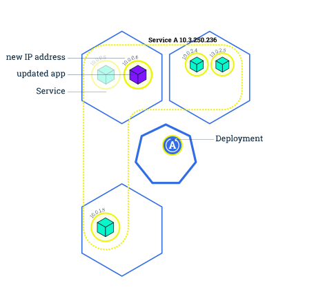

 

# kubernetes 学习


## 基础知识

### 创建集群

**Kubernetes 协调一个高可用计算机集群，每个计算机作为独立单元互相连接工作。** Kubernetes 中的抽象允许您将容器化的应用部署到集群，而无需将它们绑定到某个特定的独立计算机。为了使用这种新的部署模型，应用需要以将应用与单个主机分离的方式打包：它们需要被容器化。与过去的那种应用直接以包的方式深度与主机集成的部署模型相比，容器化应用更灵活、更可用。 **Kubernetes 以更高效的方式跨集群自动分发和调度应用容器。** Kubernetes 是一个开源平台，并且可应用于生产环境。

一个 Kubernetes 集群包含两种类型的资源:

- **Master** 调度整个集群
- **Nodes** 负责运行应用


**Master 负责管理整个集群。** Master 协调集群中的所有活动，例如调度应用、维护应用的所需状态、应用扩容以及推出新的更新。

**Node 是一个虚拟机或者物理机，它在 Kubernetes 集群中充当工作机器的角色** 每个Node都有 Kubelet , 它管理 Node 而且是 Node 与 Master 通信的代理。 Node 还应该具有用于处理容器操作的工具，例如 `Docker` 或 `rkt` 。处理**生产级流量的 Kubernetes 集群至少应具有三个 Node** 。

总的来说就是：***Master 管理集群，Node 用于托管正在运行的应用。***

在 Kubernetes 上部署应用时，您告诉 Master 启动应用容器。 Master 就编排容器在集群的 Node 上运行。 **Node 使用 Master 暴露的 Kubernetes API 与 Master 通信。**终端用户也可以使用 **Kubernetes API** 与集群交互。

Kubernetes 既可以部署在物理机上也可以部署在虚拟机上。您可以使用 **Minikube** 开始部署 Kubernetes 集群。 Minikube 是一种轻量级的 Kubernetes 实现，可在本地计算机上创建 VM 并部署仅包含一个节点的简单集群。 Minikube 可用于 Linux ， macOS 和 Windows 系统。**Minikube CLI** 提供了用于引导集群工作的多种操作，包括启动、停止、查看状态和删除。


> 此处使用 `minikube`快速创建 `kubernetes`。

通过运行 `minikube version` 命令检查它是否已正确安装：

```bash
minikube version
```

执行 `minikube start`开启 `kubernetes ` 集群

```bash
minikube start
```

查看 `kubernetes` 版本

```bash
kubectl version
```

输入`kubectl cluster-info `查看集群状态

```bash
kubectl cluster-info
```

输入 `kubectl get nodes` 查看集群下节点

### 部署应用

一旦运行了 Kubernetes 集群，就可以在其上部署容器化应用程序。 为此，您需要创建 Kubernetes **Deployment** 配置。Deployment 指挥 Kubernetes 如何创建和更新应用程序的实例。创建 Deployment 后，Kubernetes master 将应用程序实例调度到集群中的各个节点上。

创建应用程序实例后，Kubernetes Deployment 控制器会持续监视这些实例。 如果托管实例的节点关闭或被删除，则 Deployment 控制器会将该实例替换为群集中另一个节点上的实例。 **这提供了一种自我修复机制来解决机器故障维护问题。**

在没有 Kubernetes 这种编排系统之前，安装脚本通常用于启动应用程序，但它们不允许从机器故障中恢复。通过创建应用程序实例并使它们在节点之间运行， Kubernetes Deployments 提供了一种与众不同的应用程序管理方法。


您可以使用 Kubernetes 命令行界面 **Kubectl 创建和管理 Deployment**。Kubectl **使用 Kubernetes API** 与集群进行交互。

创建 Deployment 时，您需要指定应用程序的容器映像以及要运行的副本数。您可以稍后通过更新 Deployment 来更改该信息。

我们可以使用`kubectl create deployment`命令中部署在`Kubernetes`上的第一个应用程序。我们需要提供**部署名称**和**AppImage**位置（托管在Docker Hub外部的镜像需要的完整的URL）。

```bash
kubectl create deployment kubernetes-bootcamp --image=gcr.io/google-samples/kubernetes-bootcamp:v1
```

此命令完成了以下操作：

- 搜索可以运行应用程序实例的合适节点（我们只有1个可用节点）
- 配置应用程序在该节点上运行
- 配置集群，以便在需要时重新安排实例到新的节点上

要列出您的部署，请使用`kubectl get deployments`命令：

```bash
kubectl get deployments
```

我们看到有一个部署运行您的应用程序的一个实例。该实例运行在节点上的Docker容器中。

程序在 `kubernetes`内部网络运行，默认情况下，此程序对集群中的其他 `service` 和 `pods` 可见，但在外部网络无法使用，但我们可以使用 `kubectl proxy`与应用程序通信。

在终端上执行`kubectl proxy`

```bash
kubectl proxy
```

我们现在在我们的主机连接到 `Kubernetes`集群之。通过代理在终端直接访问API。

```bash
 curl http://localhost:8001/version
```

API Server 将根据 `pod` 名称自动为每个 `pod` 创建端口，也可以通过代理访问。

首先，我们需要得到 `pod` 的名称，然后我们将存储在环境变量POD_NAME中：

```bash
export POD_NAME=$(kubectl get pods -o go-template --template '{{range .items}}{{.metadata.name}}{{"\n"}}{{end}}')
echo Name of the Pod: $POD_NAME
```

您可以通过通过 `api` 访问`pod`：

```bash
curl http://localhost:8001/api/v1/namespaces/default/pods/$POD_NAME/
```

### 组件介绍

在创建 `Deployment` 时, `Kubernetes` 添加了一个 **Pod** 来托管你的应用实例。**Pod** 是 `Kubernetes` 抽象出来的，表示**一组一个或多个应用程序容器**（如 Docker），以及这些容器的一些共享资源。这些资源包括:

- 共享存储，当作卷

- 网络，作为唯一的集群 IP 地址
- 有关每个容器如何运行的信息，例如容器映像版本或要使用的特定端口。

Pod是 Kubernetes 平台上的原子单元。 当我们在 Kubernetes 上创建 Deployment 时，该 Deployment 会在其中创建包含容器的 Pod （而不是直接创建容器）。每个 Pod 都与调度它的工作节点绑定，并保持在那里直到终止（根据重启策略）或删除。 如果工作节点发生故障，则会在群集中的其他可用工作节点上调度相同的 Pod。

#### Pod 概览


#### 工作节点

一个 `pod` 总是运行在 **工作节点**。工作节点是 Kubernetes 中的参与计算的机器，可以是虚拟机或物理计算机，具体取决于集群。每个工作节点由主节点管理。工作节点可以有多个 `pod` ，Kubernetes 主节点会自动处理在群集中的工作节点上调度 pod 。 主节点的自动调度考量了每个工作节点上的可用资源。

***如果它们紧耦合并且需要共享磁盘等资源，这些容器应在一个 Pod 中编排。***

每个 Kubernetes 工作节点至少运行:

- Kubelet，负责 Kubernetes 主节点和工作节点之间通信的过程; 它管理 Pod 和机器上运行的容器。
- 容器运行时（如 Docker）负责从仓库中提取容器镜像，解压缩容器以及运行应用程序。


***工作节点是 Kubernetes 中的负责计算的机器，可能是VM或物理计算机，具体取决于群集。多个 Pod 可以在一个工作节点上运行。***

#### 使用 kubectl 进行故障排除

最常见的操作可以使用以下 kubectl 命令完成：

- **kubectl get** - 列出资源
- **kubectl describe** - 显示有关资源的详细信息
- **kubectl logs** - 打印 pod 和其中容器的日志
- **kubectl exec** - 在 pod 中的容器上执行命令

可以使用这些命令查看应用程序的部署时间，当前状态，运行位置以及配置。

我们将使用`kubectl get pods`命令查找现有的 pod：

```bash
kubectl get pods
```

接下来，我们使用 `kubectl describe pods`要查看Pod中有哪些容器，以及用于构建这些容器的镜像：

```bash
kubectl describe pods
```

我们在这里看到有关Pod容器的详细信息：IP地址、所使用的端口以及与 `pod` 的生命周期相关的事件列表。

pod 运行在内部专用网络中，因此我们需要代理访问它们，以便我们可以调试和与它们交互。为此，我们将使用`kubectl proxy`运行代理。

```bash
kubectl proxy
```

现在，我们需获得Pod名称，并通过代理直接查询该Pod。获取Pod名称并将其存储在`POD_NAME`环境变量中：

```bash
export POD_NAME=$(kubectl get pods -o go-template --template '{{range .items}}{{.metadata.name}}{{"\n"}}{{end}}')
echo Name of the Pod: $POD_NAME
```

通过 CURL 查看应用程序的输出：

```bash
curl http://localhost:8001/api/v1/namespaces/default/pods/$POD_NAME/proxy/
```

URL 是 Pod API 的路由。

### 使用 Service 暴露应用

Kubernetes `Pods`是转瞬即逝的。 Pod 实际上拥有生命周期。 当一个工作 `Node` 挂掉后, 在 `Node` 上运行的 `Pod` 也会消亡。 `ReplicaSet` 会自动地通过创建新的 Pod 驱动集群回到目标状态，以保证应用程序正常运行。 换一个例子，考虑一个具有3个副本数的用作图像处理的后端程序。这些副本是可替换的; 前端系统不应该关心后端副本，即使 Pod 丢失或重新创建。也就是说，Kubernetes 集群中的每个 Pod (即使是在同一个 Node 上的 Pod )都有一个唯一的 IP 地址，因此需要一种方法自动协调 Pod 之间的变更，以便应用程序保持运行。

Kubernetes 中的服务(Service)是一种抽象概念，它定义了 Pod 的逻辑集和访问 Pod 的协议。Service 使从属 Pod 之间的松耦合成为可能。 和其他 Kubernetes 对象一样, Service 用 YAML (更推荐) 或者 JSON 来定义. Service 下的一组 Pod 通常由 LabelSelector (请参阅下面的说明为什么您可能想要一个 spec 中不包含selector的服务)来标记。

尽管每个 Pod 都有一个唯一的 IP 地址，但是如果没有 Service ，这些 IP 不会暴露在集群外部。Service 允许您的应用程序接收流量。Service 也可以用在 ServiceSpec 标记`type`的方式暴露。

- *ClusterIP* (默认) - 在集群的内部 IP 上公开 Service 。这种类型使得 Service 只能从集群内访问。
- *NodePort* - 使用 NAT 在集群中每个选定 Node 的相同端口上公开 Service 。使用`<NodeIP>:<NodePort>` 从集群外部访问 Service。是 ClusterIP 的超集。
- *LoadBalancer* - 在当前云中创建一个外部负载均衡器(如果支持的话)，并为 Service 分配一个固定的外部IP。是 NodePort 的超集。
- *ExternalName* - 通过返回带有该名称的 CNAME 记录，使用任意名称(由 spec 中的`externalName`指定)公开 Service。不使用代理。这种类型需要`kube-dns`的v1.7或更高版本。

 另外，需要注意的是有一些 Service 的用例没有在 spec 中定义`selector`。 一个没有`selector`创建的 Service 也不会创建相应的端点对象。这允许用户手动将服务映射到特定的端点。没有 selector 的另一种可能是您严格使用`type: ExternalName`来标记。


Service 通过一组 Pod 路由通信。Service 是一种抽象，它允许 Pod 死亡并在 Kubernetes 中复制，而不会影响应用程序。在依赖的 Pod (如应用程序中的前端和后端组件)之间进行发现和路由是由Kubernetes Service 处理的。

Service 匹配一组 Pod 是使用 **标签(Label)和选择器(Selector)**, 它们是允许对 Kubernetes 中的对象进行逻辑操作的一种分组原语。标签(Label)是附加在对象上的键/值对，可以以多种方式使用:

- 指定用于开发，测试和生产的对象
- 嵌入版本标签
- 使用 Label 将对象进行分类


标签(Label)可以在创建时或之后附加到对象上。他们可以随时被修改。现在使用 Service 发布我们的应用程序并添加一些 Label 。


使用 `kubectl get services`列出我们集群中的当前服务。

```bash
kubectl get services
```

我们有一个名为`kubernetes`的服务，它是在`minikube`启动集群时默认创建的。要创建新服务并将其公开给外部流量，我们将使用参数为`NodePort`的`expose`命令（minikube还不支持LoadBalancer选项）。

```bash
kubectl expose deployment/kubernetes-bootcamp --type="NodePort" --port 8080
```

我们现在有了一个名为`kubernetes-bootcamp`的运行服务。

执行 `kubectl get services`，我们可以看到 集群 IP，集群的内部端口和集群的外部IP（节点的IP）。

要了解外部（通过NodePort选项）打开了哪个端口，我们将运行`kubectl describe`命令

```bash
kubectl describe services/kubernetes-bootcamp
```

创建名为`NODE_PORT`的环境变量，该变量具有分配的节点端口的值：

```bash
export NODE_PORT=$(kubectl get services/kubernetes-bootcamp -o go-template='{{(index .spec.ports 0).nodePort}}')
echo NODE_PORT=$NODE_PORT
```

现在我们可以使用 Curl 测试应用程序，因为端口已映射外部机器上。

```bash
curl $(minikube ip):$NODE_PORT
```

Deployment 自动为我们的 Pod 创建了标签。使用`kubectl describe deployment`命令您可以看到标签的名称：

```bash
kubectl describe deployment
```

让我们使用这个标签来查询 Pod 列表。我们将使用`kubectl get pods`命令，参数为 `-l` ，后面是标签值：

```bash
kubectl get pods -l app=kubernetes-bootcamp
```

您可以执行相同的操作以列出服务：

```bash
kubectl get services -l app=kubernetes-bootcamp
```

获取Pod的名称并将其存储在`POD_NAME`环境变量中：

```bash
export POD_NAME=$(kubectl get pods -o go-template --template '{{range .items}}{{.metadata.name}}{{"\n"}}{{end}}')
echo Name of the Pod: $POD_NAME
```

要应用新标签，我们使用label命令，后跟对象类型、对象名称和新标签:

```bash
kubectl label pods $POD_NAME version=v1
```

这将为我们的Pod应用一个新标签（我们将应用程序版本指定在Pod上），我们可以使用`descripe pods`命令进行检查：

```bash
kubectl describe pods $POD_NAME
```

我们在此看到标签现在标记在我们的 Pod 上。现在我们可以查询使用新标签的POD列表：

```bash
kubectl get pods -l version=v1
```

要删除服务，可以使用 `delete service` 命令。标签也可以使用：

```bash
kubectl delete service -l app=kubernetes-bootcamp
```

再次执行 `kubectl get services`发现服务已经消失。

为了证实了 `Service ` 已被删除。要确认路由已经删除，可以Curl 测试以前暴露的IP和端口：

```bash
curl $(minikube ip):$NODE_PORT
```

但可以确认该应用程序仍然在 Pod 中使用 `Curl` 运行。

我们在这里看到了应用程序仍可用。这是因为 `Deployment` 正在管理应用程序。要关闭应用程序，您也需要删除 `Deployment`。

### 扩缩应用

我们创建了一个 `Deployment`，然后通过 `Service`让其可以开放访问。`Deployment` 仅为跑这个应用程序创建了一个 `Pod`。 当流量增加时，我们需要扩容应用程序满足用户需求。

扩缩是通过改变 `Deployment` 中的副本数量来实现的。

扩容前：


扩容后：


**扩展 Deployment 将创建新的 Pods**，并将资源调度请求分配到有可用资源的节点上，收缩会将 Pods 数量减少至所需的状态。Kubernetes 还支持 Pods 的自动缩放，但这并不在本教程的讨论范围内。将 Pods 数量**收缩到0也是可以**的，但这**会终止 Deployment 上所有已经部署的 Pods**。

运行应用程序的多个实例需要在它们之间分配流量。服务 (Service)有一种负载均衡器类型，可以将网络流量均衡分配到外部可访问的 Pods 上。服务将会一直通过端点来监视 Pods 的运行，保证流量只分配到可用的 Pods 上。

一旦有了多个应用实例，就可以没有宕机地滚动更新。

***扩缩是通过改变 Deployment 中的副本数量来实现的。***

**扩展应用**

要列出Deployment，请使用get deployments命令：

```bash
kubectl get deployments
```

现在应该有1个 Pod，其中：

- *NAME* 表示集群部署应用的名称。
- *READY* 表示当前存活数量/所需数量的比率。
- *AVAILABLE* 表示您的用户可用的应用程序的副本。
- *AGE* 表示应用程序运行的时间。

要查看Deployment  创建的复制集合，请运行`kubectl get rs`

请注意，复制 Pod 的名称始终格式化为 `[DEPLOYMENT-NAME]-[RANDOM-STRING]`,其中：

- *DESIRED* 表示应用程序的所需数量的Deployment，您在创建部署时定义。这是所需的状态。
- *CURRENT* 表示当前正在运行的 Deployment数量。

接下来，让我们将 Deployment 扩展到4个副本。我们将使用`kubectl scale`命令，然后是部署类型、名称和所需的实例数：

```bash
kubectl scale deployments/kubernetes-bootcamp --replicas=4
```

要再次列出Deployment，请使用`get deployments`

更改已应用，我们有4个应用程序实例可用。接下来，让我们检查一下Pod的数量是否有了变化

```bash
kubectl get pods -o wide
```

现在有4个 Pod，具有不同的IP地址。该更改已在Deployment事件日志中注册。要检查，请使用`describe`命令：

```bash
kubectl describe deployments/kubernetes-bootcamp
```

您还可以在此命令的输出中查看，现在有4个副本。

**负载均衡**

检查服务是否负载均衡流量。找出暴露的IP和端口，我们可以使用`kubectl describe`

```bash
kubectl describe services/kubernetes-bootcamp
```

创建一个名为`NODE_PORT`的环境变量，该变量保存映射端口的值：

```bash
export NODE_PORT=$(kubectl get services/kubernetes-bootcamp -o go-template='{{(index .spec.ports 0).nodePort}}')
echo NODE_PORT=$NODE_PORT
```

然后，我们使用 `Curl` 测试.

```bash
curl $(minikube ip):$NODE_PORT
```

我们每一个请求都遇到了一个不同的Pod。这表明负载均衡正在运行。

**缩小应用**

要将 Service 缩小为2个副本，请再次运行 `scale` 命令：

```bash
kubectl scale deployments/kubernetes-bootcamp --replicas=2
```

使用 `get deployments`命令查看是否缩减

```bash
kubectl get deployments
```

副本数量已减少到2，使用 `get pods -o wide`列出Pod的数量 

```bash
kubectl get pods -o wide
```

这证实了2个 Pod 被终止。

### 滚动更新应用

用户希望应用程序始终可用，而开发人员则需要每天多次部署它们的新版本。在 Kubernetes 中，这些是通过**滚动更新（Rolling Updates）**完成的。 **滚动更新** 允许通过使用新的实例逐步更新 Pod 实例，零停机进行 Deployment 更新。新的 Pod 将在具有可用资源的节点上进行调度。

在前面的模块中，我们将应用程序扩展为运行多个实例。这是在不影响应用程序可用性的情况下执行更新的要求。默认情况下，更新期间不可用的 pod 的最大值和可以创建的新 pod 数都是 1。这两个选项都可以配置为（pod）数字或百分比。 在 Kubernetes 中，更新是经过版本控制的，任何 Deployment 更新都可以恢复到以前的（稳定）版本。

**更新流程**





与应用程序扩展类似，如果公开了 Deployment，服务将在更新期间仅对可用的 pod 进行负载均衡。可用 Pod 是应用程序用户可用的实例。

滚动更新允许以下操作：

- 将应用程序从一个环境提升到另一个环境（通过容器镜像更新）
- 回滚到以前的版本
- 持续集成和持续交付应用程序，无需停机

***如果 Deployment 是公开的，则服务将仅在更新期间对可用的 pod 进行负载均衡。***

运行`get deployments`命令列出部署：

```bash
kubectl get deployments
```

运行`get pods`命令列出正在运行的 Pods：

```bash
kubectl get pods
```

运行`describe pods`命令并指定镜像名称查看应用程序的当前版本：

```bash
kubectl describe pods
```

要将应用程序的镜像更新到版本`2`，请使用`set image`命令，后跟部署名称和新镜像版本：

```bash
kubectl set image deployments/kubernetes-bootcamp kubernetes-bootcamp=jocatalin/kubernetes-bootcamp:v2
```

该命令通知部署为应用程序使用不同的镜像，并启动滚动更新。使用`get Pods`检查新Pods的状态：

```bash
kubectl get pods
```

检查应用程序是否正在运行。要查找公开的IP和端口，请运行describe service命令：

```bash
kubectl describe services/kubernetes-bootcamp
```

创建名为`NODE_PORT`的环境变量，该变量具有分配的节点端口的值

```bash
export NODE_PORT=$(kubectl get services/kubernetes-bootcamp -o go-template='{{(index .spec.ports 0).nodePort}}')
echo NODE_PORT=$NODE_PORT
```

接下来，对暴露的IP和端口使用 CURL 测试：

```bash
curl $(minikube ip):$NODE_PORT
```

每次运行`Curl`命令时，您都会连接到一个不同的Pod。请注意，所有Pod都运行最新版本（v2）。

还可以通过运行`rollout status`命令来确认更新:

```bash
kubectl rollout status deployments/kubernetes-bootcamp
```

要查看应用程序的当前镜像版本，请运行`describe pods`命令

```bash
kubectl describe pods
```

在输出的镜像字段中，确认您正在运行最新的镜像版本（v2）。

**测试**

执行另一个更新，并部署一个标记为v10的镜像：

```bash
kubectl set image deployments/kubernetes-bootcamp kubernetes-bootcamp=gcr.io/google-samples/kubernetes-bootcamp:v10
```

使用`get deployments`查看部署的状态

```bash
kubectl get deployments
```

请注意，输出没有列出所需的可用Pod数量。运行`get pods`命令列出所有pods:

```bash
kubectl get pods
```

请注意，某些Pod 为`ImagePullbackoff`状态。

要深入了解问题，请运行`descripe pods`命令：

```bash
kubectl describe pods
```

控制台输出在受影响的Pod输出的`Events`部分中，提示存储库中不存在v10镜像版本。

要将 deployment 回滚到上一个工作版本，请使用`rollout undo`命令

```bash
kubectl rollout undo deployments/kubernetes-bootcamp
```

`rollout undo`命令将部署恢复为上一个已知状态（v2）。您可以恢复为任何先前已知的部署状态。

使用`get pods`命令再次列出pods：

```bash
kubectl get pods
```

四个 Pods 正在运行。要检查部署的映像，请使用`describe pods`命令：

```bash
kubectl describe pods
```

deployments 再次使用旧版本(v2)，回滚成功。


## 配置

### 外部化应用配置

> 使用 `MicroProfile`、`ConfigMaps`、`Secrets` 实现外部化应用配置

在 Kubernetes 中，为 docker 容器设置环境变量有几种不同的方式，比如： `Dockerfile`、`kubernetes.yml`、`Kubernetes ConfigMaps`、和 `Kubernetes Secrets`。  使用 ConfigMaps 和 Secrets 的一个好处是他们能在多个容器间复用， 比如赋值给不同的容器中的不同环境变量。

`ConfigMaps` 是存储非机密键值对的 API 对象。 

`Secrets` 尽管也用来存储键值对，但区别于 `ConfigMaps` 的是：它**针对机密/敏感数据**，且存储格式为 **Base64 编码**。 `secrets` 的这种特性使得它适合于存储证书、密钥、令牌。

外部化应用配置之所以有用处，是因为配置常常根据环境的不同而变化。 为了实现此功能，我们用到了 **Java 上下文**和**依赖注入（Contexts and Dependency Injection, CDI）**、**MicroProfile 配置**。 `MicroProfile config` 是 `MicroProfile` 的功能特性， 是一组开放 Java 技术，用于开发、部署云原生微服务。

CDI 提供一套标准的依赖注入能力，使得应用程序可以由相互协作的、松耦合的 `beans` 组装而成。 `MicroProfile Config` 为 app 和微服务提供从各种来源，比如应用、运行时、环境，获取配置参数的标准方法。 基于来源定义的优先级，属性可以自动的合并到单独一组应用可以通过 API 访问到的属性。 CDI & MicroProfile 都会被用在互动教程中， 用来从 `Kubernetes ConfigMaps` 和 `Secrets` 获得外部提供的属性，并注入应用程序代码中。

很多开源框架、运行时支持 `MicroProfile Config`。